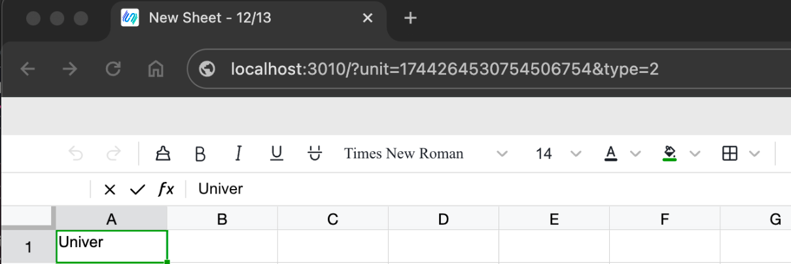

# Deploying with Docker

Get up and running quickly with our Docker deployment solution for the Univer Pro service, using Docker Compose for a hassle-free setup.

## System Requirements

1. CPU: Single core
2. RAM: 2GB
3. Storage: 10GB

Ensure you have [Docker version 23 or higher](https://docs.docker.com/engine/install/).

## Technical Stack

Our architecture is built on PostgreSQL and RabbitMQ.

## How to Deploy

Compatible with Linux, Mac, and Windows/WSL environments.

1. Download the appropriate [release](https://github.com/dream-num/helm-charts/releases),

   Or use this link to download the setup: [Docker Compose Zip](https://release-univer.oss-cn-shenzhen.aliyuncs.com/release-demo/docker-compose.zip).

2. Navigate to the `docker-compose` directory after extracting the files.

```bash
cd helm-charts/docker-compose
```

3. Optional: To set up a Pro License, place your [Pro License](/pro/license) file in the `docker-compose/configs` directory.

4. Launch the backend services.

```bash
bash run.sh
```

5. Service Verification

Confirm that the document service has successfully started.

```bash
docker run --net=univer-prod --rm --name univer-collaboration-lite -p 3010:3010 univer-acr-registry.cn-shenzhen.cr.aliyuncs.com/release/univer-collaboration-lite:latest
```

Access http://localhost:3010 in your web browser to create a new blank document, which will then redirect you to the document link (Internet Explorer is not supported).



Also, verify the successful startup of the collaboration service.

For a comprehensive test, try accessing it in various browsers or in private browsing mode to experience the full collaborative capabilities.


## Port Check

Ensure that the specified ports are not in use; if they are, terminate the conflicting processes before attempting to start again.

Default ports for Univer services are listed below:

| service Name | Port Number |  	Function |
| --- | --- | --- |
| universer | 8000 | Serves API over HTTP |
| univer-minio | 9000 | Acts as the S3 storage server |
| univer-client | 3010 | Provides the frontend interface |

## Troubleshooting

### Having trouble starting on a Windows OS?

The `run.sh` script operates in a `bash` environment. To get it up and running, you'll need to use either Git Bash/MinGW or a WSL environment.

### Can't use the save-as-table function?

You'll need to tweak the `.env` file. Set `S3_ENDPOINT_PUBLIC` to your local network IP to get the `save as` function to work properly.

```diff
- S3_ENDPOINT_PUBLIC=http://univer-minio:9000
+ S3_ENDPOINT_PUBLIC=http://Your Local Network IP:19000
```

If you're still running into issues, feel free to [reach out to us](/pro/guides/sheet/introduction#-contact us) for assistance.