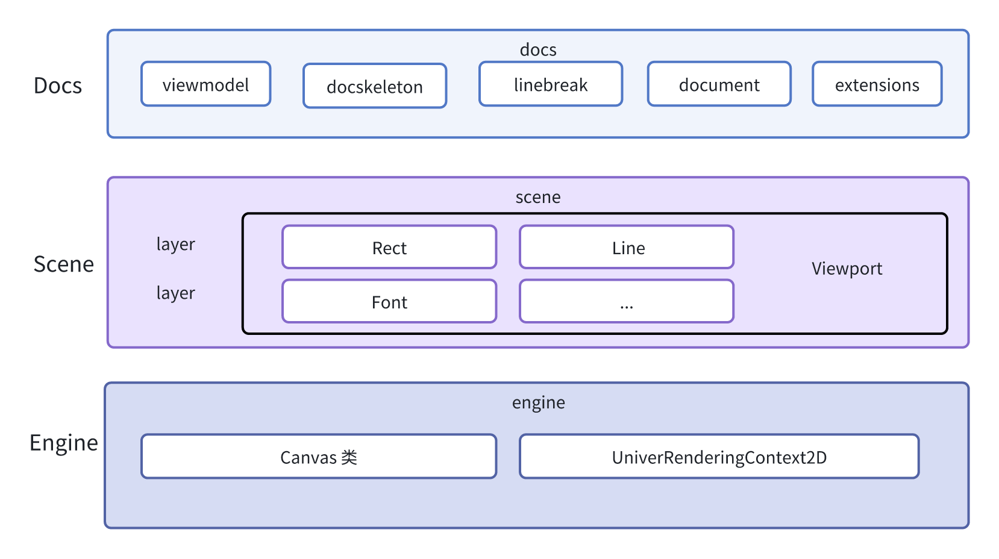
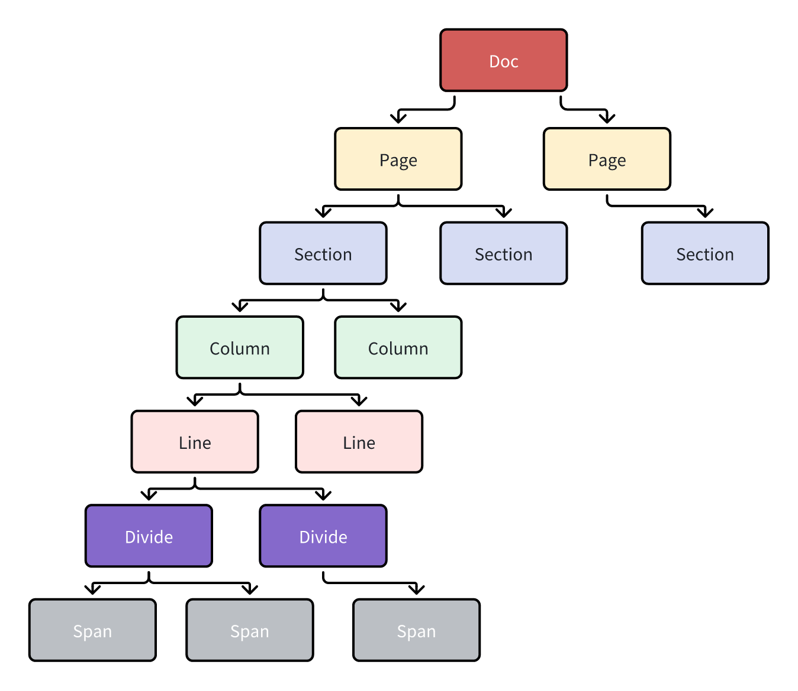
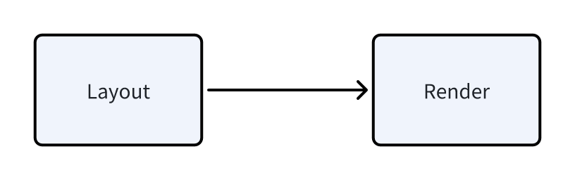
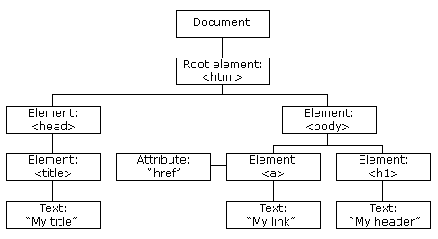

> Univer Documents, a component of the Univer office suite, can be better understood by delving into the "Architectural Framework and Module Design of Univer Documents" document. This publication offers insights into the structural considerations and module delineations within the Univer Documents framework. The primary focus of this article lies in elucidating the document typesetting requisites and elucidating how Univer Documents caters to these needs through its architectural design.

## Technical Selection for Document Typesetting

The utilization of editors serves the purpose of document editing and typesetting, whether through specialized typesetting systems like Word and LaTeX for crafting academic papers, legal documents, or corporate contracts. As software aimed at delivering an unparalleled document editing experience and a robust typesetting system, Univer Documents made decisive choices in its architectural design and technological selection from the outset to enable highly customized document typesetting.

Univer Document Editor eschewed the conventional approach of using the DOM `contenteditable` attribute to achieve a rich text editor. Instead, it opted for the more challenging and sophisticated Canvas element to render the entire document content. This decision was made because Canvas allows for highly customizable aspects such as text position, punctuation size, inline styles, and the implementation of complex mixed typesetting of Eastern and Western languages, a feat challenging to achieve with a rich text editor implemented through DOM `contenteditable`.

Below are some key functional requirements in our typesetting:

- _Support for multiple languages and regions, with subtle differences in Chinese, Japanese, and Western typesetting. We need to accommodate diverse typesetting requirements, including variations in Chinese typesetting across regions like Hong Kong, Macau, and Taiwan._
- _In text typesetting, aside from Chinese characters, there are punctuation marks, Arabic numerals, Latin script, Greek characters, and other Western elements that may be interspersed._
- _Support for horizontal and vertical layout, tight or loose spacing, and uniform spacing._
- _Support for various fonts and the ability to introduce custom fonts._
- _Text size, font types, writing directions (vertical, horizontal, slanted), columns (number and spacing), mixing of text and images, text and table integration, number of lines per page, grids, letter spacing, line spacing, etc._
- _Punctuation glyph shapes, sizes, and distribution, punctuation width adjustments._
- _Rules for leading and trailing punctuation marks._
- _Hanging punctuation at the end of lines._
- _Inline compression and expansion._
- _Alignment of adjacent Chinese characters in Chinese typesetting._

The aforementioned requirements only scratch the surface of text typesetting demands. Relying solely on the browser's DOM elements (text typesetting systems implemented through `contenteditable`) has started to show limitations, prompting some reading software like 'WeChat Reading' to opt for Canvas for typesetting and rendering, among other reasons.

## Architecture of the View Layer

With the aforementioned technical choices in mind, let's delve into the architecture of the view layer in Univer Documents.

### 2.1 Overall Architecture Diagram



Let's explore the view layer architecture from bottom to top:

**Engine Layer**: At the foundation of the view layer lies the engine layer, which encompasses the Canvas class. This class serves as an abstraction of the browser's Canvas element. Through this abstraction, we can create Canvas elements, set their dimensions, and bind instances of UniverRenderingContext2D. Leveraging the UniverRenderingContext2D object allows us to utilize all the drawing capabilities provided by the Canvas Context2D, such as drawing rectangles, circles, text, lines, and setting drawing styles. With these drawing capabilities, we can utilize Canvas Context2D to render text, strikethroughs, underlines, and other content within the document.

The engine layer also offers Canvas event delegation, establishing a user interaction event system within the engine layer. This system dispatches events to objects accurately hit within the Scene, which are then handled by event processing functions on the objects. For a detailed overview of the event system, refer to the "Architectural Framework and Module Design of Univer Documents."

Additionally, the engine layer provides a render loop that supports running multiple render functions concurrently. Through a timer mechanism, the render loop iterates over render functions, facilitating page rendering and updating in real-time following modifications in the data layer. Below is the core code snippet for the render loop:

```typescript
runRenderLoop(renderFunction: () _=>_ _void_): _void_ {
    if (this._activeRenderLoops.indexOf(renderFunction) !== -1) {
        return;
    }

    this._activeRenderLoops.push(renderFunction);

    if (!this._renderingQueueLaunched) {
        this._renderingQueueLaunched = true;
        this._renderFunction = this._renderLoop.bind(this);
        this._requestNewFrameHandler = requestNewFrame(this._renderFunction);
    }
}
```

**Scene Layer**: Positioned above the engine layer, the Scene layer relies on the drawing capabilities provided by the engine layer. It can be envisioned as a container for drawing elements, housing multiple Layers within a Scene object. Each Layer can contain multiple Objects and may cache drawing objects to enhance overall performance. A Scene can encompass multiple Viewport objects, serving as windows to observe elements drawn on the Canvas. Elements within the viewport are visible, and the viewport may necessitate horizontal and vertical scrollbars for adjusting the viewport's position to view all elements within the Scene. The fundamental element within a Scene is the Object, derived from the BaseObject, encompassing entities like rectangles, rich text, and paths.

**Docs Layer**: Closer to the business logic, the Docs layer is more application-oriented compared to the lower-level capabilities of the Engine and Scene layers. In the Docs layer, several core modules are prominent:

1. Definition and implementation of the View Model, the initial data model for page rendering. With the View Model, the Document Skeleton can perform layout calculations and subsequently render pages.
2. Implementation of the Unicode line break algorithm, crucial for determining line breaks in the Docs layer.
3. Definition of the Document Skeleton class, responsible for layout calculations based on View Model data.
4. Handling the drawing and management of selections and cursors, crucial and business-relevant modules responsible for their rendering and positioning.
5. Provision of the Document object, the core object for document rendering derived from the BaseObject. Through this object and leveraging the layout calculations from the Document Skeleton, the entire Univer document can be rendered.

The Document class supports extension for enhanced drawing capabilities, enabling the use of different extensions for drawing various sub-elements:

- Font and baseline extension: for text rendering
- Line extension: for drawing underlines, strikethroughs, supporting different line styles
- Background extension: for drawing background colors

Future enhancements will include additional drawing extensions, such as extensions for drawing tables and punctuation symbols.

### 2.2 Introduction to Document Skeleton

The DocSkeleton class stands as one of the core modules in document typesetting, responsible for layout calculations, node element positioning, and more. In this section, we will explore key concepts within the Skeleton and the principles of layout calculations.

#### 2.2.1 Rendering Nodes in the Skeleton

As frontend engineers, we are well-acquainted with DOM objects, structured in a tree format where the root is the HTML element, containing HEAD and BODY elements, further nested with child elements like A tags, H1 tags, and more.



This DOM tree structure, in conjunction with CSS styles, completes the webpage rendering process.

Similarly, in Univer Documents, a corresponding tree structure is designed to meet document typesetting needs.



Within the Univer rendering node objects, a document (Doc) comprises multiple pages, each page containing sections, each section containing columns, each column containing lines, each line containing divides, and each divide containing spans. This breakdown segments a document into distinct rendering elements, with the layout process determining the relationships and positional layout information of these elements.

_Why is this design chosen?_

**Page Rendering Node** embodies the traditional concept of pages in documents, allowing for the customization of page styles such as margins and dimensions. Hence, we require a rendering entity, Page, to carry these style attributes. Within the Page rendering node, attributes include page numbers, rendering configurations, page margin details, page width and height, page orientation, headers, footers, and more.

**Section Rendering Node** reflects the traditional notion of sections in documents. In applications like Word, section breaks can be inserted, and in Univer Documents, sections are delineated using the character `\n` to signify the end of a section. Within the rendering node object, a Section represents a section, with related descriptions defined in the <u>ISectionBreak</u> interface. Attributes of the Section rendering node include:

- columns: data related to columns
- colCount: number of columns
- height: section height
- parent: its parent rendering node, namely the Page rendering node
- st, sd: start and end indices of the section

**Column Rendering Node** serves as a child node of a Section, where each Column corresponds to a column within a Section. Attributes of a Column include:

- lines: information related to lines
- left: position information from the left
- width: column width
- st: start position information of the column
- ed: end position information of the column

**Line Rendering Node** acts as a child node of a Column, representing a line of text content within Univer Documents. Attributes of a Line include:

- lineIndex: line number
- paragraphStart: indicates if it is the first line of a paragraph
- contentHeight: content height
- lineHeight: line height
- paddingTop, paddingBottom, marginTop: descriptions related to padding and margin

**Divide Rendering Node** functions as a child node of a Line, primarily used for scenarios involving mixed text and images. Divides divide a line into multiple segments and possess attributes such as:

- spanGroup: collection of span elements on the divide
- width: width of the divide
- left: offset position after division
- paddingLeft: alignment offset calculated based on horizonAlign and width
- isFull: indicates if content fills the divide
- st, sd: start and end position offset information

**Span Rendering Node** acts as a child node of a Divide, representing the lowest level node in Univer Documents without child nodes. Spans are the smallest units for cursor movement or selection. Attributes of a Span include:

- content: content of the span, such as a Chinese character or a punctuation mark
- ts: text style information like font, font size, bold, italics, etc.
- fontStyle: font-related style information including fontString, fontSize, fontFamily
- width: width of the span
- bBox: Bounding Box containing [TextMetrics](https://developer.mozilla.org/en-US/docs/Web/API/TextMetrics)-related data like actualBoundingBoxAscent, actualBoundingBoxDescent, fontBoundingBoxAscent, defined in the <u>IDocumentSkeletonBoundingBox</u> interface
- paddingLeft: when text needs to align to a grid, `paddingLeft = (width - contentWidth) / 2`
- left: distance of the span from the start of the divide
- spanType: type of the span, including LETTER, WORD, LIST, PLACEHOLDER, defined in the <u>SpanType</u> enumeration
- count: length of the span content, `content.length`, crucial for calculating cursor movement positions as the cursor's minimum unit of movement is a span, requiring the length value of `span.count`

### 2.2.2 From Layout Calculation to Page Rendering

In the previous section, we elucidated the rendering nodes, their functionalities, and attributes. In this section, we shall expound on the process from layout calculation to page rendering. The layout calculation involves determining the positional information of the rendering nodes throughout the document, subsequently rendering them using the rendering engine. The entire rendering process is divided into Layout and Render stages:



**Layout Process**: The layout process primarily entails computing the position information of elements within the Skeleton. This process is encapsulated within the `_createSkeleton` method. Initially, the `getViewModel` method is utilized to acquire data from the view layer model, essential for generating the Skeleton data. Within the layout process, the smallest layout unit is the span, encompassing all layout-related information for one or more characters (typically one). Essential information within a span includes content, text style, width, Bounding Box (bBox), span type, and content length (`content.length`). With this span information and the width of a line, layout and typesetting operations can be executed, positioning spans within the current divide. As divides are filled, new ones are created, and this process continues with the creation of new columns, lines, and so forth until a new page is generated. Throughout the layout process, positions and sizes of non-rendered nodes are calculated. Adherence to established rules, such as punctuation not appearing at the beginning of a line, is crucial. These rules are defined within the Unicode line break algorithm, which will be elaborated on in the subsequent section discussing the line break algorithm.

**Render Process**: The rendering process involves taking the skeleton data, which includes position information for text, and rendering it onto the page. Initially, different shape elements' drawing extensions are registered on the rendering engine, such as the <u>FontAndBaseLine</u> class for text rendering and the <u>Line</u> class for drawing underlines and strikethroughs. Once these extensions are registered, pages, sections, columns, lines, divides, and spans are iterated through layer by layer, and spans with style information are rendered onto the page.

## Handling Mixed Chinese and Western Text Typesetting

Within the text typesetting process in Univer, it is common to encounter a mix of Chinese and Western characters, such as Chinese characters alongside Latin letters, Greek letters, or Arabic numerals. When dealing with this mix, it is advisable to use Chinese punctuation in accordance with Chinese punctuation conventions. Additionally, for aesthetic purposes, a word space (U+0020 SPACE [ ]) is typically inserted between Chinese characters and Western letters to enhance layout aesthetics. The width of this space may vary depending on the font used.

The code implementation is as follows:

```javascript
// Last span is western char and the current span is Chinese word or vice verse.
 _const_ isMixedCJKWesternTextLayout = hasMixedTextLayout(lastSpan, _spanGroup_[0]);
 _let_ wordSpaceWidth = 0;

 // Only add word space between CJK text and Western text when processing span for the first time,
 // otherwise it will be added multiple times during recursion.
 if (isMixedCJKWesternTextLayout) {
       _const_ lastSpanIsCJKWord = hasCJKText(lastSpan.content!);
       _const_ WORD_INNER_SPACE = '\u0020';

       wordSpaceWidth = <u>FontCache</u>.getTextSize(
            WORD_INNER_SPACE, // word space.
            lastSpanIsCJKWord ? _spanGroup_[0].fontStyle! : lastSpan.fontStyle!
       ).width;

       lastSpan.width += wordSpaceWidth;
  }
```

Initially, the `hasMixedTextLayout` method is employed to determine if there is a mix of Chinese and Western characters. If such a mix exists, the width of the Western word space `U+0020` is measured using the CanvasRenderingContext2D: measureText method. Subsequently, this measured width is added to the width of the character on the right side of the mixed Chinese and Western text. This process ensures that a Western word space is rendered between the Chinese and Western characters during rendering, serving as a visual element that is not part of the document content but is inserted during rendering.

Furthermore, in handling mixed Chinese and Western text typesetting, considerations include horizontal and vertical layout, rendering of vertical Chinese and Western characters, as well as the positioning of punctuation marks. For those interested, delving into the source code related to text typesetting is recommended for a deeper understanding.

## Line Break Algorithm

The concept of line break involves segmenting a text into different lines based on a specified width to ensure optimal placement of content on a page. The [Unicode Line Break Algorithm](https://unicode.org/reports/tr14/) partially accomplishes this task by providing a series of break opportunities that can be utilized to determine where line breaks should occur. The selection of a specific break opportunity requires additional information such as page width and the width and height required for typesetting individual characters. The [Knuth & Plass line-breaking](https://defoe.sourceforge.net/folio/knuth-plass.html) algorithm elaborates on this aspect.

### 4.1 Unicode Line Break Algorithm

In the context of text composition within Univer documents, we have adopted the Unicode Line Break Algorithm, a method defined in the Unicode standard for determining text line breaks. Line breaking rules may vary across different languages and cultures, but the Unicode Line Break Algorithm offers a universal solution applicable to diverse languages and environments.

The Unicode Line Break Algorithm encompasses character properties, line breaking rules, direct and indirect line breaks, and implementation recommendations:

- **Character Properties**: Each Unicode character is assigned a line break property indicating its behavior regarding line breaks. These properties include mandatory breaks (e.g., newline characters), non-breaking characters (e.g., letters and numbers), spaces, and line breaking symbols.
  
- **Line Breaking Rules**: The algorithm defines a set of rules based on the properties of adjacent characters to determine whether a line break can occur between them. These rules are defined as a series of conditions for break opportunities and prohibitions.
  
- **Direct and Indirect Line Breaks**: The algorithm distinguishes between direct line breaks (occurring directly between two characters) and indirect line breaks (requiring consideration of surrounding context).
  
- **Mandatory Breaks**: Certain characters mandate a line break, such as newline characters (LF) and carriage return characters (CR).

In the algorithm's implementation, a table known as the "Pair Table" is utilized to determine line breaking behavior between characters. This table uses the Line Break Class of two adjacent characters to decide whether a line break is permissible. These classes include categories such as letters, numbers, spaces, and punctuation, each with its own set of line breaking rules.

The basic steps of the algorithm involve:

1. **Text Analysis**: Initially, the algorithm traverses each character in the text and assigns each character to a Line Break Class based on the Unicode standard.
2. **Utilizing the Pair Table**: Subsequently, the algorithm examines pairs of adjacent characters' Line Break Classes and utilizes the Pair Table to determine whether a line break is permissible between these two categories.
   - The Pair Table is a two-dimensional matrix where rows and columns represent the Line Break Class of preceding and succeeding characters, respectively.
   - Each cell in the table contains a line breaking action (such as "allow line break," "disallow line break," "direct line break," etc.).

3. **Line Breaking Rules**: The line breaking rules in the Pair Table may also be influenced by other factors, such as:
   - **Mandatory Break**: Certain characters (e.g., newline characters) necessitate a line break after them.
   - **Direct Break**: Some character pairs can directly allow a line break without further examination.
   - **Indirect Break**: Certain character pairs may permit a line break, but the presence of whitespace characters needs to be checked.
   - **Prohibited Break**: Line breaks are not permitted between certain character pairs.

4. **Determining Line Break Points**: Finally, based on the aforementioned rules, all potential line break points are identified. The text layout system can utilize these break points to determine the actual line break positions within the text.

The above description outlines the implementation process of the Unicode Line Break Algorithm. In our code implementation, we drew inspiration from the _foliojs/linebreak_ implementation and made appropriate enhancements and modifications. Those interested may explore the relevant source code for further insights.

### 4.2 Optimal Line Break Position Selection

As previously discussed, the Unicode Line Break Algorithm merely presents potential break positions (break opportunities). The specific choice of positions for line breaks is determined by various factors such as page width and individual character width. One commonly employed algorithm for selecting appropriate line breaks is the [Knuth & Plass line-breaking](https://defoe.sourceforge.net/folio/knuth-plass.html) algorithm.

The Knuth & Plass line-breaking algorithm, introduced by Donald Knuth and Michael Plass in 1981, represents a method for text composition. This algorithm is particularly suited for high-quality text typesetting, with the TeX typesetting system being a notable user of this algorithm. Its objective is to identify the optimal line break points throughout an entire paragraph, as opposed to focusing solely on local optimization as traditional methods do.

In traditional document typesetting, emphasis is placed on local optimization, proceeding line by line where each line is filled before moving to the next. However, this approach can lead to uneven word distribution across lines, resulting in an aesthetically unpleasing layout. The Knuth & Plass algorithm employs dynamic programming, shifting away from single-line typesetting. It progressively constructs a sequence of optimal line break points starting from the beginning of a paragraph, with each step building upon the results of preceding steps. This methodology ensures the discovery of globally optimal combinations of line break points within the entire paragraph.

Currently, due to performance considerations in Univer documents, the Knuth & Plass line-breaking algorithm has not been implemented. Real-time calculation of document layout following user input is a critical requirement in Univer documents, demanding high performance. The computational complexity of the Knuth & Plass algorithm is higher compared to line-by-line text layout, potentially leading to longer processing times. Therefore, for performance reasons, Univer documents continue to utilize a line-by-line local optimization algorithm. Additionally, we are exploring chunk-based layout calculation algorithms and considering leveraging WebAssembly to enhance layout calculation performance. Consequently, in the near future, we are investigating the feasibility of transitioning to the Knuth & Plass line-breaking algorithm.

## Summary

Given the diverse requirements in document typesetting, our design of the entire document layout system encompasses a multitude of factors. These include considerations such as the design of rendering nodes, handling mixed Eastern and Western text typesetting, and line-breaking algorithms. The Univer document layout system is continuously exploring avenues for optimization, aiming to deliver the utmost in typesetting and editing experiences for our users. This pursuit aligns with our core objective in developing Univer documents.

<p style="color: #666; font-size: 14px;">Author: <a href="https://github.com/Jocs">Jocs</a>, Creator of <a href="https://github.com/marktext/marktext">MarkText</a>, Core Developer at Univer, responsible for Univer Doc architecture and development.</p>
