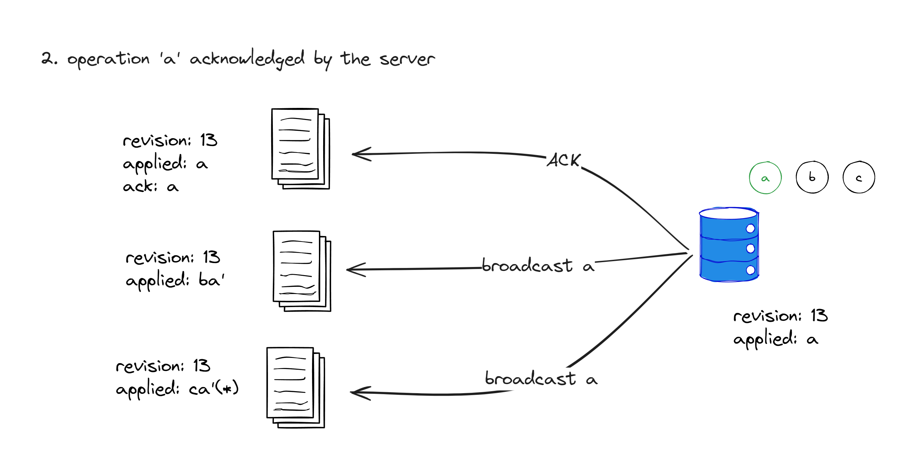
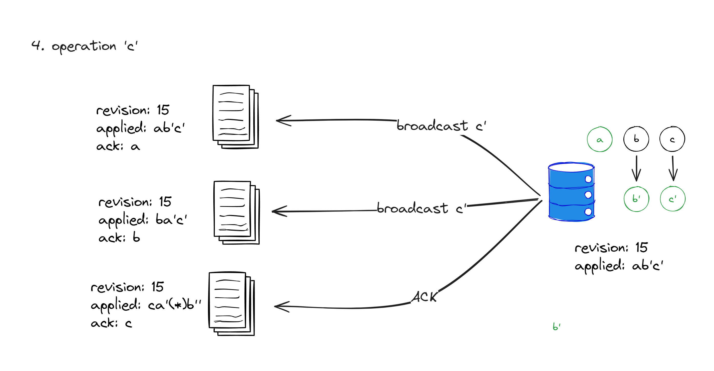

> 这篇博客是 Univer 团队内部分享整理而成。在 Univer 我们经常对有趣的技术问题进行分享和讨论，如果你喜欢这篇博客的内容，不妨考虑[加入我们](mailto:huwenzhao@univer.ai)。

Univer 作为一个企业数据协同工具，我们的目标之一是让用户可以在任何地方、任何时间、任何设备上进行协同编辑。在这个过程中，我们遇到了很多有趣的技术问题，其中最有挑战性的问题之一是设计 OT 算法。本文将介绍 OT 算法的基本原理，以及 Univer 协同编辑模块的设计。

目前社区里有关 OT 算法的资料很多，但是大多数仅简单介绍了操作转换的概念，对于如何调度操作转换，特别是为什么需要做这些调度，以及如何处理生产环境中的诸多情况则没有做太多讲解。这篇文章将会尝试把这些问题都介绍清楚，如有错误之处请在讨论区指出。

---

## 为什么我们需要一个协同编辑算法？

什么是协同编辑？如果你用过 Google Doc、腾讯文档、飞书文档这样的工具，可能已经接触过了协同编辑：多个用户可以**同时**编辑同一个文档，而且他们可以看到彼此的操作。如果不采用协同编辑方法而允许多个用户编辑同一篇文档，我们要么牺牲便捷性：要求让用户手动解决冲突（就像 Git 一样），要么牺牲同时性：通过设置锁使得同一时刻最多只有一个用户能够编辑文档。但显而易见，这两种方案都会对用户体验造成极大的负面影响。

协同编辑算法的意义就在于它能够**让多个用户能够同时编辑同一个文档，最终大家看到的文档内容一致，而且大体上符合他们的预期**。

我们拿电子表格做一个简单的例子：用户 A 和用户 B 同时编辑一个表格，A 想要在 C2 单元格插入文本，B 想要在 B 列之前插入一列，最终他们看到的都应该是：B 列前插入了一列，且在 D2 单元格插入了那段文本。


我们来尝试给协同编辑下一个定义：

如果在**同一文档**的**多个副本**上同时进行编辑（这里同时的意思是：在编辑时，一个副本并没有完全同步了其他副本的所有编辑），我们需要提出一种方法使得：

- **各个副本的内容最终一致**，即最终一致性
- **最终内容符合用户的预期**，即意图保持

其中第一点是要求强保证的。第二点要求尽力保证，即我们不能保证结果一定符合用户的预期，但是我们应该尽可能保证结果符合大多数人的直觉。

另外，除了最终一致性和意图保持两点要求外，还有另外一点隐含要求：

- **用户的编辑总是要先在本地生效**

接下来我们来看看 OT（Operation Transform，操作转换）算法是怎么满足协同编辑的这些要求的。

PS：协同编辑问题可以看作是一种特殊的分布式数据同步问题 [CAP 定理 - 维基百科，自由的百科全书 (wikipedia.org)](https://zh.m.wikipedia.org/wiki/CAP%E5%AE%9A%E7%90%86)。协同编辑要求保证可用性（用户永远可以编辑本地的副本），分区容忍性（用户的副本可以暂时不一致），牺牲强一致性（但提供最终一致性），即 AP without C。

PPS：近些年来，一种叫做 CRDT（Conflict-free Replicated Data Type，无冲突复制数据类型）的协同编辑算法得到了越来越多的关注和应用。至于为什么我们没有选择 CRDT，将在文章最后进行讨论。

## OT 的解决方案

### 操作的定义

首先我们给出**操作**的定义，将用户的编辑行为做如下抽象：

1. 操作有这么几个字段：操作的类型（或者称名称、ID，总而言之指的就是何种操作），操作的坐标，操作的参数（因操作的类型而定）
2. 操作的分类有语义化特征，即操作有用户能够感知的语义，例如插入文字、设置属性、删除区域等等
3. 操作的分类有原子化特征，即操作不能再被分解成其他类型的操作

例如，上面提到的插入列的编辑行为可以这样表示：

```ts
const insertColOp = {
  type: "insertCol",
  coord: { col: 1 },
  params: { count: 1 },
};
```

在单元格插入内容的编辑行为可以这样表示：

```ts
const insertCell = {
  type: "insertCell",
  coord: { row: 1, col: 2 },
  params: { content: "text" },
};
```

PS：这里是伪代码，Univer 所使用的结构比这要稍微复杂些。

定义了操作之后，用户的编辑行为都可以被操作所表示，执行编辑的行为即是在某个副本上应用操作的
过程。

### 操作的顺序和版本号

同样的一组操作以不同的顺序应用在同一副本上，会得到不同的结果，因此需要确定操作的顺序。

我们这里引入版本号的概念：定义初始（未应用任何操作的副本）版本号为 `x`，应用一个操作之后，副本的版本号为 `x+1`，此时应用的这个操作的版本号就定义为 `x+1`，或者说，这个操作的 `revision` 属性为 `x+1`，这样，我们就可以通过版本号来定义操作的顺序了。

另外，如果一个操作发生时，发生操作的这个副本的版本号为 `y`，那么就说这个操作的 `baseRevision` 为 `y`。这样我们也可以用 `baseRevision` 来定义并发的操作，即两个操作拥有相同的 `baseRevision`。

注意，一个操作的 `baseRevision` 为 `y` 并不意味着它的 `revision` 一定为 `y+1`，这一点我们下一小节就来介绍。

### 协调服务器

现在的问题是，当多个副本同时发生操作时（或者说有多个相同 `baseRevision` 的操作时），我们如何给这些操作分配版本号呢？在 OT 中，**版本号不能由客户端赋予**。这里我们引入一个协调服务器，这个服务器将会负责给每个操作分配一个版本号，即给它们的 `revision` 属性赋值，通过服务端的分配，我们能保证所有的 `revision` 是全局唯一且全局一致的。

:::note

换句话说，OT 中的所有副本的操作整体具有[全序特征](https://zh.wikipedia.org/wiki/%E5%85%A8%E5%BA%8F%E5%85%B3%E7%B3%BB)，即任意两个操作都可以比较出先后顺序。与之相对，CRDT 并不要求所有副本的操作具有全序特征。

:::

:::note

为什么版本号不能由客户端赋予？因为由客户端赋予的话，很难保证版本号的唯一、单增和连续性。而前面我们提到：

> 同样的一组操作以不同的顺序应用在同一副本上，会得到不同的结果，因此需要确定操作的顺序。

如果我们让客户端自己赋予版本号，那么很难保证各个副本的操作在不同的副本上能有相同的版本号，这样就会导致不同副本上的操作顺序不一致，最终导致副本内容不一致。

:::


我们举一个例子来让你更直观的了解协同服务器的作用，**为了方便后续介绍操作转换的必要性，这里我们假设客户端发生的操作在被服务器分配版本号之前不会在本地应用**。

我们假设有 A B C 三个副本都处于 12 版本，此时它们都发生了一个操作，这三个操作的 `baseRevision` 都为 `12`，我们将这三个操作分别命名为 `a`、`b`、`c`，并且假设它们的 `revision` 属性都为 `0`，即还没有被服务器分配版本号。用伪代码表示如下：

```ts
const opa = {
  // ... other fields
  baseRevision: 12,
  revision: 0,
};

const opb = {
  // ... other fields
  baseRevision: 12,
  revision: 0,
};

const opc = {
  // ... other fields
  baseRevision: 12,
  revision: 0,
};
```

A B C 三个副本都向服务器发送了这三个操作，服务器收到了这三个操作，将它们的 `revision` 属性分别赋值为 `13`、`14`、`15`，并将它们返回给 A B C 三个副本。这三个副本按照 `revision` 的顺序应用这三个操作，此时 A B C 三个副本的版本号都为 `15`，且它们的内容都是一致的。

```ts
const opa = {
  // ... other fields
  baseRevision: 12,
  revision: 13,
};

const opb = {
  // ... other fields
  baseRevision: 12,
  revision: 14,
};

const opc = {
  // ... other fields
  baseRevision: 12,
  revision: 15,
};
```

:::note

你可能想知道服务端如何给操作分配版本号，其实这里的依据是无关紧要的，只要版本号是全局唯一的就可以了，可以按照时间顺序来分配，也可以按照操作发起者的 ID 来分配。

:::

小结一下：

- 服务端来决定所有操作的应用顺序，从而做到操作版本号的全局唯一和全局一致
- 多个副本以相同的顺序应用同一批操作，那么副本的内容也完全一致，所以现在的协同方案已经满足了强最终一致性

但现在的方案有两个很明显的问题：

第一个问题：客户端发生操作时，没有在本地立即应用，而是要等待服务端排序后才能应用，不满足 **用户的编辑总是要先在本地生效** 这一条件。

第二个问题：不能保证结果符合用户的预期。以开头的例子为例：

> 一个简单的例子：用户 A 和用户 B 同时编辑一个表格，A 想要在 C2 单元格插入文本，B 想要在 B 列之前插入一列，两个人编辑完成之后，我们需要在 B 列前插入一列，且在 D2 单元格插入那段文本

如果 A 的操作的 `revision` 小于 B 操作的 `revision`，那么结果是符合预期的，但如果 B 操作的 `revision` 小于 A 操作的 `revision`，那么结果就不符合预期了。

要解决这两个问题，我们就要引入对操作的转换（Transform）。

### 操作转换

我们细化一下上面假设的三个操作 `a`、`b`、`c`：

- `a` 是在 C2 单元格插入文本
- `b` 是在 B 列之前插入一列
- `c` 是在 A1 单元格设置样式

用伪代码描述如下：

```ts
const a = {
  type: "insertCell",
  coord: { row: 1, col: 2 },
  params: { content: "text" },
  baseRevision: 12,
  revision: 0,
};

const b = {
  type: "insertCol",
  coord: { col: 1 },
  params: { count: 1 },
  baseRevision: 12,
  revision: 0,
};

const c = {
  type: "setCellStyle",
  coord: { row: 0, col: 0 },
  params: { style: "bold" },
  baseRevision: 12,
  revision: 0,
};
```

A B C 三个副本先将这三个操作分别应用再本地，然后将这三个操作发送给服务器，等待服务端发送对三个操作的 ACK 事件。


**处理 `a`**



我们假设服务器永远按照 A B C 副本的顺序来优先处理它们发送过来的操作，此时 `a` 的 `baseRev` 为 `12` 和服务端最后一个操作的 `revision` 一致，所以这个操作可以直接应用在服务端持有的副本上。服务端应用这个操作之后，将这个 `a` 的 `revision` 属性赋值为 `13`，向 A 发送一个 ACK 事件表明该操作已经被服务端接受，并向 B C 广播这个操作 `a`。

A 收到 ACK 之后，将本地版本号自增为 `13`。

B 收到 `a` 之后，发现 `a` 的 `revision` 为 `13`，而 B 的版本号为 `12`，所以 B 应该应用这个操作，但是由于 B 已经先应用的自己的操作 `b`，因此不能直接应用这个操作，B 必须计算 **“在 b 已经已经应用”的前提下，该如何转换 a 得到 a'，转换 b 得到 b'，才能使得应用 ab' 和应用 ba' 的结果一致？** ，这就是操作转换。

> 补充说明：当然有可能存在 `revision` 不是本地版本号加一的情况，如果 `revision` 低于自己的版本号加一，那么直接丢弃即可，如果高于自己的版本号加一，说明本地副本 miss 了一些操作，需要去服务器端补拉这些操作并做操作转换

这里可以得到转换（Transform）的非形式化定义：

**Transform 算法的非形式化定义：假设 a b 是基于相同版本，在不同副本上并发的两个操作，Transform 所做的事情是，在假设 a b 分别已经在各自的副本中应用的情况下，调整 a b 操作得到 a' b'，使得 ab' / ba' 的应用结果一致。**

`a'` 的内容用伪代码描述应该是：

```ts
const aPrime = {
  type: "insertCell",
  coord: { row: 1, col: 3 },
  params: { content: "text" },
  baseRevision: 12,
  revision: 13,
};
```

B 在转换得到 `b'` 之后，虽不需要应用到本地，但是需要将 `b'` 的 `baseRevision` 属性设置为 `13`，这是为什么？因为 `b'` 是在 `a` 之后发生的，而 `a` 已经是被服务端所确认的 `13` 号操作，所以 `b'` 的 `baseRevision` 也应该改为 `13`。

`b'` 的内容用伪代码描述应该是：

```ts
const bPrime = {
  type: "insertCol",
  coord: { col: 2 },
  params: { count: 1 },
  baseRevision: 13,
  revision: 0,
};
```

C 对于 `a` 的处理和 B 类似，不再赘述。

**处理 `b`**


首先 b `baseRevision` 是 12，而此时服务端副本的版本号因为应用了 `a` 变为 13，因此服务端收到此操作之后，需要对 `a` `b` 进行得转换到 `b'` 再将 `b'` 应用在服务端的副本上，并给 `b'` 设置 `revision` 为 14。然后向 B 发送 ACK 事件，向 A C 广播 `b`。

这里有一个有趣的问题：为什么广播的是 `b'` 而不是 `b`？

- 对于 A 来说，此时它的版本号已经升到 13，直接应用 `b'` 就可以直接到 14，其实你可以注意到 A 和服务端的副本应用的操作是完全一致的
- 对于 C 来说，它之前收到 `a` 的时候，已经对 `a` 进行了一次转换得到 `c'`，`c'` 的 `baseRevision` 为 13，如果再对 `c'` 和 `b` 进行转换，由于它们的 `baseRevision` 不一致，不能直接转换，而要先对 `b` `a` 进行一次转换重新得到 `b'`;，不如直接用服务端 transform 好的 `b'`。

**处理 `c`**



对于 `c` 的处理和 `b` 类似，不再赘述，大家可以自行推演。

小结一下：

- 通过引入操作转换，使得操作可以先在本地生效，同时解决意图保持问题

### 操作转换改变了什么

在执行操作变更的时候，往往会修改操作执行的坐标和其他参数，但是特殊情况下，变更操作的类型也是完全有可能的。

具体的操作转换方法，需要根据操作的类型来决定，任意两种操作都需要进行转换，另外操作可能要和同类型的另一个操作进行转换。如果原子操作的数量是 `n`，那么转换方法的量级就是 `O(n^2)`，因此，正确地实现操作转换是一个细活。不过也正是我们需要一个个地实现操作转换，我们才对转换过程中的意图保持有更强的控制力。

## 真实场景中需要考虑的问题

以上就是 OT 算法的基本原理，但是在实际的生产环境中，我们还需要考虑很多其他的问题。

### 操作的合并和压缩

为了减少网络传输的开销以及减少操作转换的次数，我们需要对操作进行合并和封装。

1. 合并指的是将同种类的多个操作合并为一个操作，例如用户在文档中连续输入多个字符，我们可以将这些字符合并为一个插入操作；又或者用户在几个单元格中输出了内容，我们可以将这几个写个内容的操作合并为同一个。
2. 封装指的是将多个操作封装成一个更大的单位，以这个单位作为版本号的基准，Univer 中将这个单位称作 changeset。例如用户设置了单元格内容之后，再设置了这个单元格的样式，我们可以将这两个操作封装为一个 changeset 发给服务端。

### Undo Redo

应用了其他副本的协同操作之后，Undo Redo 栈里面记录的操作有可能就不能再直接执行。还是以上面的例子为例，如果在所有的编辑同步完成之后 A 想要 undo 插入操作，那么就应该清除 D2 单元格的内容而非 C2 单元格的内容。所以在应用来自其他副本的操作之前，还需要对本地的 Undo Redo 栈进行操作转换。

### 应对网络错误等复杂情形

在整个协同编辑的过程中会大量使用网络，不可避免地会出现各种网络中断的情况（可能是网络本身出了问题，又或者在网络传输完成之间网页被用户关闭的），协同调度算法必须对这些意外做出应对。

第一种情况：客户端可能错过服务端广播的一些操作，造成本地版本号的落后。客户端如何感知这种情况？客户端有两种办法感知，第一种是在接收服务端的远程操作时，发现操作的 `revision` 比本地的版本号 1 要大；第二种是在发送操作给服务端时，服务端返回的 ACK 事件的 `revision` 比本地的版本号要大。这两种情况都说明了客户端错过了一些操作，此时客户端需要向服务端拉取这些操作，拉取操作的区间应该是本地版本号加一到 `revision` 减一（闭区间），这个拉取的行为叫做 fetch miss。在 fetch miss 期间，本地仍有可能发生操作，也有可能接收到更新的服务端操作，这些操作之间均需要进行操作转换。

第二种情况：客户端可能错过服务端的 ACK。为了避免同一个操作重复发送和执行，我们需要给每个操作一个全局唯一的 ID，当服务端收到操作时，先校验这个操作是否已经被执行过，如果已经执行过，那么就不再执行，直接返回 ACK。而客户端如果在一段时间内没有收到 ACK，那么就需要重新发送这个操作。

第三种情况：客户端有编辑未同步到服务端时网络链接断开了。此时必须将用户的编辑操作在本地进行缓存，并在链接网络后重新发送。详见下一小节。

### 离线缓存

用户可能在没有网络的情况下进行编辑，例如在编辑时网络链接断开了，又或者是通过 PWA 或者 Electron 等方式支持完全的离线编辑——总之，如果用户在离线的情况下进行了编辑，那么这些操作必须被缓存下来，等到网络恢复之后再发送给服务端。离线缓存时需要将已经发送给服务端但是未收到 ACK 的 changeset，以及尚未发给服务端的操作区分开。

### 冲突处理

尽管我们希望所有的并发编辑都能够被协同算法完美处理，但在实际的生产环境中这几乎不可能做到，我们必须要在协同算法无法处理的情况下让用户自己来解决冲突。方法就是在发生冲突时切断协同编辑，同时保留冲突现场，让用户有机会来保存他们的编辑结果。

### 历史记录

用户会需要查看文档的历史版本，因此我们需要在服务端保存每一条操作，用户想要查看制定版本的内容时，就回放指定版本及之前的所有操作。为了加快回放的速度，我们往往会在某些版本上保存快照，这样用户回放时就可以直接回放快照之后的操作。保存快照的依据可以是时间间隔，也可以是操作数量，也可以在某些特定操作发生的时候进行。快照可以是和操作不同的数据结构，也可以和操作的结构完全相同。这其中往往涉及到数据结构可读性与同构的简洁性之间的取舍。

### 协同光标

在协同编辑的过程中，用户可能会想要知道其他用户在编辑文档的哪个位置，这就需要实现协同光标。一个简单的做法是用户在切换光标时，就通过服务端将自己的操作发送给其他用户，但过于频繁的切换光标会导致大量的网络传输，因此我们做一定的节流处理，例如只有在光标停留一段时间之后才发送。

另外，协同光标还需要考虑和操作做转换，比如用户 B 的光标在 C1 单元格，用户 A 删除了 B 列，此时用户 B 的光标应该在 B1 单元格。为了避免类似的操作带来大量的网络传输事件，我们往往不会让光标的所有者在这种情形下广播自己的光标信息，而是让各个端在本地处理。

实际上，协同光标的广播并不一定要依赖服务端（和 OT 不同，光标切换的动作并不需要排列出一个全局一致的顺序），所以我们也可以通过 P2P 的方式来实现，这样可以减少服务端的压力。

## Univer 的协同编辑模块设计

### 使用插件形式构建协同编辑

在 Univer 当中，协同并没有侵入 Univer 的内核，而是作为一个插件存在的，并且 Univer 的内核并没有针对某一种协同编辑算法做特殊的数据结构上的设计，这样做的好处是我们可以在不改动 Univer 内核的情况下，支持多种协同编辑算法。我们也欢迎社区发挥自己的创意，开发自己的协同编辑方案。

另外我们想分享给大家的一点是 Univer 技术栈中的依赖注入带来的灵活性，它对于实现协同编辑插件化至关重要。Univer 当中 undo redo 服务的依赖注入 token 为 `IUndoRedoService`，默认实现为 `LocalUndoRedoService`，它并不支持对 undo redo 栈中的操作做转换。Univer 官方的插件会将实现**替换**为 `CollaborativeUndoRedoService` 以支持 undo redo 转换：

```ts
export class CollaborativeUndoRedoService extends LocalUndoRedoService implements ICollaborativeUndoRedoService {
    // ...
}

export class CollaborationClientPlugin extends Plugin {
    static override type: PluginType = PluginType.Univer;

    constructor(
        _config: unknown,
        @Inject(Injector) protected override _injector: Injector,
        @Inject(LocaleService) private readonly _localeService: LocaleService
    ) {
        // ...
    }

    override onStarting(injector: Injector): void {
        injector.replace([IUndoRedoService, { useClass: CollaborativeUndoRedoService }]);

        // ...
    }
}}
```

### 文档类型无关的协同调度算法

Univer 无界文档的理念要求在同一个无界空间中可以混合使用多种文档类型，例如在同一个无界空间中可以混合使用电子表格、文档、幻灯片等等。这就要求协同调度算法不能依赖于文档类型的特性，例如电子表格的行列结构，而是要能够适用于任何文档类型。

我们实现了一个文档类型无关的协同调度模块，协同调度模块会处理网络连接、操作转换调度、历史记录、离线编辑等等问题，各种类型文档需要做的主要是设计操作的数据结构以及操作转换算法，这样就大大降低了不同类型文档协同编辑的开发难度。

### 基于状态机的协同调度算法

从上面的分析我们也可以看出，正确的处理协同编辑的各种复杂情况是非常困难的，尤其是在客户端。客户端可能处在不同的状态，不同的状态下对发生的各种事件的处理方式也有微妙的差别。为了处理这样的复杂性，我们引入了状态机模型。协同状态机一共有七种状态：

1. `Synced` 此时客户端和服务端的副本是完全一致的，客户端也没有任何未发送的操作
2. `Pending` 此时客户端有未发送的操作
3. `Awaiting` 客户端所有的操作都发送到了服务端，等待确认
4. `AwaitingWithPending` 客户端部分操作已经发送到了服务端，但是还有未发送的操作
5. `FetchMiss` 客户端错过了一些操作，正在向服务端拉取
6. `Offline` 客户端离线
7. `Conflict` 客户端发生了冲突，需要用户手动解决

可能导致状态转换的事件有：

1. 本地发生了操作
2. 本地收到了服务端的操作
3. 本地收到了服务端的 ACK
4. 本地收到了服务端的 REJ
5. 网络错误
6. 等等其他事件

状态机的状态转换图如下：


## 附：为什么没有用 CRDT？

出于以下两点考虑，我们选择了 OT 算法而非 CRDT 作为解决方案：

首先，Univer 主要用在企业办公领域，CRDT 的本地优先、无需协调服务器的特性在 Univer 的应用场景中并不是特别重要；而 OT 的协调服务器能够更方便地让我们处理编辑权限控制，及确定用户变更在历史记录中的顺序。在 OT 中，我们可以通过协调服务器来控制用户的编辑权限，例如只有文档的创建者才能够删除文档，而在 CRDT 中，可能需要一种分布式的权限控制能力，这样实现起来会比较复杂。

其次，目前尚没有在电子表格领域大规模使用 CRDT 的实践，我们不确定 CRDT 能否解决电子表格中复杂的意图保持问题，也不确定在超大电子表格文档中 metadata 会不会导致过高的存储和内存占用。相反，由于 OT 是 case by case 地解决冲突的，因此让我们能够手动解决意图保持问题，数据结构也相对简单，更加可靠。

## 结论

这篇文章讨论了为什么需要协同编辑，OT 算法为什么要这么设计，实践中需要考虑的问题，以及 Univer 的协同编辑模块的设计。协同编辑是复杂的，这是一个凝结了大量工程师智慧的领域；但是协同编辑也是有趣的，它能够给用户带来全新的体验，让用户在协作中更加高效。我们希望这篇文章能够帮助你更好地理解协同编辑。如果有任何问题，欢迎在评论区和我们讨论。

---

作者：[Wenzhao Hu](https://github.com/wzhudev)，Univer 团队架构师。负责 Univer 协同编辑模块的设计和研发。
