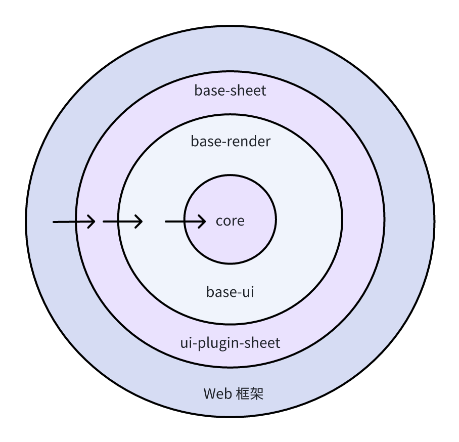

## Chapter Zero: Introduction

This article aims to help newcomers quickly familiarize themselves with the architecture and code of the open-source project "univer". It reflects my learning and summarization during my involvement in the development of "univer" over the past period. There may be inaccuracies or misunderstandings, so feedback and corrections are welcome.

In Chapter One, I will discuss my understanding of the "univer" architecture, how it modularizes components, and the dependencies between these modules. I will then place "univer" within the MVC architectural pattern and analyze its model layer, view layer, controllers' boundaries, and responsibilities.

In Chapter Two, we will delve into the data structure design of "univer sheet," distinguishing between workbook, sheet, row, column, style, and understanding their relationships, which will be helpful for a deeper comprehension of the code.

Chapters Three and Four will analyze the codebase from two control chains within "univer." One chain covers the process of "univer" startup and initial rendering, transitioning from the model layer to the view layer. The other chain involves "univer" responding to user events, triggering model layer data changes, and page re-rendering, transitioning from the view layer to the model layer. These sections will involve a significant amount of source code analysis while retaining the primary logic and omitting edge case code. Each code block's first line indicates the TS file it belongs to, facilitating direct code reading.

## Chapter One: Understanding the Code Architecture

> "Outer beauty pleases the eye, inner beauty captivates the heart." —Voltaire

### Module Splitting and Dependency Relationships in Univer

#### Principle of No Dependency Cycles

Software architecture rules essentially revolve around arranging code blocks. Based on the business domain, software architecture organizes project code into different modules, ensuring a separation of concerns among modules. Modules have clear dependencies between them, forming a directed acyclic graph, known as the principle of no dependency cycles. As illustrated below, system-level and application-level business logic are the core and most stable parts of the project, placed at the core of the architecture. Other elements like user interfaces, rendering engines, frontend frameworks, and persistent databases, which may be replaced during architecture evolution, depend on the central business entity, positioned on the outer layers.



(Core, sheet, engine-render, ui, sheet-ui correspond to different folders under the "packages" directory in the repository)

In the architecture design of Univer, the core module strives to contain only the most essential business logic. Additional functionalities built on top of the core business logic are provided through plugins, following the **Micro kernel architecture** concept. In the diagram, engine-render, ui, sheet, etc., are modularized plugins that provide extra capabilities to the core. For example, the sheet plugin enhances sheet-related functions, the engine-render (canvas rendering engine) offers canvas rendering capabilities, and the formula engine provides formula-related calculations and parsing.

#### Dependency Inversion

Initially, one might assume that the core module depends on the engine-render module for canvas rendering and on the ui module for page framework rendering and styling menus. This setup can lead to a problem where the core module relies on other unstable modules. For instance, styling menus may frequently change in position or appearance, potentially affecting the core module's stability. In Univer, the issue of core module dependency on unstable modules is mitigated through **Dependency Inversion**, as shown in the diagram. All outer rings depend on inner rings, while inner rings cannot depend on outer rings. Univer incorporates **Dependency Injection (DI)** to invert dependencies, ensuring that the core layer does not rely on outer layers. The following code examples illustrate this concept clearly:

In the absence of dependency injection, code might look like this:

```ts
class SheetPlugin {
    private _commandService = new CommandService(); 
}
```

In the code above, the `SheetPlugin` class depends on the `CommandService` class. Changes in the methods of the `CommandService` class directly impact `SheetPlugin`, potentially requiring modifications and destabilizing `SheetPlugin`.


Through dependency injection, the code is structured as follows:

```ts
class SheetPlugin {
    constructor(
        // ...
        @ICommandService private readonly _commandService: ICommandService,
        // ...
    )

    otherMethod(){
        this._commandService.registerCommand(SomeCommand);
    }
}
```

In the code snippet above, the `_commandService` property is declared to have the `ICommandService` interface. Through relevant dependency bindings, methods in `SheetPlugin` can call methods defined in the `ICommandService` interface. This decouples the direct dependency relationship between `SheetPlugin` and `CommandService`. The diagram below illustrates this concept:


By implementing the `ICommandService` interface, and through dependency injection, the direct dependency between `SheetPlugin` and `CommandService` is decoupled, ultimately ensuring the stability of core business logic.

### A Brief Discussion on the MVC Architecture in Univer


MVC has a history of over 50 years in the GUI programming domain, yet it has never had a clear definition. The diagram above depicts two typical variations of MVC. In [MVC with ASP.NET](http://asp.net/), the controller manages the view and model layers. When the controller alters data in the model layer, the view layer directly reads data from the model layer through subscription mechanisms to update the view. In **MVC with Rails**, the view layer does not directly interact with the model layer. Instead, it goes through the controller as an intermediary to fetch data from the model layer for rendering. This approach ensures a complete decoupling of the view and model layers, making the control flow clearer.

Upon examining the Univer project's codebase, one can observe numerous files named with suffixes like `controller`, `view`, and `model`. This naming convention indicates that Univer follows the traditional MVC architectural pattern. Univer's MVC architecture is more similar to MVC with Rails because the view layer does not directly read data from the model layer or subscribe to changes in the model layer (as will be mentioned later—it subscribes to Mutations). Instead, it acts as a data cache (similar to a ViewModel), managed by the SheetSkeleton class.

When initially exploring the codebase, some doubts may linger:

1. How does Univer organize and manage the model layer?
2. What are the responsibilities of controllers in Univer, and how is controller code architecture kept clear?
3. How is the view layer in Univer organized and managed?

By reading the source code, we can discuss how Univer answers these questions from an architectural perspective.

#### Model Layer

In Univer, the entire model layer is relatively thin. Taking Univer sheet as an example, in the core module, the management of sheet-related model data is done through the Workbook and Worksheet classes, providing storage and management functionalities for the relevant model data. For instance, in the Worksheet class, there are row-manager, column-manager, and related classes and methods to manage each sheet's model data. For example, with the row-manager, we can obtain information and data about table rows:

```ts
getRowData(): ObjectArray<IRowData>;
getRowHeight(rowPos: number): number;
getRowOrCreate(rowPos: number): IRowData;
// ...
```

It's easy to understand that the data we render cannot directly use the underlying model data. Often, it needs to undergo certain calculations to generate a "model layer" suitable for direct view rendering. For instance, during view rendering, we need to calculate the total height of rows and columns. By considering the content of each row, we calculate the minimum row height required to accommodate the row's content. Through a series of calculations, we ultimately determine the layout of the sheet page for the final rendering. All these calculations are encapsulated in the SheetSkeleton class in the view layer.

#### Responsibilities of Controllers


In traditional MVC architecture, the responsibilities of the view and model layers are often clear, while the controller bears the main business logic responsibilities, managing the view layer and model layer tasks. Controllers can become bulky, handling various tasks. How does Univer avoid bloated controllers? In Univer, the controller (in the MVC sense) is further broken down into **Controllers** (in the narrow sense in Univer), **Commands**, and **Services**. Almost all the application's business logic is encapsulated in controllers, each with distinct roles, ensuring the normal operation of the Univer application.

**Responsibilities of Controllers**

- Initialize some rendering logic and event listeners, such as in the SheetRenderController class, executed during the Rendered lifecycle of the application. It initializes the page data refresh (_initialRenderRefresh), listens to Command executions involving Mutations to modify the model layer, and triggers page rendering logic.
- Interact with the view layer, retrieve some data information from the view layer. For example, in the AutoHeightController class, it calculates sheet auto row height based on Commands' requirements through the view layer.
- Bind UI events, such as in the HeaderResizeController class, executed during the Rendered lifecycle of the application. During initialization, it binds hover events for spreadsheetRowHeader, spreadsheetColumnHeader to show and hide resize headers (used to adjust row and column heights and widths). It also binds pointer down/move/up events to the resize header, enabling it to respond to drag movements, handle relevant user operations, and ultimately reflect changes to the model layer and view layer.

**Responsibilities of Commands**

Commands can be understood as single user interaction operations, such as merging cells, clearing selections, inserting rows/columns, setting cell styles, etc., and modifying the model layer, triggering view layer rendering. `Commands` have three types: `COMMAND`, `MUTATION`, `OPERATION`.

- **COMMAND** represents a single user interaction operation triggered by user behavior. It can spawn another COMMAND, for example, when a user clicks on the text wrap menu item in the menu, it triggers `SetTextWrapCommand`, which can spawn `SetStyleCommand` to handle all style changes uniformly. A `COMMAND` can spawn another `COMMAND`, but it cannot fork, as we need to handle undo/redo operations in `COMMAND` (undo/redo might be moved to the data layer later). However, a `COMMAND` can spawn multiple `MUTATION` and `OPERATION`.
- **MUTATION** is an atomic operation on model layer data, such as `SetRangeValuesMutation` to modify cell styles and values within a selection range, or SetWorksheetRowHeightMutation to change the height of rows within a selection range. Executing a `MUTATION` not only modifies model data but also triggers view re-rendering. Data modifications in MUTATION need to be coordinated and conflicts resolved.
- **OPERATION** is a change in application state, representing a temporary state of the application, such as page scroll position, user cursor position, current selection, etc. It does not involve coordination or conflict resolution, mainly used for future functionalities like live share (similar to Feishu's magic share).

**Responsibilities of Services**

Services provide various services for the entire Univer application, serving as the bearer of Separation of Concerns in the Univer project architecture.

- Manage the application lifecycle, such as the LifecycleService class, which stores the application's lifecycle state values and provides the subscribeWithPrevious method for other modules to subscribe to changes in the application's lifecycle state values and perform responsive tasks, such as initialization of dependencies.
- Handle application history operations and store historical operations, allowing users to undo/redo previous actions. In the LocalUndoRedoService class, the `pushUndoRedo` method pushes undo/redo information onto the stack, and the `updateStatus` method triggers undo/redo operations.
- Manage network IO and websocket connections.

In summary, Controllers, Commands, and Services are collectively referred to as controllers in the MVC pattern, handling a significant amount of business logic in Univer. The main responsibilities are listed above (more detailed analysis of how controllers work will be provided in Sections Three and Four).

#### View Layer

In Univer, there are two rendering approaches: Canvas rendering engine and React rendering through the DOM. The Canvas rendering engine primarily renders the main part of the sheet: row headers, column headers, sheet cells, selections, cell editors, etc. React is mainly used to render the top menu bar, context menu bar, pop-ups, etc.

The main body of the sheet is rendered using the Canvas rendering engine, ensuring optimal performance and smooth animation effects for table rendering under large data sets. Menus, on the other hand, require event responsiveness, where DOM has advantages over Canvas.

Components and services required for Canvas rendering are located in the `base-render` folder, handling sheet rendering components like Spreadsheet, SpreadsheetRowHeader, SpreadsheetColumnHeader, etc. Event response mechanisms are defined on Canvas components to ensure independent event handling for each component, although event handling is not performed in the view layer. These events need to be handled in Controllers.

The `base-ui/Components` folder is responsible for rendering basic menu components and publishing user events. The base-ui module is also responsible for rendering the entire Univer sheet page framework and handling user interaction operations, such as keyboard shortcuts, copy-paste, etc.

## Chapter Two: Univer Sheet Data Structure

To understand a project, let's start with its data structure.

The data types related to sheets are defined in the [Interfaces](https://github.com/dream-num/univer/tree/dev/packages/core/src/Types/Interfaces) folder, with the following relationships:


The overall data type definition of Univer sheet is as shown in the above diagram. A workbook contains multiple sheets, and the styles referenced by sheets are defined at the top-level workbook to ensure style reuse, reducing memory overhead, which is consistent with Excel. In the IWorksheetConfig, the cellData field is defined as a two-dimensional matrix used to persist cell information, as defined in the type information of ICellData. **'p' indicates rich text, an interface type IDocumentData, essentially an Univer document, which is a unique feature of Univer's design - each cell in Univer sheet can be transformed into an Univer document**. The 's' field mostly contains a string ID pointing to the styles field in IWorkbookConfig, from which the style information for that cell can be retrieved.

The diagram does not include all the fields defined in each interface. For more information, it is recommended to directly refer to the [type definition file](https://github.com/dream-num/univer/blob/9a505ec3ba9de96677b9caaa821e287e71ebe0cf/packages/core/src/Types/Interfaces/IWorkbookData.ts#L12) above, where corresponding comments are also provided.

## Chapter Three: Application Startup to Rendering Process

How does Univer render pages? It's essentially the entire process of starting the Univer application, and also the process from the model layer to the view layer. Before understanding page rendering, let's first understand the lifecycle of Univer, which was also mentioned in the Services section above.

### Application Lifecycle

```ts
export const enum LifecycleStages {
    /**
     * Register plugins to Univer.
     */
    Starting,
    /**
     * Univer business instances (UniverDoc / UniverSheet / UniverSlide) are created and services or controllers provided by
     * plugins get initialized. The application is ready to do the first-time rendering.
     */
    Ready,
    /**
     * First-time rendering is completed.
     */
    Rendered,
    /**
     * All lazy tasks are completed. The application is fully ready to provide features to users.
     */
    Steady,
}
```

Univer has four stages in its lifecycle: `Starting`, `Ready`, `Rendered`, and `Steady`. In the Starting stage, plugins are registered with Univer. In the Ready stage, UniverSheet is instantiated, and the initialization functions of various plugins are executed. The Rendered stage completes the first rendering, and in the Steady stage, the application is fully launched, and users can use all features.

When do the various lifecycle stages get triggered?

**Starting Stage**: In the `_tryStart` method, the LifecycleService class is instantiated, and the application enters the Starting stage. **At this stage, the onStarting hooks of plugins are also executed**.

**Ready Stage**: After instantiating UniverSheet, in the `_tryProgressToReady` method, the LifecycleService stage value is set to Ready. **At this stage, the onReady hooks of various plugins are also executed**.

**Rendered Stage**: In the DesktopUIController, after bootstrapping the entire application, the LifecycleService stage value is marked as Rendered.

**Steady Stage**: After the Rendered stage, the Steady stage is triggered after a delay of 3000 seconds.

Through the `@OnLifecycle` annotation, we can precisely control when a class is instantiated during a specific lifecycle stage, as shown below:

```ts
@OnLifecycle(LifecycleStages.Rendered, SheetRenderController)
export class SheetRenderController extends Disposable {
    //...
}
```

In the above code snippet, SheetRenderController will be instantiated during the Rendered stage.

### The Entire Process from Startup to Rendering


**Step One**: Create Univer instance, register necessary plugins for the sheet, and create the Univer sheet instance.

The registered plugins and their functionalities are as follows:

- base-docs: Used for cell and formula editing.
- base-render: Canvas rendering engine, including basic components required for sheet, doc, slide, responsible for the entire canvas rendering process.
- base-sheets: Manages sheet canvas-related rendering, such as row header, column header, cells, and also handles a large amount of sheet-related business logic.
- base-ui: Manages the rendering of basic components in React DOM, such as menu-related components. Also responsible for rendering the entire Univer sheet page framework and user interaction operations, such as keyboard shortcuts, copy-paste, etc.
- ui-plugin-sheets: Responsible for rendering some basic UI and business logic, such as context menus, tasks related to rich text editing in cells.

After registering plugins, the createUniverSheet method creates the Univer sheet instance.

```ts
/**
 * Create a univer sheet instance with internal dependency injection.
 */
createUniverSheet(config: Partial<IWorkbookConfig>): Workbook {
    let workbook: Workbook;
    const addSheet = () => {
        workbook = this._univerSheet!.createSheet(config);
        this._currentUniverService.addSheet(workbook);
    };

    if (!this._univerSheet) {
        this._univerSheet = this._rootInjector.createInstance(UniverSheet);

        this._univerPluginRegistry
            .getRegisterPlugins(PluginType.Sheet)
            .forEach((p) => this._univerSheet!.addPlugin(p.plugin as unknown as PluginCtor<any>, p.options));
        this._tryStart();
        this._univerSheet.init();
        addSheet();

        this._tryProgressToReady();
    } else {
        addSheet();
    }

    return workbook!;
 }
```

Through the above code, we can see that Univer re-registers the plugins of type PluginType.Sheet from the registered plugins mentioned above to the UniverSheet instance. Then, by using _tryStart, the application enters the Starting stage, initializes, and instantiates a Workbook through addSheet, completing the initialization of the model layer. At this point, the model data preparation is complete, and Univer transitions to the Ready stage.

**Step Two**: Initialize the page framework and render the page framework.

During the Univer application lifecycle explanation, it was mentioned that plugins execute at different lifecycle stages. In this step, we focus on the base-ui plugin.

```ts
// base-ui-plugin.ts
override onStarting(_injector: Injector): void {
    this._initDependencies(_injector);
}

override onReady(): void {
    this._initUI();
}
```

In the above code, the base-ui plugin declares and adds dependencies in the onStarting stage and initializes the rendering of the entire page framework in the onReady stage, mounting the View interface onto the container.

```ts
// ui-desktop.controller.tsx
bootstrapWorkbench(options: IWorkbenchOptions): void {
    this.disposeWithMe(
        bootStrap(this._injector, options, (canvasElement, containerElement) => {
            this._initializeEngine(canvasElement);
            this._lifecycleService.stage = LifecycleStages.Rendered;
            this._focusService.setContainerElement(containerElement);

            setTimeout(() => (this._lifecycleService.stage = LifecycleStages.Steady), STEADY_TIMEOUT);
        })
    );
}
// ...
function bootStrap(
    injector: Injector,
    options: IWorkbenchOptions,
    callback: (canvasEl: HTMLElement, containerElement: HTMLElement) => void
): IDisposable {
    let mountContainer: HTMLElement;
    // ...
    const root = createRoot(mountContainer);
    const ConnectedApp = connectInjector(App, injector);
    const desktopUIController = injector.get(IUIController) as IDesktopUIController;
    const onRendered = (canvasElement: HTMLElement) => callback(canvasElement, mountContainer);

    function render() {
        const headerComponents = desktopUIController.getHeaderComponents();
        const contentComponents = desktopUIController.getContentComponents();
        const footerComponents = desktopUIController.getFooterComponents();
        const sidebarComponents = desktopUIController.getSidebarComponents();
        root.render(
            <ConnectedApp
                {...options}
                headerComponents={headerComponents}
                contentComponents={contentComponents}
                onRendered={onRendered}
                footerComponents={footerComponents}
                sidebarComponents={sidebarComponents}
            />
        );
    }

    // ...
    render();
    // ...
}
```

In the above code snippet, after mounting and rendering the page framework, the canvas rendering engine container is mounted and the canvas size is adjusted, and the application enters the Rendered stage.

**Step Three**: Render the canvas interface, completing the entire rendering process.

This process actually began in the Ready stage, where the initialization and assembly of components for the sheet canvas were started.

```ts
// sheet-canvas-view.ts
@OnLifecycle(LifecycleStages.Ready, SheetCanvasView)
export class SheetCanvasView {
    // ...
    constructor(
        // ...
    ) {
        this._currentUniverService.currentSheet$.subscribe((workbook) => {
            // ...
            const unitId = workbook.getUnitId();
            if (!this._loadedMap.has(unitId)) {
                this._currentWorkbook = workbook;
                this._addNewRender();
                this._loadedMap.add(unitId);
            }
        });
    }

    private _addNewRender() {
        // ...
        if (currentRender != null) {
            this._addComponent(currentRender);
        }
        const should = workbook.getShouldRenderLoopImmediately();
        if (should && !isAddedToExistedScene) {
            engine.runRenderLoop(() => {
                scene.render();
            });
        }
        // ...
    }

    private _addComponent(currentRender: IRender) {
        // ...
        currentRender.mainComponent = spreadsheet;
        currentRender.components.set(SHEET_VIEW_KEY.MAIN, spreadsheet);
        currentRender.components.set(SHEET_VIEW_KEY.ROW, spreadsheetRowHeader);
        currentRender.components.set(SHEET_VIEW_KEY.COLUMN, spreadsheetColumnHeader);
        currentRender.components.set(SHEET_VIEW_KEY.LEFT_TOP, SpreadsheetLeftTopPlaceholder);
        // ...
        this._sheetSkeletonManagerService.setCurrent({ sheetId, unitId });
    }

    private _addViewport(worksheet: Worksheet) {
        // ...
        scene
            .addViewport(
                viewMain,
                viewColumnLeft,
                viewColumnRight,
                viewRowTop,
                viewRowBottom,
                viewLeftTop,
                viewMainLeftTop,
                viewMainLeft,
                viewMainTop
            )
            .attachControl();
    }
}
```

The above code actually represents the entire process of rendering the sheet canvas. It first subscribes to `currentSheet`. If the sheet has not been rendered before, the `_addNewRender` method is called to add the necessary canvas rendering components for the sheet, add a viewport, and then add the scene's rendering to the rendering loop of the rendering engine (`runRenderLoop`).

In the above process, the assembly of the necessary canvas components for the sheet and the addition of the viewport are completed. So, where does the initial rendering of the canvas occur? And in which lifecycle stage? The rendering of the sheet canvas is managed by the SheetRenderController class, which handles the initialization rendering of the sheet canvas, listens for mutations, and then selectively renders the canvas interface.

```ts
// sheet-render.controller.ts
@OnLifecycle(LifecycleStages.Rendered, SheetRenderController)
export class SheetRenderController extends Disposable {}
```

In the above code, we can see that the rendering of the sheet canvas occurs during the entire application's Rendered stage. This is quite understandable because at this stage, the page framework has been mounted on the container, and the sheet canvas has completed its initialization work. During the Rendered stage, it subscribes to changes in `currentSkeleton$`, then updates the skeleton to complete the initial rendering of the page.

```ts
// sheet-render.controller.ts
private _commandExecutedListener() {
    this.disposeWithMe(
         his._commandService.onCommandExecuted((command: ICommandInfo) => {
            // ...
            if (COMMAND_LISTENER_SKELETON_CHANGE.includes(command.id)) {
                // ...
                if (command.id !== SetWorksheetActivateMutation.id) {
                    this._sheetSkeletonManagerService.makeDirty(
                        {
                            unitId,
                            sheetId,
                            commandId: command.id,
                         ,
                        true
                    );
                }

                 this._sheetSkeletonManagerService.setCurrent({
                    unitId,
                    sheetId,
                    commandId: command.id,
                });
           }

            this._renderManagerService.getRenderById(unitId)?.mainComponent?.makeDirty(); // refresh spreadsheet
        })
    );
}
```

The above code occurs in the SheetRenderController class. In the `_commandExecutedListener` method, it listens for Command executions. If it is within the `COMMAND_LISTENER_SKELETON_CHANGE` list, it marks the current skeleton and mainComponent as dirty. This way, the Canvas rendering engine will re-render the page in the next rendering loop.

**Step Four**: Initialize the cell editors.

In fact, by the third step, the rendering of the entire sheet interface is essentially complete. Let's now focus on the initialization process of the cell editors. During the application's Rendered stage, Univer will initialize two Doc instances—one for cell editing and the other for formula input box editing.

```ts
// initialize-editor.controller.ts
private _initialize() {
    this._currentUniverService.createDoc({
        id: DOCS_NORMAL_EDITOR_UNIT_ID_KEY,
        documentStyle: {},
    });
    // create univer doc formula bar editor instance

    this._currentUniverService.createDoc({
        id: DOCS_FORMULA_BAR_EDITOR_UNIT_ID_KEY,
        documentStyle: {},
    });
}
```

Also, during the Rendered stage, when the EditorBridgeController class is instantiated, it initializes related event listeners, such as double-clicking on a cell to enter edit mode. However, it is not until the Steady stage that the StartEditController class is fully instantiated, allowing for full interactivity in cell editing.

## Chapter Four. How does the interface respond to user actions?

The following sequence diagram describes the entire process from event response to interface rendering when a user clicks on the text wrap menu item in Univer:


**Step 1**: The user clicks on the "text wrap" menu item in the menu.

```typescript
 // menu.ts
 export function WrapTextMenuItemFactory(accessor: IAccessor): IMenuSelectorItem<WrapStrategy> {
    // ...
    return {
        id: SetTextWrapCommand.id,
        // ...
    };
}
// ToolbarItem.tsx
 <Select
    // ...
    onClick={(value) => {
        let commandId = id;
        // ...
        commandService.executeCommand(commandId, value);
     }}
     // ...
 />
```

Above is the Select component for the "text wrap" menu item in the menu bar. It can be seen that a click event handler is bound to it. When clicked, the `commandService` will execute the `commandId`, which is the id value configured in `WrapTextMenuItemFactory`: `SetTextWrapCommand`'s id.

**Step 2**: In `SetTextWrapCommand`, the parameters are wrapped, and then a Command for setting styles uniformly, `SetStyleCommand`, is executed.

```ts
export const SetTextWrapCommand: ICommand<ISetTextWrapCommandParams> = {
    type: CommandType.COMMAND,
    id: 'sheet.command.set-text-wrap',
    handler: async (accessor, params) => {
        // ...
        const commandService = accessor.get(ICommandService);
        const setStyleParams: ISetStyleParams<WrapStrategy> = {
            style: {
                type: 'tb',
                value: params.value,
            },
        };

        return commandService.executeCommand(SetStyleCommand.id, setStyleParams);
    },
};
```

**Step 3**: In `SetStyleCommand`, as the style values within the selection are changed, the parameters for `SetRangeValuesMutation` need to be assembled. For example, setting the `tb` of all cells in the selection to `WrapStrategy.WRAP`. Due to the change in text wrap within the selection, and since the row height is automatically adjusted, the calculation of an `autoHeight` for that row is required. Before calculating the auto row height, `SetRangeValuesMutation` needs to be executed because the autoHeight calculation depends on the updated view data. The value of `autoHeight` is obtained through the interceptor registered in `SheetInterceptorService` (in `redos`).

```typescript
 // set-style.command.ts
 const { undos, redos } = accessor.get(SheetInterceptorService).onCommandExecute({
       id: SetStyleCommand.id,
        params,
 });
```

**Step 4**: The ability to obtain the `autoHeight` value as mentioned above is primarily attributed to the `AutoHeightController` class. This class is instantiated in the `LifecycleStages.Ready` stage and adds interception for all Commands that affect row auto height, such as intercepting `SetStyleCommand`.

```typescript
// auto-height.controller.ts
// for intercept set style command.
sheetInterceptorService.interceptCommand({
     getMutations: (command: { id: string; params: ISetStyleParams<number> }) => {
          if (command.id !== SetStyleCommand.id) {
              return {
                  redos: [],
                  undos: [],
              };
          }
          // ...
          const selections = selectionManagerService.getSelectionRanges();

          return this._getUndoRedoParamsOfAutoHeight(selections);
      },
  });
```

**Step 5**: Since calculating the auto row height requires the document model and related calculations of cell layout, all related calculations are placed in the `SheetSkeleton` class that manages the `Spreadsheet` (view layer). The `calculateAutoHeightInRange` method in this class ultimately calculates the auto row height.

```typescript
// auto-height.controller.ts
private _getUndoRedoParamsOfAutoHeight(ranges: IRange[]) {
    // ...
    const { skeleton } = sheetSkeletonService.getCurrent()!;
    const rowsAutoHeightInfo = skeleton.calculateAutoHeightInRange(ranges);
    // ...     
}
```

**Step 6**: Once the data for `autoHeight` is obtained, it triggers the `SetWorksheetRowHeightMutation`. Whether triggered by `SetRangeValuesMutation` or `SetWorksheetRowHeightMutation,` both will modify the model layer and mark `sheetSkeleton` and `mainComponent` as dirty. The `sheetSkeleton` will recalculate layout and other rendering information as needed, and then render the page.

```typescript
// sheet-render.controller.ts
private _commandExecutedListener() {
    this.disposeWithMe(
        this._commandService.onCommandExecuted((command: ICommandInfo) => {
            // ...
            if (COMMAND_LISTENER_SKELETON_CHANGE.includes(command.id)) {
                 // ...
                 if (command.id !== SetWorksheetActivateMutation.id) {
                    this._sheetSkeletonManagerService.makeDirty(
                        {
                            unitId,
                            sheetId,
                            commandId: command.id,
                        },
                        true
                    );
                  }
                  // ...
              }
              this._renderManagerService.getRenderById(unitId)?.mainComponent?.makeDirty(); // refresh spreadsheet
         })
     );
 }
```

The above completes the entire process from event triggering to modifying the model layer, and subsequently updating the view layer.

## 5. Further Reading

If you wish to have an overall understanding of the architecture, I recommend reading [Architecture Notes Overview of Architecture](https://github.com/dream-num/univer/blob/dev/docs/zh/achitecture.md#architecture-notes-%E6%9E%B6%E6%9E%84%E6%A6%82%E8%A6%81). If you want to learn more about the architecture of the sheet and the design and responsibilities of various modules, I recommend reading [Univer Sheet Architecture - Univer Sheet Architecture](https://github.com/dream-num/univer/blob/dev/docs/zh/sheet-architecture.md#univer-sheet-architecture---univer-sheet-%E6%9E%B6%E6%9E%84). If you are unfamiliar with the DI system, I suggest reading the DI framework [redi](https://redi.wendell.fun/zh-CN/docs/introduction) used in the Univer project. The project uses Rxjs as an observer pattern, and reading the [Rxjs documentation](https://rxjs.tech/guide/overview) is a quick way to become familiar with Rxjs.

<p style="color: #666; font-size: 14px;">Author: <a href="https://github.com/Jocs">Jocs</a>, author of <a href="https://github.com/marktext/marktext">MarkText</a>, core developer of Univer, responsible for Univer Doc architecture and development.</p>