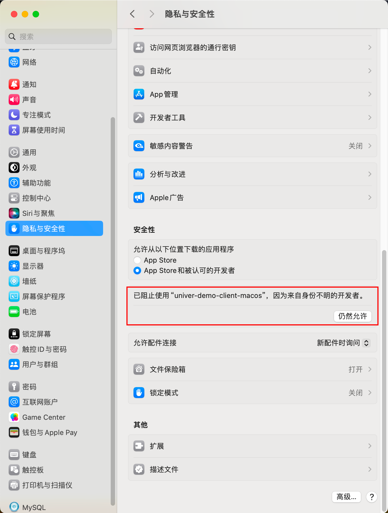

import {TabItem, Tabs} from "@astrojs/starlight/components";

当前部署版本分为lite（社区精简版）和 docker-compose（社区完整版）。

- lite（社区精简版）：只需要执行二进制文件就可完成部署，不需要任何依赖。
- docker-compose（社区完整版）：需要[docker >= 23 版本](https://docs.docker.com/engine/install/)。

## 技术指标
| 技术指标    | 描述               |
|---------|------------------|
| 协同人数    | 支持多达50人同时协作      |
| 创建文档数   | 无限制，您可以创建任意数量的文档 |
| 同时打开文档数 | 最多可以同时打开100个文档   |

我们提供了出色的技术指标，让您和您的团队可以在高效的协作环境中工作。

## 配置要求
1. CPU: 1 核
2. 内存: 2G
3. 磁盘: 10G

## 部署
<Tabs>
    <TabItem label="docker-compose">
        系统环境：Linux、Mac、Windows/WSL。

        1. 克隆本仓库。

        ```bash
        git clone https://github.com/dream-num/helm-charts.git
        ```
        或点击[此处](https://release-univer.oss-cn-shenzhen.aliyuncs.com/release-demo/docker-compose.zip)下载。

        2. 解压后进入 `docker-compose` 目录。
        ```bash
        cd helm-charts/docker-compose
        ```
        3. 启动后端服务。
        ```bash
        bash run.sh
        ```
        4. 启动前端demo。
        ```bash
        docker run --net=unvier-prod --rm --name univer-collaboration-demo \
        -p 3010:3010 univer-acr-registry.cn-shenzhen.cr.aliyuncs.com/release/univer-collaboration-demo:latest
        ```

    </TabItem>

    <TabItem label="windows-lite">
        1. 点击[下载](https://release-univer.oss-cn-shenzhen.aliyuncs.com/lite/windows.zip) Windows 10/11 x64版本。

        2. 进入解压目录，运行 start_apps.bat 文件。请确保在运行过程中允许防火墙执行此程序。
    </TabItem>

    <TabItem label="linux-lite">
        1. 点击[下载](https://release-univer.oss-cn-shenzhen.aliyuncs.com/lite/linux.zip) linux x64版本。

        2. 进入解压目录下执行命令。
        ```bash
        chmod +x ./start_apps.sh && ./start_apps.sh
        ```
    </TabItem>

    <TabItem label="mac-lite">
        1. 点击[下载](https://release-univer.oss-cn-shenzhen.aliyuncs.com/lite/mac.zip) Apple silicon版本。

        2. 进入解压目录下执行命令。
        注：mac需要在设置与隐私中允许非 App store 应用运行，[详见常见问题](#常见问题)。
        ```bash
        chmod +x ./start_apps.sh && ./start_apps.sh
        ```
    </TabItem>
</Tabs>

## 使用

打开浏览器输入 http://localhost:3010 后会自动创建空白文档并跳转到新文档链接（不支持IE浏览器）。


### 体验协同

请尝试在不同类型浏览器或无痕模式下访问，以全面体验协同功能。


## 常见问题
### 1. 如何分享到局域网协同
替换 localhost 为本机ip，并分享给其它内网同事。
```bash
# 如 http://localhost:3010/?unit=17443300120626831361&type=2
# 替换为 http://192.168.50.172:3010/?unit=17443300120626831361&type=2
```

### 2. mac运行文件失败
打开系统设置设置-隐私与安全-安全性-点击仍然允许。


### 3. 内网访问失败
检查防火墙是否启用,若启用请确保局域网内univer的端口可被访问。

### 4. 服务启动失败
检查端口是否被占用，若占用请结束其他进程后再尝试启动。

univer端口见下表。
<Tabs>
    <TabItem label="docker-compose">
        | service | port | description |
        | --------- | ---- | --------------- |
        | universer | 8000 | api http server |
        | univer-client | 3010 | frontend |
    </TabItem>
    <TabItem label="lite">
        | service | port | description |
        |---------------|-----------|----------------------|
        | universer | 8000，9000 | api http server |
        | univer-server | 5001，5002 | collaboration server |
        | univer-client | 3010 | frontend |
    </TabItem>
</Tabs>

### 5. lite（社区精简版）和docker-compose（社区完整版）有什么分别？
- 功能性：在功能上保持一致。
- 支持系统：
- lite：支持windows、linux、mac。
- docker-compose: 支持linux、mac。
- 具体实现：
- lite：SQLite + 内存队列。
- docker-compose: PostgreSQL + RabbitMQ。

### 6. 针对lite版该如何正确停止服务
<Tabs>
    <TabItem label="mac-lite">
        进入目录下执行命令。
        ```bash
        chmod +x ./stop_apps.sh && ./stop_apps.sh
        ```
    </TabItem>

    <TabItem label="windows-lite">
        进入目录下运行stop_apps.bat文件。
    </TabItem>

    <TabItem label="linux-lite">
        进入目录下执行命令。
        ```bash
        chmod +x ./stop_apps.sh && ./stop_apps.sh
        ```
    </TabItem>
</Tabs>

若仍然不能解决您的问题，请[联系社区](/guides/introduction#社区)获取帮助。
