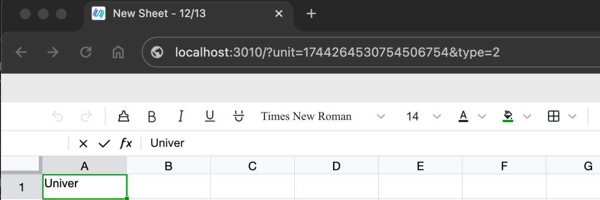
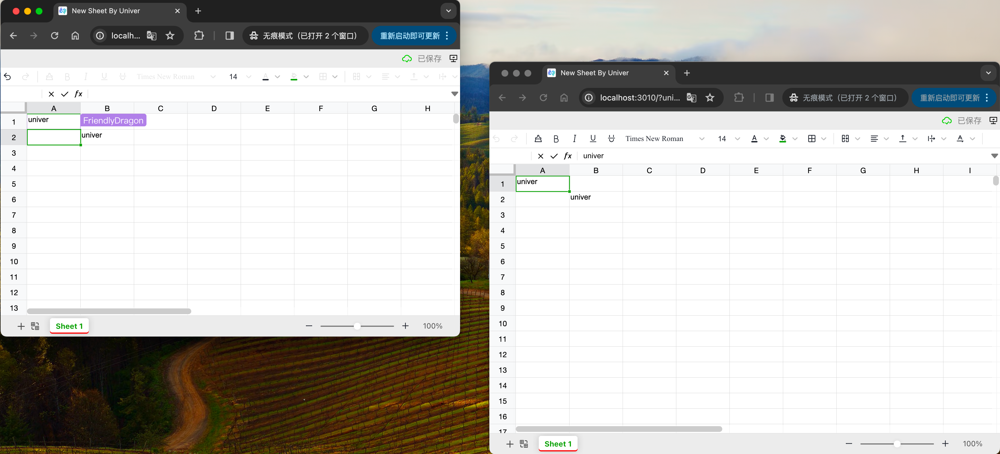

## 快速上手

### 1. 获取Univer服务

下载二进制压缩包

``` url
https://release-univer.oss-cn-shenzhen.aliyuncs.com/release-demo/windows.zip
```

创建单独目录并将压缩包所有内容解压到该目录下

### 2. 启动Univer服务

```bash
双击运行start_apps.bat文件
```

### 3. 创建文档并访问

复制url链接到浏览器，本地体验 Univer 的乐趣

```url
http://localhost:3010/
```


注：本地可打开不同浏览器或使用无痕模式体验协同


### 4. 分享

还可以复制浏览器链接，发送给局域网中的朋友一起感受 Univer 协同的魅力

需要替换 localhost 为本地 ip

```url
http://localhost:3010/?unit=17443300120626831361&type=2
//如 http://192.168.50.172:3010/?unit=17443300120626831361&type=2
```

## 备注

### 如何查找本地IP

1.按下 Win+R

2.输入 powershell,打开命令提示符

3.复制以下命令并执行

``` bash
ipconfig | findstr /R /C:"IPv4" | findstr /v "127.0.0.1"
```


### 如何停止服务

```bash
chmod +x ./stop_apps.sh
```

```bash
./stop_apps.sh
```

### 如何开放防火墙权限

```bash
netsh advfirewall set allprofiles state off
```

### 如何恢复防火墙权限

```bash
netsh advfirewall set allprofiles state on
```

## 占用端口

| service       | port      | description          |
|---------------|-----------|----------------------|
| universer     | 8000，9000 | api http server      |
| univer-server | 5001，5002 | collaboration server |
| univer-client | 3010      | frontend             |
