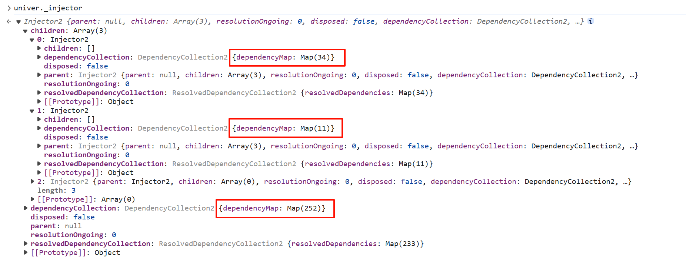

# Practice of Dependency Injection in Univer

import { Callout } from 'nextra/components'

The complexity in Univer's architecture stems from several aspects:

1. **Complex business logic and numerous modules.** Univer supports three different document types: documents, spreadsheets, and presentations, and has implemented its own collaboration engine, formula engine, and rendering engine. This results in extremely high complexity in Univer, with a correspondingly large number of modules in the code.
2. **Isomorphic across multiple platforms.** As a client, Univer needs to run in desktop and mobile browsers; as a computation engine, it needs to run in web workers; as a collaboration server, it needs to run in Node.js. We need to reuse modules across multiple platforms as much as possible.
3. **High extensibility and customizability**. Univer is not an office suite, but an SDK for creating office suites. Univer's features are all extensions to the core in the form of plugins, and plugins need to allow external code to modify or even completely overwrite their behavior.

In designing Univer's architecture, our team introduced [Dependency Injection (DI)](https://en.wikipedia.org/wiki/Dependency_injection) to address the complexities listed above. This article will introduce the practice of DI in Univer.

## Managing Dependencies Between Hundreds of Modules

Counting just [the open-source repository](https://github.com/dream-num/univer), Univer is already a massive project with over 300,000 lines of TypeScript code, and it's still growing. In [the Univer Sheet demo](https://univer.ai/examples/sheets), the number of modules managed by DI has reached 297. Manually coding the construction and management of these 297 modules and their dependencies would be extremely difficult—if not impossible.

Through DI, we can build the entire application with a declarative syntax. Developers only need to declare the dependencies of modules and register all used modules with the injector to ensure that the entire application is initialized with the correct dependency relationships, without having to worry about construction sequence, constructor parameters, and other issues.



## Implementing Multiple Instances

Unlike Univer's predecessor [luckysheet](https://github.com/dream-num/Luckysheet), users can create [multiple instances](https://univer.ai/examples/sheets-multi) on the same page. This is because all modules of each Univer instance are stored in their respective dependency injectors, and modules in one injector cannot access modules in another injector. The injector acts like a fence, allowing multiple Univer instances to run without interfering with each other.


## Decoupling Platform Features Through Abstract Dependencies

Univer's formula engine can run in the browser's main thread, web worker, or server-side Node.js thread. When running in the latter two, the Univer instance running in the web worker or Node.js needs to make RPC calls to the Univer instance in the main thread, but the communication methods between web workers and Node.js with the main thread are different. To shield this difference from the upper-level business logic, Univer implements an abstract dependency `IRPCChannelService`. When connecting to different computation backends, different implementations of `IRPCChannelService` are provided in combination with the corresponding channel:

```tsx
// Node.js on WebSocket
const [_, messageProtocol] = createWebSocketMessagePortOnMain(url);
const dependencies: Dependency[] = [
    [IRPCChannelService, { useFactory: () => new ChannelService(messageProtocol) }],
];

// Message Port on Web Worker
const messageProtocol = createWebWorkerMessagePortOnMain(worker);
const dependencies: Dependency[] = [
    [IRPCChannelService, { useFactory: () => new ChannelService(messageProtocol) ]],
];
```

## Implementing Extensions Through Dependency Overrides

This feature is used in many places in Univer. Here are two examples.

### Collaborative Editing

Univer is extended through plugins, and even a seemingly basic capability like collaborative editing is implemented through plugins. In collaborative editing scenarios, we need to additionally process the data stored in the undo-redo stack when collaborative editing records reach the client. However, the `LocalUndoRedoService` built into the core package doesn't provide this capability. Therefore, in collaborative scenarios, we need to replace it with `CollaborativeUndoRedoService`. So how can we achieve this without the upper-level business logic being aware of it?

Again, through abstract dependencies. The undo-redo service defined by Univer is an abstract dependency `IUndoRedoService`, and all upper-level business logic depends on it. In scenarios that need to support collaborative editing, we use Univer's override API to prevent `LocalUndoRedoService` from registering as `IUndoRedoService`, and then inject `CollaborativeUndoRedoService` through the collaboration plugin, achieving a seamless substitution effect.

```tsx
// main.ts
const univer = new Univer({
    override: [
        [IUndoRedoService, null],
    ],
});

// collaboration-client
let dependencies: Dependency[] = [
    // ...
    [IUndoRedoService, { useClass: CollaborativeUndoRedoService }],
    // ...
];
```

### Authentication

Some features shouldn't be handled by Univer as an SDK, such as authentication, where each integrator has a different implementation. For this, we declared an abstract dependency `IAuthIoService`. As long as it's correctly implemented, developers can integrate Univer with their own authentication system.

## Setting Up Test Environments Through Abstract Dependencies

Abstract dependencies can also be used to prepare lightweight test environments. For example, there's a module `ICollaborationSocketService` running on the client side in the collaborative editing plugin, used to transfer collaborative data between the client and server. In normal runtime, the injected implementation is `CollaborationSocketService` based on HTTP and Web Socket. However, when running unit tests for client-side collaborative editing, using real HTTP and Web Socket is inappropriate. This not only slows down the execution of unit tests but also makes it impossible to effectively test many edge cases due to the inability to simulate server behavior.

For this reason, we implemented `MockCollaborationSocketService` in the test environment. It doesn't perform real network requests but exposes a series of APIs that allow test code to simulate server responses, enabling us to conveniently and thoroughly unit test the collaborative editing module.


If we try to combine manual control capabilities with real collaborative editing services, we can do even more interesting things. We implemented a `ManualCollaborationSocketService` that can connect to a real server, but unlike CollaborationSocketService, it only sends or receives collaborative data when the user clicks these arrows. This gives us a convenient [collaborative testing tool](https://univer.ai/pro/examples/sheets-collaboration-playground?unit=rA6uCSvKSUuGMq2lOm5Mwg&type=2&subunit=kYrr5Ggs7PSIez4bWWf00)！


## Issues

Although DI is very useful, we've also encountered some issues in practice.

### Learning Curve

DI has a learning curve. Users need to grasp the concepts of Inversion of Control and Dependency Inversion to fully understand the advantages of DI. Additionally, they need to learn decorator syntax and even understand some TypeScript configurations to effectively apply DI in projects. This might intimidate some users, as exemplified by Angular. To address this, we're committed to improving our [Facade API](https://univer.ai/guides/sheet/getting-started/facade), trying to hide DI as much as possible and provide users with a simpler, configuration-based interface, thereby significantly lowering the entry barrier for Univer.

### Module Division Challenges Developers' Design Skills

DI makes it very easy to create modules and declare dependencies between modules, which can significantly simplify the development process. However, proper module division is crucial; otherwise, DI might make logic difficult to track and debug—you might need to jump back and forth between four or five modules to understand how a feature works specifically. DI developers should be proficient in classic OOP design principles, such as [GRASP](https://en.wikipedia.org/wiki/GRASP_(object-oriented_design)) and [SOLID](https://www.digitalocean.com/community/conceptual-articles/s-o-l-i-d-the-first-five-principles-of-object-oriented-design), to fully utilize DI's flexibility and avoid potential issues.

---

DI has been widely applied in all of Univer's frontend projects, including our [open-source repository](https://github.com/dream-num/univer), [commercial version](https://univer.ai/), and [SaaS version](https://space.univer.ai/). Its power and flexibility have been of great help to us, allowing us to create a highly extensible SDK, reuse as much code as possible across different runtime environments, easily isolate modules for testing, and successfully support multiple product lines with a relatively small team.

The dependency injection tool we use is [redi](https://www.notion.so/991adceb8bb244278e9897588d639aff?pvs=21), which we implemented ourselves after referencing vscode and Angular. It not only maintains the simplicity and flexibility of vscode's dependency injection system but also combines various types of dependency injection from Angular and provides tools for use with React, while supporting JavaScript (even without transpilation). If you're considering introducing DI, we strongly recommend you give it a try.

If you want to learn more about Univer's architectural design, feel free to read our documentation.

<p className="text-gray-500 text-sm mt-8">Author: [Wenzhao Hu](https://github.com/wzhudev), Head of Engineering</p>