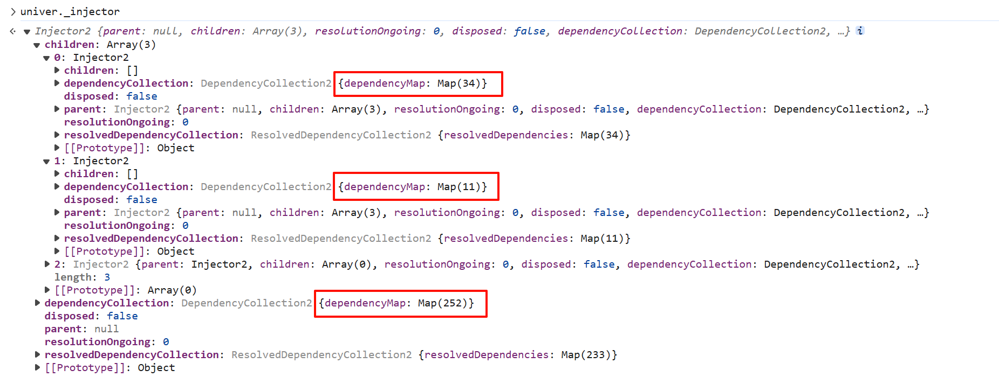
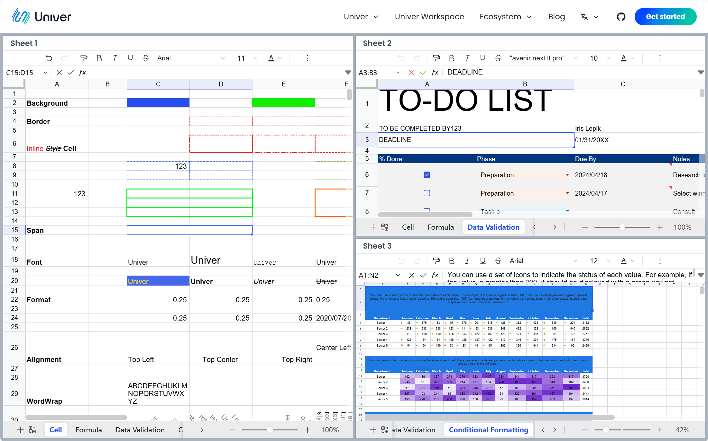
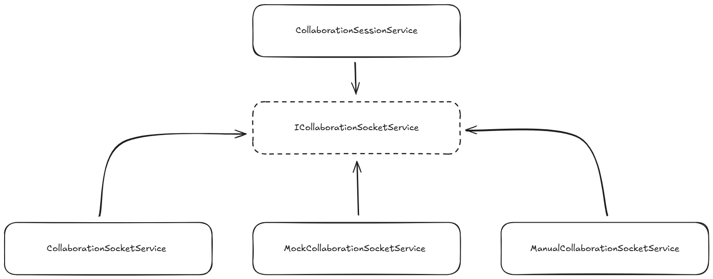
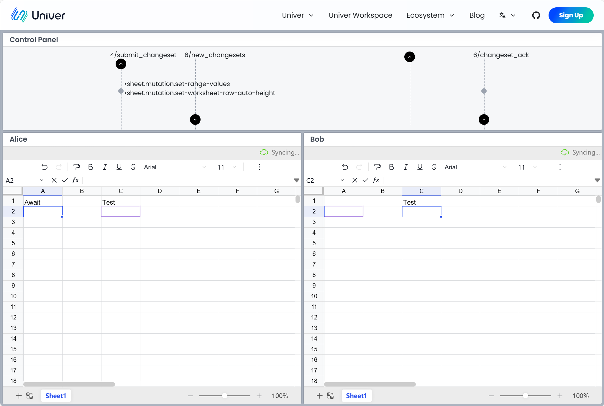

# 依赖注入在 Univer 的实践

import { Callout } from 'nextra/components'

Univer 的架构上的复杂度来自于以下几个方面：

1. **业务复杂，模块众多**。Univer 支持三种不同的文档类型：文档、电子表格和幻灯片，并且自行实现了协同引擎、公式引擎和渲染引擎。这导致 Univer 的复杂度极高，相应的，代码中的模块也非常多。
2. **多端同构**。Univer 作为客户端，需要运行在桌面端和移动端浏览器中；作为计算引擎，需要运行在 web worker 当中；作为协同服务器，需要运行在 Node.js 当中。我们需要在尽可能地在多端复用模块。
3. **高度的可扩展性和定制性**。Univer 不是办公套件，而是创建办公套件的 SDK。 Univer 的功能都以插件的形式作为核心的扩展，并且插件需要允许外部代码修改甚至是完全覆写自己的行为。

在设计 Univer 的架构的过程中，我们团队引入了[依赖注入](https://zh.wikipedia.org/wiki/%E4%BE%9D%E8%B5%96%E6%B3%A8%E5%85%A5)（Dependency Injection, DI）来应对上面所列举出的复杂度。这篇文章将介绍 DI 在 Univer 中的实践。

<Callout>
如果你还不了解依赖注入概念，可以阅读[这篇文章](https://redi.wendell.fun/zh-CN/blogs/di)。
</Callout>

## 管理成百个模块之间的依赖关系

仅计算[开源仓库](https://github.com/dream-num/univer)，Univer 已经是一个拥有超过三十万行 TypeScript 代码的超大项目，并且还在持续增长。在 [Univer Sheet demo](https://univer.ai/examples/sheets) 中，DI 管理的模块已达到 297 个。人工编码构造并管理这 297 个模块及其依赖关系的复杂度非常困难——甚至是不可能的。

而通过 DI，我们可以一种声明式的语法构建起整个应用。开发者仅需要声明好模块的依赖，并将所有用到的模块注册到注入器上，就可以确保整个应用以正确的依赖关系初始化，不用再担心构造时序，构造函数参数等问题。



## 实现多实例

和 Univer 的前辈 [luckysheet](https://github.com/dream-num/Luckysheet) 不同，用户可以在同一个页面中创建[多个实例](https://univer.ai/examples/sheets-multi)。这是因为每个 Univer 实例的全部模块都保存在各自的依赖注入器中，一个注入器中的模块无法访问到另一个注入器中的模块。注入器就像是一道篱笆，让多个 Univer 可以互不干扰地运行。



## 通过抽象依赖解耦平台特性

Univer 的公式引擎可以运行在浏览器主线程、web worker 或者是服务端的 Node.js 线程中，在后两者中运行时，在 web worker 或 Node.js 中运行的 Univer 实例需要和主线程中的 Univer 实例进行 RPC 调用，但是 web worker 和 Node.js 与主线程通讯的方式是不同的。为了对上层业务屏蔽这一差异，Univer 实现了抽象依赖 `IRPCChannelService` ，在对接不同的计算后端时，结合相应的信道提供不同的 `IRPCChannelService` 实现：

```tsx
// Node.js on WebSocket
const [_, messageProtocol] = createWebSocketMessagePortOnMain(url);
const dependencies: Dependency[] = [
    [IRPCChannelService, { useFactory: () => new ChannelService(messageProtocol) }],
];

// Message Port on Web Worker
const messageProtocol = createWebWorkerMessagePortOnMain(worker);
const dependencies: Dependency[] = [
    [IRPCChannelService, { useFactory: () => new ChannelService(messageProtocol) ]],
];
```

## 通过依赖覆写实现功能扩展

Univer 当中有许多地方使用到了该特性，这里举两个例子。

### 协同编辑

Univer 通过插件的方式进行拓展，协同编辑这一看似基础的能力也是通过插件实现的。协同编辑场景下，我们需要在协同编辑记录到达客户端时额外处理 undo redo 栈中保存的数据，但是 core 包内置的 `LocalUndoRedoService` 并没有提供相关的能力，因此在协同场景下我们需要替换成 `CollaborativeUndoRedoService`。那么如何在上层业务无感知的情况下做到这一点？

仍然是通过抽象依赖。Univer 定义的 undo redo 服务是一个抽象依赖 `IUndoRedoService`，上层业务均依赖它。在需要支持协同编辑的场景中，我们通过 Univer 提供的 override API 阻止 `LocalUndoRedoService` 注册成 `IUndoRedoService`，然后通过协同插件注入 `CollaborativeUndoRedoService` ，起到偷梁换柱的效果。

```tsx
// main.ts
const univer = new Univer({
    override: [
        [IUndoRedoService, null],
    ],
});

// collaboration-client
let dependencies: Dependency[] = [
    // ...
    [IUndoRedoService, { useClass: CollaborativeUndoRedoService }],
    // ...
];
```

### 鉴权

有些功能是作为 SDK 的 Univer 不该越俎代庖的，例如鉴权，每个接入方都有不同的实现方式。为此我们声明了抽象依赖 `IAuthIoService`，只要正确地实现它，开发者就能将 Univer 接入自己的鉴权系统。

## 通过抽象依赖设置测试环境

抽象依赖还可以用于准备轻量的测试环境。例如协同编辑插件中有一个运行在客户端的模块 `ICollaborationSocketService`，用于在客户端和服务器之间传递协同数据。在正常的运行时中，注入的是基于 HTTP 和 Web Socket 的 `CollaborationSocketService` 实现。但是在运行客户端协同编辑的单元测试时，使用真实的 HTTP 和 Web Socket 就很不适当，这不仅会拖慢单测的运行速度，并且由于无法模拟服务端的行为，很多边际情形无法得到有效测试。

为此我们在测试环境实现了 `MockCollaborationSocketService` ，它不执行真实的网络请求，而是暴露了一系列 API 可以让测试代码模拟服务器的响应，从而让我们得以方便且充分地对协同编辑模块进行单元测试。



如果我们尝试将手动控制能力和真实的协同环境编辑服务结合，就能做到更有趣的事情。我们实现了一个 `ManualCollaborationSocketService` ，它能够连接到真实的服务器，但和 `CollaborationSocketService` 不同的是，它只会在用户点击这些箭头时才会发送或者接收协同数据，于是我们就得到了一个方便的[协同测试工具](https://univer.ai/pro/examples/sheets-collaboration-playground?unit=rA6uCSvKSUuGMq2lOm5Mwg&type=2&subunit=kYrr5Ggs7PSIez4bWWf00)！



## 问题

尽管 DI 非常好用，实践的过程中我们也发现了一些问题。

### 一定的学习门槛

DI 有一定的学习门槛，使用者需要掌握控制反转和依赖倒置的概念，才能充分理解 DI 所带来的优势。此外，还需学习装饰器语法，甚至了解 TypeScript 的一些配置，才能在项目中有效应用 DI。这可能会让部分用户感到畏惧，Angular 就是一个例子。对此，我们致力于完善我们的 [Facade API](https://univer.ai/zh-CN/guides/sheet/getting-started/facade)，尽量将 DI 隐藏起来，为用户提供一个更简单、基于配置的接口，从而大幅降低 Univer 的入门门槛。

### 模块的划分很考验开发者的设计能力

DI 使得创建模块和声明模块之间的依赖关系变得十分容易，它能够显著简化开发过程。然而，合理划分模块至关重要，否则 DI 可能会使逻辑变得难以跟踪和调试——你可能会需要在四五个模块之间来回跳转，以了解一个功能的具体运行。DI 的开发者应当熟练掌握 OOP 的经典设计原则，例如 [GRASP](https://en.wikipedia.org/wiki/GRASP_(object-oriented_design)) 和 [SOLID](https://www.digitalocean.com/community/conceptual-articles/s-o-l-i-d-the-first-five-principles-of-object-oriented-design)，以充分利用 DI 的灵活性并避免潜在问题。

---

DI 已经在 Univer 所有的前端项目中得到了广泛的应用，包括我们的[开源仓库](https://github.com/dream-num/univer)、[商业版本](https://univer.ai/)和 [SaaS 版本](https://space.univer.ai/)。它的强大和灵活为我们带来了极大的帮助，使我们能够创建一个具有高度可扩展性的 SDK，在不同运行环境复用尽可能多的代码，很方便地对模块进行隔离测试，并成功地以一个较小的团队支撑多个产品线。

我们所使用的依赖注入工具是参考了 vscode 和 Angular 后自行实现的 [redi](https://www.notion.so/991adceb8bb244278e9897588d639aff?pvs=21)，它不仅保持了 vscode 依赖注入系统的简单和灵活性，还结合了 Angular 各种依赖注入类型，并且提供了与 React 结合使用的工具，同时支持 JavaScript（甚至不需要转译）。如果你正在考虑引入 DI，强烈推荐你试试它。

如果你想了解更多关于 Univer 架构设计的内容，欢迎阅读我们的[文档](https://univer.ai/zh-CN/guides/sheet/architecture/univer)。

<p className="text-gray-500 text-sm mt-8">作者：[Wenzhao Hu](https://github.com/wzhudev)，Head of Engineering</p>