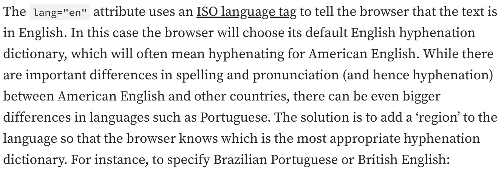
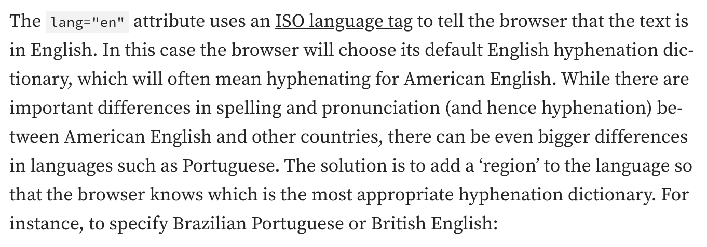
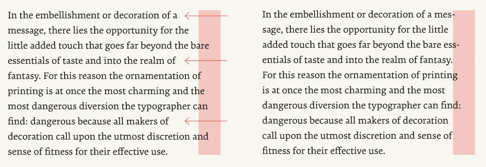
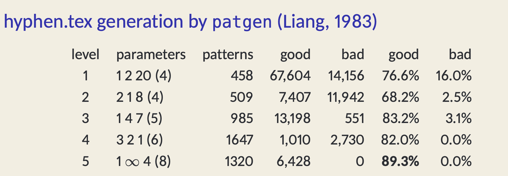
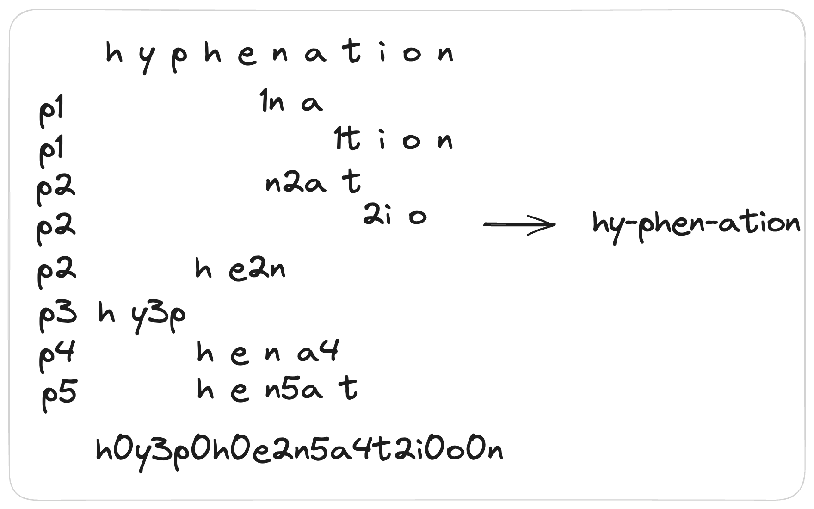

# Hyphenation from Theory to Practice

## 1 Background

At the beginning of this year, in order to optimize the layout and typography of [Univer](https://github.com/dream-num/univer), I started studying and practicing digital typesetting. During this process, I also learned a lot about various aspects of typesetting. I plan to document my learning through a series of articles to deepen my understanding and reflection on the field of typesetting, and I hope to help those who want to learn about digital typesetting. Of course, there may be some errors in the text, so I welcome corrections.

### 1.1 The Development of Hyphenation

Today’s focus is hyphenation. Hyphenation is not a product of digital typesetting; as early as the Middle Ages in Latin manuscripts, hyphens were used for word division. Scribes would often use a short dash to split long words when they needed to move to the next line, thereby saving space. At that time, the rules for hyphenation were quite casual, with no fixed standards.

With the invention of **the Gutenberg printing press** (circa 1440), printed text became the primary means of book production, and typesetting rules became more standardized. Since printed text needed to be arranged neatly on fixed-size pages, the demand for word division became more prominent. Typesetters would manually hyphenate words to ensure that each line was neatly aligned without leaving too much blank space. During this period, hyphenation became more standardized, but the rules largely depended on the typesetter’s experience and language habits. As printing technology advanced into the 16th and 17th centuries, printers across Europe began to establish basic rules for hyphenation. For example, in English, hyphenation methods gradually formed based on syllables, while in German, more emphasis was placed on dividing words by roots and affixes.

By the 19th century, hyphenation rules were increasingly standardized by linguists, dictionary compilers, and typesetting industry norms. For example, the Oxford English Dictionary (OED) and some spelling manuals began specifying where words could be divided. Typesetters began relying on written standards for hyphenation. Hyphenation was frequently used in the typesetting of books, newspapers, and periodicals to handle line breaks.

In the 20th century, with the rise of digital typesetting, hyphenation entered a new phase in the typesetting and printing industry. Electronic typesetting replaced manual typesetting, and hyphenation algorithms became a hot topic in the field of digital typesetting. For example, in the TeX typesetting system developed by [Donald Knuth](https://zh.wikipedia.org/wiki/%E9%AB%98%E5%BE%B7%E7%BA%B3), automated hyphenation began. Later, Frank Liang introduced concepts such as packed Trie and Hyphenation patterns, optimizing hyphenation algorithms to improve their efficiency and accuracy. We will detail the development of hyphenation algorithms in the “Algorithm Section.”

In summary, hyphenation is not a product of digital typesetting, but it has risen in prominence due to digital typesetting and has sparked extensive academic research and discussion. The topic of hyphenation even led to a conflict known as the [Hyphen War](https://en.wikipedia.org/wiki/Hyphen_War), which you can explore further if interested.

### 1.2 Why is Hyphenation Necessary?

In paragraph typesetting, Chinese uses "character-by-character writing," so line breaks can occur after any character, except in special cases like when the character is followed by punctuation marks that cannot appear at the end of a line, as specified in the [prohibition rules for line start/end punctuation](https://www.w3.org/TR/clreq/#prohibition_rules_for_line_start_end). In contrast, Western languages use "word-by-word writing," with word spaces between words. According to the [Unicode Linebreak Algorithm](https://unicode.org/reports/tr14/), line breaks in Western text usually occur after spaces between words. For justified text, Chinese can adjust the spacing between characters, while Western languages mainly adjust word spacing. In English, where long words are more common, word spacing tends to be large when text is justified. In left-aligned text (as shown in Figure 1), large gaps often appear on the right side, which is both visually unappealing and wasteful of space. This is where hyphenation comes in, splitting a word in two, placing the first half at the end of the current line with a hyphen "-" and the second half at the beginning of the next line. This effectively reduces excessive gaps (as shown in Figure 2).



(Figure 1: No hyphenation, large gaps on the right side when left-aligned)



(Figure 2: With hyphenation, the large gaps on the right side are significantly reduced)

In the typesetting of some newspapers and journals, columns are often used, with each column being narrow in width. Hyphenation can often prevent the obvious unevenness caused by narrow columns.

### 1.3 The Application of Hyphenation in the Web

As a front-end engineer, we are more concerned about the support for hyphenation in browsers. The good news is that modern mainstream browsers widely support hyphenation. In the [CSS Text Module Level 4](https://www.w3.org/TR/css-text-4/#hyphenation), there are standard specifications regarding browser support for hyphenation. In this standard, hyphenation is described as follows:

> ***Hyphenation*** is the controlled splitting of words where they usually would not be allowed to break to improve the layout of paragraphs, typically splitting words at syllabic or morphemic boundaries and often visually indicating the split (usually by inserting a hyphen, U+2010). In some cases, hyphenation may also alter the spelling of a word. Regardless, hyphenation is a rendering effect only: it must have no effect on the underlying document content or on text selection or searching.

The above passage clearly illustrates the functionality and impact of hyphenation: Hyphenation is used to improve paragraph layout by splitting words at allowed positions and connecting them with a hyphen (U+2010). Different hyphenations can alter the spelling of words, but hyphens only exist at the rendering layer, meaning that the data layer does not store hyphens. As a result, hyphenation does not affect functions such as search.

#### 1.3.1 Enabling Hyphenation in Browsers

Step 1: Set the language

Hyphenation algorithms are language-specific, and different languages have different hyphenation patterns (these will be introduced in the algorithm section). So, the first step is to set the language for webpage rendering.

```html
<html lang="pt-BR">
```

Even within the same language, such as English, different regions may have variations in spelling and pronunciation, which can lead to different hyphenation rules. This difference is even more pronounced in Portuguese. Therefore, when setting the language, it’s common to add a region suffix to better match the corresponding hyphenation patterns.

Step 2: Enable hyphenation

```css
hyphens: auto;
```

#### 1.3.2 Fine Control Over Hyphenation

For shorter words, we may not want them to be hyphenated because breaking up short words can make them hard to read, especially if the hyphenation occurs too early or too late in the word. In such cases, we can control this using `hyphenate-limit-chars`. For example:

```css
hyphenate-limit-chars: 6 3 2;
```

In this rule, the first number means that words with fewer than 6 letters will not be hyphenated. The second and third numbers specify the minimum number of characters that must remain before and after the hyphen when the word is split.

Another scenario to consider is when multiple consecutive lines in a paragraph end with hyphenated words. This can be both unattractive and difficult to read. To avoid this situation, browsers provide the `hyphenate-limit-lines` property, which limits the number of consecutive lines that can end with hyphenated words, preventing the issue of multiple lines in a row ending with hyphens. Of course, if you don't mind, you can use `no-limit` to remove this restriction.

If hyphenation occurs on the last line of a paragraph, leaving half a word at the end, CSS has considered this case as well. You can control this with `hyphenate-limit-last: always;`.

The final control is the `hyphenation zone`. This is used for more precise control over the frequency of hyphenation. By default, hyphenation might occur frequently. When there is space left on a line but not enough to fit a whole word, the browser will try to hyphenate the word to fill the gap. This can lead to an overabundance of hyphens.

Consider a left-aligned scenario where hyphenation is used to reduce the jagged edges on the right side. While this reduces the unevenness, excessive hyphenation can make the paragraph look cluttered. We often need to strike a balance between jagged edges and the number of hyphens. This is where `hyphenate-limit-zone`, the balancing master, can help.



(Figure 3: Illustration of hyphenate-limit-zone)

The `hyphenate-limit-zone` refers to a zone on the right side of the paragraph. If a word starts within the hyphenation zone, it cannot be hyphenated. The larger the zone, the less likely hyphenation will occur; conversely, the smaller the zone, the more likely hyphenation will occur. In Figure 3, the word "added" on the third line actually starts within the hyphenation zone, but since it couldn't fit on the previous line, it is moved to the next line without hyphenation, preventing consecutive lines from ending with hyphens. Typically, `hyphenate-limit-zone: 8%` is a good choice, as referenced in [All you need to know about hyphenation in CSS](https://medium.com/clear-left-thinking/all-you-need-to-know-about-hyphenation-in-css-2baee2d89179).

## 2 Hyphenation Algorithms

### 2.1 The Development of Hyphenation Algorithms in TeX

There’s an interesting story about the development of TeX. [Donald Knuth](https://zh.wikipedia.org/wiki/%E9%AB%98%E5%BE%B7%E7%BA%B3) developed the TeX typesetting system because he couldn’t tolerate the poor typesetting quality of the publisher’s version of his series *The Art of Computer Programming*. TeX quickly gained popularity in academia and was adopted by the American Mathematical Society for typesetting mathematical journals.

An essential part of TeX is hyphenation, especially in cases requiring justified alignment, where hyphenation can achieve a more elegant paragraph layout. As mentioned earlier, before digital typesetting, hyphenation was determined manually by typesetters based on rules. In the era of digital typesetting, scholars like Donald Knuth and Frank Liang proposed using computer algorithms to accurately determine hyphenation points.

In existing typesetting systems, there are two primary approaches to hyphenation algorithms: **rule-based hyphenation** and **dictionary-based hyphenation**.

Rule-based hyphenation relies on a set of rules for word segmentation. For instance, the preface of *Webster's Dictionary* provides rules for hyphenation in English, including common rules for prefixes, suffixes, splitting between double consonants, and other specialized rules. However, many of these rules are ambiguous and difficult to implement algorithmically. Rule-based approaches inevitably make mistakes, rarely cover all cases, and finding a suitable set of rules is both challenging and time-consuming.

Dictionary-based hyphenation algorithms store the allowable hyphenation points for a complete list of words. The obvious downside of this approach is the need for significant storage space and a method for quickly locating hyphenation points within a word.

The original TeX hyphenation algorithm, designed and implemented by [Donald Knuth](https://zh.wikipedia.org/wiki/%E9%AB%98%E5%BE%B7%E7%BA%B3) and others in the summer of 1977, was based on rule-based hyphenation. The system included three main types of rules: suffix removal, prefix removal, and vowel-consonant-consonant-vowel (veev) splitting. The last rule stated that when a “vowel-consonant-consonant-vowel” pattern appears in a word, a split can usually be made between the consonants. There were also many special-case rules, such as “split at vowel-q” or “split after ck.” Additionally, a small exception dictionary (around 300 words) was used to correct errors from these rules and to handle common words (such as *pro-gram*) that were not handled by the rules. The full algorithm is described in Appendix H of the original TeX manual.

While this algorithm performed reasonably well, it had its drawbacks. It correctly identified hyphenation points in only 40% of words in a small dictionary list, with an error margin of 1%. This highlighted the limitations of rule-based hyphenation, as it was difficult to cover all permissible hyphenation points in the dictionary and inevitably made some incorrect decisions. Additionally, rule-based algorithms had the fatal flaw of requiring extensive manual rule creation, which made it challenging to automate their extension to other languages.

In 1977, Donald Knuth's student, Frank Liang, began working on TeX. His major contribution was the design and optimization of TeX's hyphenation algorithm in 1978. Frank Liang developed a pattern-based algorithm (essentially a derivative of the dictionary-based approach) and introduced a new optimized data structure called the packed trie (a compressed trie). This algorithm replaced the original hyphenation system in TeX82 and has since been widely adopted in other typesetting systems and word processing software. Liang detailed his algorithm and its optimizations in his doctoral thesis, *[Hyphenation by Computer](https://www.researchgate.net/publication/35881346_Word_Hyphenation_by_Computer)*. Frank Liang later worked on Microsoft Word, contributing to page layout and printing in 1982.

The core principle of Frank Liang’s algorithm is as follows: First, a dictionary containing all words and their hyphenation points for a given language is prepared. Each word is then processed to identify hyphenation points, and hyphenation patterns are generated from this. These extracted patterns are inserted into a packed trie to optimize storage through compression. Finally, the system can use pattern matching to find potential hyphenation points in a word.

Given the above explanation of the algorithm, several questions arise:

1. What exactly is a packed trie, and how does it optimize storage through compression?
2. Hyphenation points can differ across dictionaries, and even within the same dictionary, words may have different hyphenation points depending on their context. For example, a word that can function as both a noun and a verb may have different hyphenation points. How did Frank Liang design hyphenation patterns to handle these differences?
3. If you're familiar with the concept of hyphenation levels to improve hyphenation accuracy, how are these levels determined?

Let's explore these questions further...

### 2.2 Packed Tries

Frank Liang recognized the limitations of rule-based hyphenation algorithms, such as their inability to cover all cases, inevitable misjudgments, and the challenge of extending them to other languages. To improve the accuracy and efficiency of hyphenation handling, he shifted towards a dictionary-based algorithm, using pattern matching and data compression. The goal was to enhance both the accuracy and efficiency of the hyphenation process.

As mentioned earlier, dictionary-based algorithms require significant storage space because they store all the hyphenation points for words in the dictionary. Liang's primary challenge was to reduce the storage requirements for this dictionary, which meant finding a compact and efficient data structure for storing and searching hyphenation points.

When searching for a specific word in a dictionary, a data structure like a trie (prefix tree) is a natural choice. Tries are well-suited for storing and searching collections of strings, such as an English dictionary, and are often referred to as dictionary trees. The term “trie” comes from the word **retrie**val. The inventor of the trie, Edward Fredkin, pronounced it as [/ˈtriː/](https://zh.wikipedia.org/wiki/Help:%E8%8B%B1%E8%AA%9E%E5%9C%8B%E9%9A%9B%E9%9F%B3%E6%A8%99) "tree." However, other authors pronounce it as [/ˈtraɪ/](https://zh.wikipedia.org/wiki/Help:%E8%8B%B1%E8%AA%9E%E5%9C%8B%E9%9A%9F%E9%9F%B3%E6%A8%99) "try." A [trie](https://zh.wikipedia.org/zh-hans/Trie) is an ordered tree where all descendants of a node share the same prefix, corresponding to the string represented by that node, with the root representing the empty string. The path from the root to a leaf node represents a complete string.

For example, consider the following set of words: "cat,” "car," and "dog."

The structure of a regular trie would look like this:

```sh
          (root)
           /  \
          c    d
         / \    \
        a   a    o
       /     \    \
      t       r    g
```

In a trie, each node has multiple pointers to child nodes, each corresponding to a character. The time complexity for searching in a trie is O(m), where *m* is the length of the search string. However, a key drawback of the trie is its inefficient use of space, as each node might have many empty pointers (null references).

To address this, Frank Liang introduced the packed trie, a compressed version of the trie, to reduce this space inefficiency while maintaining fast search performance. A packed trie achieves compression by merging nodes that share the same prefix. In a traditional trie, each node has many empty pointers, whereas in a packed trie, nodes with common prefixes are combined, significantly reducing space usage. For more details on packed tries, refer to Frank Liang’s thesis *[Hyphenation by Computer](https://www.researchgate.net/publication/35881346_Word_Hyphenation_by_Computer)*, Chapter 2.

### 2.3 Hyphenation patterns

The packed trie solves the problem of space wastage in dictionary-based hyphenation algorithms, but it does not address the issue of hyphenation accuracy. As mentioned in the previous question, different dictionaries may have different hyphenation positions for the same word. Even within the same dictionary, the hyphenation position for the same word may vary depending on the context. This is precisely the issue that hyphenation patterns are designed to solve.

> “**pattern** ORIGIN Middle English patron ‘something serving as a model’, from Old French.
> The change in sense is from the idea of *patron giving an example to be copied.* Metathesis
> in the second syllable occurred in the 16th cent. By 1700 patron ceased to be used of
> things, and the two forms became differentiated in sense.”
>                                                                  *— New Oxford Dictionary of English, 1998 edition*

Above is the description of "pattern" from the Oxford Dictionary, while hyphenation patterns are special strings in which numbers are inserted to carry hyphenation information, as shown below:

```tex
% title: Hyphenation patterns for American English
% ...
% The Plain TeX hyphenation tables.
\patterns{ % just type <return> if you're not using INITEX
.ach4
.ad4der
.af1t
.al3t
.am5at
ar5inat
ar3io
a5sia.
```

The code above is a snippet from the TeX source, which contains hyphenation matching patterns for American English. These patterns are used to determine where hyphenation can or cannot occur in English words. We can see that the pattern consists of a combination of `.` (dot), letters, and numbers:

- `.`: Represents word boundaries. A `.` at the beginning of the pattern signifies the start of the word, while a `.` at the end indicates the word's conclusion.
- Letters: Represent themselves and are used to match specific parts of the word.
- Numbers: Represent the hyphenation level, indicating potential hyphenation points or prohibitions. There are five levels in total. **Higher levels have higher priority, with odd numbers allowing hyphenation and even numbers prohibiting it.**

For example, `.ach4` indicates matching from the beginning of the word, and if a word matches this pattern, it is likely prohibited from being hyphenated unless it also matches a pattern with a higher number like `5`. Similarly, if a word matches `.am5at`, hyphenation must occur between `am` and `at`, since `5` is the highest level.

With the different "hyphenation levels," the accuracy of hyphenation is addressed. Since different hyphenation patterns can be assigned different levels, higher levels are typically more reliable or common and should be prioritized. The use of hyphenation levels also helps reduce errors during the hyphenation process. By distinguishing between odd and even numbers, we can represent binary meanings such as "allow" and "prohibit," with higher priority patterns overriding lower ones. Lower-level patterns may allow some errors, while higher-level patterns demand more strict accuracy. This hierarchical approach ensures that the most appropriate hyphenation point is chosen while minimizing unnecessary errors.



(Figure 4: Accuracy comparison of different-level patterns)

The above chart shows the statistical comparison of 4919 patterns generated by Frank Liang for the Webster pocket dictionary. As seen in the table, the accuracy of hyphenation improves as the level increases. The probability of bad results at level 5 is 0.0%.

In summary, the classification of hyphenation levels (hyphenation level) allows for effective management of the hyphenation process, ensuring the most appropriate hyphenation positions are selected while minimizing errors. This plays a crucial role in improving hyphenation accuracy.

### 2.4 Pattern Matching in Practice

With patterns in place, the next step is to match words and find the appropriate hyphenation points. In this example, we use the American English hyphenation patterns and illustrate it with the word `hyphenation`.



Starting from the first letter of the word, `h`, we begin matching patterns. The first matched pattern is `hy3ph`, a level 3 hyphenation pattern. This means there is a high probability of hyphenation after `hy`. Next, we continue matching. At the fourth letter, `h`, we match three patterns: `he2n`, `hena4`, and `hen5at`. These are ranked according to their level, as marked in the diagram. Then, at the letter `n`, we match `1na` and `n2at`, and at the letter `t`, we match `1tion`. The letter `i` matches `2io`. At this point, we have traversed all the characters of the word and found all the matching patterns. According to the pattern matching rules, higher-level patterns override lower-level ones, and patterns without a numerical marker are replaced with a 0. The final result is the string `h0y3p0h0e2n5a4t2i0o0n`. Finally, we replace odd numbers (representing hyphenation points) with hyphens `-` and delete even numbers, resulting in the hyphenated representation of *hyphenation* as *hy-phen-ation*.

In terms of algorithm implementation, we should first consider high-priority patterns and then move to medium- and low-priority patterns. This way, once a high-priority pattern is matched, there is no need to match lower-priority ones, improving algorithm efficiency. When generating a trie from the TeX file, multiple patterns may share the same level, so reusing the pattern level helps save memory.

In [Univer](https://github.com/dream-num/univer), there is a code implementation of how to perform pattern matching using a trie. It also includes implementations similar to browser-side `hyphenate-limit-lines` and `hyphenate-limit-area`, so interested readers can take a look.

## 3 Future Outlook

Scholars from Masaryk University have proposed Universal Hyphenation Patterns to address the hyphenation problem. This is essentially an optimization of Frank Liang’s hyphenation algorithm. It aims to use a single set of patterns to handle multiple languages, thus saving storage resources. For example, in languages like English and Czech, very few words have different hyphenation points, so a single pattern set can be used for both languages.

In the paper "Hyphenation using deep neural networks," the authors propose using deep learning for automatic hyphenation in Hungarian. With the rapid advancements in AI and natural language processing in recent years, it is believed that machine learning methods will significantly enhance the accuracy and efficiency of hyphenation in the near future.

## 4 References

1. Word Hy-phen-a-tion by Com-put-er
2. Towards Univeral Hyphenation Patterns
3. Hyphenation using deep neural networks
4. [All you need to know about hyphenation in CSS](https://medium.com/clear-left-thinking/all-you-need-to-know-about-hyphenation-in-css-2baee2d89179)

<p className="text-gray-500 text-sm mt-8">Author: [Jocs](https://github.com/Jocs), Creator of [MarkText](https://github.com/marktext/marktext), Core Developer at Univer, responsible for Univer Doc architecture and development.</p>