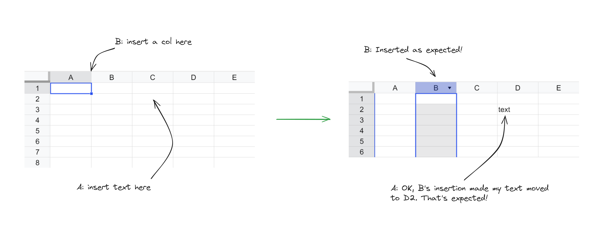
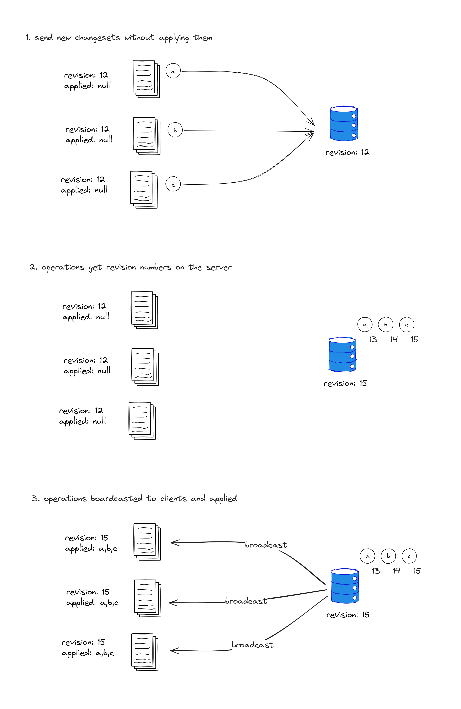
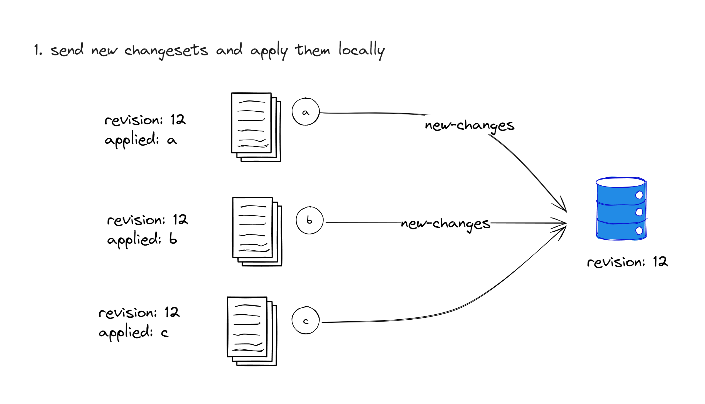
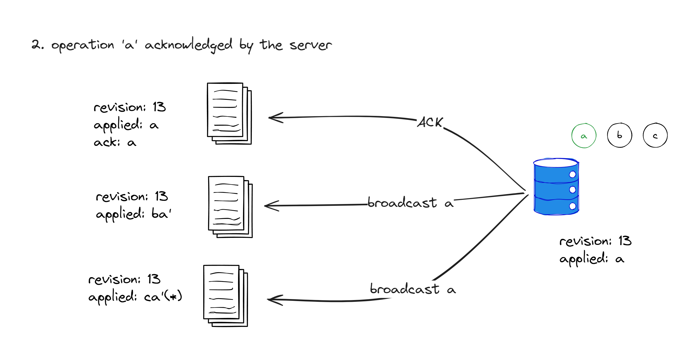
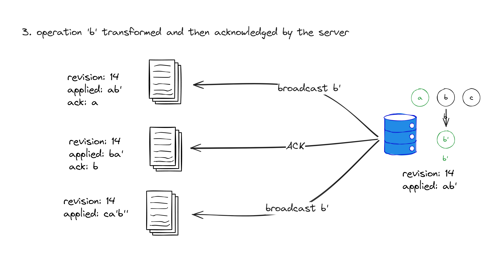
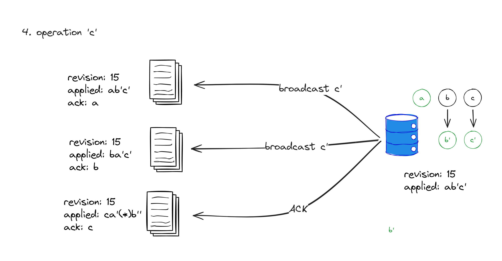
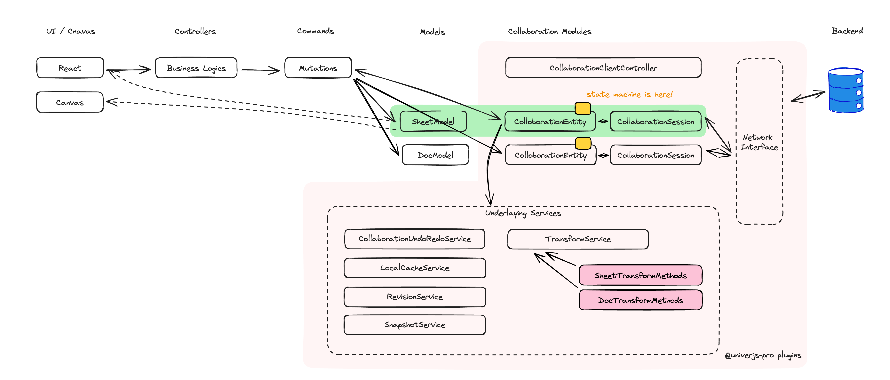
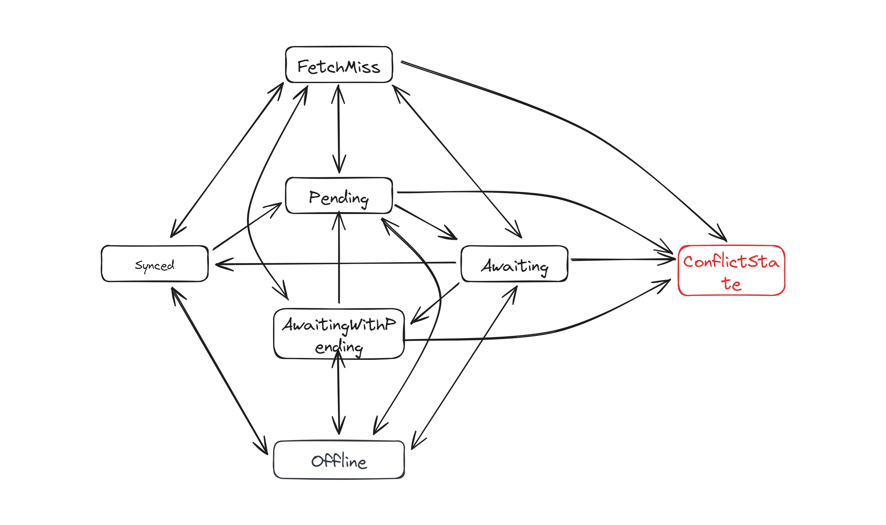
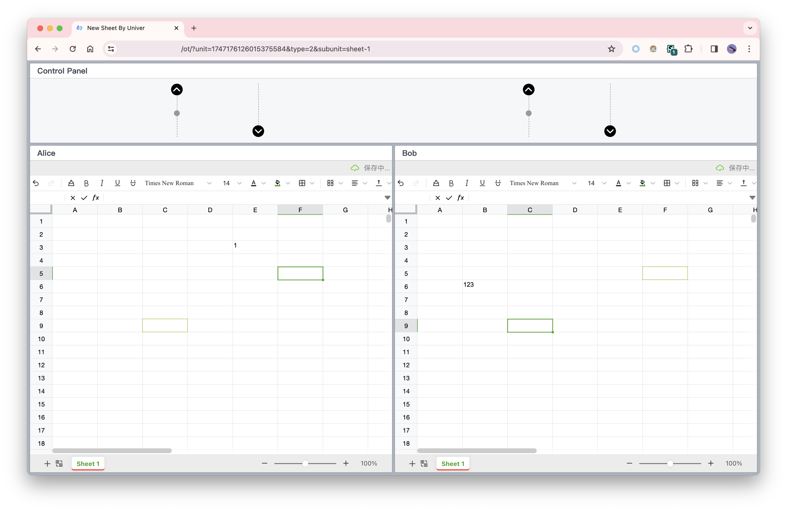

import { Callout } from 'nextra/components'

# OT 算法以及 Univer 的协同编辑设计

> 这篇博客是 [Univer 团队](https://github.com/dream-num)内部分享整理而成。在 Univer 我们经常对有趣的技术问题进行分享和讨论，如果你喜欢这篇博客，不妨考虑[加入我们](mailto:huwenzhao@univer.ai)。

[Univer](https://univer.ai) 是一个企业数据协同工具，我们的目标之一是让用户可以在任何地方、任何时间、任何设备上进行编辑，并且和他/她的同事进行协作。在实现这个目标的过程中，我们遇到了很多有趣的技术问题，其中最有挑战性的问题之一是协同编辑模块的设计和实现。

Univer 最终选择的方案属于 [OT（Operation Transform 操作转换）](https://en.wikipedia.org/wiki/Operational_transformation) 一族。这篇博客将会介绍 OT 算法的原理，以及我们在设计 Univer 协同编辑模块的一些考虑。目前社区里有关 OT 算法的资料很多，但是大多数资料对于操作转换的调度方法，以及生产环境中的可能遇到的许多意外情况则没有做太多讨论，我们将会尝试在这篇文章中覆盖这些主题。

---

## 为什么我们需要一个协同编辑算法？

什么是协同编辑？如果你用过 Google Doc、腾讯文档、Figma 等等，那你可能已经体验过协同编辑：多个用户可以**同时**编辑同一个文档，其他用户的编辑会实时地出现在你的屏幕上。

这篇文章的剩余内容将会主要讨论电子表格的协同编辑。所以这里我们以电子表格为例：用户 Alice 和用户 Bob 同时编辑一个表格，Alice 想要在 C2 单元格插入文本，Bob 想要在 B 列之前插入一列，最终他们看到的都应该是：B 列前插入了一列，且在 D2 单元格插入了那段文本。



我们来尝试给协同编辑下一个定义：

如果在**同一文档**的**多个副本**上**同时**进行编辑（这里同时的意思是：在编辑时，一个副本并没有完全同步了其他副本的所有编辑），协同编辑能够使得：

- **各个副本的内容最终一致**，即最终一致性
- **最终内容符合用户的预期**，即意图保持

其中第一点是要求强保证，第二点要求尽力保证，即我们不能保证结果一定符合用户的预期，但是我们应该尽可能保证结果符合大多数人的直觉。

另外，除了最终一致性和意图保持两个目标外，还有另外一个目标可能往往会被忽略：

- **用户的编辑总是要先在本地生效**

接下来我们来看看 OT（Operation Transform，操作转换）算法是怎么满足协同编辑的这些要求的。

PS：协同编辑问题可以看作是一种特殊的分布式数据同步问题，满足 [CAP 定理](https://zh.m.wikipedia.org/wiki/CAP%E5%AE%9A%E7%90%86)。协同编辑保证可用性（用户永远可以编辑本地的副本），分区容忍性（用户的副本可以暂时不一致），牺牲强一致性（但提供最终一致性），即 AP without C。

PPS：近些年来 [CRDT（Conflict-free Replicated Data Type，无冲突复制数据类型）](https://en.wikipedia.org/wiki/Conflict-free_replicated_data_type) 得到了越来越多的关注和应用。Univer 没有选用 CRDT，我们将在文章最后进行讨论做出这一决定的原因。

## OT 的解决方案

### 操作的定义

首先我们给出**操作**的定义，我们将用户的编辑行为定义为有下列特征的数据结构：

1. 操作有这么几个字段：操作的**类型**（或者称名称、ID，总而言之指的就是何种操作），操作的**参数**（因操作的类型而定），操作的**坐标**
2. 操作的分类有**语义化特征**，即操作有用户能够感知的语义，例如插入文字、设置属性、删除区域等等
3. 操作的分类有**原子化特征**，即操作不能再被分解成其他类型的操作

例如，上面提到的插入列的编辑行为可以表示为这样的一个操作：

```typescript
const insertColOp = {
  type: "insertCol",
  coord: { col: 1 },
  params: { count: 1 },
};
```

在单元格插入内容的编辑行为可以这样表示：

```typescript
const insertCell = {
  type: "insertCell",
  coord: { row: 1, col: 2 },
  params: { content: "text" },
};
```

定义了操作之后，用户的编辑行为都可以被操作所表示，执行编辑的行为即是在某个副本上应用操作的过程。

<Callout type="info" emoji="ℹ️">
  这里是伪代码，[Univer 所使用的结构](https://github.com/dream-num/univer/blob/dev/packages/sheets/src/commands/mutations/set-range-values.mutation.ts)比这要稍微复杂些。
</Callout>

<Callout type="info" emoji="ℹ️">
  实际往往会用[命令模式](https://en.wikipedia.org/wiki/Command_pattern)来实现操作。
</Callout>

### 操作的顺序和版本号

同样的一组操作以不同的顺序应用在同一副本上，会得到不同的结果。因此为了

> 各个副本的内容最终一致

需要确定操作的顺序。

<Callout type="info" emoji="ℹ️">
  换句话说，大部分的操作不满足[交换律](https://en.wikipedia.org/wiki/Commutative_property)。与之相对，CRDT 类算法通过定义满足交换律的一些操作，来使得操作可以交换顺序，因此无需引入协同服务器。
</Callout>

我们这里引入版本号的概念：定义一个副本的版本号为 `x`，应用一个操作之后，副本的版本号为 `x+1`，此时应用的这个操作的版本号就定义为 `x+1`，用代码的来描述就是把这个操作的 `revision` 属性赋值为 `x+1`。这样，我们就可以通过版本号来定义操作的顺序了。

```typescript {5}
const insertCell = {
  type: "insertCell",
  coord: { row: 1, col: 2 },
  params: { content: "text" },
  revision: 10086,
};
```

另外，如果一个操作发生时，发生操作的这个副本的版本号为 `y`，那么就说这个操作的 `baseRevision` 为 `y`。这样我们也可以用 `baseRevision` 来定义并发的操作，即两个操作拥有相同的 `baseRevision`。

```typescript {6}
const insertCell = {
  type: "insertCell",
  coord: { row: 1, col: 2 },
  params: { content: "text" },
  revision: 10086,
  baseRevision: 10000,
};
```

注意，一个操作的 `baseRevision` 为 `y` 并不意味着它的 `revision` 一定为 `y+1`，这一点我们下一小节就来介绍。

### 协调服务器

现在的问题是，当多个副本同时发生操作时（或者说有多个相同 `baseRevision` 的操作时），我们如何给这些操作分配版本号呢？在 OT 中，**版本号不能由客户端赋予**，客户端仅能赋值操作的 `baseRevision`。这里我们引入一个协调服务器，这个服务器将会负责给每个操作分配一个版本号，即给它们的 `revision` 属性赋值，通过服务端的分配，我们能保证所有的 `revision` 是全局唯一且全局一致的。

<Callout type="info" emoji="ℹ️">
  换句话说，OT 中的所有副本的操作整体具有[全序关系](https://en.wikipedia.org/wiki/Total_order)，即任意两个操作都可以比较出先后顺序。与之相对，CRDT 并不要求所有副本的操作具有全序关系，仅需要[偏序关系](https://en.wikipedia.org/wiki/Partially_ordered_set)。
</Callout>

<Callout type="info" emoji="ℹ️">
  为什么版本号不能由客户端赋予？因为由客户端赋予的话，很难保证版本号的唯一、单增和连续。而前面我们提到：

> 同样的一组操作以不同的顺序应用在同一副本上，会得到不同的结果，因此需要确定操作的顺序。

如果我们让客户端自己赋予版本号，那么很难保证各个副本的操作在不同的副本上能有相同的版本号，这样就会导致不同副本上的操作顺序不一致，最终导致副本内容不一致。
</Callout>

我们举一个例子来让你更直观的了解协同服务器的作用，**为了方便后续介绍操作转换的必要性，这里我们假设客户端发生的操作在被服务器分配版本号之前不会在本地应用**。



我们假设有 A B C 三个副本都处于 12 版本，此时它们都发生了一个操作，这三个操作的 `baseRevision` 都为 12，我们将这三个操作分别命名为 `a`、`b`、`c`，并且假设它们的 `revision` 属性都为 `0`，即还没有被服务器分配版本号。用伪代码表示如下：

```typescript
const opa = {
  // ... other fields
  baseRevision: 12,
  revision: 0,
};

const opb = {
  // ... other fields
  baseRevision: 12,
  revision: 0,
};

const opc = {
  // ... other fields
  baseRevision: 12,
  revision: 0,
};
```

A B C 三个副本都向服务器发送了这三个操作（上图中 1），服务器收到了这三个操作，将它们的 `revision` 属性分别赋值为 13 14 15（上图中 2），并将它们返回给 A B C 三个副本（上图中 3）。这三个副本按照 `revision` 的顺序应用这三个操作，此时 A B C 三个副本的版本号都为 15，且它们的内容都是一致的。

```typescript
const opa = {
  // ... other fields
  baseRevision: 12,
  revision: 13,
};

const opb = {
  // ... other fields
  baseRevision: 12,
  revision: 14,
};

const opc = {
  // ... other fields
  baseRevision: 12,
  revision: 15,
};
```

<Callout type="info" emoji="ℹ️">
  你可能想知道服务端如何给操作分配版本号，其实这里的依据是无关紧要的，只要版本号是全局唯一的就可以了，可以按照时间顺序来分配，也可以按照操作发起者的 ID 来分配。
</Callout>

小结一下：

- 服务端来决定所有操作的应用顺序，从而做到操作版本号的全局唯一和全局一致
- 多个副本以相同的顺序应用同一批操作，那么副本的内容也完全一致，所以现在的协同方案已经满足了强最终一致性

但现在的方案有两个很明显的问题：

第一个问题：客户端发生操作时，没有在本地立即应用，而是要等待服务端排序后才能应用，不满足

> **用户的编辑总是要先在本地生效**

这一条件。

第二个问题：不能保证结果符合用户的预期。

以开头的例子为例：

> 一个简单的例子：用户 Alice 和用户 Bob 同时编辑一个表格，Alice 想要在 C2 单元格插入文本，Bob 想要在 B 列之前插入一列，两个人编辑完成之后，我们需要在 B 列前插入一列，且在 D2 单元格插入那段文本

如果 Alice 的操作的 `revision` 小于 Bob 操作的 `revision`，那么结果是符合预期的，但如果 Bob 操作的 `revision` 小于 Alice 操作的 `revision`，那么结果就不符合预期了，即单元格文本还是插入在 C2 上，并没有因为 Bob 的操作而移动到 D2。

要解决这两个问题，我们就要引入对操作的转换（Transform）。

### 操作转换

我们细化一下上面假设的三个操作 `a`、`b`、`c`：

- `a` 是在 C2 单元格插入文本
- `b` 是在 B 列之前插入一列
- `c` 是在 A1 单元格设置样式

用伪代码描述如下：

```typescript
const a = {
  type: "insertCell",
  coord: { row: 1, col: 2 },
  params: { content: "text" },
  baseRevision: 12,
  revision: 0,
};

const b = {
  type: "insertCol",
  coord: { col: 1 },
  params: { count: 1 },
  baseRevision: 12,
  revision: 0,
};

const c = {
  type: "setCellStyle",
  coord: { row: 0, col: 0 },
  params: { style: "bold" },
  baseRevision: 12,
  revision: 0,
};
```

A B C 三个副本先将这三个操作分别应用再本地，然后将这三个操作发送给服务器，等待服务端发送对三个操作的 ACK 事件。



**处理 `a`**



我们假设服务器永远按照 A B C 副本的顺序来优先处理它们发送过来的操作，此时 `a` 的 `baseRev` 为 12 和服务端最后一个操作的 `revision` 一致，所以这个操作可以直接应用在服务端持有的副本上。服务端应用这个操作之后，将这个 `a` 的 `revision` 属性赋值为 13，向 A 发送一个 ACK 事件表明该操作已经被服务端接受，并向 B C 广播这个操作 `a`。

A 收到 ACK 之后，将本地版本号自增为 13。

B 收到 `a` 之后，发现 `a` 的 `revision` 为 13，而 B 的版本号为 12，所以 B 应该应用这个操作，但是由于 B 已经先应用的自己的操作 `b`，因此不能直接应用这个操作，B 必须计算 **“在 b 已经被应用”的前提下，该如何转换 a 得到 a'，转换 b 得到 b'，才能使得应用 ab' 和应用 ba' 的结果一致？** ，这就是操作转换。

<Callout type="info" emoji="ℹ️">
  有可能存在 `revision` 不是本地版本号加一的情况，如果 `revision` 低于自己的版本号加一，那么直接丢弃即可，如果高于自己的版本号加一，说明本地副本 miss 了一些操作，需要去服务器端补拉这些操作并做操作转换。这些边际情形我们会在后面的小节中分析。
</Callout>

这里可以得到转换（Transform）的非形式化定义：

假设 `a` `b` 是基于相同版本，在不同副本上并发的两个操作，Transform 所做的事情是：**在假设 `a` `b` 分别已经在各自的副本中应用的情况下，调整 `a` `b` 操作得到 `a'` `b'`，使得 `ab'` / `ba'` 的应用结果一致。**

<Callout type="info" emoji="ℹ️">
  由定义可以看出：`a` `b` 的 `baseRevision` 必须相同。
</Callout>

回到我们的例子，在 B 的副本上，`a'` 的内容用伪代码描述应该是：

```typescript
const aPrime = {
  type: "insertCell",
  coord: { row: 1, col: 3 },
  params: { content: "text" },
  baseRevision: 12,
  revision: 13,
};
```

B 在转换得到 `b'` 之后，虽不需要应用到本地，但是需要将 `b'` 的 `baseRevision` 属性设置为 13，这是为什么？因为根据 Transform 的定义，`b'` 是以 `a` 已经应用在各自副本的前提下才成立的（参数才是正确的），此时副本 B 已经应用了来自服务端的 `a`（转换为 `a'` 后应用），因此 B 副本的版本号已经为 13，所以 `b'` 就变成了基于 13 副本才能成立的一条操作。

`b'` 的内容用伪代码描述应该是：

```typescript
const bPrime = {
  type: "insertCol",
  coord: { col: 2 },
  params: { count: 1 },
  baseRevision: 13,
  revision: 0,
};
```

<Callout type="info" emoji="ℹ️">
  我们已经知道了为什么要把 `revision` 设为 13，但为什么这里要设置 `revision` 呢，`b` 不是已经被发送到服务端去了么？这里其实跟网络异常等边际情况有关，我们将会在后面的小节中讨论。
</Callout>

C 对于 `a` 的处理和 B 类似，不再赘述。

**处理 `b`**



首先 b `baseRevision` 是 12，而此时服务端副本的版本号因为应用了 `a` 变为 13，因此服务端收到此操作之后，需要对 `a` `b` 进行得转换到 `b'` 再将 `b'` 应用在服务端的副本上，并给 `b'` 设置 `revision` 为 14。然后向 B 发送 ACK 事件，向 A C 广播 `b'`。

<Callout type="info" emoji="ℹ️">

这里有一个有趣的问题：为什么广播的是 `b'` 而不是 `b`？

对于 A 来说，此时它的版本号已经升到 13，直接应用 `b'` 就可以直接到 14。容易发现：实际上 A 和服务端副本应用的操作是完全一致的。

对于 C 来说，它之前收到 `a` 的时候，已经对 `a` 进行了一次转换得到 `c'`，`c'` 的 `baseRevision` 为 13，如果再对 `c'` 和 `b` 进行转换，由于它们的 `baseRevision` 不一致，不能直接转换，而要先对 `b` `a` 进行一次转换重新得到 `b'`，不如直接用服务端 transform 好的 `b'`。

</Callout>

**处理 `c`**



对于 `c` 的处理和 `b` 类似，不再赘述，大家可以自行推演。

小结一下：

- 通过引入操作转换，使得操作可以先在本地生效，同时解决意图保持问题

### 操作转换改变了什么

在执行操作变更的时候，往往会修改操作执行的坐标和其他参数，但是特殊情况下，变更操作的类型也是完全有可能的。

具体的操作转换方法，需要根据操作的类型来决定，任意两种操作都需要进行转换，另外操作可能要和同类型的另一个操作进行转换。如果原子操作的数量是 `n`，那么转换方法的量级就是 `O(n^2)`，因此，正确地实现操作转换是一个细活。不过也正是我们需要一个个地实现操作转换，我们才对转换过程中的意图保持有更强的控制力。

<Callout type="info" emoji="ℹ️">
  这些操作转换方法我们在 Univer 称之为 “transform 算法”。而之前提到的客户端和服务器如何对操作进行调度，以及后面提到的网络传输、离线缓存等等，我们统称为 “协同调度算法”。
</Callout>

## 真实场景中需要考虑的问题

以上就是 OT 算法的基本原理，但是在实际的生产环境中，我们还需要考虑很多其他的问题。

### 操作的合并和压缩

为了减少网络传输的开销以及减少操作转换的次数，我们需要对操作进行合并和封装。

1. 合并指的是将同种类的多个操作合并为一个操作，例如用户在文档中连续输入多个字符，我们可以将这些字符合并为一个插入操作；又或者用户在几个单元格中输出了内容，我们可以将这几个写个内容的操作合并为同一个。
2. 封装指的是将多个操作封装成一个更大的单位，以这个单位作为版本号的基准，Univer 中将这个单位称作 changeset。例如用户设置了单元格内容之后，再设置了这个单元格的样式，我们可以将这两个操作封装为一个 changeset 发给服务端。

### Undo Redo

应用了其他副本的协同操作之后，Undo Redo 栈里面记录的操作有可能就不能再直接执行。

以上面 Alice 和 Bob 的例子为例，如果在所有的编辑同步完成之后 Alice 想要 undo 插入操作，那么就应该清除 D2 单元格的内容而非 C2 单元格的内容。所以在应用来自其他副本的操作之前，还需要对本地的 Undo Redo 栈进行操作转换。

### 应对网络错误等复杂情形

在整个协同编辑的过程中会大量使用网络，不可避免地会出现各种网络中断的情况（可能是网络本身出了问题，又或者在网络传输完成之前网页被用户关闭），协同调度算法必须对这些意外做出应对。

1. 客户端可能错过服务端广播的一些操作，造成本地版本号的落后。客户端如何感知这种情况？客户端有两种办法感知，第一种是在接收服务端的远程操作时，发现操作的 `revision` 比本地的版本号 + 1 要大；第二种是在发送操作给服务端时，服务端返回的 ACK 事件的 `revision` 比本地的版本号要大。这两种情况都说明了客户端错过了一些操作，此时客户端需要向服务端拉取这些操作，拉取操作的区间应该是本地版本号加一到 `revision` 减一（闭区间），这个拉取的行为叫做 fetch miss。在 fetch miss 期间，本地仍有可能发生操作，也有可能接收到更新的服务端操作，这些操作之间均需要进行操作转换。
2. 客户端提交的操作的丢失了，客户端需要设置超时机制以在这种情形发生时重新发送操作。我们在此处回收上面的一处伏笔：注意此时发送的操作的 `baseRevision` 可能已经被修改过，这可以降低服务器需要进行的 transform 的次数。
3. 客户端可能错过服务端的 ACK。为了避免同一个操作重复发送和执行，我们需要给每个操作一个全局唯一的 ID，当服务端收到操作时，先校验这个操作是否已经被执行过，如果已经执行过，那么就不再执行，直接返回 ACK。而客户端如果在一段时间内没有收到 ACK，那么就需要重新发送这个操作。
4. 客户端有操作未同步到服务端时网络链接断开了。此时必须将用户的编辑操作在本地进行缓存，并在链接网络后重新发送，即需要支持离线缓存。

### 离线缓存

用户可能在没有网络的情况下进行编辑，例如在编辑时网络链接断开了，又或者是通过 PWA 或者 Electron 等方式支持完全的离线编辑——总之，如果用户在离线的情况下进行了编辑，那么这些操作必须被缓存下来，等到网络恢复之后再发送给服务端。

离线缓存时需要将已经发送给服务端但是未收到 ACK 的 changeset，以及尚未发给服务端的操作区分开。

### 冲突处理

尽管我们希望所有的并发编辑都能够被协同算法完美处理，但在实际的生产环境中这几乎不可能做到，我们必须要在协同算法无法处理的情况下让用户自己来解决冲突。例如 Alice 删除了一个子表，而同时 Bob 在这个子表上执行了一些操作，如果我们静默地将 Bob 的操作丢弃，那么 Bob 的这些编辑就会完全丢失，我们不希望这样的情形发生。解决方法就是在发生冲突时切断协同编辑，同时保留（Bob 的）冲突现场，让用户有机会来保存他们的编辑结果。

好在这样的特殊情形是非常少见的，不会对用户的编辑体验造成太大的影响。

### 历史记录

用户会需要查看文档的历史版本，因此我们需要在服务端保存每一条操作，用户想要查看制定版本的内容时，就回放指定版本及之前的所有操作。为了加快回放的速度，我们往往会在某些版本上保存快照，这样用户回放时就可以直接回放快照之后的操作。保存快照的依据可以是时间间隔，也可以是操作数量，也可以在某些特定操作发生的时候进行。快照可以是和操作不同的数据结构，也可以和操作的结构完全相同——这其中往往涉及到数据结构可读性与同构的简洁性之间的取舍。

### 协同光标

在协同编辑的过程中，用户可能会想要知道其他用户在编辑文档的哪个位置，这就需要实现协同光标。一个简单的做法是用户在切换光标时，就通过服务端将自己的操作发送给其他用户，但过于频繁的切换光标会导致大量的网络传输，因此我们做一定的节流处理，例如只有在光标停留一段时间之后才发送。

另外，协同光标还需要考虑和操作做转换，比如用户 B 的光标在 C1 单元格，用户 A 删除了 B 列，此时用户 B 的光标应该在 B1 单元格。为了避免类似的操作带来大量的网络传输事件，我们往往不会让光标的所有者在这种情形下广播自己的光标信息，而是让各个端在本地处理。

## Univer 协同编辑研发实践

### 整体架构



最后我们想介绍一下 Univer 协同编辑模块的整体架构，客户端架构图如上所示。这个架构有如下要点：

- 实现了三个插件 `@univerjs-pro/collaboration` / `@univerjs-pro/collaboration-client` `@univerjs-pro/collaboration-server` 分别负责两端共用的代码，以及客户端和服务端各自的代码，并实现客户端和服务端的同构。
- 对于每个文档的 model，都有一组 `CollaborationEntity` 和 `CollaborationSession` 与之对应，前者负责该文档的协同调度，后者负责协同模块和服务端的网络连接。这样可以支持一个页面上同时有多个相同或不同类型的文档同时协同。
- `CollaborationEntity` 监听在其对应文档上发生的编辑 mutations（mutations 就是 Univer 当中的 operations），然后将这些 mutation 发往服务端协同。服务端同步过来的其他客户端的操作也会转换为 mutations 并在 transform 之后执行。
- `CollaborationEntity` 持有一个状态机，它负责管理客户端的协同调度。
- 我们抽象了一个网络层 NetworkInterface，它负责在客户端和服务端之间建立连接通讯。

接下来我们详细说明一下其中的几个要点。

### 使用插件形式构建协同编辑

在 Univer 当中，协同并没有侵入 Univer 的内核，而是作为一个插件存在的，这样的设计允许我们在不改动 Univer 内核的情况下支持多种协同编辑算法。

Univer 技术栈中的所使用的依赖注入框架支持插件对一些内核服务进行覆盖，协同编辑对于 undo redo 的处理依赖这一特性。Univer 当中 undo redo 服务的依赖注入 token 为 `IUndoRedoService`，默认实现为 `LocalUndoRedoService`，它并不支持对 undo redo 栈中的操作做转换，而 Univer 的协同编辑插件会将实现替换为 `CollaborativeUndoRedoService` 以支持 undo redo 转换：

```typescript {17}
export class CollaborativeUndoRedoService extends LocalUndoRedoService implements ICollaborativeUndoRedoService {
    // ...
}

export class CollaborationClientPlugin extends Plugin {
    static override type: PluginType = PluginType.Univer;

    constructor(
        _config: unknown,
        @Inject(Injector) protected override _injector: Injector,
        @Inject(LocaleService) private readonly _localeService: LocaleService
    ) {
        // ...
    }

    override onStarting(injector: Injector): void {
        injector.replace([IUndoRedoService, { useClass: CollaborativeUndoRedoService }]);

        // ...
    }
}}
```

### 文档类型无关的协同调度算法

Univer 无界文档的理念要求在同一个无界空间中可以混合使用多种文档类型，例如在同一个无界空间中可以混合使用电子表格、文档、幻灯片等等。这就要求协同调度算法不能依赖于文档类型的特性，例如电子表格的行列结构，而是要能够适用于任何文档类型。我们实现了一个文档类型无关的协同调度算法，协同调度算法会处理网络连接、历史记录、离线编辑等等问题。在架构图上有一个 `TransformService`，不同类型的文档可以通过这个 service 提供的 API 注册 transform 方法以快速接入协同编辑，这样就大大降低了不同类型文档协同编辑的开发难度。

### 基于状态机的协同调度算法

正确的处理协同编辑的各种复杂情况是非常困难的，尤其是在客户端。客户端可能处在不同的状态，不同的状态下对发生的各种事件的处理方式也有微妙的差别。为了处理这样的复杂性，我们引入了状态机。

协同状态机一共有七种状态：

1. `Synced` 此时客户端和服务端的副本是完全一致的，客户端也没有任何未发送的操作
2. `Pending` 此时客户端有未发送的操作
3. `Awaiting` 客户端所有的操作都发送到了服务端，等待确认
4. `AwaitingWithPending` 客户端部分操作已经发送到了服务端，但是还有未发送的操作
5. `FetchMiss` 客户端错过了一些操作，正在向服务端拉取
6. `Offline` 客户端离线
7. `Conflict` 客户端发生了冲突，需要用户手动解决

可能导致状态转换的事件有：

1. 本地发生了操作
2. 本地收到了服务端的操作
3. 本地收到了服务端的 ACK
4. 本地收到了服务端的 REJ
5. 网络错误
6. 等等其他事件

状态机的状态转换图如下：



### 将网络接口层作为抽象依赖

Univer 的[架构](/guides/general/architecture/univer)全面引入了[依赖注入](https://en.wikipedia.org/wiki/Dependency_injection)，我们所使用的依赖注入框架支持[基于接口的依赖注入](https://redi.wendell.fun/docs/identifier#identifierdecorator)，在开发 Univer 协同模块时，我们对网络接口层做了抽象，对协同逻辑屏蔽了具体的网络层实现，因此我们可以做到：

1. 在自动化测试中，可以很方便地做 mock，对上层协同逻辑进行全面的集成测试
2. 在手动测试中，通过实现一个可以手动控制信息收发的网络层，我们为 QA 同学准备了一个可视化的协同测试工具，可以模拟各种协同场景



## 结论

这篇文章讨论了四个主题：为什么需要协同编辑，OT 算法的运行原理，实践中需要考虑的问题，以及 Univer 的协同编辑模块的设计。

协同编辑是复杂的，这是一个凝结了 [大量](https://github.com/Operational-Transformation/ot.js/) [工程师](https://github.com/share/sharedb) 的 [智慧](https://github.com/ether/etherpad-lite/tree/develop/doc/easysync) 的领域；但是协同编辑也是有趣的，它能够给用户带来全新的体验，让用户在协作中更加高效。

我们希望这篇文章能够帮助你更好地理解协同编辑。如果有任何问题，欢迎在评论区和我们讨论。

## 附：为什么 Univer 没有使用 CRDT？

出于以下两点考虑，我们选择了 OT 算法而非 CRDT 作为解决方案：

1. Univer 主要用在企业办公领域，CRDT 的本地优先、无需协调服务器的优点在 Univer 的应用场景中并不是特别重要。反之，OT 需要协调服务器的特点便于一些企业需求的开发：比如协调服务器能够更方便地让我们处理权限控制，确定全局唯一的历史记录等等。
1. 目前尚没有在电子表格领域大规模使用 CRDT 的实践，我们不确定 CRDT 能否解决电子表格中复杂的意图保持问题，也不确定在超大电子表格文档中 metadata 会不会导致过高的存储和内存占用。相反，由于 OT 让我们能够 case by case 地解决意图保持问题，数据结构也相对简单可靠。

话虽如此，由于 Univer 的协同编辑是以插件的形式工作的，并不和 OT 强绑定，我们也乐于见到社区将 Univer 作为 playground 探索基于 CRDT 的电子表格协同。

<p className="text-gray-500 text-sm mt-8">作者：[Wenzhao Hu](https://github.com/wzhudev)，Head of Engineering</p>
