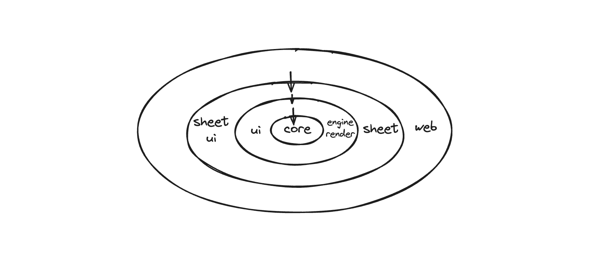

# This is Univer

## Chapter Zero: Introduction

This article aims to assist newcomers in swiftly acquainting themselves with the architecture and code of the open-source project "univer." It also encapsulates my learning and synthesis from my recent involvement in the development of "univer." There may be instances of inaccuracy or misconceptions, and I welcome comments and corrections from the community.

Chapter One will delve into my comprehension of the architecture of "univer", discussing how "univer" modularizes and establishes dependencies among its modules. Subsequently, we will integrate "univer" into the MVC architectural pattern, dissecting the boundaries and responsibilities of its model layer, view layer, and controllers.

In Chapter Two, we will initially explore the data structure design of the model layer in the "univer sheet", distinguishing between entities such as workbooks, sheets, rows, columns, and styles. Understanding their hierarchical relationships will facilitate a deeper comprehension of the code.

Chapters Three and Four will analyze the codebase of "univer" through two control chains. One chain entails the process of initializing and rendering "univer," progressing from the model layer to the view layer. The other chain involves "univer" responding to user events, triggering data changes in the model layer, and subsequently re-rendering the page, moving from the view layer to the model layer. These sections will involve extensive source code analysis, focusing on the core logic while excluding edge cases. Additionally, each code block will be prefaced with the corresponding TypeScript file, enhancing the readability of the source code.

## Chapter One: Understanding the Code Architecture

> External beauty may please the eyes, but inner beauty can touch the soul. —Voltaire

### Module Separation and Dependency Relationships in Univer

#### Principle of No Dependency Cycles

The rules of software architecture essentially revolve around arranging and combining code blocks. Software architecture organizes project code based on the business domain, breaking it down into different modules. Each module focuses on separation of concerns, with clear dependencies among them forming a directed acyclic graph, known as the Principle of Dependency Graphs. As illustrated below, system-level and application-level business logic constitute the core and most stable parts of the project, positioned at the innermost layer of the architecture. Components such as user interfaces, rendering engines, front-end frameworks, and persistent databases, which are subject to potential replacements during architectural evolution, depend on the central business entity, positioned in the outer layers.



(Note: core, sheet, engine-render, ui, sheet-ui correspond to different directories under the "packages" folder in the repository)

In the architectural design of Univer, efforts are made to ensure that the core module contains only the most essential business logic. Additional functionalities built upon this core business logic are provided through a plugin-based approach, embodying the concept of a **microkernel architecture**. In the diagram above, modules like engine-render, ui, sheet are all plugin-based, offering supplementary capabilities to the core. For instance, the sheet module enhances sheet-related functionalities, the engine-render (canvas rendering engine) provides canvas rendering capabilities, and the formula engine offers computation and parsing of formulas.

#### Dependency Inversion

At first glance, one might assume that the core module in Univer depends on the engine-render module for canvas rendering and on the ui module for rendering the page framework and styling menus. However, this setup poses a challenge: the core module relies on other modules, which are often unstable. For instance, styling menus may frequently change in position or appearance, potentially destabilizing the core module. In Univer, the **Dependency Inversion** principle is employed to address this issue. As depicted in the diagram above, all outer layers depend on the inner layers, while the inner layers remain independent of the outer layers. In Univer, **Dependency Injection (DI)** is introduced to invert dependencies, avoiding direct dependencies from the core layer to the outer layer. The following code example clarifies this concept further:

Without dependency injection, one might write code like this:

```typescript
class SheetPlugin {
  private _commandService = new CommandService()
}
```

In the code above, the `SheetPlugin` class depends on the `CommandService` class. Changes in the methods of the `CommandService` class directly impact `SheetPlugin`, potentially requiring modifications and destabilizing `SheetPlugin`.


Through dependency injection, the code is structured as follows:

```typescript
class SheetPlugin {
  constructor(
    // ...
    @ICommandService private readonly _commandService: ICommandService,
    // ...
  )

  otherMethod(){
    this._commandService.registerCommand(SomeCommand);
  }
}
```

In the code above, the _commandService property is declared to possess the ICommandService interface. Through relevant dependency bindings, methods defined in the ICommandService interface can be invoked within SheetPlugin's methods. This way, SheetPlugin depends on the ICommandService interface, while the CommandService class implements this interface. This decouples the direct dependency relationship between SheetPlugin and CommandService, as illustrated below:


Through the ICommandService interface, dependency inversion is achieved. Without the ICommandService interface, SheetPlugin would directly depend on CommandService, potentially destabilizing the core business logic (SheetPlugin). By introducing the ICommandService interface and employing dependency injection, if we consider the dashed box as a whole, with the CommandService class pointing to (implementing) the dashed box, we ultimately achieve dependency inversion, ensuring the stability of the core business logic.

### A Brief Discussion on the MVC Architecture in Univer


MVC has a history of over 50 years in the entire GUI programming domain, yet it has never had a precise definition. The diagram above illustrates two typical variants of MVC. In [MVC with ASP.NET](http://asp.net/), the controller is responsible for managing the view and model. When the controller modifies data in the model layer, the view layer directly reads data from the model layer through some subscription mechanism and updates the view. In **MVC with Rails**, the view layer does not directly interact with the model layer. Instead, it acts as an intermediary through the controller. The view layer needs to fetch data from the model layer via the controller for rendering. This approach decouples the view layer from the model layer entirely, leading to clearer control flow.

Upon examining the Univer project codebase, one can observe numerous files named with the suffixes `controller`, `view`, and `model`, indicating the adoption of a traditional MVC architectural pattern. In Univer, the MVC architecture more closely resembles MVC with Rails, as the view layer does not directly read data from the model layer or subscribe to changes in the model layer (which will be discussed further below, as it subscribes to Mutations), instead employing a layer of data caching (similar to a ViewModel), as seen in the SheetSkeleton class.

Initially delving into the project code raised several questions:

1. How does Univer organize and manage the model layer?
2. What are the responsibilities of controllers in Univer, and how is the clarity of controller code architecture ensured?
3. How is the view layer in Univer organized and managed?

By examining the source code, let's explore how Univer addresses these questions from an architectural perspective.

#### Model Layer (Model)

The model layer in Univer tends to be relatively thin. Taking Univer sheet as an example, in the core module, the Workbook and Worksheet classes are utilized to manage sheet-related model data, providing the necessary data storage and management functionalities. For instance, in the Worksheet class, there are row-manager, column-manager, and related classes and methods to manage each sheet's model data. For instance, regarding the row-manager, we can retrieve information and data about table rows:

```typescript
getRowData(): ObjectArray<IRowData>;
getRowHeight(rowPos: number): number;
getRowOrCreate(rowPos: number): IRowData;
// ...
```

It is essential to understand that the data we render cannot directly use underlying model data; it often requires some calculations to generate a "model layer" suitable for direct view rendering. For example, during rendering, we need to calculate the total height of rows and columns. By analyzing the content of each row, we can determine the minimum row height required to accommodate the data. Through a series of calculations, the layout of the sheet page is ultimately determined for final rendering. These calculations are primarily housed in the view layer's SheetSkeleton class.

#### Responsibilities of Controllers


In traditional MVC architecture, the roles of the view and model layers are usually more distinct, with the controller assuming the primary business logic responsibilities and managing tasks related to the view and model layers. Controllers often tend to become cumbersome, so how does Univer prevent bloated controllers? In Univer, the controller (in the MVC sense) is further broken down into **Controllers** (narrow sense controllers in Univer), **Commands**, and **Services**. Additionally, almost all of Univer's business logic is encapsulated within the controllers, each fulfilling specific roles to ensure the smooth operation of the Univer application.

**Responsibilities of Controllers**

- Initializing rendering logic and event listeners, such as in the SheetRenderController class, executed during the application's Rendered lifecycle. It initializes page data refresh (_initialRenderRefresh), listens for Command executions, involves Mutations to modify the model layer, and triggers page rendering logic.
- Interacting with the view layer to obtain certain data information. For instance, in the AutoHeightController class, automatic row height for the sheet is computed based on Commands' requirements.
- Binding UI events, as seen in the HeaderResizeController class, executed during the application's Rendered lifecycle. During initialization, it binds hover events for spreadsheetRowHeader and spreadsheetColumnHeader to show and hide resize headers (for adjusting row and column heights). It also binds pointer down/move/up events to the resize header, allowing it to respond to drag movements, handle user interactions, and ultimately reflect changes in the model layer and updates in the view layer.

**Responsibilities of Commands**

Commands can be viewed as individual user interaction operations, such as merging cells, clearing selections, inserting rows/columns, setting cell styles, etc., which modify the model layer and trigger view layer rendering. `Commands` come in three types: `COMMAND`, `MUTATION`, `OPERATION`.

- **COMMAND** represents a user's single interaction operation triggered by user actions. It can spawn another COMMAND, such as clicking the text wrap menu item in the menu triggering the SetTextWrapCommand, which then spawns the SetStyleCommand to handle all style changes. A COMMAND can spawn another COMMAND but cannot fork, as we need to handle undo/redo operations within COMMAND (undo/redo might be moved to the data layer later). However, a COMMAND can spawn multiple MUTATIONS and OPERATIONS.
- **MUTATION** can be understood as atomic operations on model layer data, like SetRangeValuesMutation modifying cell styles and values within the selected range, or SetWorksheetRowHeightMutation altering row heights within the selected range. Executing a MUTATION not only modifies model data but also triggers view re-rendering. Data modifications in MUTATION need to be coordinated and conflict resolved.
- **OPERATION** pertains to changes in application state, representing a temporary state of the application, such as page scroll position, user cursor position, current selection, etc., without involving coordination or conflict resolution, primarily used for future functionalities like live share (similar to Feishu's magic share).

**Responsibilities of Services**

Services provide various services to the entire Univer application, embodying the concept of Separation of Concerns in the Univer project architecture.

- Managing application lifecycle, as seen in the LifecycleService class, which stores the status values of the application lifecycle and provides the subscribeWithPrevious method for other modules to subscribe to changes in application lifecycle status values and execute responsive tasks like dependency initialization.
- Handling application history operations and storing historical operations, enabling users to undo/redo previous actions. In the LocalUndoRedoService class, undo/redo information is pushed onto a stack through the pushUndoRedo method, and the updateStatus method triggers undo/redo operations.
- Managing network IO and WebSocket connections.

In summary, Controllers, Commands, and Services collectively referred to as controllers in MVC, carry out a significant amount of business logic in Univer. The main responsibilities include (further detailed analysis on how controllers operate will be provided in subsequent sections):

1. Managing the entire application's lifecycle
2. Binding and responding to UI events, such as double-clicks, cursor movements, etc.
3. Controlling view rendering and triggering rendering logic
4. Communicating with the view layer to retrieve computed page layout information
5. Modifying the model layer through Command/Mutation to trigger interface rendering
6. Handling undo/redo-related tasks
7. Managing collaboration and network IO

#### View Layer (View)

In Univer, there are two rendering methods: canvas rendering engine and React rendering through the DOM. The canvas rendering engine primarily renders the main components of the sheet: row headers, column headers, sheet cells, selections, cell editors, etc. React is mainly used to render the top menu bar, context menu bar, pop-ups, etc.

Canvas rendering is utilized for rendering the main body of the sheet, ensuring an optimal performance experience for table rendering with large datasets and smooth animation effects. On the other hand, menus require responsiveness to user events, where DOM often holds an advantage over Canvas.

Components and services required for Canvas rendering are located in the `base-render` folder, encompassing sheet rendering-related components such as Spreadsheet, SpreadsheetRowHeader, SpreadsheetColumnHeader, etc. Additionally, a set of event response mechanisms is defined on Canvas components to ensure that each component can independently respond to events but does not handle these events in the view layer. These events need to be managed in the Controllers.

The `Base-ui/Components` folder code is responsible for rendering basic menu components and publishing user events. The base-ui module is also responsible for rendering the entire application framework. For instance, in the DesktopUIController class, bootstrapWorkbench initiates the rendering of the entire application framework and mounts the Canvas element.

## Chapter Two: Univer Sheet Data Structure

Understanding a project often begins with delving into its data structures.

The definitions of data types related to the Univer sheet are housed in the [Interfaces](https://github.com/dream-num/univer/tree/dev/packages/core/src/Types/Interfaces) directory. The hierarchical relationships are illustrated below:


The overall data type definitions for Univer sheets are depicted in the above diagram. A workbook encompasses multiple sheets, with the styles referenced by sheets defined at the top-level workbook. This design choice ensures style reusability, reducing memory overhead, aligning with Excel's structure. Within the IWorksheetConfig interface, the cellData field is defined as a two-dimensional matrix, persisting cell information, as specified in the ICellData type. Notably, the p field denotes rich text, referencing the interface type IDocumentData, essentially representing a Univer document. This unique feature underscores Univer's distinctive design aspect, where each cell in a Univer sheet can transform into a Univer document. The s field predominantly consists of a string id, pointing to the styles field in IWorkbookConfig, facilitating the retrieval of style information for the respective cell.

While the diagram does not encompass all fields defined within each interface, for a comprehensive understanding, it is recommended to directly explore the aforementioned [type definition file](https://github.com/dream-num/univer/blob/9a505ec3ba9de96677b9caaa821e287e71ebe0cf/packages/core/src/Types/Interfaces/IWorkbookData.ts#L12), which also includes relevant annotations for further clarity.

## Chapter Three: Application Initialization to Rendering Process

Understanding how Univer renders its pages essentially encompasses the entire process of Univer application startup, also representing the transition from the model layer to the view layer. Before delving into page rendering, let's first grasp the lifecycle of Univer, which was briefly mentioned in the Services section.

### Application Lifecycle

```typescript
export const enum LifecycleStages {
  /**
   * Register plugins to Univer.
   */
  Starting,
  /**
   * Univer business instances (UniverDoc / UniverSheet / UniverSlide) are created and services or controllers provided by
   * plugins get initialized. The application is ready to do the first-time rendering.
   */
  Ready,
  /**
   * First-time rendering is completed.
   */
  Rendered,
  /**
   * All lazy tasks are completed. The application is fully ready to provide features to users.
   */
  Steady,
}
```

The Univer lifecycle comprises four stages: `Starting`, `Ready`, `Rendered`, and `Steady`. During the `Starting` stage, plugins are registered in Univer. Upon entering the `Ready` stage, Univer business instances (UniverDoc / UniverSheet / UniverSlide) are created, and services or controllers provided by plugins are initialized. The application is then prepared for the initial rendering. Subsequently, the `Rendered` stage signifies the completion of the first rendering, while the `Steady` stage indicates that all deferred tasks are finished, and the application is fully operational for user interaction.

When are the various lifecycle stages triggered?

**Starting Stage**: In the `_tryStart` method, the LifecycleService class is instantiated, marking the application's entry into the Starting stage. During this phase, plugins' `onStarting` hooks are executed.

**Ready Stage**: After instantiating UniverSheet, in the `_tryProgressToReady` method, the LifecycleService stage value is set to Ready. At this point, plugins' `onReady` hooks are executed.

**Rendered Stage**: In the DesktopUIController, after bootstrapping the entire application, the LifecycleService stage value is set to Rendered.

**Steady Stage**: Following the Rendered stage, the Steady stage is triggered after a delay of 3000 milliseconds.

Through the `@OnLifecycle` annotation, precise control over when a class is instantiated during a specific lifecycle stage can be achieved, as demonstrated below:

```typescript
@OnLifecycle(LifecycleStages.Rendered, SheetRenderController)
export class SheetRenderController extends Disposable {
  // ...
}
```

In the above code snippet, SheetRenderController is instantiated during the Rendered stage.

### The Entire Process from Startup to Rendering


**Step One**: Creating the Univer instance, registering necessary plugins for sheets, and creating the Univer sheet instance.

The registered plugins and their functionalities include:

- base-docs: Used for cell and formula editing.
- base-render: Canvas rendering engine, containing essential components for sheet, document, and slide rendering.
- base-sheets: Manages sheet canvas-related rendering such as row headers, column headers, cells, and handles a significant amount of sheet-related business logic.
- base-ui: Manages basic React DOM rendering components for menus and the entire Univer sheet page framework rendering. It also handles user interaction operations like keyboard shortcuts registration, copy-paste functionalities, etc.
- ui-plugin-sheets: Responsible for rendering basic UI elements and business logic related to right-click menus and rich text editing in cells.

Upon completing plugin registration, the `createUniverSheet` method creates the Univer sheet instance.

```typescript
/**
 * Create a univer sheet instance with internal dependency injection.
 */
createUniverSheet(config: Partial<IWorkbookConfig>): Workbook {
  let workbook: Workbook;
  const addSheet = () => {
    workbook = this._univerSheet!.createSheet(config);
    this._currentUniverService.addSheet(workbook);
  };

  if (!this._univerSheet) {
    this._univerSheet = this._rootInjector.createInstance(UniverSheet);

    this._univerPluginRegistry
      .getRegisterPlugins(PluginType.Sheet)
      .forEach((p) => this._univerSheet!.addPlugin(p.plugin as unknown as PluginCtor<any>, p.options));
    this._tryStart();
    this._univerSheet.init();
    addSheet();

    this._tryProgressToReady();
  } else {
    addSheet();
  }

  return workbook!;
}
```

Through the above code, we can see that Univer re-registers the plugins of type PluginType.Sheet from the registered plugins mentioned above to the UniverSheet instance. Then, by using _tryStart, the application enters the Starting stage, initializes, and instantiates a Workbook through addSheet, completing the initialization of the model layer. At this point, the model data preparation is complete, and Univer transitions to the Ready stage.

**Step Two**: Initializing the page framework and rendering the page framework.

During the Univer application lifecycle, plugins execute specific actions at different stages. In this step, the focus is on the base-ui plugin.

```typescript
// base-ui-plugin.ts
override onStarting(_injector: Injector): void {
  this._initDependencies(_injector);
}

override onReady(): void {
  his._initUI();
}
```

In the above code, the base-ui plugin declares and adds dependencies in the onStarting stage and initializes the rendering of the entire page framework in the onReady stage, mounting the View interface onto the container.

```typescript
// ui-desktop.controller.tsx
bootstrapWorkbench(options: IWorkbenchOptions): void {
  this.disposeWithMe(
    bootStrap(this._injector, options, (canvasElement, containerElement) => {
      this._initializeEngine(canvasElement);
      this._lifecycleService.stage = LifecycleStages.Rendered;
      this._focusService.setContainerElement(containerElement);

      setTimeout(() => (this._lifecycleService.stage = LifecycleStages.Steady), STEADY_TIMEOUT);
    })
  );
}
// ...
function bootStrap(
  injector: Injector,
  options: IWorkbenchOptions,
  callback: (canvasEl: HTMLElement, containerElement: HTMLElement) => void
): IDisposable {
  let mountContainer: HTMLElement;
  // ...
  const root = createRoot(mountContainer);
  const ConnectedApp = connectInjector(App, injector);
  const desktopUIController = injector.get(IUIController) as IDesktopUIController;
  const onRendered = (canvasElement: HTMLElement) => callback(canvasElement, mountContainer);

  function render() {
    const headerComponents = desktopUIController.getHeaderComponents();
    const contentComponents = desktopUIController.getContentComponents();
    const footerComponents = desktopUIController.getFooterComponents();
    const sidebarComponents = desktopUIController.getSidebarComponents();
    root.render(
      <ConnectedApp
        {...options}
        headerComponents={headerComponents}
        contentComponents={contentComponents}
        onRendered={onRendered}
        footerComponents={footerComponents}
        sidebarComponents={sidebarComponents}
      />
    );
  }

  // ...
  render();
    // ...
}
```

In the above code snippet, after mounting and rendering the page framework, the canvas rendering engine container is mounted and the canvas size is adjusted, and the application enters the Rendered stage.

**Step Three**: Render the canvas interface, completing the entire rendering process.

This process actually began in the Ready stage, where the initialization and assembly of components for the sheet canvas were started.

```typescript
// sheet-canvas-view.ts
@OnLifecycle(LifecycleStages.Ready, SheetCanvasView)
export class SheetCanvasView {
  // ...
  constructor(
    // ...
  ) {
    this._currentUniverService.currentSheet$.subscribe((workbook) => {
      // ...
      const unitId = workbook.getUnitId()
      if (!this._loadedMap.has(unitId)) {
        this._currentWorkbook = workbook
        this._addNewRender()
        this._loadedMap.add(unitId)
      }
    })
  }

  private _addNewRender() {
    // ...
    if (currentRender != null) {
      this._addComponent(currentRender)
    }
    const should = workbook.getShouldRenderLoopImmediately()
    if (should && !isAddedToExistedScene) {
      engine.runRenderLoop(() => {
        scene.render()
      })
    }
    // ...
  }

  private _addComponent(currentRender: IRender) {
    // ...
    currentRender.mainComponent = spreadsheet
    currentRender.components.set(SHEET_VIEW_KEY.MAIN, spreadsheet)
    currentRender.components.set(SHEET_VIEW_KEY.ROW, spreadsheetRowHeader)
    currentRender.components.set(SHEET_VIEW_KEY.COLUMN, spreadsheetColumnHeader)
    currentRender.components.set(SHEET_VIEW_KEY.LEFT_TOP, SpreadsheetLeftTopPlaceholder)
    // ...
    this._sheetSkeletonManagerService.setCurrent({ sheetId, unitId })
  }

  private _addViewport(worksheet: Worksheet) {
    // ...
    scene
      .addViewport(
        viewMain,
        viewColumnLeft,
        viewColumnRight,
        viewRowTop,
        viewRowBottom,
        viewLeftTop,
        viewMainLeftTop,
        viewMainLeft,
        viewMainTop
      )
      .attachControl()
  }
}
```

The above code actually represents the entire process of rendering the sheet canvas. It first subscribes to `currentSheet`. If the sheet has not been rendered before, the `_addNewRender` method is called to add the necessary canvas rendering components for the sheet, add a viewport, and then add the scene's rendering to the rendering loop of the rendering engine (`runRenderLoop`).

In the above process, the assembly of the necessary canvas components for the sheet and the addition of the viewport are completed. So, where does the initial rendering of the canvas occur? And in which lifecycle stage? The rendering of the sheet canvas is managed by the SheetRenderController class, which handles the initialization rendering of the sheet canvas, listens for mutations, and then selectively renders the canvas interface.

```typescript
// sheet-render.controller.ts
@OnLifecycle(LifecycleStages.Rendered, SheetRenderController)
export class SheetRenderController extends Disposable {}
```

In the above code, we can see that the rendering of the sheet canvas occurs during the entire application's Rendered stage. This is quite understandable because at this stage, the page framework has been mounted on the container, and the sheet canvas has completed its initialization work. During the Rendered stage, it subscribes to changes in `currentSkeleton$`, then updates the skeleton to complete the initial rendering of the page.

```typescript
private _commandExecutedListener() {
  this.disposeWithMe(
    this._commandService.onCommandExecuted((command: ICommandInfo) => {
      // ...
      if (COMMAND_LISTENER_SKELETON_CHANGE.includes(command.id)) {
          // ...
          if (command.id !== SetWorksheetActivateMutation.id) {
            this._sheetSkeletonManagerService.makeDirty(
              {
                unitId,
                sheetId,
                commandId: command.id,
              },
              true
            );
          }

          this._sheetSkeletonManagerService.setCurrent({
            unitId,
            sheetId,
            commandId: command.id,
          });
      }

      this._renderManagerService.getRenderById(unitId)?.mainComponent?.makeDirty(); // refresh spreadsheet
    })
  );
}
```

The above code occurs in the SheetRenderController class. In the `_commandExecutedListener` method, it listens for Command executions. If it is within the `COMMAND_LISTENER_SKELETON_CHANGE` list, it marks the current skeleton and mainComponent as dirty. This way, the Canvas rendering engine will re-render the page in the next rendering loop.

**Step Four**: Initialize the cell editors.

In fact, by the third step, the rendering of the entire sheet interface is essentially complete. Let's now focus on the initialization process of the cell editors. During the application's Rendered stage, Univer will initialize two Doc instances—one for cell editing and the other for formula input box editing.

```typescript
// initialize-editor.controller.ts
private _initialize() {
  this._currentUniverService.createDoc({
    id: DOCS_NORMAL_EDITOR_UNIT_ID_KEY,
    documentStyle: {},
  });
  // create univer doc formula bar editor instance

  this._currentUniverService.createDoc({
    id: DOCS_FORMULA_BAR_EDITOR_UNIT_ID_KEY,
    documentStyle: {},
  });
}
```

Also, during the Rendered stage, when the EditorBridgeController class is instantiated, it initializes related event listeners, such as double-clicking on a cell to enter edit mode. However, it is not until the Steady stage that the StartEditController class is fully instantiated, allowing for full interactivity in cell editing.

## Chapter Four. How does the interface respond to user actions?

The following sequence diagram describes the entire process from event response to interface rendering when a user clicks on the text wrap menu item in Univer:


**Step 1**: The user clicks on the "text wrap" menu item in the menu.

```tsx
// menu.ts
export function WrapTextMenuItemFactory(accessor: IAccessor): IMenuSelectorItem<WrapStrategy> {
  // ...
  return {
    id: SetTextWrapCommand.id,
    // ...
  }
}

// ToolbarItem.tsx
  <Select
    onClick={(value) => {
      const commandId = id
      commandService.executeCommand(commandId, value)
    }}
  />
```

Above is the Select component for the "text wrap" menu item in the menu bar. It can be seen that a click event handler is bound to it. When clicked, the `commandService` will execute the `commandId`, which is the id value configured in `WrapTextMenuItemFactory`: `SetTextWrapCommand`'s id.

**Step 2**: In `SetTextWrapCommand`, the parameters are wrapped, and then a Command for setting styles uniformly, `SetStyleCommand`, is executed.

```typescript
export const SetTextWrapCommand: ICommand<ISetTextWrapCommandParams> = {
  type: CommandType.COMMAND,
  id: 'sheet.command.set-text-wrap',
  handler: async (accessor, params) => {
    // ...
    const commandService = accessor.get(ICommandService)
    const setStyleParams: ISetStyleParams<WrapStrategy> = {
      style: {
        type: 'tb',
        value: params.value,
      },
    }

    return commandService.executeCommand(SetStyleCommand.id, setStyleParams)
  },
}
```

**Step 3**: In `SetStyleCommand`, as the style values within the selection are changed, the parameters for `SetRangeValuesMutation` need to be assembled. For example, setting the `tb` of all cells in the selection to `WrapStrategy.WRAP`. Due to the change in text wrap within the selection, and since the row height is automatically adjusted, the calculation of an `autoHeight` for that row is required. Before calculating the auto row height, `SetRangeValuesMutation` needs to be executed because the autoHeight calculation depends on the updated view data. The value of `autoHeight` is obtained through the interceptor registered in `SheetInterceptorService` (in `redos`).

```typescript
// set-style.command.ts
const { undos, redos } = accessor.get(SheetInterceptorService).onCommandExecute({
  id: SetStyleCommand.id,
  params,
})
```

**Step 4**: The ability to obtain the `autoHeight` value as mentioned above is primarily attributed to the `AutoHeightController` class. This class is instantiated in the `LifecycleStages.Ready` stage and adds interception for all Commands that affect row auto height, such as intercepting `SetStyleCommand`.

```typescript
// auto-height.controller.ts
// for intercept set style command.
sheetInterceptorService.interceptCommand({
  getMutations: (command: { id: string, params: ISetStyleParams<number> }) => {
    if (command.id !== SetStyleCommand.id) {
      return {
        redos: [],
        undos: [],
      }
    }
    // ...
    const selections = selectionManagerService.getSelectionRanges()

    return this._getUndoRedoParamsOfAutoHeight(selections)
  },
})
```

**Step 5**: Since calculating the auto row height requires the document model and related calculations of cell layout, all related calculations are placed in the `SheetSkeleton` class that manages the `Spreadsheet` (view layer). The `calculateAutoHeightInRange` method in this class ultimately calculates the auto row height.

```typescript
// auto-height.controller.ts
private _getUndoRedoParamsOfAutoHeight(ranges: IRange[]) {
  // ...
  const { skeleton } = sheetSkeletonService.getCurrent()!;
  const rowsAutoHeightInfo = skeleton.calculateAutoHeightInRange(ranges);
  // ...
}
```

**Step 6**: Once the data for `autoHeight` is obtained, it triggers the `SetWorksheetRowHeightMutation`. Whether triggered by `SetRangeValuesMutation` or `SetWorksheetRowHeightMutation,` both will modify the model layer and mark `sheetSkeleton` and `mainComponent` as dirty. The `sheetSkeleton` will recalculate layout and other rendering information as needed, and then render the page.

```typescript
// sheet-render.controller.ts
private _commandExecutedListener() {
  this.disposeWithMe(
    this._commandService.onCommandExecuted((command: ICommandInfo) => {
      // ...
      if (COMMAND_LISTENER_SKELETON_CHANGE.includes(command.id)) {
        // ...
        if (command.id !== SetWorksheetActivateMutation.id) {
          this._sheetSkeletonManagerService.makeDirty(
            {
              unitId,
              sheetId,
              commandId: command.id,
            },
            true
          );
        }
        // ...
      }
      this._renderManagerService.getRenderById(unitId)?.mainComponent?.makeDirty(); // refresh spreadsheet
    })
  );
}
```

The above completes the entire process from event triggering to modifying the model layer, and subsequently updating the view layer.

## 5. Further Reading

If you wish to have an overall understanding of the architecture, I recommend reading [Univer Architecture](/guides/sheet/architecture/univer). If you are unfamiliar with the DI system, I suggest reading the DI framework [redi](https://redi.wendell.fun/zh-CN/docs/introduction) used in the Univer project. The project uses Rxjs as an observer pattern, and reading the [Rxjs documentation](https://rxjs.tech/guide/overview) is a quick way to become familiar with Rxjs.

<p className="text-gray-500 text-sm mt-8">Author: [Jocs](https://github.com/Jocs), Creator of [MarkText](https://github.com/marktext/marktext), Core Developer at Univer, responsible for Univer Doc architecture and development.</p>
