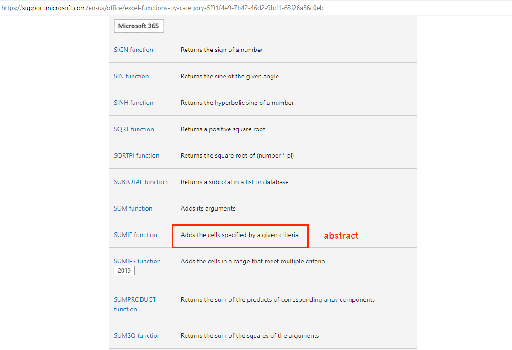
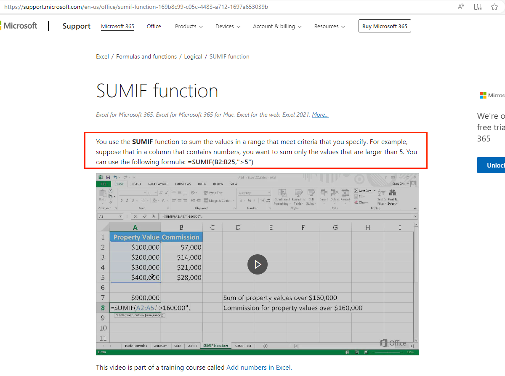
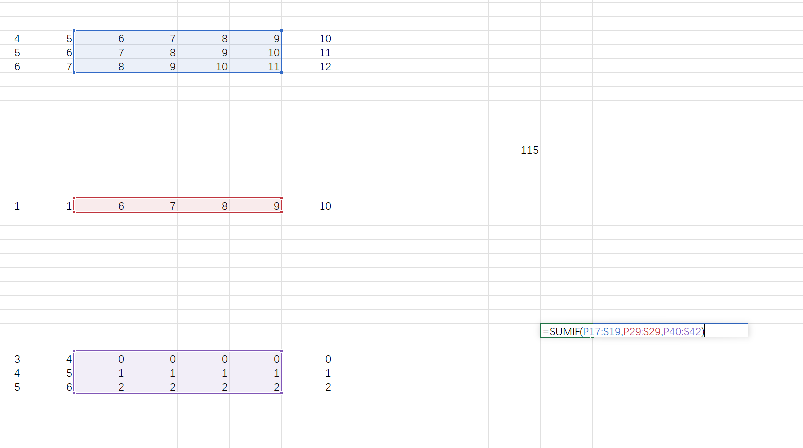
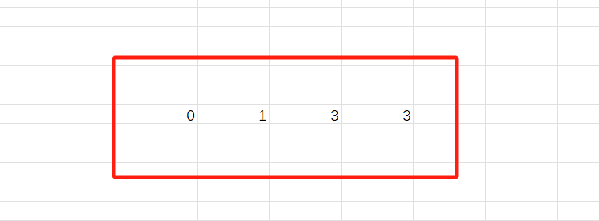
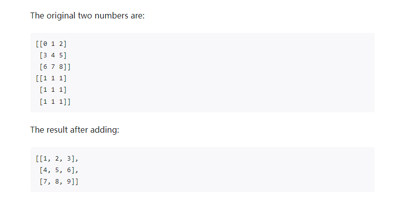

import { Callout } from 'nextra/components'
import BadgeGroup, { UniverTypes } from '@/components/BadgeGroup'

# Custom Formula

<BadgeGroup values={[UniverTypes.GENERAL]} value={UniverTypes.GENERAL} />

When the existing formulas do not meet your needs, you can register custom formulas in the following ways.

## How To Configure Custom Formulas Through Plugin

Follow the steps below to implement a custom formula `CUSTOMSUM`, configure the formula information into the formula plugin, and register the formula plugin with Univer.

You can create a new `custom-function.ts` file to specifically place custom formula-related modules, or write it directly before `univer` is initialized.

1. Define formula name

    First, give the formula a name. We require that it cannot be repeated with the name of the existing formula. The existing formula is mainly from [Office Excel](https://support.microsoft.com/en-us/office/excel-functions-by-category-5f91f4e9-7b42-46d2-9bd1-63f26a86c0eb) refer to.

    We collect multiple custom formulas in an enumeration.

    ```typescript
    /**
     * function name
     */
    export enum FUNCTION_NAMES_USER {
      CUSTOMSUM = "CUSTOMSUM",
    }
    ```

2. Define internationalization

    Define the international content you need. For detailed field descriptions, please refer to the [How to add formulas in Formula Engine](/guides/sheet/advanced/custom-formula/#how-to-add-formulas-in-formula-engine) section. Similarly, multiple formulas are distinguished by using the formula name as the `key` value.

    ```typescript
    /**
     *i18n
     */
    export const functionEnUS = {
      formulaCustom: {
        CUSTOMSUM: {
          description: `You can add individual values, cell references or ranges or a mix of all three.`,
          abstract: `Adds its arguments`,
          links: [
            {
              title: 'Instruction',
              url: 'https://support.microsoft.com/en-us/office/sum-function-043e1c7d-7726-4e80-8f32-07b23e057f89',
            },
          ],
          functionParameter: {
            number1: {
              name: 'number1',
              detail: 'The first number you want to add. The number can be like 4, a cell reference like B6, or a cell range like B2:B8.',
            },
            number2: {
              name: 'number2',
              detail: 'This is the second number you want to add. You can specify up to 255 numbers in this way.',
            },
          },
        },
      },
    };

    export const functionZhCN = {
      formulaCustom: {
        CUSTOMSUM: {
          description: '将单个值、单元格引用或是区域相加，或者将三者的组合相加。',
          abstract: '求参数的和',
          links: [
            {
              title: '教学',
              url: 'https://support.microsoft.com/zh-cn/office/sum-%E5%87%BD%E6%95%B0-043e1c7d-7726-4e80-8f32-07b23e057f89',
            },
          ],
          functionParameter: {
            number1: {
              name: '数值1',
              detail: '要相加的第一个数字。 该数字可以是 4 之类的数字，B6 之类的单元格引用或 B2:B8 之类的单元格范围。',
            },
            number2: {
              name: '数值2',
              detail: '这是要相加的第二个数字。 可以按照这种方式最多指定 255 个数字。',
            },
          },
        },
      },
    };
    ```

3. Registration internationalization

    Expand the internationalization content you defined in the original internationalization object.

    ```typescript
    export const locales = {
      [LocaleType.EN_US]: {
        ...UniverSheetsEnUS,
        ...UniverDocsUIEnUS,
        ...UniverSheetsUIEnUS,
        ...UniverUiEnUS,
        ...UniverDesignEnUS,
        ...functionEnUS,
      },
      [LocaleType.ZH_CN]: {
        ...functionZhCN,
      },
    };
    ```

4. Definition description

    The description of the formula mainly configures internationalized fields, which are used for formula search prompts, details panels, etc.

    ```typescript
    import type { IFunctionInfo } from '@univerjs/engine-formula';
    import { FunctionType } from '@univerjs/engine-formula';

    /**
    * description
    */
    export const FUNCTION_LIST_USER: IFunctionInfo[] = [
      {
        functionName: FUNCTION_NAMES_USER.CUSTOMSUM,
        aliasFunctionName: 'formulaCustom.CUSTOMSUM.aliasFunctionName',
        functionType: FunctionType.User,
        description: 'formulaCustom.CUSTOMSUM.description',
        abstract: 'formulaCustom.CUSTOMSUM.abstract',
        functionParameter: [
          {
            name: 'formulaCustom.CUSTOMSUM.functionParameter.number1.name',
            detail: 'formulaCustom.CUSTOMSUM.functionParameter.number1.detail',
            example: 'A1:A20',
            require: 1,
            repeat: 0,
          },
          {
            name: 'formulaCustom.CUSTOMSUM.functionParameter.number2.name',
            detail: 'formulaCustom.CUSTOMSUM.functionParameter.number2.detail',
            example: 'B2:B10',
            require: 0,
            repeat: 1,
          },
        ],
      },
    ];
    ```

5. Registration description

    Pass in the description object you defined when registering the formula plugin.

    ```typescript
    // universal
    univer.registerPlugin(UniverSheetsFormulaPlugin, {
      description: FUNCTION_LIST_USER,
    });
    ```

6. Define formula algorithm

    Write specific formula calculation logic, map algorithms and formula names.

    ```typescript
    import type { ArrayValueObject, BaseValueObject, IFunctionInfo } from '@univerjs/engine-formula';
    import { BaseFunction, FunctionType, NumberValueObject } from '@univerjs/engine-formula';

    /**
    * Function algorithm
    */
    export class Customsum extends BaseFunction {
      override calculate(...variants: BaseValueObject[]) {
        let accumulatorAll: BaseValueObject = NumberValueObject.create(0);
        for (let i = 0; i < variants.length; i++) {
          let variant = variants[i];

          if (variant.isError()) {
            return variant;
          }

          if (accumulatorAll.isError()) {
            return accumulatorAll;
          }

          if (variant.isArray()) {
            variant = (variant as ArrayValueObject).sum();
          }

          accumulatorAll = accumulatorAll.plus(variant as BaseValueObject);
        }

        return accumulatorAll;
      }
    }
    // Mapping of algorithms and names
    export const functionUser = [[Customsum, FUNCTION_NAMES_USER.CUSTOMSUM]];
    ```

    Formula algorithms can also be marked with `isAsync` to return asynchronous results. A `Promise` is passed into the returned `AsyncObject`, and `Promise.resolve` can accept `BaseValueObject` or `ArrayValueObject`.

    ```typescript
    /**
     * Get data asynchronously and assign it to a single formula value
    */
    export class CustomAsyncObject extends BaseFunction {
      override calculate(value: BaseValueObject) {
          return new AsyncObject(asyncObjectFunction(value));
      }

      override isAsync(): boolean {
          return true;
      }
    }

    async function asyncObjectFunction(value: BaseValueObject) {
      return new Promise((resolve: (value: BaseValueObject) => void) => {
          setTimeout(() => {
              resolve(StringValueObject.create(`Async Info: ${value.getValue()}`));
          }, 1000);
      });
    }
    ```

7. Registration formula algorithm

    Pass in the formula algorithm object you defined in `UniverFormulaEnginePlugin`.

    ```typescript
    univer.registerPlugin(UniverFormulaEnginePlugin, {
      function: functionUser,
    });
    ```

    <Callout type="info" emoji="ℹ️">
      If `UniverFormulaEnginePlugin` is instantiated in `worker`, you need to register the formula algorithm in `UniverFormulaEnginePlugin` in `worker`, otherwise the custom formula cannot be executed.
    </Callout>

8. Test

    At this point, the development of the custom formula is completed, and now it is time to test it. Enter `=CUSTOMSUM` in any blank cell and expect to get a formula prompt. Here is a [Custom Formula Demo](/playground?title=Custom%20Function) for reference.

## How To Add Formulas in Third-Party Plugin

If you are developing a Univer plugin, you can add custom formulas directly to the plugin to facilitate code management in a plugin repository.

Our internal `UniverFormulaEnginePlugin` plugin provides a `function.service` specifically for registering formula descriptions and algorithms.

First, create a new plugin, and then you can start adding custom formulas.

1. Create a new `custom-function.ts` file in the `common` file and write all the basic modules required for the formula.

    ```typescript
    import type { ArrayValueObject, BaseValueObject, IFunctionInfo } from '@univerjs/engine-formula';
    import { BaseFunction, FunctionType, NumberValueObject } from '@univerjs/engine-formula';

    /**
     * function name
     */
    export enum FUNCTION_NAMES_USER {
      CUSTOMSUM = 'CUSTOMSUM',
    }

    /**
     *i18n
     */
    export const functionEnUS = {
      formulaCustom: {
        CUSTOMSUM: {
          description: `You can add individual values, cell references or ranges or a mix of all three.`,
          abstract: `Adds its arguments`,
          links: [
            {
              title: 'Instruction',
              url: 'https://support.microsoft.com/en-us/office/sum-function-043e1c7d-7726-4e80-8f32-07b23e057f89',
            },
          ],
          functionParameter: {
            number1: {
              name: 'number1',
              detail: 'The first number you want to add. The number can be like 4, a cell reference like B6, or a cell range like B2:B8.',
            },
            number2: {
              name: 'number2',
              detail: 'This is the second number you want to add. You can specify up to 255 numbers in this way.',
            },
          },
        },
      },
    };

    export const functionZhCN = {
      formulaCustom: {
        CUSTOMSUM: {
          description: '将单个值、单元格引用或是区域相加，或者将三者的组合相加。',
          abstract: '求参数的和',
          links: [
            {
              title: '教学',
              url: 'https://support.microsoft.com/zh-cn/office/sum-%E5%87%BD%E6%95%B0-043e1c7d-7726-4e80-8f32-07b23e057f89',
            },
          ],
          functionParameter: {
            number1: {
              name: '数值1',
              detail: '要相加的第一个数字。 该数字可以是 4 之类的数字，B6 之类的单元格引用或 B2:B8 之类的单元格范围。',
            },
            number2: {
              name: '数值2',
              detail: '这是要相加的第二个数字。 可以按照这种方式最多指定 255 个数字。',
            },
          },
        },
      },
    };

    /**
     * description
     */
    export const FUNCTION_LIST_USER: IFunctionInfo[] = [
      {
        functionName: FUNCTION_NAMES_USER.CUSTOMSUM,
        aliasFunctionName: 'formulaCustom.CUSTOMSUM.aliasFunctionName',
        functionType: FunctionType.User,
        description: 'formulaCustom.CUSTOMSUM.description',
        abstract: 'formulaCustom.CUSTOMSUM.abstract',
        functionParameter: [
          {
            name: 'formulaCustom.CUSTOMSUM.functionParameter.number1.name',
            detail: 'formulaCustom.CUSTOMSUM.functionParameter.number1.detail',
            example: 'A1:A20',
            require: 1,
            repeat: 0,
          },
          {
            name: 'formulaCustom.CUSTOMSUM.functionParameter.number2.name',
            detail: 'formulaCustom.CUSTOMSUM.functionParameter.number2.detail',
            example: 'B2:B10',
            require: 0,
            repeat: 1,
          },
        ],
      },
    ];

    /**
     * Function algorithm
     */
    export class Customsum extends BaseFunction {
      override calculate(...variants: BaseValueObject[]) {
        let accumulatorAll: BaseValueObject = NumberValueObject.create(0);
        for (let i = 0; i < variants.length; i++) {
          let variant = variants[i];

          if (variant.isError()) {
            return variant;
          }

          if (accumulatorAll.isError()) {
            return accumulatorAll;
          }

          if (variant.isArray()) {
            variant = (variant as ArrayValueObject).sum();
          }

          accumulatorAll = accumulatorAll.plus(variant as BaseValueObject);
        }

        return accumulatorAll;
      }
    }

    export const functionUser = [[Customsum, FUNCTION_NAMES_USER.CUSTOMSUM]];
    ```

2. Create a new `custom-description.controller.ts` under the `controllers` folder to register formula internationalization content and description.

    ```typescript
    import { Disposable, LifecycleStages, Inject, LocaleService, OnLifecycle } from '@univerjs/core';

    import { FUNCTION_LIST_USER, functionEnUS, functionZhCN } from '../common/custom-function';
    import { IDescriptionService } from '../services/description.service';

    @OnLifecycle(LifecycleStages.Ready, CustomDescriptionController)
    export class CustomDescriptionController extends Disposable {
      constructor(
        @IDescriptionService private readonly _descriptionService: IDescriptionService,
        @Inject(LocaleService) private readonly _localeService: LocaleService
      ) {
        super();

        this._initialize();
      }

      private _initialize(): void {
        this._registerLocales();
        this._registerCustomDescriptions();
      }

      private _registerLocales() {
        this._localeService.load({
          zhCN: functionZhCN,
          enUS: functionEnUS,
        });
      }

      private _registerCustomDescriptions() {
        this._descriptionService.registerDescription(FUNCTION_LIST_USER);
      }
    }
    ```

3. Create a new `custom-function.controller.ts` under the `controllers` folder to register formula algorithms.

    ```typescript
    import { type Ctor } from '@univerjs/core';
    import { Disposable, LifecycleStages, OnLifecycle } from '@univerjs/core';
    import type { BaseFunction, IFunctionNames } from '@univerjs/engine-formula';
    import { IFunctionService } from '@univerjs/engine-formula';

    import { functionUser } from '../common/custom-function';

    @OnLifecycle(LifecycleStages.Ready, CustomFunctionController)
    export class CustomFunctionController extends Disposable {
      constructor(@IFunctionService private readonly _functionService: IFunctionService) {
        super();

        this._initialize();
      }

      private _initialize(): void {
        this._registerCustomFunctions();
      }

      private _registerCustomFunctions() {
        const functions: BaseFunction[] = [...functionUser].map((registerObject) => {
          const Func = registerObject[0] as Ctor<BaseFunction>;
          const name = registerObject[1] as IFunctionNames;

          return new Func(name);
        });

        this._functionService.registerExecutors(...functions);
      }
    }
    ```

4. In the plugin entry file `plugin.ts`, register `custom-description.controller.ts` and `custom-function.controller.ts` into the DI system.

    ```typescript
    initialize(): void {
      // ... other logic

      const dependencies: Dependency[] = [
        // ... other modules
        [CustomFunctionController],
        [CustomDescriptionController],
      ];

      dependencies.forEach((dependency) => this._injector.add(dependency));
    }
    ```

    Start Univer and enter `=CUSTOMSUM` in any blank cell to test this newly added formula.

## Write a Plugin To Register Formulas

In addition to registering through the `UniverFormulaEnginePlugin` configuration, the formula algorithm module can also be separately packaged as a plugin for registration.

First of all, there is no need to register `CustomFunctionController` in `plugin.ts`. Create a new `custom-function-plugin.ts` in the same directory, specifically for registering `CustomFunctionController`.

```typescript
import type { Dependency } from '@univerjs/core';
import { Plugin, PluginType, Inject, Injector } from '@univerjs/core';

import { FORMULA_UI_PLUGIN_NAME } from './common/plugin-name';
import { CustomFunctionController } from './controllers/custom-function.controller';

export class UniverSheetsCustomFunctionPlugin extends Plugin {
  static override type = PluginType.Sheet;

  constructor(@Inject(Injector) override readonly _injector: Injector) {
    super(FORMULA_UI_PLUGIN_NAME);
  }

  initialize(): void {
    const dependencies: Dependency[] = [[CustomFunctionController]];

    dependencies.forEach((dependency) => this._injector.add(dependency));
  }

  override onReady(): void {
    this.initialize();
  }
}
```

Then export it in `index.ts`

```typescript
export { UniverSheetsCustomFunctionPlugin } from './custom-function-plugin';
```

Register plugin

```typescript
import { UniverSheetsCustomFunctionPlugin } from '@univerjs/sheets-formula';

// ...initialize other plugins
univer.registerPlugin(UniverSheetsCustomFunctionPlugin);
```

## How To Add Formulas in Formula Engine

Univer's goal is to be compatible with all Excel and Google Sheets formulas, and we hope everyone can help improve this part of the content.

### How to Claim the Formula

1. From [Office Excel functions](https://support.microsoft.com/en-us/office/excel-functions-by-category-5f91f4e9-7b42-46d2-9bd1-63f26a86c0eb) or [Google Sheets function list](https://support.google.com/docs/table/25273), first find a formula you are interested in and check whether it has not been implemented in Univer and no one has claimed it in Github issues.
2. Create a [Feature request issue](https://github.com/dream-num/univer/issues/new/choose) for each formula.
Comment under the mark `@yourself: I can solve it`, example [\[Feature\] Math Formula LET](https://github.com/dream-num/univer/issues/1835).
3. Wait for the maintainer's comment and confirmation before starting development.

### How to Submit Code

1. Refer to our [Contribution Guides](/guides/sheet/contributing), fork [Univer Project](https://github.com/dream-num/univer), and branch development from dev. The branch names are unified to `feat/formula-[function name]`, such as `feat/formula-sumif`.
2. When developing code, pay attention to comply with our [CONTRIBUTING](https://github.com/dream-num/univer/blob/dev/CONTRIBUTING.md)
3. Mark the close related issue in the PR, submit the PR, and rebase the upstream branch in time. Reviewers select `Dushusir` to wait for code review and QA testing.
4. Merge into dev after passing code review and QA

### How to Implement the Formula

Before officially starting to write code, it is recommended that you study [Formula Architecture](/guides/sheet/architecture/formula) to have a comprehensive understanding of the formula system.

Familiar with the classification of formulas

- Financial
- Date
- Math
- Statistical
- Lookup
- Database
- Text
- Logical
- Information
- Engineering
- Cube
- Compatibility
- Web
- Array
- Univer
- User
- DefinedName

Detailed API reference [FunctionType](/typedoc/@univerjs/engine-formula/enumerations/FunctionType)

To implement a formula, you need to add formula description, internationalization, and formula algorithm. Take the `SUMIF` function as an example for reference.

1. Add Function Name

    Location: [packages/engine-formula/src/functions/math/function-names.ts](https://github.com/dream-num/univer/blob/dev/packages/engine-formula/src/functions/math/function-names.ts).

    Each category has a folder containing a `function-names` file to manage all function names in that category. Add the function name, which will be used in the `sheets-formula` plugin.

    Note that a function in Excel may belong to multiple categories. For example, `FLOOR` appears in Compatibility and Math Functions, and we classify it under the Math category. Other functions are treated similarly, based on the exact classification.

    > Most Excel functions have already written function names. New functions can be added at the end

2. Internationalization Files

    Location: [packages/sheets-formula/src/locale/function-list/math/en-US.ts](https://github.com/dream-num/univer/blob/dev/packages/sheets-formula/src/locale/function-list/math/en-US.ts).

    Internationalization is organized by category, with a file for each category. Refer to the Office function category page for a brief overview.

    

    Refer to the Office function details page for function descriptions and parameter descriptions.

    

    Most function names already have basic description, abstract, links, and parameter structures. It is recommended to modify them based on this foundation. If a function is not present, add it to the end.

    Requirements:

    - Use the English names of function parameters as the `key` for translation, e.g., `SUMIF`. Generally, do not modify unless there is an error.
    - Extract the `description` from the content, as some Excel descriptions are lengthy and need simplification.
    - `abstract` and `links` generally do not need modification.
    - `aliasFunctionName` is optional; most formulas do not need to be filled (or can be set for aliases in specific countries). Currently, there is no documentation for formula aliases. Currently I have found a function translation plug-in that may provide similar functions [Excel Functions Translator](https://support.microsoft.com/en-us/office/excel-functions-translator-f262d0c0-991c-485b-89b6-32cc8d326889)
    - `functionParameter` needs a name for each parameter. We recommend varying names based on the parameter's meaning, e.g., use `number` for a numeric parameter (if there is only one) or `number1`, `number2` for multiple numeric parameters. Use `range` for a range, `criteria` for conditions, and `sumRange` for the sum range, use `camelCase`. For specific parameter content, the English format of `name` uses the underlined format `sum_range`, other languages use the translated text, and `detail` uses all translations.
    - Some Chinese translations in the Office function documentation are machine-translated and may be unclear. Modify as needed. For example, `单元格参考` (Cell Reference) should be translated as `单元格引用`. Numeric type parameters are uniformly translated as: `数值`.
    - Do not end `abstract` with a period (used in the search list when users input cells), but end `description` and `detail` with a period (used in descriptions).
    - Capitalize the first letter of English sentences.
    - Ensure that all existing internationalization files are filled. Currently, there are Chinese, English, Japanese, and Russian translations (languages can be switched at the bottom of the Excel introduction page).

3. Formula Descriptions

    `SUMIF` belongs to the `math` category, and the description is in [packages/sheets-formula/src/services/function-list/math.ts](https://github.com/dream-num/univer/blob/dev/packages/sheets-formula/src/services/function-list/math.ts), which manages all functions in the `math` category.

    Most function names already have basic description structure. It is recommended to modify them based on this foundation. If a function is not present, add it to the end.

    Here is an example of `SUMIF`

    ```typescript
    {
      functionName: FUNCTION_NAMES_MATH.SUMIF,
      aliasFunctionName: 'formula.functionList.SUMIF.aliasFunctionName',
      functionType: FunctionType.Math,
      description: 'formula.functionList.SUMIF.description',
      abstract: 'formula.functionList.SUMIF.abstract',
      functionParameter: [
        {
          name: 'formula.functionList.SUMIF.functionParameter.range.name',
          detail: 'formula.functionList.SUMIF.functionParameter.range.detail',
          example: 'A1:A20',
          require: 1,
          repeat: 0,
        },
        {
          name: 'formula.functionList.SUMIF.functionParameter.criteria.name',
          detail: 'formula.functionList.SUMIF.functionParameter.criteria.detail',
          example: '">5"',
          require: 1,
          repeat: 0,
        },
        {
          name: 'formula.functionList.SUMIF.functionParameter.sumRange.name',
          detail: 'formula.functionList.SUMIF.functionParameter.sumRange.detail',
          example: 'B1:B20',
          require: 0,
          repeat: 0,
        },
      ],
    }
    ```

    Requirements:

    - Add the formula to the `FUNCTION_LIST_MATH` array. It is recommended to keep the order consistent with the internationalization file for easy management and retrieval.
    - Reference the previously defined `FUNCTION_NAMES_MATH` enum for the `functionName`.
    - `aliasFunctionName` is also optional; if there are no aliases in the internationalization file, you do not need to add them here.
    - Pay attention to the internationalized fields corresponding to the function name and parameter name. For example, the `name` of `functionParameter` is written as `formula.functionList.SUMIF.functionParameter.range.name`, `SUMIF` is the function name, and `range` is the parameter name.
    - Modify function parameter information, including the `example` parameter example (e.g., for a range, use `"A1:A20"`; for conditions, use `">5"`), the `require` parameter (1 for required, 0 for optional), and the `repeat` parameter (1 for allowed, 0 for not allowed). For detailed information, refer to the interface [IFunctionParam](https://github.com/dream-num/univer/blob/dev/packages/engine-formula/src/basics/function.ts).

4. Formula Algorithm

    Location: [packages/engine-formula/src/functions/math/sumif/index.ts](https://github.com/dream-num/univer/blob/dev/packages/engine-formula/src/functions/math/sumif/index.ts).

    Create a new formula folder under the classification folder of the current formula. The folder name is the same as the formula, named with `kebab-case`, one folder for each formula. Then create a new `index.ts` file to write the formula algorithm. The name of the formula `class` adopts `PascalCase`. The formula is considered to be one word, and the formula with `_` or `.` is considered to be two words such as

     - `SUMIF` => folder `sumif`, class `Sumif`
     - `NETWORKDAYS.INTL` => folder `networkdays-intl`, class `NetworkdaysIntl`
     - `ARRAY_CONSTRAIN` => folder `array-constrain`, class `ArrayConstrain`

    Create a `__tests__` folder at the same level to write unit tests. After writing, remember to add the formula algorithm and function name mapping in the `function-map` file in the category directory to register the formula algorithm.

    Location: [packages/engine-formula/src/functions/math/function-map.ts](https://github.com/dream-num/univer/blob/dev/packages/engine-formula/src/functions/math/function-map.ts).

5. Unit Tests

    Location: [packages/engine-formula/src/functions/math/sumif/\_\_tests\_\_/index.spec.ts](https://github.com/dream-num/univer/blob/dev/packages/engine-formula/src/functions/math/sumif/__tests__/index.spec.ts)

    Note:

    - Supplement `sheetData` according to the formula's calculation needs, construct `cellData` based on the calculated data, and determine `rowCount` and `columnCount`.
    - Manually initialize the formula with `new Sumif(FUNCTION_NAMES_MATH.SUMIF)`.
    - Manually build the formula parameters for each test, and execute `calculate` at the end.
    - Single formula tests are generally used for testing the algorithm of the current formula. If testing nested formulas with multiple formulas is needed, manually nest them or go to the `/packages/engine-formula/src/functions/__tests__` directory to execute complex nested formulas.

6. Functional Tests

    Start Univer in development mode, test formulas on the interface, and preconstruct data.

    - In any blank cell, enter `=sumif`. Expect a search prompt list to appear.
    - After selecting `SUMIF` or entering `=sumif(`, trigger the formula details popup and carefully check the contents.
    - Select the data range, trigger the calculation, and check if the formula calculation result is correct.

### Considerations

- For most formula rules, please refer to the latest version of Excel. If there are any unreasonable rules, please refer to Google Sheets.
- The input and output parameters of any formula can be `A1`, `A1:B10`, and the cell content may also be numbers, strings, Boolean values, empty cells, error values, arrays, etc., although the formula tutorial explains In order to identify fixed data types, the program implementation needs to be compatible. When researching Excel, consider all cases, such as `=SIN(A1:B10)`, which expands to the calculated range.
    - For example, the `XLOOKUP` function requires at least one of the rows or columns of its two inputs to be of equal size for matrix calculation.
    - For example, the `SUMIF` function, although commonly used for summation, can expand based on the second parameter.

        

        

    - Excel formula calculation is becoming more like numpy, for example:

        

- In formula algorithms, the number of parameters passed in needs to be checked. If it is less than the number of required parameters, or more than the number of required + optional parameters, `#N/A` will be returned (this behavior will be intercepted in Excel, and `#N/A` will be returned in Google Sheets, we refer to Google Sheets).
- For numerical calculations in formulas, use built-in methods and try to avoid obtaining values for manual calculation. Because formula parameters can be values, arrays, or references. You can refer to existing `sum` and `minus` functions.
- Precision issues: The formula introduces `big.js`, and using built-in methods will call this library. However, it is nearly 100 times slower than native calculations. Therefore, for methods like `sin`, it is advisable to use native implementations.
- For custom calculations, use the `product` function, suitable for calculating two input parameters. Call `map` to iterate over the values for changes to a parameter's own values.
- Formula algorithm supports two configurations `needsExpandParams` and `needsReferenceObject`
     - `needsExpandParams`: Whether the function needs to expand parameters, mainly handles situations where the `LOOKUP` function needs to handle vectors of different sizes
     - `needsReferenceObject`: Whether the function needs to pass in a reference object. After setting, `BaseReferenceObject` will not be converted into `ArrayValueObject` but will be passed directly into the formula algorithm, such as the `OFFSET` function
- Formula calculation errors will return fixed types of errors, such as `#NAME?`, `#VALUE!`, which need to be aligned with Excel, because there are functions `ISERR`, `ISNA`, etc. that determine the error type. If the type is not specified correctly, the result will be It may be different.
- Functions that support reference objects, such as OFFSET, INDIRECT, and ADDRESS, need to be marked with `isAddress` to determine whether the associated range needs to be obtained from the reference object. Refer to the implementation of the `OFFSET` function.

### Basic Tools

1. `ValueObjectFactory` is used to automatically recognize parameter formats and create a parameter instance. Use `RangeReferenceObject` to create parameter instances for range-type data.
2. The array `toArrayValueObject` can be operated directly with values to get a new array.
