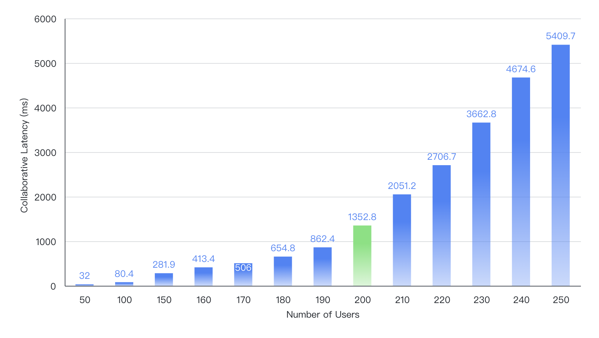

import { Callout } from 'nextra/components'
import BadgeGroup, { UniverTypes } from '@/components/BadgeGroup'

# 协同基准测试报告

<BadgeGroup values={[UniverTypes.GENERAL]} value={UniverTypes.GENERAL} />

## 引言

在当今快节奏的商业环境中，实时协作编辑已成为现代生产力应用不可或缺的核心功能。它让远程团队能够高效协作，共同完成创作和编辑任务。本报告深入评估了 Univer 协同引擎在处理多人实时协作编辑时的性能表现，并将其与市场上其他领先产品进行对比。

在论文《 Performance of real-time collaborative editors at large scale: User perspective 》中，提出了市场上流行的实时编辑服务中延迟性能测量。提出了**协同编辑人数**是影响实时编辑系统性能的主要因素，以下是主流实时编辑产品表现：

|                  | Office 365 | 腾讯文档 | 石墨文档 | Google Sheet | 飞书表格 |
|------------------|------------|----------|----------|--------------|----------|
| 协同编辑人数上限 | 365        | 200      | 200      | 200          | 200      |

注：上述数据截止于2022年。

## 介绍 Univer 协同引擎

为了更好理解测试过程，让我们简要介绍一下 Univer 协同引擎的实现方案。

Univer 协同引擎非常注重扩展性，已支持分布式方案。但为便于叙述，我们将暂时采用单机部署方案来描述。

Univer 协同引擎主要使用两种编程语言：Golang 和 JavaScript。

- Golang 擅长处理高并发和快速网络 I/O，使 Univer 协作引擎能够轻松处理大量客户端连接请求；

- JavaScript（Node.js）使得后端与前端之间的代码共享变得容易，并极大减少了处理冲突错误的可能性。同时也为未来服务器端计算和渲染奠定了重要基础。

Univer 使用 OT（操作转换）作为协同冲突处理的方案。

为了加快单个请求处理速度，协同引擎被设计为有状态服务，即每篇活跃文档在内存中都有一份最新的拷贝，客户端的编辑请求会迅速应用和写入。

有状态服务 Collaboration-server 采用 Node.js 实现，与前端编辑器共享相同的冲突处理代码，包括两个核心方法：

- Transform：实施表格或文档的 OT 算法，对 changeset 进行操作转换；

- Apply：将转换后的 changeset 应用到表格/文档。

无状态服务 Universer 使用 Golang 实现，主要负责调度和网络

- Comb：基于 WebSocket 实现房间服务，用于广播和分发协同事件；

- Snapshot：基于 EventSourcing 模式提供文档快照服务，并高效还原任意版本文档。

以下是用户编辑事件如何被协同引擎处理的过程：

> changeset 指的用户编辑后产生的一组变更，通常简称为 cs

## 性能测试

为全面评估 Univer 协同引擎的性能，我们精心设计了一系列测试，涵盖了关键指标和典型场景。

为方便叙述，介绍几个关键术语：

通俗讲，衡量协同体验最直接的指标是，A 的编辑多久后被 B 应用并展示。

这个过程涉及的变量很多，为简化压测过程，这里提取最关键的变量，并称为“协同延迟”。

<Callout emoji="⏰">
  定义 “协同延迟”

  changeset 从发送到被第一个客户端应用的时间差。
  协同延迟能有效地衡量 CS 的 transform，apply 的性能。
</Callout>

在当前协同引擎模型下，影响协同延迟的直接因素为 CS 的处理数量，不妨称为
协同并发数。

<Callout emoji="🚀">
  定义 CS QPS，“协同并发数”

  对同一篇文档 (unit) ，每秒提交的 Changeset 数量。
</Callout>

测试环境：

- ECS 配置为4核8GB内存

- 采用单机部署模式（docker compose）

预设条件：

- 每个客户端平均发送编辑事件频率约为0.15次每秒；

- 当协同编辑人数达到200时，协同并发数约为30（CS QPS=30）；

测量方法：

- 逐步增加协同编辑人数，观察并记录协同延迟情况；

- 测量总时长为 5 分钟；

预期结果：研究协同编辑人数与协同延迟 (pct99) 之间的关系。

测量结果：

{/* 视频较大，需要为 CDN 展示 */}
{/* TODO 这是多人协作在同一张表格中绘制图形的模拟效果 */}

## 总结

- 图表显示，在一台普通的 4 核 8GB 服务器上处理 200 个并发用户时，协同引擎协作延迟保持在约 1.3 秒左右；

- 随着协同编辑人数变多，协同延迟逐渐出现非线性的增长，下面是对其指数拟合：`y = 3.92e^(0.03x)`

凭借这些基准结果，Univer 协同引擎在实时协作中展现出不俗的性能，处理 200 个并发用户时，协同引擎成功将协作延迟保持在约 1.3 秒左右，接近业界主流产品水平。

同时随着协同人数增加，协同延迟出现指数增长的趋势。我们将继续改进引擎支持大量并发用户的能力，并尽量降低延迟。

## 下一步

本实验重点关注协同引擎外部的观测数据，如协同延迟和协同人数，然而当协同人数逐渐增多时，协同延迟出现较大幅度增长。分析其原因，需要增加更多的内部视角：如，随着人数增加，与 transform、apply 的处理延迟之间的关系；

此外，随着人数增加，网络吞吐量将成为一个关键因素。我们需要研究编辑人数、网络吞吐量和延迟之间的关系。

再者，多文档数量与延迟之间的关系。本研究仅对单个文档进行实验。在涉及多个文档时，在保持较低延迟的情况下，单个 Node.js 能够承载多少文档呢？由于 Node.js 的单线程特性极大地限制了其并发能力，在处理多个文档时，效率也会有所降低。

通过持续优化和创新，我们有信心让 Univer 协同引擎在实时协作领域脱颖而出，为用户带来更加流畅体验。
