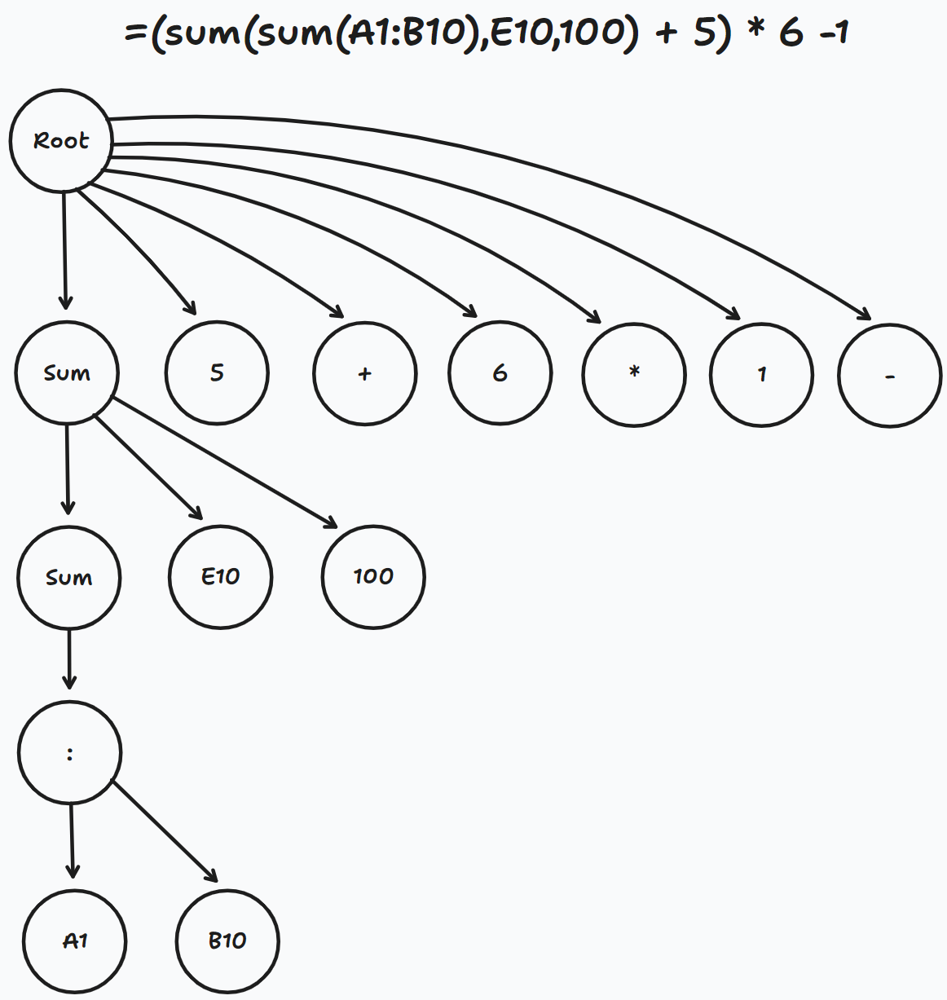
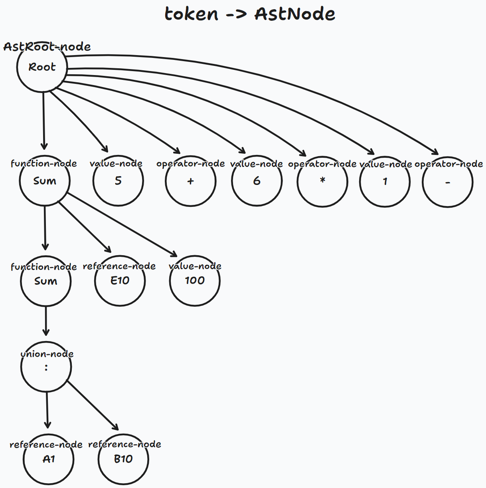

import BadgeGroup, { UniverTypes } from '@/components/BadgeGroup'

# Architecture of Formula Engine

<BadgeGroup values={[UniverTypes.GENERAL]} value={UniverTypes.GENERAL} />

Chapter outline discussing Univer's formula engine architecture, it is recommended to read the "[Overall Architecture](/guides/sheet/architecture/univer)" chapter first.

The primary objectives in designing the formula engine are:

1. Support Univer's various document types and related functionalities to connect to formulas
2. Provide a smooth user experience, supporting computation on [web worker](/guides/sheet/architecture/web-worker) and server side
3. Support advanced formula capabilities, aligned with features provided by Microsoft Office 365, including but not limited to:
	1. Sense formula execution status, support for stopping formula execution, support for loop reference detection and iteration calculation execution limit setting
	2. Let / lambda and other custom functions
	3. Supporting supertables, formulae, and naming ranges.

## Overall Architecture

The architecture diagram is presented as follows:


1. `Model`: Stores the initial formula data, such as location and formula string.
2. `Engine`: Responsible for syntactic and semantic analysis of the formula string, analyzing the dependencies between formulas, and more.
3. `Service`: Provides a formula computation environment, supports registering functions, and offers custom name, supertable, and formula scheduling services.
4. `Command` and `Controller`: Control the formula module coordination.
5. `Function`: Function implementation.

## Engine

The Engine is the core of the formula engine, providing the following capabilities:

* Dependency analysis, determining the order of execution for a set of formulas.
* Syntax and lexical analysis of each formula string, generating a syntax tree.
* Performing computation through the syntax tree.
* Providing basic operations for functions, including addition, subtraction, multiplication, and division, string concatenation, trigonometric functions, etc.

The Engine architecture is presented in the following figure:


### Lexer

The Lexer is responsible for the lexical analysis of the formula string. It matches tokens defined by the engine and generates nodes based on the rules, constructing a tree of `LexerNode` nodes. For example, `A1`, `B10`, `SUM` will all be recognized as `LexerNode`. The recognition of node types will be handled by the Parser. For instance:

```txt
=(sum(sum(A1:B10), E10, 100) + 5) * 6 - 1
```

The transformed `LexerNode` tree looks as follows:



After generating the `LexerNode` tree, the engine will call the conversion method, using [postfix notation](https://www.geeksforgeeks.org/evaluation-of-postfix-expression/) to replace the original infix expression, eliminating the parentheses in the computation. For example:

```typescript
( 3 + 4 ) * 5 - 6
```

Will be converted to:

```typescript
3 4 + 5 × 6 -
```

### Parser

The Parser's main responsibilities are to transform the `LexerNode` tree generated by the Lexer as follows, creating an `AstNode` tree:

1. Convert node names containing functions like `SUM` to `FunctionNode` formula nodes, and references like `E10` to `ReferenceNode` reference nodes, and operators like `+` to `OperatorNode` operation nodes.
2. Other node types include:
	1. `LambdaNode`, specific to lambda functions, for parametrization and wrapping as lambda-value-object
	2. `UnionNode`, merging `A1:B10` as RangeReference
	3. `PrefixNode`, recognizing `-` as a negative number and compatibility with `@` in older versions
	4. `SuffixNode`, recognizing `%` as percentage and `#` as shorthand for dynamic array formula range
	5. `ValueNode`, recognizing text, number, and logical value as the three basic types
3. Convert `let` to lambda execution
4. Inject parameters for lambda

The illustration of the transformed `LexerNode` tree to `AstNode` tree is as follows:



### Interpreter

Responsible for executing a single expression, recursively obtaining the return value by invoking the methods of the AST node, with the following main responsibilities:

1. Converting operators to meta functions and executing them, primarily including arithmetic and comparison operators
2. Instantiating characters, numbers, and Boolean values as `ValueObject`, and instantiating arrays as `ArrayValueObject`
3. Instantiating references as `ReferenceObject`, and calling the internal method to convert them to `ArrayValueObject`
4. Invoking specific functions to start the calculation, with the values received by the function being the base class `BaseValueObject`, and returning `ReferenceObject | BaseValueObject | AsyncValueObject`
5. Asynchronous calculations will be awaited for results in the upper layer and passed to the lower layer, so there is no need to write asynchronous methods in the function, just passing the Promise as a parameter to `AsyncValueObject` and returning
6. For INDIRECT, OFFSET, and other reference functions, return `ReferenceObject`.

BaseValueObject is a crucial operation type in the formula engine computation, with the following inheritance types:

#### NullValueObject

Representing a null value, treated as false or 0 when calculated with other value types. An `ErrorValueObject` is returned directly if unable to calculate.

#### ErrorValueObject

Representing an error, similar to Excel's #VALUE!, #NAME!, #REF!, etc. An `ErrorValueObject` can be returned directly in the function to represent a calculation error.

#### PrimitiveValueObject

Comprised of three basic value types: `NumberValueObject`, `StringValueObject`, and `BooleanValueObject`, each implementing their respective numeric calculation methods. The precision of the underlying computation is handled by [big.js](https://github.com/MikeMcl/big.js).

#### LambdaValueObject

Passing lambda functions as arguments to lower-level functions allows them to be applied in functions such as [MAKEARRAY](https://www.w3schools.com/python/numpy/numpy_array_slicing.asp) and [REDUCE](https://support.microsoft.com/en-au/office/reduce-function-42e39910-b345-45f3-84b8-0642b568b7cb).

#### ArrayValueObject

This is the core of matrix computation and can be computed with any `PrimitiveValueObject` or another `ArrayValueObject`. The calculation is demonstrated in the following figure:


It also supports calculations such as sum, average, min, max, std, var, power, and more. Furthermore, it has implemented capabilities like Numpy's [slice](https://www.w3schools.com/python/numpy/numpy_array_slicing.asp) and [filter](https://www.w3schools.com/python/numpy/numpy_array_filter.asp) for functions such as vlookup, xlookup, match, and others.

```typescript
export class Vlookup extends BaseFunction {
  override calculate(
    lookupValue: BaseValueObject,
    tableArray: BaseValueObject,
    colIndexNum: BaseValueObject,
    rangeLookup: BaseValueObject = new PrimitiveValueObject(false)
  ) {

    const colIndexNumValue = this.getIndexNumValue(colIndexNum);

    // Extract the first column of the tableArray
    const searchArray = (tableArray as ArrayValueObject).slice(0, 1);

    // Extract the column specified by colIndexNumValue
    const resultArray = (tableArray as ArrayValueObject).slice(colIndexNumValue - 1, colIndexNumValue);

    // Use the pick method of the resultArray to filter the matrix based on the lookupValue
    // Return the first result value found
    return resultArray.pick((searchArray as ArrayValueObject).isEqual(lookupValue) as ArrayValueObject).getFirstCell();
  }
}
```

In situations with a high number of formulas, `ArrayValueObject` implements a reverse index on the list to enhance iteration performance.


### Dependency

Responsible for formula dependency analysis, marking formulas that need to be calculated and outputting a queue of the marked formulas for execution.


As shown in the above image, when the content of cell A1 changes, the formulas in A2, A3, A4, A5 will be marked as dirty, and the marked formulas will undergo dependency analysis, resulting in the final output order of A2 -> A3 -> A5 -> A4.

If [INDIRECT / OFFSET](https://support.microsoft.com/en-us/office/indirect-function-474b3a3a-8a26-4f44-b491-92b6306fa261) -like reference functions are encountered, the Dependency module will call Lexer and Parser to perform pre-computation. This allows for the advance calculation of the reference range of these types of functions, which is then used to calculate their dependencies.

## Service

Provides various services for the computation process. Here are a few of the key services:

### IFormulaCurrentConfigService and IFormulaRuntimeService

Used for loading Univer data and storing temporary data for the formula execution process. The runtime returns all calculation results once the formula execution is complete.

### IFunctionService

Used for registering functions and their descriptions. Users can also register quick, custom functions through uniscript.

### IFeatureCalculationManagerService

Registers features in the sheet domain, such as pivot tables, conditional formatting, and data validation. For example, pivot tables:

1. Pivot tables can register a dependency range and a `getDirtyData` method.
2. After the dependency range is marked as dirty, the `getDirtyData` method is executed, implementing the calculation logic within the pivot table.
3. The `getDirtyData` method can return a dirty area and temporary data for the dirty area, which are used for further calculation dependent on the pivot table results. The final, correct result is obtained.

### IOtherFormulaManagerService

Registers formulas for doc and slide, which are non-table domains. These formulas are not dependent on sheet formulas, so they do not need to return dirty areas and temporary data.

### CalculateFormulaService

The core method for triggering formula calculation, which provides the following functions:

1. Circular dependency execution
2. Return of runtime status, including the total number of formulas executed and the number of completed formulas.
3. Secondary marking of array formulas as dirty, and their execution after the results are returned.
4. Uses `requestImmediateMacroTask` to avoid the 4ms limit of setTimeout, enabling formula execution in macro tasks and supporting termination of formula execution.
5. Formula execution time statistics.

## Function

Implemented with matrix calculation, reducing code size and centralizing core logic. This leads to more standardized function implementation and improved accuracy and quality.

The formula engine references Numpy's matrix operation concept, reducing the amount of code needed for function implementation and centralizing numerical computation, trigonometric function computation, and other core logic in `BaseValueObject`. This lays the groundwork for standardizing function implementation.

The following is an example of a Sum formula implementation:

```ts
export class Sum extends BaseFunction {
  override calculate(...variants: BaseValueObject[]) {
    // Initialize an accumulator variable for summing
    let accumulatorAll: BaseValueObject = new NumberValueObject(0);

    // The number of parameters for the Sum function is determined by the user. The following loop obtains and calculates.
    for (let i = 0; i < variants.length; i++) {
      let variant = variants[i];

      // If the input is a reference range like A1:B10, the upper layer will automatically convert it to an ArrayValueObject.
      if (variant.isArray()) {
        // Call the sum function on ArrayValueObject to sum the value of all ValueObjects
        variant = (variant as ArrayValueObject).sum();
      }

      // Call the numerical computation function Plus on ValueObject to perform the sum
      accumulatorAll = accumulatorAll.plus(variant);
    }

    return accumulatorAll;
  }
}
```
