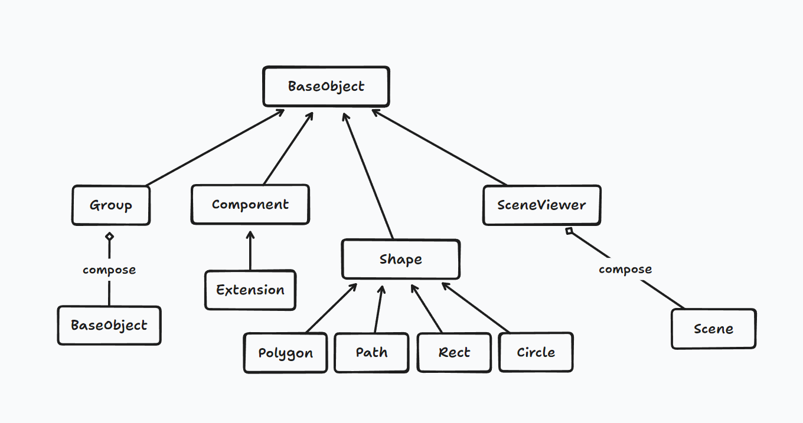
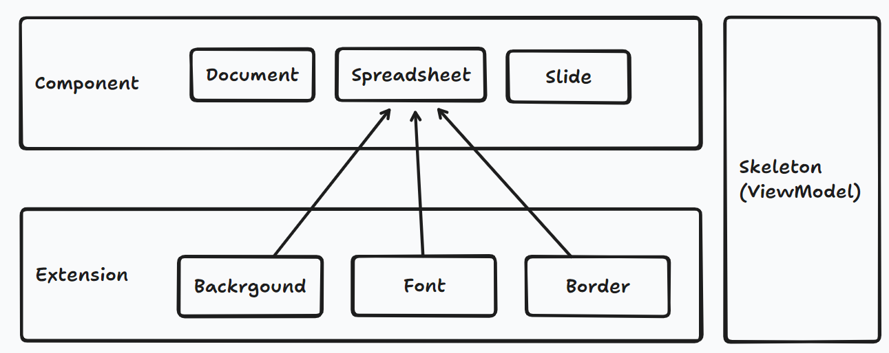
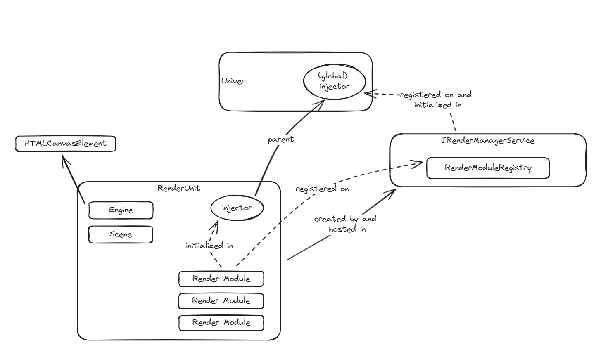

import BadgeGroup, { UniverTypes } from '@/components/BadgeGroup'

# Architecture of Rendering Engine

<BadgeGroup values={[UniverTypes.GENERAL]} value={UniverTypes.GENERAL} />

The rendering engine of Univer is inspired by KonvaJs / FabricJs and BabylonJs, and is implemented based on Canvas2D.

The purpose of designing the rendering engine is to integrate the rendering of documents, electronic spreadsheets, and presentations, and to reuse rendering capabilities while making their rendering interoperable. Therefore, in electronic spreadsheets, the typesetting and rendering of text within cells is completely reused from that of documents, so that cells support all typesetting capabilities of documents, and can maintain a consistent rendering effect in the cell editor.


## Overall Architecture

The rendering engine adopts an object-oriented approach, abstracting each element that needs to be drawn as an `Object`, and implementing a nested structure through elements such as `Group` and `SceneViewer`.

The overall architecture diagram is as follows:


## Engine

Manages the canvas instance (e.g. modifying the width and height of the canvas), provides an API to drive the scene for frame-by-frame drawing, and encapsulates the event mechanism for use by the lower layers.

## Scene

The Scene is the space where all rendering objects exist, and its area may exceed the size of the current Viewport (Engine).


The Scene needs to be added to the Engine, and an Engine can have multiple Scenes, which can be switched by `Engine.runRenderLoop` to render the current Scene.

```typescript
const engine = new Engine();
const scene = new Scene(SCENE_NAMESPACE, engine, { width, height });
engine.runRenderLoop(() => {
  scene.render();
});
```

Each Scene has its own event listener, and all rendering objects Object must be added to the Scene in order to be rendered.

```typescript
const spreadsheet = new Spreadsheet(SHEET_VIEW_KEY.MAIN);
const spreadsheetRowHeader = new SpreadsheetRowHeader(SHEET_VIEW_KEY.ROW);
const spreadsheetColumnHeader = new SpreadsheetColumnHeader(SHEET_VIEW_KEY.COLUMN);
const SpreadsheetLeftTopPlaceholder = new Rect(SHEET_VIEW_KEY.LEFT_TOP, {
  zIndex: 2,
  left: -1,
  top: -1,
  fill: 'rgb(248, 249, 250)',
  stroke: 'rgb(217, 217, 217)',
  strokeWidth: 1,
});

scene.addObjects([spreadsheet, spreadsheetRowHeader, spreadsheetColumnHeader, SpreadsheetLeftTopPlaceholder])
```

It is allowed to directly add events to the Scene, just like adding a global event to the document in DOM.

For example, you can add a MouseMove event to the scene like this:

```typescript
// Add a new MouseMove event to the scene
scene.onPointerMoveObserver.add((moveEvt: IPointerEvent | IMouseEvent) => {
  const { offsetX: moveOffsetX, offsetY: moveOffsetY } = moveEvt;
  /// ...
});
```

## Viewport

In order to support frozen scenes in electronic spreadsheets, the concept of Camera in BabylonJs is referenced, and the position and width and height of the Viewport can be set to specify which part of the Scene to render.

As shown in the following figure, a spreadsheet in a normal state has 4 Viewports, each corresponding to the top-left corner's selection box, row headers, column headers, and the main content area. Only a ScrollBar is added to the main content area. When row and column freezing is supported, the number of Viewports may increase to 9. If row footer freezing is also supported, the number of Viewports will further increase to 12.


Here's an example of adding a Viewport:

```typescript
// Create a viewport and add an scrollbar.
const viewMain = new Viewport(VIEWPORT_KEY.VIEW_MAIN, scene, {
  left: rowHeader.width,
  top: columnHeader.height,
  bottom: 0,
  right: 0,
  isWheelPreventDefaultX: true,
});

new ScrollBar(viewMain);
```

Indeed, during rendering, the Viewport also propagates its own viewport information to the Objects that require rendering, allowing for the exclusion of rendering Objects outside of its own viewport. This can optimize rendering performance and improve efficiency.

## Layer

The `Layer` design refers to Konva, but developers do not need to manually create `Layer`s. The rendering engine will automatically create `Layer`s through the `Scene` method. You can choose whether to enable caching for the `Layer` layer. This can improve performance when there are many elements, but the browser has a total area limit for canvas. Therefore, Univer requires users to specify which layer's caching to open.

```typescript
class Scene {
  // When adding an object to the `Scene`, the `Scene` will determine if a new `Layer` is needed
  addObject(o: BaseObject, zIndex: number = 1): this {
    this.getLayer(zIndex)?.addObject(o);
    return this;
  }

  getLayer(zIndex: number = 1): Layer | undefined {
    for (const layer of this._layers) {
      if (layer.zIndex === zIndex) {
        return layer;
      }
    }
    return this._createDefaultLayer(zIndex);
  }

  // Enable caching for the specified `Layer` by calling the `scene` method
  enableLayerCache(...layerIndexes: number[]): this {
    layerIndexes.forEach((zIndex) => {
      this.getLayer(zIndex)?.enableCache();
    });
    return this;
  }
}
```

An `Object` is attached to a `Layer`, and each `Layer` has an off-screen `canvas` as a cache. As long as the layer is not "dirty", the cached content will be directly copied onto the canvas.

## Object

It is essential that all objects requiring rendering extend from the `BaseObject` class:



### Shape

`Shape` implements basic shapes, such as `Circle`, `Rect`, `Path`, and `Polygon`, with static functions to make them easily usable by other objects.

Here is an example of a `Rect` shape:

```typescript
export class Rect<T extends IRectProps = IRectProps> extends Shape<T> {
  private _radius: number = 0;

  constructor(key?: string, props?: T) {
    super(key, props);

    if (props?.radius) {
      this._radius = props.radius;
    }
  }

  static override drawWith(ctx: UniverRenderingContext, props: IRectProps | Rect) {
    let { radius, width, height } = props;

    radius = radius ?? 0;
    width = width ?? 30;
    height = height ?? 30;

    ctx.beginPath();

    if (props.strokeDashArray) {
      ctx.setLineDash(props.strokeDashArray);
    }

    ctx.rect(0, 0, width, height);

    ctx.closePath();
    this._renderPaintInOrder(ctx, props);
  }

  protected override _draw(ctx: UniverRenderingContext) {
    Rect.drawWith(ctx, this);
  }
}
```

### Component

To render more complex objects, such as spreadsheets, documents, and slides, in order to handle complex rendering logic, Univer has designed a ViewModel layer called Skeleton, which is responsible for handling calculated layout data and providing canvas-coordinate-to-Component-internal-coordinate conversion. An Extension is responsible for rendering a specific part of a Component and can be injected with user logic to alter rendering behavior, such as data validation, conditional formatting, or cell images.



For instance, when drawing a spreadsheet content area, three components must be considered: background color, text, and borders, which results in 3 extensions that accept SpreadsheetSkeleton as input and render each cell based on the provided layout information.

Components support using a canvas as a buffer for caching and offscreen rendering, which significantly improves performance, especially during scrolling. The rendering engine currently only draws incremental views when scrolling the sheet.


## RenderUnit

To support rendering multiple documents within a single Univer, we introduced the `RenderUnit` mechanism in our architecture.



Each `RenderUnit` is responsible for rendering a document and holds:

- An `Engine` instance
- A `Scene` instance
- A `UnitModel` instance, which could be a document, spreadsheet, or slide document model
- An `Injector` instance, used to instantiate `IRenderModule`s which are specifically for rendering and interaction logic. This injector allows the `RenderUnit` to independently handle rendering and interaction logic without interfering with other `RenderUnit`s.

### `IRenderModule`

If you would like to implement rendering-related business logic, you need to implement a class that implements the `IRenderModule` interface and register it with the `IRenderManagerService`. For example:

```ts
export class UniverSheetsUIPlugin extends Plugin {
    private _registerRenderBasics(): void {
        ([
            [SheetSkeletonManagerService],
            [SheetRenderController],
            [ISheetSelectionRenderService, { useClass: SheetSelectionRenderService }],
        ] as Dependency[]).forEach((m) => {
            this.disposeWithMe(this._renderManagerService.registerRenderModule(UniverInstanceType.UNIVER_SHEET, m));
        });
    }
}
```

When registering, you need to associate the `IRenderModule` with its corresponding document type, i.e. `UniverInstanceType`. When initializing a `RenderUnit`, the `IRenderModule` dependencies are obtained from the `IRenderManagerService` based on the `UniverInstanceType` of the document.

The `IRenderModule` constructor's first parameter is an object that satisfies `IRenderContext`, which includes the following properties:

- `engine`: `Engine` instance
- `scene`: `Scene` instance
- `unit`: `UnitModel` instance
- `unitId`: `UnitModel` id

Via these properties, `IRenderModule` can easily obtain the resources needed for rendering, without the need to (and should not) inject `IUniverInstanceService` and `IRenderManagerService` modules.

In addition to `IRenderContext`, `IRenderModule` can obtain other `IRenderModule`s through dependency injection. Since the `Injector` in `RenderUnit` is a child node of the global `Injector`, `IRenderModule` can also inject global modules. For example:

```ts
export class RefSelectionsRenderService extends BaseSelectionRenderService implements IRenderModule {
    constructor(
        private readonly _context: IRenderContext<Workbook>, // render context
        @Inject(Injector) injector: Injector, // injected by the injector of RenderUnit
        @Inject(ThemeService) themeService: ThemeService, // global dependency
        @IShortcutService shortcutService: IShortcutService, // global dependency
        @Inject(SheetSkeletonManagerService) sheetSkeletonManagerService: SheetSkeletonManagerService, // injected by the injector of RenderUnit
        @IRefSelectionsService private readonly _refSelectionsService: SheetsSelectionsService // global dependency
    ) {
      // ...
    }
}
```

Under certain circumstances, you may need to obtain an `IRenderModule` from a global module. In this case, you can obtain the `RenderUnit` from the `IRenderManagerService` and call the `with` method, for example:

```ts
renderManagerService.getRenderById(unitId)?.with(DocSkeletonManagerService);
```
