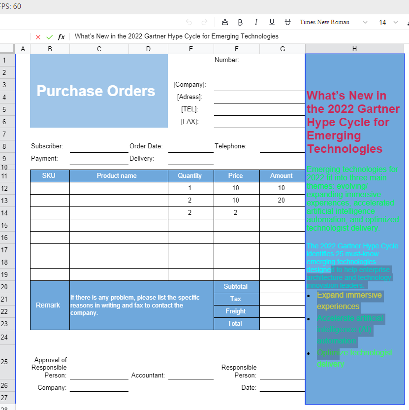
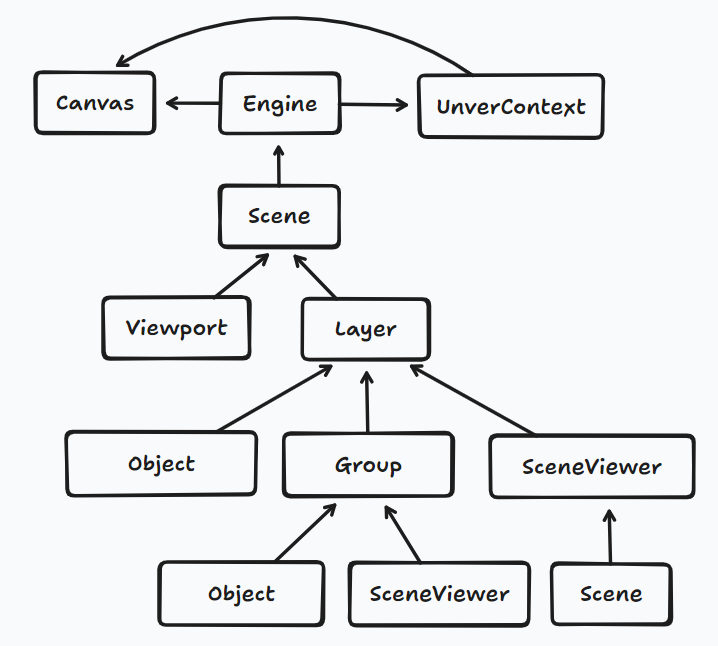
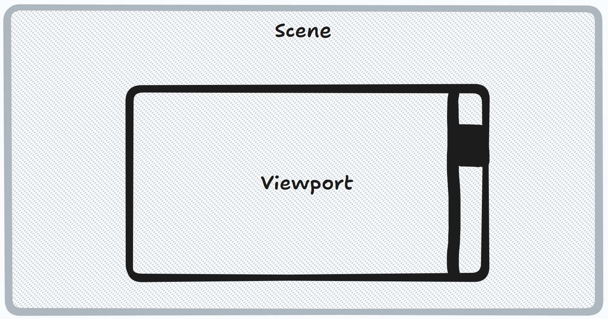
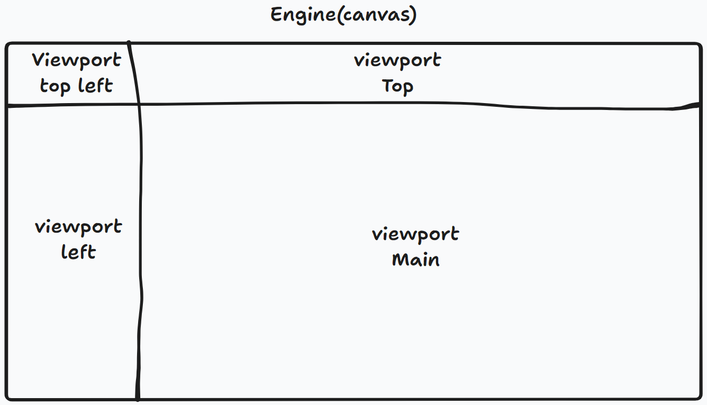
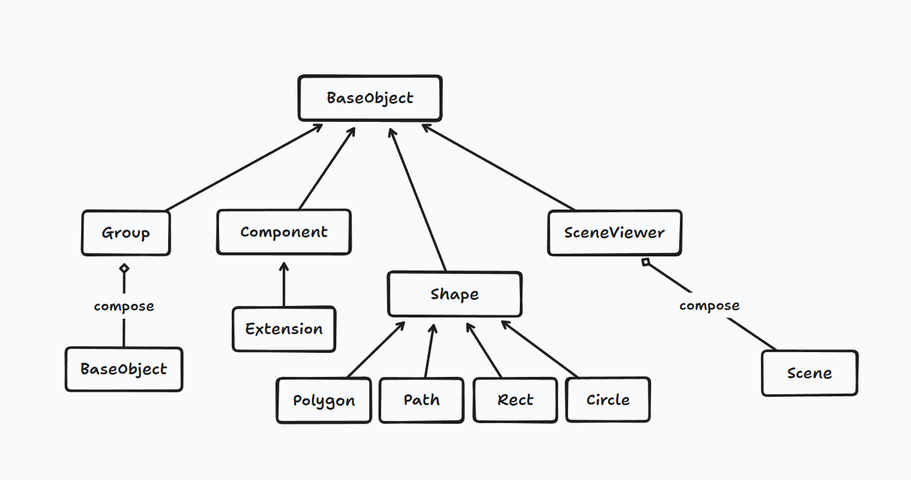
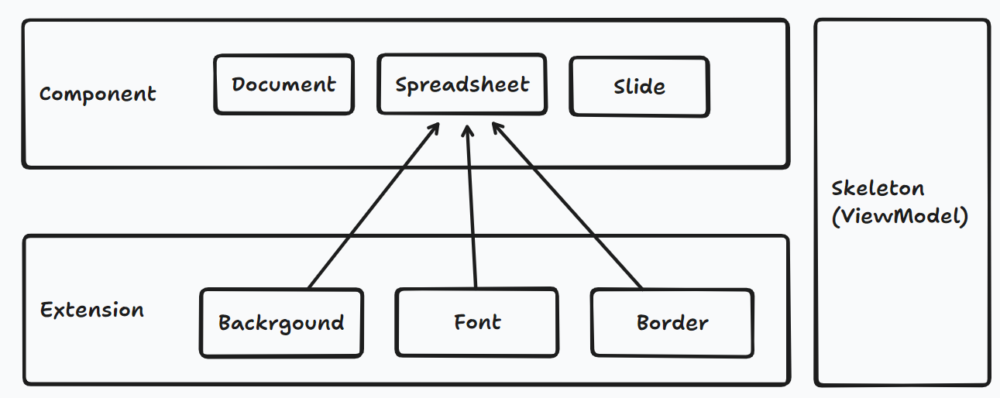
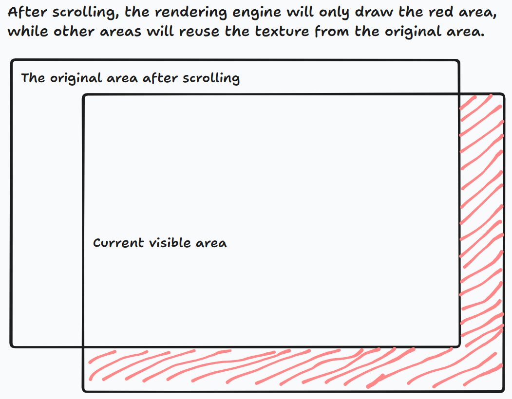
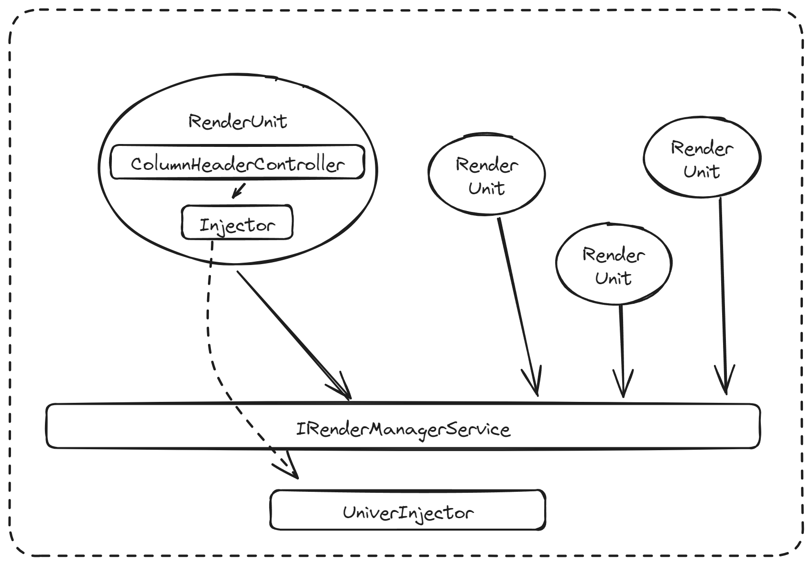

import BadgeGroup, { UniverTypes } from '@/components/BadgeGroup'

# 渲染引擎架构设计

<BadgeGroup values={[UniverTypes.GENERAL]} value={UniverTypes.GENERAL} />

Univer 的渲染引擎参考了 KonvaJs / FabricJs 以及 BabylonJs，基于 Canvas2D 实现。

渲染引擎设计的目的是整合文档、电子表格和幻灯片的渲染，复用渲染能力并让它们的渲染可以相互嵌套。在电子表格中，单元格内文本的排版和渲染与文档的排版和渲染完全复用，所以单元格支持文档的所有排版能力，并且能够在单元格编辑器中保持完全一致的渲染效果。



## 整体架构

渲染引擎采取面向对象的思路，把每一个需要绘制的元素抽象为 `Object`，并且通过 `Group` `SceneViewer` 等元素实现嵌套结构。

整体架构图如下：



## Engine

管理 canvas 实例（例如修改 canvas 画布的宽高），提供 API 驱动 scene 进行逐帧绘制，封装事件机制提供给下层使用。

## Scene

Scene 是所有渲染对象存在的空间，它的面积可能超过当前 Viewport (Engine) 的大小。



Scene 需要添加到 Engine 中去，一个 Engine 可以有多个 Scene，可以通过 `Engine.runRenderLoop` 切换当前需要渲染的 Scene。

```typescript
const engine = new Engine();
const scene = new Scene(SCENE_NAMESPACE, engine, { width, height });
engine.runRenderLoop(() => {
  scene.render();
});
```

每个 Scene 有自己的事件监听，并且所有的渲染对象 Object 都要加入到 Scene 才能被渲染。

```typescript
const spreadsheet = new Spreadsheet(SHEET_VIEW_KEY.MAIN);
const spreadsheetRowHeader = new SpreadsheetRowHeader(SHEET_VIEW_KEY.ROW);
const spreadsheetColumnHeader = new SpreadsheetColumnHeader(SHEET_VIEW_KEY.COLUMN);
const SpreadsheetLeftTopPlaceholder = new Rect(SHEET_VIEW_KEY.LEFT_TOP, {
  zIndex: 2,
  left: -1,
  top: -1,
  fill: 'rgb(248, 249, 250)',
  stroke: 'rgb(217, 217, 217)',
  strokeWidth: 1,
});

scene.addObjects([spreadsheet, spreadsheetRowHeader, spreadsheetColumnHeader, SpreadsheetLeftTopPlaceholder])
```

可以对 Scene 直接添加事件，就像在 DOM 中为 document 添加一个全局事件一样。

```typescript
// 为 scene 新增一个 MouseMove 事件
scene.onPointerMoveObserver.add((moveEvt: IPointerEvent | IMouseEvent) => {
  const { offsetX: moveOffsetX, offsetY: moveOffsetY } = moveEvt;
  /// ...
});
```

## Viewport

为了支持电子表格中冻结的场景，参考了 BabylonJs 的 Camera 概念，可以设置 Viewport 的位置和宽高来指定渲染 Scene 的哪个部分。

如下图所示，电子表格在常规状态下，会有 4 个 Viewport，分别对应左上方的全选块，行标题，列标题以及主内容区，只为主内容区添加 ScrollBar。在行列冻结的情况下，Viewport 会多达 9 个。若再支持行尾冻结，则会增加到 12 个。



添加一个 Viewport 的例子如下：

```typescript
// 为 Scene 新增一个 Viewport 并且添加一个滚动条
const viewMain = new Viewport(VIEWPORT_KEY.VIEW_MAIN, scene, {
  left: rowHeader.width,
  top: columnHeader.height,
  bottom: 0,
  right: 0,
  isWheelPreventDefaultX: true,
});

new ScrollBar(viewMain);
```

Viewport 也会在渲染时会把自己所在的视口信息向需要渲染的 Object 传递，可以避免渲染视口之外的 Object。

## Layer

Layer 参考了 Konva 的设计，但开发者不需要手动创建 Layer，渲染引擎会通过 Scene 的方法自动创建 Layer。可以选择是否开启 Layer 层的缓存，在元素比较多的情况下会带来性能提升，但浏览器对 canvas 有总面积的限制，所以 Univer 需要用户指定打开哪些层的缓存。

```typescript
class Scene {
  // Scene 在添加 object 的时候会判断是否需要新建 Layer
  addObject(o: BaseObject, zIndex: number = 1) {
    this.getLayer(zIndex)?.addObject(o);
    return this;
  }

  getLayer(zIndex: number = 1) {
    for (const layer of this._layers) {
      if (layer.zIndex === zIndex) {
        return layer;
      }
    }
    return this._createDefaultLayer(zIndex);
  }

  // 调用 scene 的方法开启指定 layer 的缓存
  enableLayerCache(...layerIndexes: number[]) {
    layerIndexes.forEach((zIndex) => {
      this.getLayer(zIndex).enableCache();
    });
  }
}
```

Object 会挂到 Layer 上，并且 Layer 会有一个离屏 canvas 作为缓存，当层非脏时，会直接复制缓存内容到画布上。

## Object

所有需要绘制的对象都需要继承 `BaseObject`：



### Shape

Shape 实现基本的形状，比如 Circle、Rect、Path、Polygon，并且画法都用静态函数实现，方便被其他 object 使用。

基本形状里封装了绘制原语，例如一个 Rect 形状的类实现如下：

```typescript
export class Rect<T extends IRectProps = IRectProps> extends Shape<T> {
  private _radius: number = 0;

  constructor(key?: string, props?: T) {
    super(key, props);

    if (props?.radius) {
      this._radius = props.radius;
    }
  }

  static override drawWith(ctx: UniverRenderingContext, props: IRectProps | Rect) {
    let { radius, width, height } = props;

    radius = radius ?? 0;
    width = width ?? 30;
    height = height ?? 30;

    ctx.beginPath();

    if (props.strokeDashArray) {
      ctx.setLineDash(props.strokeDashArray);
    }

    ctx.rect(0, 0, width, height);

    ctx.closePath();
    this._renderPaintInOrder(ctx, props);
  }

  protected override _draw(ctx: UniverRenderingContext) {
    Rect.drawWith(ctx, this);
  }
}
```

### Component

为了绘制更加复杂的对象，也就是电子表格、文档和幻灯片等，为了应对复杂的渲染逻辑，Univer 设计了一层名为 Skeleton 的 ViewModel，它们负责处理计算后的排版数据，提供 canvas 坐标与 Component 内部坐标的转换。Extension 会负责具体渲染 Component 的某个部分，可以由用户注入逻辑改变渲染行为，例如完成数据验证、条件格式、单元格图片等功能。



以电子表格为例。要绘制电子表格内容区域，需要考虑三个部分，背景色、文字、边框线，所以这里有 3 个 extension，他们接受 SpreadsheetSkeleton 作为输入，根据其提供的布局信息来按单元格进行绘制。

Component 支持用 canvas 作为缓存，进行贴图缓存绘制。目前在滚动 sheet 的时候，渲染引擎只会绘制增量部分的视图，极大提升了性能。



## Render Unit



为了支持注销和创建不同的 unit，以及在未来支持多个 unit 同时渲染，Univer 提出了 `RenderUnit` 的概念，一个 unit 对应一个 `RenderUnit`。`RenderUnit` 内部会持有一个 `Injector`，用户注册的 render controller 会被 Univer 在这个 `Injector` 当中实例化。Render controller 负责一个 unit 对于某个功能的渲染逻辑，它需要继承 `IRenderController` 接口。
