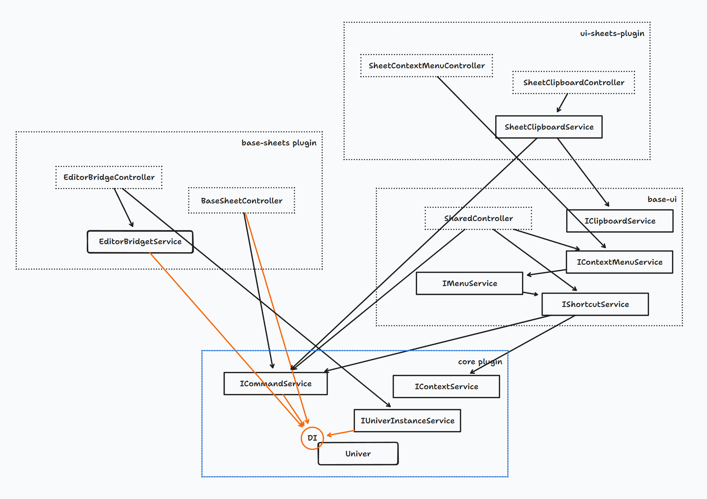
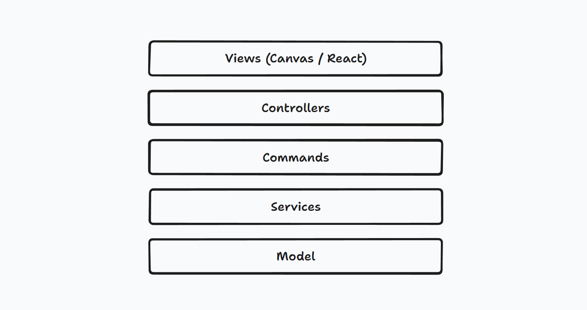

import { Callout } from 'nextra/components'
import BadgeGroup, { UniverTypes } from '@/components/BadgeGroup'

{/* This is out of date with the Chinese version. It should be updated. */}

# Univer Architecture

<BadgeGroup values={[UniverTypes.GENERAL]} value={UniverTypes.GENERAL} />

This document introduces the overall architecture of Univer. If you want to contribute code to Univer or write your own plugins, this document will help you.

## Building Blocks of Univer

The basic elements of Univer's architecture are **modules** and **plugins**.

## Plugins



Univer's functionality is organized into plugins, with multiple plugins combining to form a single Univer application. For example, `@univerjs/ui` provides basic UI capabilities, `@univerjs/sheets` provides data capabilities for spreadsheets, and `@univerjs/sheets-ui` provides UI capabilities for spreadsheets.

The plugin architecture offers the following advantages to Univer:

1. **Composable**: You can choose which plugins to load based on your actual needs, customizing a Univer application that suits you.
2. **Customizable**: You can develop your own plugins to meet specific requirements without changing Univer's core code.
3. **Isomorphic**: Regardless of the environment in which Univer runs—browser, Electron, Node.js, web worker, test runner—you can adapt to different environments by loading different plugins. For example, in the Node.js environment, UI-related plugins can be avoided to prevent errors caused by accessing DOM-related APIs, reduce package size, and reduce memory usage.
4. **Maintainable**: By distinguishing between plugins, the responsibilities and dependencies of Univer's modules are clearer, reducing coupling between features and making the code easier to understand, modify, test, and maintain.

### How to Divide Plugins?

Plugin division is quite flexible, and you can have your own set of methods. However, here are some methods used by the Univer core team:

- Whether there are modules that need to be loaded in environment A but not in environment B, if such modules exist, these modules are suitable for placement in a separate plugin. For example, UI-related parts of spreadsheets are split into `@univerjs/sheets-ui` because they do not need to be loaded in Node.js, while the core capabilities covering data and operations are placed in `@univerjs/sheets` because they need to be loaded in any environment. This classification method is very common in Univer source code.
- Divide according to different document types, such as `@univerjs/sheets` and `@univerjs/docs` are divided according to document types.
- Some complex functions can be divided into separate plugins, such as `@univerjs/sheet-find-replace`, which provides search and replace functionality.
- Some common underlying capabilities can be divided into separate plugins, such as `@univerjs/design`, which provides design system-related capabilities such as themes, colors, and components, and `@univerjs/rpc`, which provides RPC capabilities.

### Plugin Types

Univer distinguishes between different types of plugins, which currently include the following types, each corresponding to a document type:

- `UniverInstanceType.UNIVER` Univer core plugins, which provide Univer's core capabilities and capabilities shared by other types of plugins.
- `UniverInstanceType.UNIVER_DOC` Document type plugins
- `UniverInstanceType.UNIVER_SHEET` Spreadsheet type plugins
- `UniverInstanceType.UNIVER_SLIDE` Slide type plugins

<Callout type="info" emoji="🚀">
  By distinguishing between plugin types, we better control the lifecycle of plugins.
</Callout>

### Plugin Dependencies

Plugins may have dependencies on each other. When writing plugins, you can declare dependencies between plugins using the `DependentOn` decorator. When constructing plugins, Univer automatically registers and constructs dependencies if it finds that the required plugins have not been registered.

For example, if the `@univerjs/sheets-ui` plugin depends on the `@univerjs/sheets` plugin, you can write it like this:

```ts
@DependentOn(UniverSheetsPlugin, UniverUIPlugin)
export class UniverSheetsUIPlugin extends Plugin {
}
```

### Plugin Lifecycle

Plugins have a lifecycle, and by using the lifecycle, developers can better predict the behavior of plugins, thereby avoiding timing-related logic errors.

There are several stages in the lifecycle of a Univer plugin:

- `Starting` The first lifecycle of the plugin mounted on the Univer instance, in which the plugin should add its own module to the dependency injection system.
- `Ready` The first business instance of Univer has been created, and the plugin can do most of the initialization work in this lifecycle.
- `Rendered` The first rendering has been completed, and the plugin can perform the necessary rendering and DOM initialization work in this lifecycle.
- `Steady` Triggered after a period of time in `Rendered`, the plugin can perform non-first-screen work in this lifecycle to improve loading performance.

Accordingly, there are four lifecycle hooks on the `Plugin` type, and each plugin can execute corresponding logic in each lifecycle by overriding these methods.

```typescript
export abstract class Plugin {
  onStarting(): void {}
  onReady(): void {}
  onRendered(): void {}
  onSteady(): void {}
}
```

Other than using lifecycle hooks, you can also use decorators to listen to lifecycle events.

```typescript
export class YourService {
  constructor(
        @Inject(LifecycleService) private _lifecycleService: LifecycleService,
  ) {
    super()

    this._lifecycleService.lifecycle$.subscribe(stage => this._initModulesOnStage(stage))
  }
}
```

Different types of plugins will start their lifecycle at different times. `UniverInstanceType.UNIVER` plugins will be built immediately upon registration and enter the `Starting` lifecycle, while other types of plugins will be built and go through the lifecycle when the corresponding type of file is created for the first time, allowing Univer to initialize plugins at the most appropriate time to improve loading performance.

## Modules

Inside a plugin, modules are further divided into UI components, controllers, services, models, etc. Each module has its own responsibilities, but they all share one thing in common: they are only responsible for a specific domain.

### Dependency Injection

Modules can be added to Univer's dependency injection system to build dependencies. Univer can automatically resolve the dependencies between these modules and instantiate them, greatly reducing the complexity of managing dependencies in a complex system. It is recommended that plugins add their modules to the dependency injection system in the `onStarting` lifecycle.

<Callout type="info" emoji="ℹ️">
  We use the dependency injection tool [redi](https://redi.wendell.fun/en-US) in Univer, you can refer to the redi documentation to understand the basic concepts of dependency injection and how to use it. 
</Callout>

### Public and Private Modules

If a plugin wants to expose some APIs to other plugins, the plugin can export the dependency injection identifiers of the corresponding modules in its export file (index.ts), and these modules become public modules. Other plugins can import these identifiers to establish dependencies on these modules. Conversely, if a module is not exported, it is a private module.

By dividing modules into public and private, plugins can better control the visibility of modules, thereby avoiding the abuse of their own capabilities by other plugins.

### Overriding Modules Inside Plugins

Some plugins support overriding modules inside the plugin. These plugins have a `override` field in their configuration object, which can be used to override modules inside the plugin, and `null` can be passed to prevent Univer from loading this module. In the [hierarchical dependency injection system](https://redi.wendell.fun/docs/hierarchy), by overriding the module to `null`, the dependency injection system of Univer can use the implementation of the parent injector.

### Translate the following section from Chinese to English

### Divide Modules by Layers on the Architecture



A module should belong to one of the following layers:

- View: handles rendering and interaction, including Canvas rendering and React components
- Controllers: encapsulate business logic (especially functional logic), dispatch commands, etc.
- Command: executes logic through the command pattern, modifying the state or data of the lower layers such as Service / Model
- Service: encapsulates functionality according to concerns for upper-level modules to use, stores application internal state, operates on underlying data, etc.
- Model: stores data

In the hierarchy, the layers should maintain a one-way dependency relationship, except for some Controllers that may hold references to UI layer objects as view-models in MVVM, other layers are prohibited from referencing code from upper-level modules.

<Callout type="info" emoji="ℹ️">
  If you use Univer CLI to initialize plugins, Univer CLI will help you divide directories.
</Callout>

### Divide Modules by Separation of Concerns

There is a layer named service in the layered architecture of Univer, and the modules in this layer are called services. Their responsibility is to encapsulate some common functions. Univer encourages the use of the principle of [separation of concerns](https://en.wikipedia.org/wiki/Separation_of_concerns) to encapsulate functions into different services, making services more focused on a specific domain, and easier to understand, modify, test, and maintain. For example, `@univerjs/sheets-ui` has the `IShortcutService` for managing shortcuts, the `IMenuService` for managing menus, and so on.

The benefits of using the separation of concerns principle to divide modules are:

- Reducing the complexity of modules and the coupling between modules.
- Improving the understandability, maintainability, and testability of modules.
- Making modules easier to test.

### Divide Modules by Abstract Dependency Principle

When encapsulating services, the abstract dependency principle can be used to abstract the dependencies of services into interfaces.

The abstract dependency principle is mainly used to deal with the differences between different runtime environments. For example, for the clipboard service, you can directly use the `navigator.clipboard` API in the browser environment, while in the mobile environment, you can access the system clipboard through the JSBridge method. To solve this problem, the dependency of the clipboard service can be abstracted into the `IClipboardService` interface, then implemented as `BrowserClipboardService` in the browser environment, and implemented as `MobileBridgeClipboardService` in the mobile environment. Both implement `IClipboardService`, shielding the differences in the underlying clipboard implementation from the upper-level copy-paste features.

### Initialize Modules at the Right Time

Modules registered in the dependency injector will be initialized when they are first referenced, so you need to manually activate modules that will not be referenced by other modules. The way to do this is to get a module from the dependency injector in the plugin's lifecycle hook, which will trigger the initialization of the module.

```ts
class MyPlugin extends Plugin {
  onReady(): void {
    this._injector.get(MyService);
  }
}
```

## Command System

In Univer, changes to application state and data need to be executed through the command system. The command system itself is an abstraction and logging of application logic.

`@univerjs/core` provides a command service, and plugins can encapsulate business logic in commands. During the execution of a command, other modules can be obtained through the dependency injection system to implement business logic.

Plugins can register commands through the `registerCommand` interface provided by `ICommandService` and execute commands through the `executeCommand` method.

There are three types of commands in Univer:

- `COMMAND`: Responsible for creating, orchestrating, and executing `MUTATION` or `OPERATION` according to specific business logic. For example, a **delete row `COMMAND`** will generate a **delete row `MUTATION`**, an **insert row `MUTATION`** for undo, and a **set cell content `MUTATION`**.
  - `COMMAND` is the main carrier of business logic. If different underlying behaviors need to be triggered according to the application state for a _user operation behavior_—for example, when a _user clicks the bold text button_ and needs to determine the _effective range of the bold operation_ according to the current selection range—such judgment should be completed by `COMMAND`.
  - Can dispatch other `COMMAND` `OPERATION` `MUTATION`
  - Allows asynchronous execution
- `MUTATION` is the change made to the data saved to snapshot, such as inserting rows and columns, modifying cell content, modifying filter ranges, etc. If you want to add collaborative editing capabilities to Univer, it is the smallest unit of conflict resolution.
  - No further dispatch of any commands
  - **Must be executed synchronously**
- `OPERATION` is the change made to data that is not saved to snapshot, without conflict resolution, such as modifying scroll position, modifying sidebar state, etc.
  - No further dispatch of any commands
  - **Must be executed synchronously**

### Listen to Commands

`ICommandService` provides an event listening interface, and plugins can listen to which commands have been executed and what parameters have been executed. In fact, an object like this will be dispatched after the command is executed:

```typescript
/**
 * The command info, only a command id and responsible params
 */
export interface ICommandInfo<T extends object = object> {
  id: string

  type: CommandType

  /**
   * Args should be serializable.
   */
  params?: T
}
```

By listening to the execution of events, you can extend the capabilities of Univer in a non-intrusive way, such as:

- **Collaborative Editing**: A collaborative editing plugin can listen to all `MUTATION` type commands and send the `MUTATION` to other collaborative clients through a collaborative editing algorithm, then re-execute these `MUTATION` through `ICommandService`.
- **Collaborative Cursor**: Listen to selection changes `OPERATION` and send them to other clients, which can draw collaborative cursors by parsing parameters.
- **Live Share**: Listen to scroll and zoom `OPERATION` and send them to the audience, allowing the audience to synchronize the presenter's browsing position.
- Operation recording

and things like that.

## Further Reading

You can read the following sections to learn about the architecture design of Univer subsystems:

- [Formula](/guides/sheet/architecture/formula)
- [Rendering](/guides/sheet/architecture/rendering)
- [Web Worker](/guides/sheet/architecture/web-worker)
