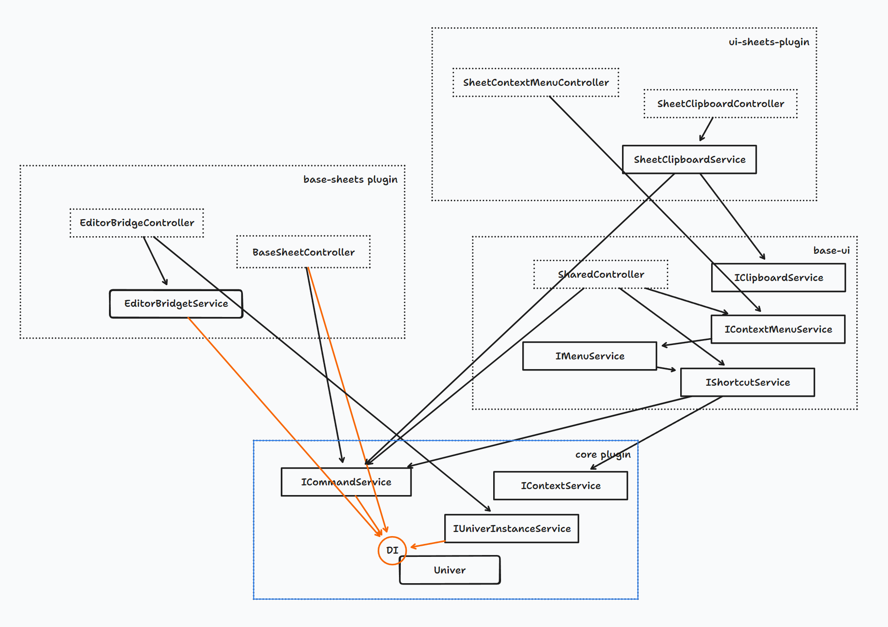

import { Callout } from 'nextra/components'
import BadgeGroup, { UniverTypes } from '@/components/BadgeGroup'

# Univer 架构

<BadgeGroup values={[UniverTypes.GENERAL]} value={UniverTypes.GENERAL} />

这篇文档介绍 Univer 的整体架构。如果你想要向 Univer 提交代码，或者是编写自己的插件，那么这篇文档将会对你有所帮助。

## Univer 的基本元素

Univer 架构的基本元素是**模块**和**插件**。

## 插件



Univer 功能以插件（plugin）为组合单元，多个插件组合成为一个 Univer 应用。例如：`@univerjs/ui` 提供基础 UI 能力，`@univerjs/sheets` 插件提供了表格文档的数据能力，`@univerjs/sheets-ui` 插件提供了表格的 UI 能力。

插件化架构为 Univer 带来这些以下优势：

1. **可组合**：你可以按照实际需要选择加载哪些插件，从而定制出适合自己的 Univer 应用。
2. **定制化**：自行开发插件满足特定的需求而不必更改 Univer 本身的代码。
3. **同构性**：无论是在什么环境里运行 Univer ——浏览器、Electron、Node.js、web worker、test runner ——都可以通过加载不同的插件来适配不同的环境。同时还能减少冗余代码带来的开销。例如在 Node.js 环境下不加载 UI 相关的插件，这样就可以避免访问 DOM 相关的 API 导致的错误，也可以降低包体积和内存占用。
4. **可维护性**：插件化架构可以让 Univer 各个模块的职责及依赖关系更加明确，减少功能之间的耦合，从而使代码更易于理解、修改、测试和维护。

### 如何划分插件？

插件的划分是相当灵活的，你完全可以有自己的一套办法。不过以下是我们 Univer 核心团队所使用的一些办法：

- 是否存在某些“在 A 环境下需要加载而在另一环境 B 下不需要加载”的模块，如果存在这样的模块，这些模块适宜放在一个单独的插件中。例如 Node.js 中不需要加载 UI 相关的模块，因此电子表格中和 UI 相关的部分被拆分到 `@univerjs/sheets-ui` 中，而涵盖数据和操作的核心能力由于在任何环境下都需要加载，因此放在 `@univerjs/sheets` 中。这种分类方法在 Univer 源码中非常常见。
- 按照不同的文档类型划分，例如 `@univerjs/sheets` 和 `@univerjs/docs` 就是按照文档类型划分的。
- 一些复杂的功能可以单独划分成一个插件，例如 `@univerjs/sheets-find-replace` 就是一个单独的插件，它提供了查找替换功能。
- 一些通用的底层能力可以单独划分成一个插件，例如 `@univerjs/design` 提供设计系统相关的能力，例如主题、颜色、组件等等、`@univerjs/rpc` 提供 RPC 能力等等。

### 插件的类型

Univer 对插件的类型做了区分，目前有以下几种类型，和文档的类型一一对应：

- `UniverInstanceType.UNIVER` Univer 核心插件，它们提供了 Univer 的核心能力，以及被其他类型的插件所共用的能力。
- `UniverInstanceType.UNIVER_DOC` 文档类型插件
- `UniverInstanceType.UNIVER_SHEET` 电子表格类型插件
- `UniverInstanceType.UNIVER_SLIDE` 幻灯片类型插件

<Callout type="info" emoji="🚀">
  通过区分插件类型，我们更好地控制插件的生命周期。
</Callout>

### 插件的依赖关系

插件之间可能会存在依赖关系，编写插件时，可以通过 `DependentOn` 装饰器声明插件之间的依赖关系，Univer 在构造插件时如果发现依赖的插件尚未被注册，会自动注册和构造依赖。

例如 `@univerjs/sheets-ui` 插件依赖 `@univerjs/sheets` 插件，就可以这么写：

```ts
@DependentOn(UniverSheetsPlugin, UniverUIPlugin)
export class UniverSheetsUIPlugin extends Plugin {
}
```

### 插件生命周期

Univer 的插件存在生命周期，通过使用生命周期，开发者可以更好地预测插件的行为，从而避免时序相关的逻辑错误。

插件会经历如下四个生命周期：

- `Starting` plugin 挂载到 Univer 实例上的第一个生命周期，plugin 在此生命周期中应该将自己模块加入到依赖注入系统当中。
- `Ready` Univer 的第一个业务实例已经创建，plugin 可以在此生命周期做大部分初始化工作。
- `Rendered` 第一次渲染已经完成，plugin 可以在此生命周期进行需要依赖渲染和 DOM 的初始化工作。
- `Steady` 在 `Rendered` 一段时间之后触发，plugin 可以在此生命周期进行非首屏必须的工作，以提升加载性能。

对应的，`Plugin` 类型上有四个生命周期勾子，各个 plugin 可以通过覆盖这些方法来在各个声明周期执行相应的逻辑.

```typescript
export abstract class Plugin {
  onStarting(): void {}
  onReady(): void {}
  onRendered(): void {}
  onSteady(): void {}
}
```

另外也可以通过注入 `LifecycleService` 来监听生命周期事件。

```typescript
export class YourService {
  constructor(
        @Inject(LifecycleService) private _lifecycleService: LifecycleService,
  ) {
    super()

    this._lifecycleService.lifecycle$.subscribe(stage => this._initModulesOnStage(stage))
  }
}
```

不同类型的插件会在不同的时机开始其生命周期。`UniverInstanceType.UNIVER` 类型的插件会在被注册的时候立即被构建并进入 `Starting` 生命周期，而其他类型的插件会在对应类型的文件第一次被创建的时候开始构建并经历生命周期，这使得 Univer 能够在最合适的时机初始化插件，提升加载性能。

## 模块

插件内部会进一步划分为模块，它们包括 UI 组件、controllers、services、models（它们具体是什么将会在下文说明）等等，它们的职责各异，但共同点是：它们只负责特定领域的一个问题。

### 依赖注入

模块可以加入 Univer 的依赖注入系统来构建依赖关系，Univer 能自动解析这些模块之间的依赖关系并实例化这些模块，从而大大降低在一个复杂系统中管理依赖的复杂度。插件推荐在 `onStarting` 生命周期中将自己内部的模块加入到依赖注入系统中。

<Callout type="info" emoji="ℹ️">
  我们使用的依赖注入工具为 [redi](https://redi.wendell.fun/zh-CN)，可以参考 redi 的文档了解依赖注入的基本概念，以及如何使用它。redi 还有一篇详细介绍依赖注入原理的[博客](https://redi.wendell.fun/zh-CN/blogs/di)，强烈推荐阅读。
</Callout>

### 插件的公有模块

如果一个插件想要暴露一些 API 给其他插件使用，插件可以在它的出口文件（index.ts）中导出相应模块的依赖注入标识符（identifier），这些模块也就变为了公有模块。其它插件可以引入这些 identifier，从而建立对这些模块的依赖。反之，如果一个模块没有被导出，那么它就是私有模块。

通过将模块分为共有和私有，插件可以更好地控制模块的可见性，从而避免自身的能力被其他插件滥用。

### 覆盖插件内的模块

部分插件支持覆盖插件内的模块。这些插件的配置有一个 `override` 字段，可以通过这个字段来覆盖插件内的模块，也可以传递 `null` 来阻止 Univer 加载此模块。在[层次依赖注入系统](https://redi.wendell.fun/zh-CN/docs/hierarchy)当中，通过将模块覆盖为 `null`，可以让 Univer 的依赖注入系统使用上级注入器的实现。

### 以分层架构划分模块


模块应当归属于以下层次中的一个：

- View 处理渲染和交互，包括 Canvas 渲染和 React 组件
- Controller 封装业务逻辑（特别是功能逻辑），派发 Command 等
- Command 通过命令模式执行逻辑，修改下面 Service / Model 等层次的状态或数据
- Service 按照关注点封装功能给上层模块使用，存储应用内部状态，操作底层数据等等
- Model 存储业务数据

层次之间需要保持单向依赖关系，除部分 Controller 作为 MVVM 中的 view-model 之外可能持有对 UI 层对象的引用，其他层次禁止引用上层模块的代码。

<Callout type="info" emoji="ℹ️">
  如果你使用 Univer CLI 来初始化插件，Univer CLI 将会帮你划分目录。
</Callout>

### 以关注点分离原则划分模块

分层架构中有一层名为 service，这一层的模块被称为服务，它们的职责是封装一些通用的功能。Univer 在架构上鼓励按照[关注点分离](https://zh.wikipedia.org/zh-sg/%E5%85%B3%E6%B3%A8%E7%82%B9%E5%88%86%E7%A6%BB)的原则将功能封装到不同的服务中，这样可以使得服务更加专注于某一特定的功能，从而使得服务更加易于理解、修改、测试和维护。例如，`@univerjs/sheets-ui` 有管理快捷键的 `IShortcutService`，有管理菜单的 `IMenuService` 等等。

使用关注点分离原则划分模块的好处有：

- 降低模块的复杂度和模块之间的耦合度
- 提升代码的可理解性和可维护性
- 使得模块更容易被测试

### 以抽象依赖原则划分模块

在封装服务时，可以采用抽象依赖的原则，将服务对其他服务的依赖抽象为接口。

抽象依赖原则主要是为了应对不同运行环境的差异。以剪贴板为例，浏览器环境下可以直接使用 `navigator.clipboard` API，而在移动端，往往可以通过 JSBridge 的方式访问系统剪贴板。为了解决这个问题，可以将剪贴板服务的依赖抽象为 `IClipboardService` 接口，然后在浏览器环境下实现 `BrowserClipboardService`，在浏览器环境下实现 `MobileBridgeClipboardService`，两者均实现 `IClipboardService`，从而对上层的复制粘贴业务屏蔽了底层剪贴板实现的差异。

### 在合适的时机初始化模块

注册在依赖注入器中的模块进会在它们被首次引用时初始化，所以你需要手动地激活那些不会被其他模块引用的模块。做法是在 plugin 的生命周期勾子中，从依赖注入器上获取一次模块，这样就会触发模块的初始化。

```ts
class MyPlugin extends Plugin {
  onReady(): void {
    this._injector.get(MyService);
  }
}
```

## 命令系统

在 Univer 当中，对应用状态和数据的变更需要通过命令系统执行。命令系统本身是对应用逻辑的抽象和日志化。

`@univerjs/core` 中提供了命令服务，插件可以将业务逻辑封装在命令里。命令的执行过程中，可以通过依赖注入系统获取到其他模块的实例，从而实现业务逻辑。

插件可以通过 `ICommandService` 提供的 `registerCommand` 接口注册命令，并通过 `executeCommand` 接口执行命令：

`Command` 一共有三种类型：

- `COMMAND` 负责根据特定的业务逻辑创建、编排和执行 `MUTATION` 或 `OPERATION`，例如一个 **删除行 `COMMAND`** 会生成一个 **删除行 `MUTATION`** 和用于 undo 的一个 **插入行 `MUTATION`** 及一个 **设置单元格内容 `MUTATION`**
  - `COMMAND` 是业务逻辑的主要承载者，如果对于一个 _用户操作行为_ 需要根据应用的状态来触发不同的 _底层行为_ —— 例如 _用户点击加粗文字按钮_ 时 需要根据当前选区范围来决定 _加粗操作的生效范围_ —— 相应的判断应该由 `COMMAND` 完成
  - 可以派发其他 `COMMAND` `OPERATION` `MUTATION`
  - 允许异步执行
- `MUTATION` 是对文档数据所做的变更，例如插入行列，修改单元格内容，修改筛选范围等等操作。如果你想给 Univer 加入协同编辑的能力，那么它就是冲突处理的最小单元。
  - 不可以再派发其他任何命令
  - **必须同步执行**
- `OPERATION` 是对非文档数据所做的变更，不涉及冲突处理，例如修改滚动位置、修改侧边栏状态等等
  - 不可以再派发其他任何命令
  - **必须同步执行**

### 事件监听

`ICommandService` 提供事件监听接口，插件可监听哪些命令被执行了，以及执行的参数是什么。实际上，命令执行后会派发这样一个对象：

```typescript
/**
 * The command info, only a command id and responsible params
 */
export interface ICommandInfo<T extends object = object> {
  id: string

  type: CommandType

  /**
   * Args should be serializable.
   */
  params?: T
}
```

通过监听事件的执行，可以以非侵入式的方式扩展 Univer 的能力，例如：

- **协同编辑**：一个协同编辑插件可以监听所有 `MUTATION` 类型命令，并通过协同编辑算法将 `MUTATION` 发送到其他协同端，再通过 `ICommandService` 重新执行这些 `MUTATION`。
- **协同光标**：监听选区变化的 `OPERATION` 并发送到其他端，其他端通过解析参数来绘制协同光标
- **Live Share**：监听滚动和缩放 `OPERATION` 并发送到观众端，观众可以同步演示者的浏览位置
- 操作录制

等等。

## 了解更多

你可以阅读以下章节了解 Univer 子系统的架构设计：

- [公式系统](/guides/sheet/architecture/formula)
- [渲染系统](/guides/sheet/architecture/rendering)
- [Web Worker](/guides/sheet/architecture/web-worker)
