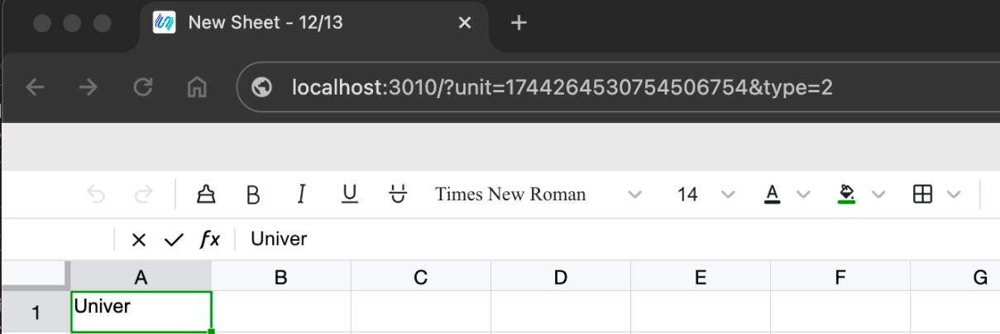
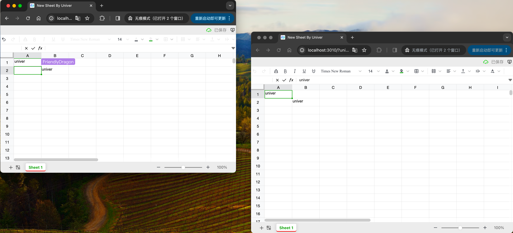

import { Callout, Steps } from 'nextra/components'
import BadgeGroup, { UniverTypes } from '@/components/BadgeGroup'
import Image from '@/components/Image'
import mysqlImg from './docker/mysql.png'

# Deploying with Docker

<BadgeGroup values={[UniverTypes.GENERAL]} value={UniverTypes.GENERAL} />

Get up and running quickly with our Docker deployment solution for the Univer service, using Docker Compose for a hassle-free setup.

## System Requirements

1. CPU: Single core
2. RAM: 2GB
3. Storage: 10GB

Ensure you have [Docker version 23 or higher](https://docs.docker.com/engine/install/).

## Technical Stack

Our architecture is built on PostgreSQL and RabbitMQ.

## Quick start

Compatible with Linux, Mac, and Windows/WSL environments.

```
bash -c "$(curl -fsSL https://raw.githubusercontent.com/dream-num/helm-charts/main/install.sh)"
```

<Callout emoji="⚠️">
  If you encounter any issues during installation or use, please refer to the [Troubleshooting](#troubleshooting).
</Callout>

Confirm that the document service has successfully started.

Access http://localhost:3010 in your web browser to create a new blank document, which will then redirect you to the document link (Internet Explorer is not supported).



Also, verify the successful startup of the collaboration service.

For a comprehensive test, try accessing it in various browsers or in private browsing mode to experience the full collaborative capabilities.



## Port Check

Ensure that the specified ports are not in use; if they are, terminate the conflicting processes before attempting to start again.

Default ports for Univer services are listed below:

| service Name | Port Number |  	Function |
| --- | --- | --- |
| universer | 8000 | Serves API over HTTP |
| univer-minio | 9000 | Acts as the S3 storage server |
| univer-client | 3010 | Provides the frontend interface |

## Offline Deployment

If you need to deploy in an offline environment, we also provide an offline installation package. However, we recommend using the one-click installation script in a networked environment for easier updates.

<Steps>
  ### Download the offline installation package

  [Click here to download the offline installation package](https://univer.ai/releases/univer-server/download) and extract it on your server.

  ```bash
  tar -xvf installation-package.tar.gz # Replace 'installation-package' with the actual file name
  ```

  ### Start the service
 
  Navigate to the extracted directory and run `bash install.sh` to start the service.

  ### Verify that the service is available.

  **Method 1:** Start the built-in demo application and visit `http://localhost:3010` to see the results.

  ```bash
  docker run --net=univer-prod --rm --name univer-collaboration-lite -p 3010:3010 univer-acr-registry.cn-shenzhen.cr.aliyuncs.com/release/univer-collaboration-lite:latest
  ```

  **Method 2:** Set up your own front-end project. [Learn more](/guides/sheet/getting-started/quickstart#install-and-run-the-frontend).
</Steps>

### How to uninstall

```bash
bash uninstall.sh       # Uninstall while retaining data for future use
bash uninstall.sh clean # Uninstall and delete data
```

## Troubleshooting

### Having trouble starting on a Windows OS?

The `run.sh` script operates in a `bash` environment. To get it up and running, you'll need to use either Git Bash/MinGW or a WSL environment.

### Can't use the save-as-table function?

You'll need to tweak the `.env` file. Set `S3_ENDPOINT_PUBLIC` to your local network IP to get the `save as` function to work properly.

```diff
- S3_ENDPOINT_PUBLIC=http://univer-minio:9000
+ S3_ENDPOINT_PUBLIC=http://<Your Local Network IP>:19000
```

### How to find error when server start failed?

You can use `docker compose logs` to see server logs, for example:

```shell
# see universer latest 20 minute logs
docker compose logs -f universer --since 20m
```

### How to restart, stop, uninstall server?

```shell
# restart server
bash run.sh

# stop server
docker compose stop

# uninstall
docker compose down

# uninstall and clean data
docker compose down --volumes
```

### How to change host port the server used?

You can update the `.env` file, then run `bash run.sh`

```
# host ports
HOST_NGINX_PORT=8000
HOST_MINIO_PORT=19000
HOST_GRAFANA_PORT=13000
```

### How to change database to MySQL?

1. Required MySQL >= 8.0

2. Update `.env` file, set the MySQL config and delete PostgreSQL config.

<Image src={mysqlImg} alt="mysql" width={500} />

3. The `docker-compose.mysql.yaml` apply a MySQL component, if you want to use yourself database, you can delete the `univer-mysql` service in `docker-compose.mysql.yaml` file, and delete the dependencies in other service `depends_on` properties.

4. Start/Restart the service: `bash run.sh`