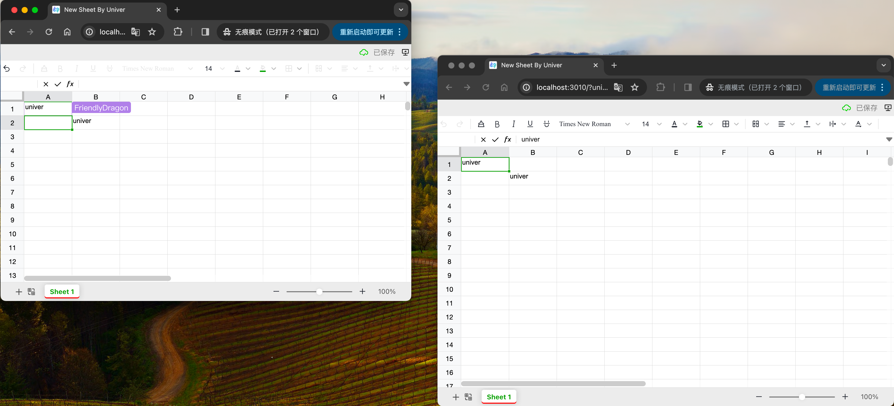

import { Callout, Steps } from 'nextra/components'
import BadgeGroup, { UniverTypes } from '@/components/BadgeGroup'
import Image from '@/components/Image'
import mysqlImg from './docker/mysql.png'

# 部署到 Docker

<BadgeGroup values={[UniverTypes.GENERAL]} value={UniverTypes.GENERAL} />

我们提供了开箱即用的 Docker 部署方式，你可以通过 Docker Compose 快速部署 Univer 的后端服务。

## 配置要求

1. CPU: 1 核
2. 内存: 2G
3. 磁盘: 10G

需要 [docker >= 23 版本](https://docs.docker.com/engine/install/)。

## 技术架构

PostgreSQL + RabbitMQ

## 快速部署

系统环境：Linux、Mac、Windows/WSL

```
bash -c "$(curl -fsSL https://release-univer.oss-cn-shenzhen.aliyuncs.com/release-demo/install.sh)"
```

<Callout emoji="⚠️">
  如果在安装或使用过程中遇到问题，请查看[常见问题](#常见问题)。
</Callout>

打开浏览器输入 http://localhost:3010 后会自动创建空白文档并跳转到新文档链接（不支持IE浏览器）。


验证协同服务是否启动成功。

请尝试在不同类型浏览器或无痕模式下访问，以全面体验协同功能。



## 端口

检查端口是否被占用，若占用请结束其他进程后再尝试启动。

Univer 服务默认端口如下：

| service | port | description |
| --- | --- | --- |
| universer | 8000 | api http server |
| univer-minio | 9000 | s3 server |
| univer-client | 3010 | frontend |

## 离线部署

  如果你恰好需要在无互联网环境下部署，我们也提供了离线安装包，条件允许我们建议你在有网络环境使用一键安装脚本进行部署，这样便于后续升级。

<Steps>
  ### 下载离线安装包

  [点击链接下载离线安装包](https://univer.ai/releases/univer-server/download)，将安装包解压到服务器。

  ```bash
  tar -xvf 安装包.tar.gz # 解压命令，将文件名替换为实际文件名
  ```

  ### 启动服务

  进入解压目录，执行 `bash install.sh` 启动服务

  ### 验证服务是否可用

  **方式 1：** 启动内置的演示程序，访问 `http://localhost:3010` 即可查看效果。
  ```bash
  docker run --net=univer-prod --rm --name univer-collaboration-lite -p 3010:3010 univer-acr-registry.cn-shenzhen.cr.aliyuncs.com/release/univer-collaboration-lite:latest
  ```

  **方式 2：** 自行建立前端工程，[了解更多](/guides/sheet/getting-started/quickstart#install-and-run-the-frontend)。
</Steps>

### 卸载

```bash
bash uninstall.sh       # 卸载，保留数据下次使用
bash uninstall.sh clean # 卸载，删除数据
```

## 常见问题 <a id="troubleshooting"></a>

### 服务的运行目录在哪里？

在`docker-compose`文件夹下，包含 .env 配置文件、 run.sh 启动脚本。

### Windows 系统下启动失败？

运行脚本 `run.sh` 需要 `bash` 环境支持，请使用 Git Bash/MinGW 或 WSL 环境启动。

### 导入导出功能异常？ <a id="import-export-error" />

首先，请通过浏览器开发工具检查下导入导出过程中响应体中是否存在 `univer-minio` 等字样，如果有，可能是 S3 配置不当导致的导入导出功能异常，请根据以下步骤检查和配置为正确的 S3 配置。

假设你使用安装时预置的 Minio 服务，打开 `.env` 文件，按下述说明将 `S3_ENDPOINT_PUBLIC` 配置项修改为 Docker 服务所在的公网或局域网 IP。

```diff
- S3_ENDPOINT_PUBLIC=http://univer-minio:9000
+ S3_ENDPOINT_PUBLIC=http://<Docker服务所在的公网或局域网IP>:19000
```

修改配置后请重启服务验证。

**注意：** 不应该配置成 `localhost` 和 `127.0.0.1`，这样会导致前端无法访问到 S3 服务。

如果你使用自己的 S3 服务，可以参考完整的[S3 配置](#s3-config)。

除了 S3 配置问题，你还应该检查前端工程中的 Univer Server 的[导入导出API的配置](/guides/sheet/features/import-export#configuration)是否正确。

### 拉取 docker hub 镜像失败？

编辑 `docker-compose.yaml` 文件，替换对应的镜像地址：
```diff
- image: nginx:alpine-slim
+ image: univer-acr-registry.cn-shenzhen.cr.aliyuncs.com/release/nginx:alpine-slim

- image: postgres:${POSTGRES_VERSION}
+ image: univer-acr-registry.cn-shenzhen.cr.aliyuncs.com/release/postgres:${POSTGRES_VERSION}

- image: rabbitmq:${RABBITMQ_VERSION}
+ image: univer-acr-registry.cn-shenzhen.cr.aliyuncs.com/release/rabbitmq:${RABBITMQ_VERSION}

- image: bitnami/redis:${REDIS_VERSION}
+ image: univer-acr-registry.cn-shenzhen.cr.aliyuncs.com/release/redis:${REDIS_VERSION}

- image: temporalio/auto-setup:${TEMPORAL_VERSION}
+ image: univer-acr-registry.cn-shenzhen.cr.aliyuncs.com/release/temporal:${TEMPORAL_VERSION}

- image: bitnami/minio:${MINIO_VERSION}
+ image: univer-acr-registry.cn-shenzhen.cr.aliyuncs.com/release/minio:${MINIO_VERSION}
```

### 如何排查服务启动报错？

你可以用 `docker compose logs` 命令查看服务日志，例如：

```shell
# 查看 universer 最近20分钟内的日志
docker compose logs -f universer --since 20m
```

### 如何重启、停止、卸载服务？

```shell
# 重启
bash run.sh

# 停止
docker compose stop

# 卸载
docker compose down

# 卸载并删除数据
docker compose down --volumes
```

### 怎样修改服务端口？

可以更新 `.env` 文件，然后执行 `bash run.sh` 重启。

```
# host ports
HOST_NGINX_PORT=8000
HOST_MINIO_PORT=19000
HOST_GRAFANA_PORT=13000
```

### 怎样修改成使用 MySQL 数据库？

1. MySQL 需要 >= 8.0 版本。

2. 更新 `.env` 文件，设置 MySQL 相关配置并把 PostgreSQL 配置去掉。

<Image src={mysqlImg} alt="mysql" width={500} />

3.  `docker-compose.mysql.yaml` 文件提供了一个 MySQL 数据库组件，如果你想使用已有的数据库，可以将 `univer-mysql` 从 `docker-compose.mysql.yaml` 文件中删除，然后再把其他服务 `depends_on` 属性中的 `univer-mysql` 依赖去掉。

4. 启动/重启服务：`bash run.sh`。

### 怎样修改 S3 配置？ <a id="s3-config"></a>

1. 更新 `.env` 文件，修改 S3 对应的配置。
```shell
# s3 config
S3_USER=minio
S3_PASSWORD=minio123456
S3_REGION=us-east-1
S3_PATH_STYLE=true
S3_ENDPOINT=http://univer-minio:9000
S3_ENDPOINT_PUBLIC=http://univer-minio:9000
S3_DEFAULT_BUCKET=univer
```

- `S3_PATH_STYLE`：`true` 表示 bucket 在路由路径；`false` 表示 bucket 在域名上。
- `S3_REGION`：地区，根据 s3 bucket 的位置配置。
- `S3_ENDPOINT`：内网地址。
- `S3_ENDPOINT_PUBLIC`：公网地址，用于下载文件。
- `S3_DEFAULT_BUCKET`：s3 存储桶，需要在启动 univer 服务前先创建好。

2. 启动/重启服务：`bash run.sh`。

### 访问 8000 端口响应 `404 page not found`？

8000 端口是 Univer Server 对外暴露的 API 端口，访问 `/` 返回 `404 page not found` 是正常现象，因为该路径下没有 API。

如果你在验证服务和功能是否正常，可以通过[模板](/guides/sheet/getting-started/quickstart#install-and-run-the-frontend)来快速建立前端工程进行验证。
