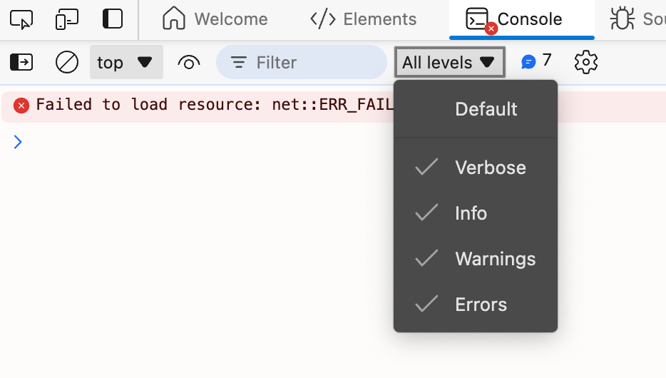

import BadgeGroup, { UniverTypes } from '@/components/BadgeGroup'
import VersionBadge from '@/components/VersionBadge'

## How to find the command ID

<BadgeGroup values={[UniverTypes.GENERAL]} value={UniverTypes.GENERAL} />

Developers often need to find the ID of a command when extending or developing a plugin. With the large number of commands in the Univer ecosystem, how can you quickly find the ID of a command?

## Import from the plugin <VersionBadge version="0.2.0+" />

Univer exports all commands, and you can find the target command in the [API Reference](/typedoc/@univerjs/README) and import it from the corresponding package to get the command ID.

For example, if you want to find the ID of the command to set the underline of a range, you can first find it in the [API Reference - Variable: SetRangeUnderlineCommand](/typedoc/@univerjs/sheets-ui/variables/SetRangeUnderlineCommand). Then you can import it and get the command ID like this:

```typescript
import { SetRangeUnderlineCommand } from '@univerjs/sheets-ui';

console.log(SetRangeUnderlineCommand.id);
```

## Enable logging

When creating an Univer instance, you can set the log level through the `logLevel` parameter. There are 5 log levels:

- `LogLevel.SILENT`: No logs are output
- `LogLevel.ERROR`: Only error logs are output
- `LogLevel.WARN`: Error and warning logs are output
- `LogLevel.INFO`: Error, warning, and information logs are output
- `LogLevel.VERBOSE`: All logs are output

```diff
const univer = new Univer({
+  logLevel: LogLevel.VERBOSE,
});
```

By using the `LogLevel.VERBOSE` log level, Univer will output all operation log information, including the ID of the command.

It is important to note that the default log level of some browsers may hide `VERBOSE` level logs, so you may need to manually adjust the log level of the browser.



## Read the source code

If you are familiar with the [architecture of Univer](/guides/sheet/architecture/univer), you should be able to easily find the ID of a command in the source code.

Commands are usually stored in the `commands` folder of the plugin directory. You need to find the corresponding file based on the function of the command, and then find the ID of the command in the file.

For example, the command to modify the background color of a Worksheet tab can be found in `./packages/ui/src/commands/commands/set-tab-color.command.ts`, and the name of this ID is `sheet.command.set-tab-color`.

<iframe 
  className="w-full h-[772px] mt-6"
  allow="clipboard-write"
  src="https://emgithub.com/iframe.html?target=https%3A%2F%2Fgithub.com%2Fdream-num%2Funiver%2Fblob%2Fdev%2Fpackages%2Fsheets%2Fsrc%2Fcommands%2Fcommands%2Fset-tab-color.command.ts%23L29-61&style=default&type=code&showBorder=on&showLineNumbers=on&showFileMeta=on&showFullPath=on&showCopy=on"
/>
