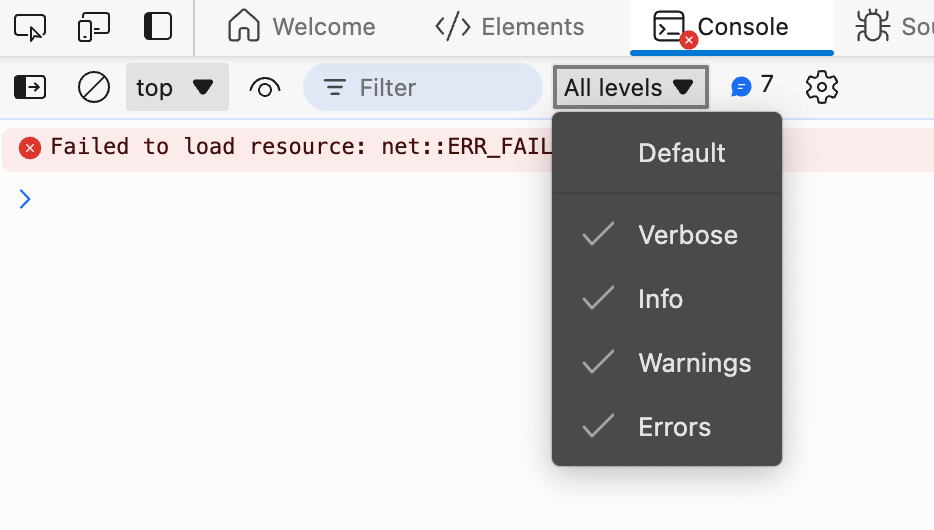

import BadgeGroup, { UniverTypes } from '@/components/BadgeGroup'
import VersionBadge from '@/components/VersionBadge'

# 如何查找命令 ID

<BadgeGroup values={[UniverTypes.GENERAL]} value={UniverTypes.GENERAL} />

开发者在进行扩展或者开发插件时，经常需要查找某个命令的 ID。而 Univer 繁多的插件生态中包含了大量的命令，如何快速找到某个命令的 ID 呢？

## 从插件中引入 <VersionBadge version="0.1.18+" />

Univer 导出了所有的命令，你可以在 [API Reference](/typedoc/@univerjs/README) 中找到目标命令，并从对应的包中导入，即可获取到命令的 ID。

列如，你想要查找设置选区下划线的命令 ID，首先可以在 [API Reference - Variable: SetRangeUnderlineCommand](/typedoc/@univerjs/sheets-ui/variables/SetRangeUnderlineCommand) 中找到。然后就可以这样导入并获取命令 ID：

```typescript
import { SetRangeUnderlineCommand } from '@univerjs/sheets-ui';

console.log(SetRangeUnderlineCommand.id);
```

## 开启日志

创建 Univer 实例时，可以通过 `logLevel` 参数来设置日志级别。日志级别有 5 种，分别是：

- `LogLevel.SILENT`：不输出日志
- `LogLevel.ERROR`：只输出错误日志
- `LogLevel.WARN`：输出错误和警告日志
- `LogLevel.INFO`：输出错误、警告和信息日志
- `LogLevel.VERBOSE`：输出所有日志

```diff
const univer = new Univer({
+  logLevel: LogLevel.VERBOSE,
});
```

使用 `LogLevel.VERBOSE` 日志级别，Univer 会输出所有的操作日志信息，其中包括命令的 ID。

需要特别注意的是，部分浏览器的默认日志级别可能会隐藏 `VERBOSE` 级别的日志，你可能需要手动调整浏览器的日志级别。



## 阅读源码

如果你对 [Univer 的架构](/guides/sheet/architecture/univer)所有了解，应该能非常轻松地在源码中寻找到命令的 ID。

命令通常存放在插件目录的 `commands` 文件夹中。你需要根据命令的功能来查找对应的文件，然后在文件中找到命令的 ID。

比如修改 Worksheet 标签背景色的命令可以在 `./packages/ui/src/commands/commands/set-tab-color.command.ts` 中找到，这个 ID 的名称叫作 `sheet.command.set-tab-color`。

<iframe 
  className="w-full h-[772px] mt-6"
  allow="clipboard-write"
  src="https://emgithub.com/iframe.html?target=https%3A%2F%2Fgithub.com%2Fdream-num%2Funiver%2Fblob%2Fdev%2Fpackages%2Fsheets%2Fsrc%2Fcommands%2Fcommands%2Fset-tab-color.command.ts%23L29-61&style=default&type=code&showBorder=on&showLineNumbers=on&showFileMeta=on&showFullPath=on&showCopy=on"
/>
