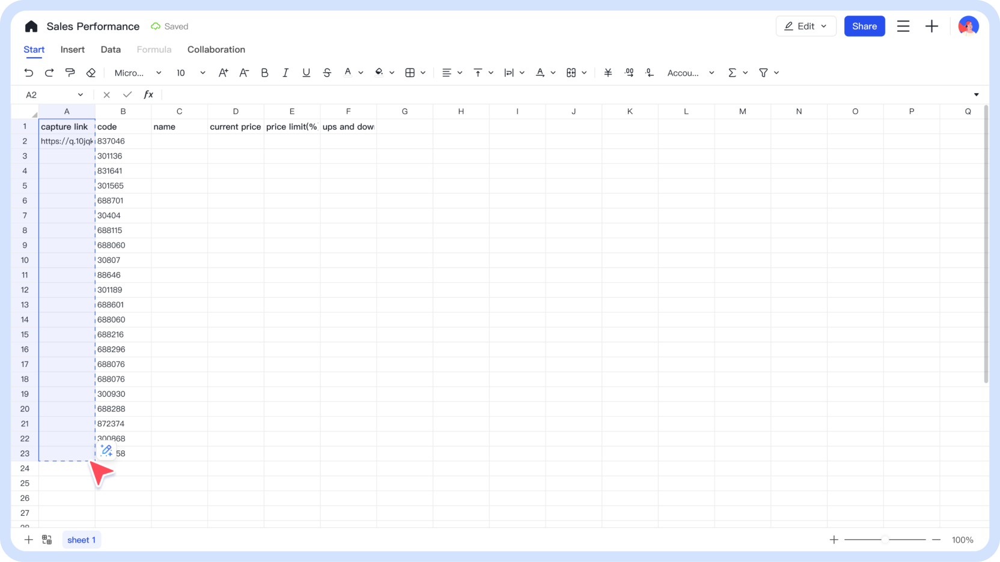
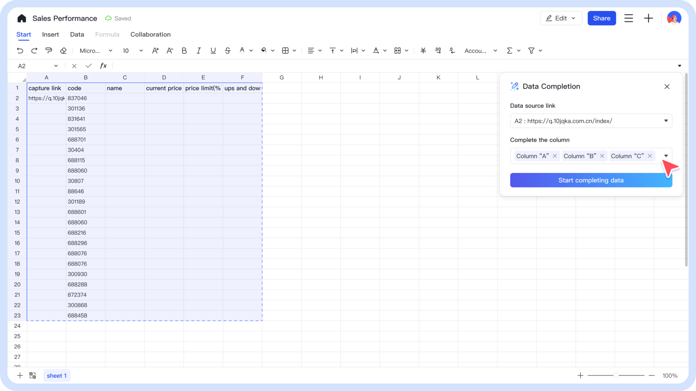

1. Write what information you want to know in the title.

2. The title should be detailed enough to act as a prompt.

3. Select the range that includes the URLs.

4. If there are other columns, please select them as well, they will serve as important inputs for AI inference.

5. Click the data completion icon.

6. Select the URL column and the completion column.

7. Start the completion process; data will be output by column.

8. If the data is not what you expected, you can stop the completion.

9. Once the completion is finished, you can either drop the data or retry.

10. Well done! You can use another sheet to analyze the data.
