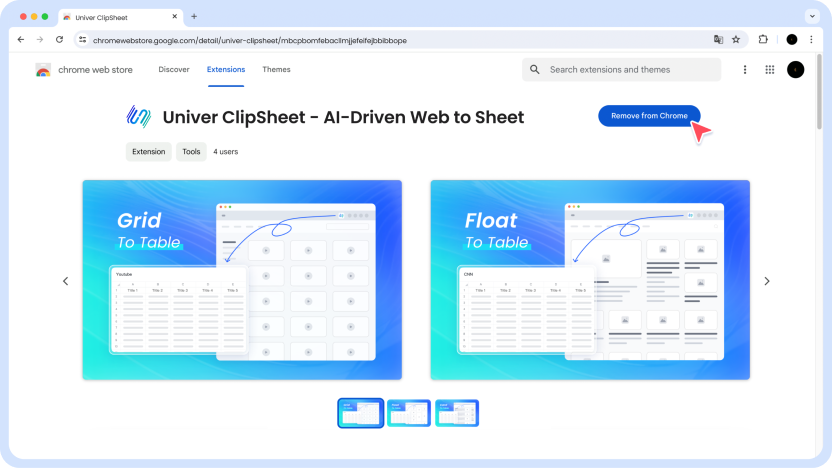
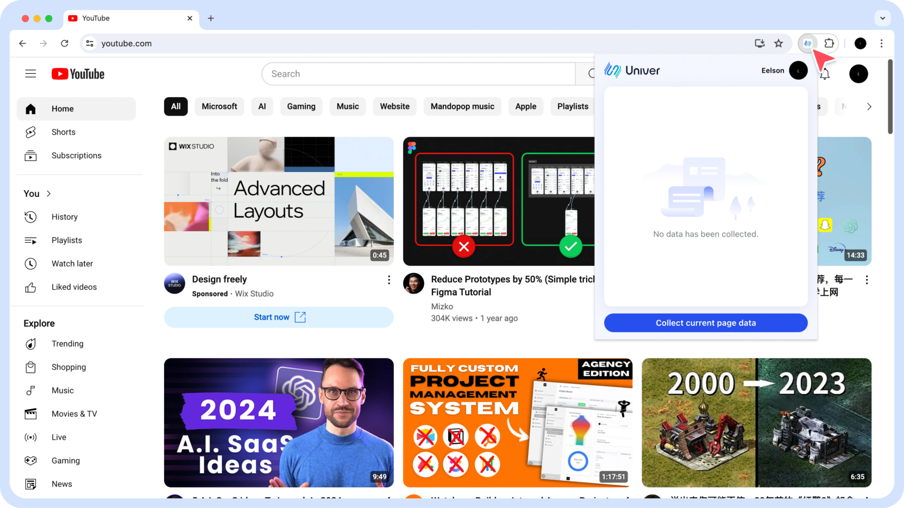
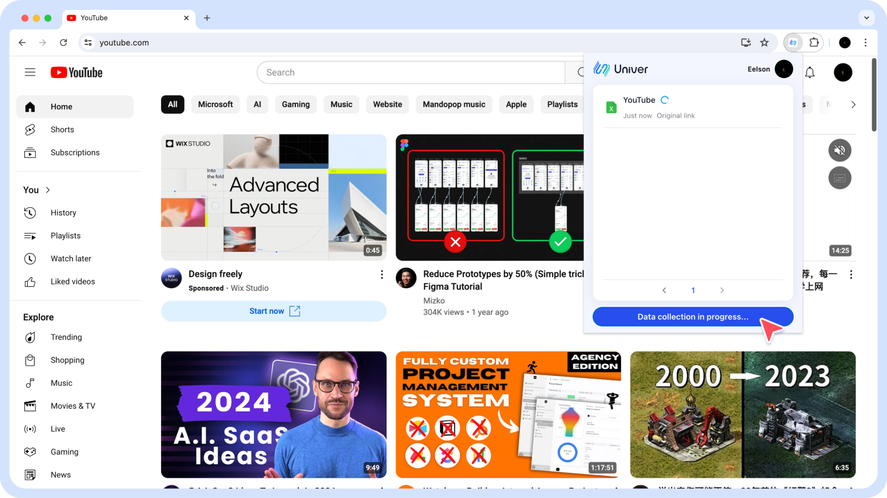
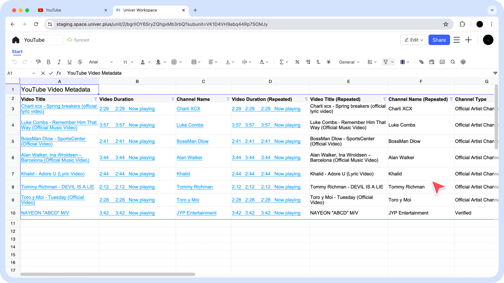
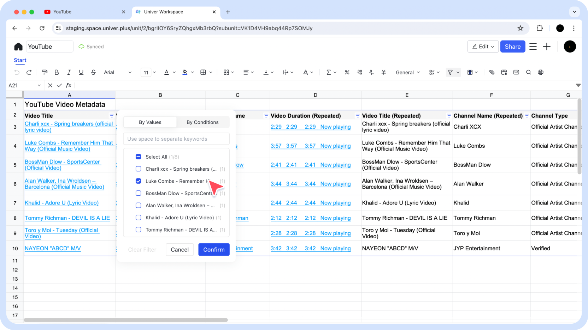
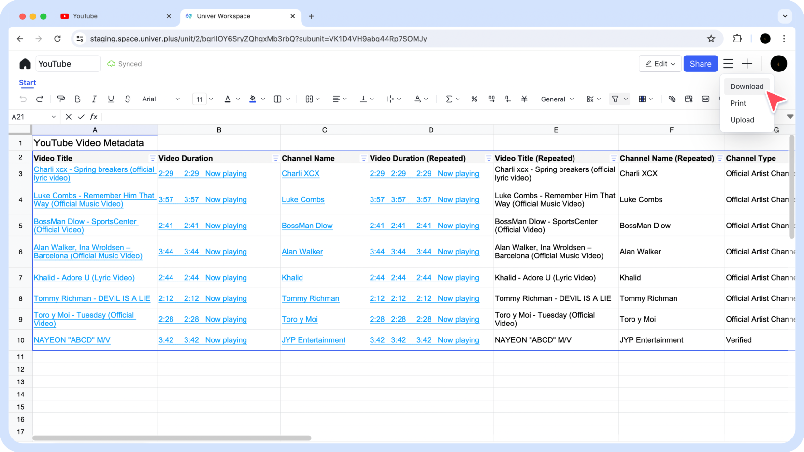
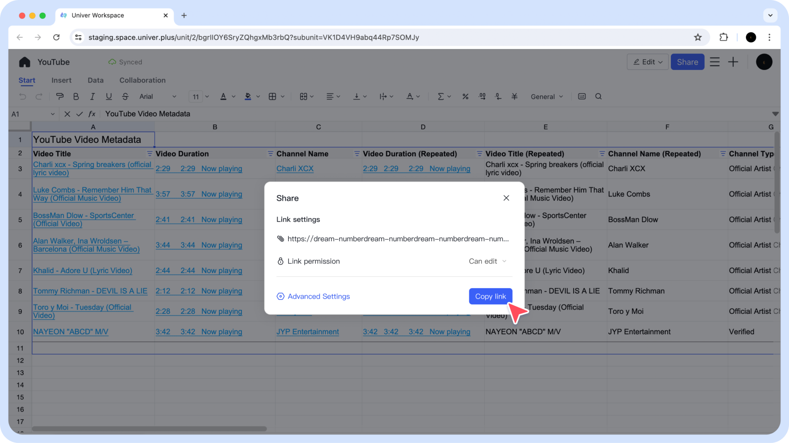

1. Download and Install.

2. Open ClipSheet.

3. Start Clipping.

4. View Clip Data in the Univer Sheet.

5. Select the Best-Fit Data for you.

6. Copy or Export to a Local File.

7. Share Data with Your Partners or Colleagues.

