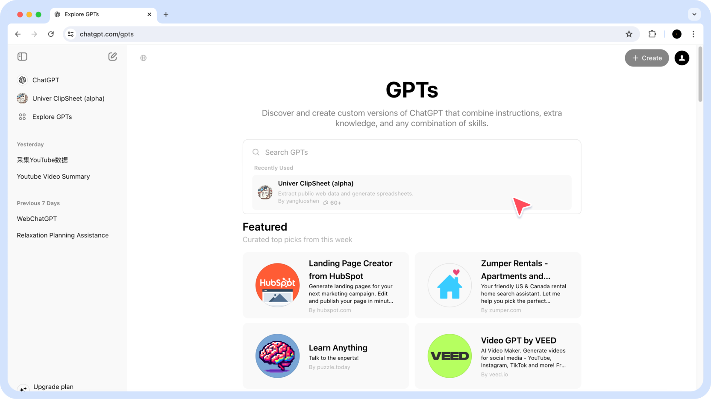
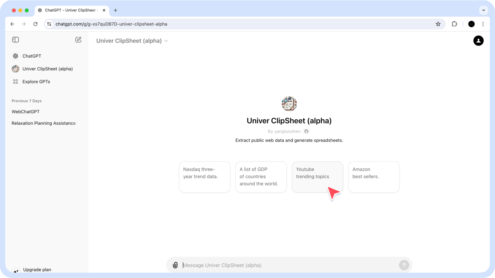
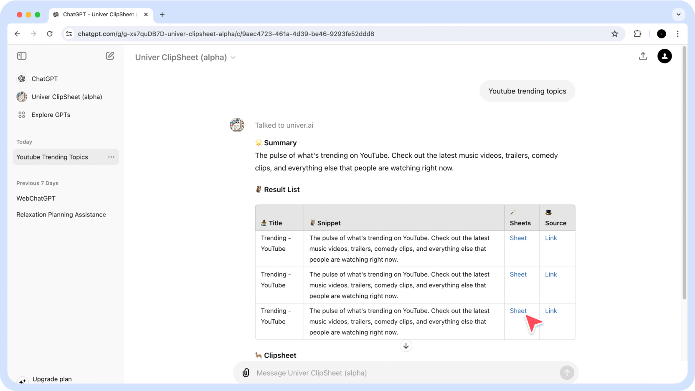

1. Open GPT store and find clipsheet plugin.

2. Ask Clipsheet AI for the data you want to find.

3. Clipsheet will return the source links and collected data links. The data is saved in the Univer sheet, where you can copy, download, edit, and share it without needing to log in.

