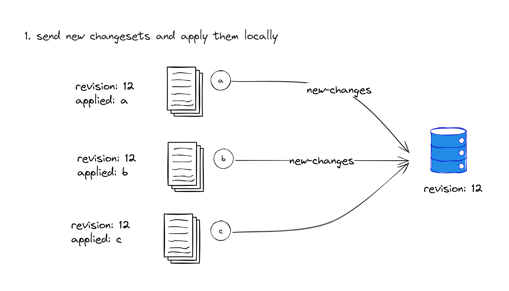
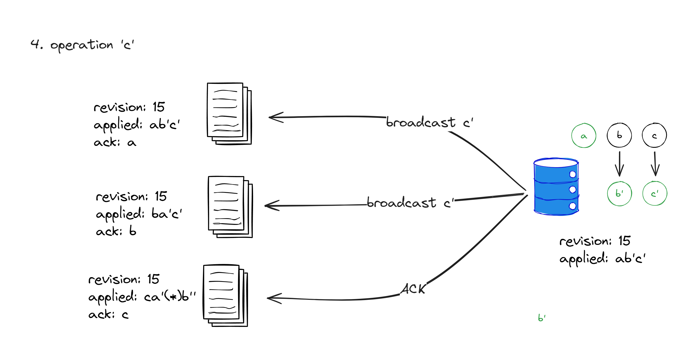

# The OT algorithm and Univer's Collaborative Editing Design

> This blog post is a compilation of internal discussions and insights from the [Univer team](https://github.com/dream-num). At Univer, we regularly share and discuss fascinating technical challenges. If you find this blog post engaging, we encourage you to consider [joining us](mailto:huwenzhao@univer.ai).

Univer is an enterprise data collaboration tool committed to enabling users to edit and collaborate with their colleagues anytime, anywhere, and on any device. Throughout our journey in achieving this goal, we've encountered numerous intriguing technical challenges. Among them, one of the most challenging we faced was the design and implementation of the collaborative editing module.

After careful consideration, Univer adopted a solution belonging to the family of [Operational Transformation (OT) algorithms](https://en.wikipedia.org/wiki/Operational_transformation). This blog post will introduce the principles behind the OT algorithm and delve into our considerations while designing the collaborative editing module for Univer. While there are abundant resources available in the community regarding OT algorithms, many of them lack extensive discussions on how to schedule transforms and the various unexpected scenarios encountered in a production environment. In this article, we strive to cover these topics comprehensively.

---

## Why do we need a collaborative editing algorithm?

What is collaborative editing? If you have used tools like Google Docs or Figma, you may have already experienced collaborative editing. It allows multiple users to **simultaneously** edit the same document, with real-time updates appearing on everyone's screens.

The remaining content of this article will mainly focus on collaborative editing for spreadsheets. So, let's use a spreadsheet as an example: Users Alice and Bob are simultaneously editing a spreadsheet. Alice wants to insert text into cell C2, while Bob wants to insert a column before column B. In the end, both users should see that a column has been inserted before column B, and the text has been added to cell D2.


Let's attempt to provide a definition for collaborative editing:

Collaborative editing refers to the simultaneous editing of **multiple copies** of the **same document** (where simultaneity implies that during editing, one copy does not fully synchronize all the edits made in other copies). Collaborative editing should meet the following requirements:

- **Consistency of content across all copies**: This ensures that the content in each copy eventually becomes consistent, in another word, achieving eventual consistency.
- **Preservation of users' intent**: The final content should align with the user's expectations.

The first requirement is a strong guarantee, while the second one is a best-effort endeavor. We cannot guarantee that the outcome will always match the user's expectations, but we should make every effort to align the outcome with the intuitions of the majority of users.

In addition to the goals of eventual consistency and preserving user intent, there is another goal that is often overlooked:

- **User edits should always take effect locally first**.

Next, let's explore how the Operation Transformation (OT) algorithm satisfies these requirements for collaborative editing.

:::note
The problem of collaborative editing can be seen as a special case of distributed data synchronization, adhering to the principles of the [CAP theorem](https://en.wikipedia.org/wiki/CAP_theorem). Collaborative editing guarantees availability (users can always edit their local copies), partition tolerance (copies can temporarily be inconsistent), and sacrifices strong consistency while providing eventual consistency. It is AP without C.
:::

:::note
In recent years, there has been increasing attention and application of [Conflict-free Replicated Data Types (CRDTs)](https://en.wikipedia.org/wiki/Conflict-free_replicated_data_type). However, Univer did not choose CRDTs. We will discuss the reasons for this decision at the end of the article.
:::

## The Solution of OT

### Definition of Operations

Firstly, let's provide a definition for **operations**. We define a user's editing behavior as a data structure with the following characteristics:

1. An operation consists of several fields: the **type** of the operation (also referred to as its name or ID, essentially indicating the kind of operation), the **parameters** specific to the operation type, and the **coordinates** of the operation.
2. Operations are categorized by their **semantic features**, meaning they possess semantics that users can perceive, such as inserting text, setting attributes, or deleting regions, among others.
3. Operations are also characterized by their **atomicity**, which means that they cannot be further divided into other types of operations.

For example, the editing behavior mentioned above, inserting a column, can be represented as an operation like this:

```typescript
const insertColOp = {
  type: "insertCol",
  coord: { col: 1 },
  params: { count: 1 },
};
```

The editing behavior of inserting content into a cell can be represented as follows:

```typescript
const insertCell = {
  type: "insertCell",
  coord: { row: 1, col: 2 },
  params: { content: "text" },
};
```

Once the operations are defined, the user's editing behavior can be represented by applying these operations to a copy.

:::note
The following is pseudocode, and the actual structure used in Univer may be slightly more complex. You can refer to the [set-range-values.mutation.ts file](https://github.com/dream-num/univer/blob/dev/packages/sheets/src/commands/mutations/set-range-values.mutation.ts) for more details.
:::

:::note
In practice, the [command pattern](https://en.wikipedia.org/wiki/Command_pattern) is often used to implement operations.
:::

The same set of operations, when applied in different orders to the same copy, will yield different results. Therefore, in order to achieve

> Consistency of content across all copies

, the order of operations needs to be determined.

:::note
In other words, most operations do not satisfy the [commutative property](https://en.wikipedia.org/wiki/Commutative_property). In contrast, CRDT-like algorithms define operations that satisfy the commutative property, so it does not need a coordinating server.
:::

We introduce the concept of revision numbers here: we define the revision number of a copy as `x`. After applying an operation, the revision number of the copy becomes `x+1`. The revision number of the applied operation is then defined as `x+1`, which can be represented in code by assigning the `revision` property of the operation with the value `x+1`. With this approach, we can define the order of operations based on their revision numbers.

```typescript {5}
const insertCell = {
  type: "insertCell",
  coord: { row: 1, col: 2 },
  params: { content: "text" },
  revision: 10086,
};
```

Notably, the `baseRevision` of an operation being `y` does not necessarily imply that its `revision` will be `y+1`. We will discuss this in the next section.

### Coordinating Server

The question at hand is how to assign revision numbers when multiple copies undergo operations simultaneously (or when there are multiple operations with the same `baseRevision`). In OT, **revision numbers cannot be assigned by clients**, as clients can only assign the `baseRevision` of operations. To address this, we introduce a coordinating server that will be responsible for assigning a revision number to each operation by setting their `revision` property. Through server allocation, we can ensure that all `revision` values are globally unique and globally consistent.

:::note
In other words, in OT, the operations of all copies have a total order relationship, meaning that the order of any two operations can be determined. In contrast, CRDT does not require a total order relationship among the operations of all copies; only a partial order relationship is needed.
:::

:::note
Revision numbers cannot be assigned by clients because it would be challenging to ensure uniqueness, monotonically increasing sequences, and continuity. As mentioned earlier:

> The same set of operations, when applied in different orders to the same copy, will yield different results.

If we allow clients to assign revision numbers themselves, it would be difficult to guarantee that operations on different replicas have the same revision numbers. This would result in inconsistent operation orders among replicas and ultimately lead to inconsistent replica states.
:::

To help you better understand the role of the coordinating server, let's consider an example. **To facilitate the subsequent discussion on the necessity of operation transformation, let's assume that the client's operations are not locally applied until after they are assigned revision numbers by the server**.


Let's assume we have three replicas, A, B, and C, all at revision 12. At this point, each replica undergoes an operation with a `baseRevision` of 12. We'll name these three operations `a`, `b`, and `c`, and assume that their `revision` attributes are all set to `0`, indicating that they haven't been assigned revision numbers by the server yet. The pseudocode representation is as follows:

```typescript
const opa = {
  // ... other fields
  baseRevision: 12,
  revision: 0,
};

const opb = {
  // ... other fields
  baseRevision: 12,
  revision: 0,
};

const opc = {
  // ... other fields
  baseRevision: 12,
  revision: 0,
};
```

Replicas A, B, and C send these three operations to the server (as shown in the diagram marked as 1). The server receives the operations and assigns their `revision` attributes as 13, 14, and 15, respectively (as shown in the diagram marked as 2). Then, the server returns these operations to replicas A, B, and C (as shown in the diagram marked as 3). The replicas apply these operations in the order of their assigned `revision` values. At this point, all replicas A, B, and C have revision number 15, and their contents are consistent.

```typescript
const opa = {
  // ... other fields
  baseRevision: 12,
  revision: 13,
};

const opb = {
  // ... other fields
  baseRevision: 12,
  revision: 14,
};

const opc = {
  // ... other fields
  baseRevision: 12,
  revision: 15,
};
```

:::note
You may be curious about how the server assigns revision numbers to the operations. However, the specifics of this process are not crucial for our discussion. As long as the revision numbers are globally unique, they can be assigned based on timestamps or the IDs of the operation initiators, among other methods.
:::

Summary:

- The server determines the application order for all operations, ensuring globally unique and consistent operation revision numbers.
- Multiple replicas apply the same batch of operations in the same order, resulting in replicas having identical contents. Therefore, the current collaborative solution achieves strong eventual consistency.

However, there are two noticeable issues with the current approach:

The first issue is that when a client performs an operation, it is not immediately applied locally but instead waits for the server's ordering, which does not satisfy the condition that "users' edits should always take effect locally first."

The second issue is that the current approach does not guarantee that the results align with the user's expectations.

To address these two issues, we need to introduce operation transformation.

Let's use the example at the beginning to illustrate:

> An example: User Alice and User Bob are simultaneously editing a spreadsheet. Alice wants to insert text in cell C2, while Bob wants to insert a column before column B. After both of them have finished editing, we need to insert a column before column B and insert the text in cell D2.

If Alice's operation's `revision` is smaller than Bob's operation's `revision`, the result aligns with expectations. However, if Bob's operation's `revision` is smaller than Alice's operation's `revision`, the result does not align with expectations. In this case, the text remains inserted in cell C2, instead of being moved to D2 due to Bob's operation.

To solve these two problems, we need to introduce operation transformation.

### Operation Transformation

Let's refine the three operations `a`, `b`, `c` that were assumed earlier:

- `a` is inserting text in cell C2.
- `b` is inserting a column before column B.
- `c` is setting the style of cell A1.

We can describe them in pseudocode as follows:

```typescript
const a = {
  type: "insertCell",
  coord: { row: 1, col: 2 },
  params: { content: "text" },
  baseRevision: 12,
  revision: 0,
};

const b = {
  type: "insertCol",
  coord: { col: 1 },
  params: { count: 1 },
  baseRevision: 12,
  revision: 0,
};

const c = {
  type: "setCellStyle",
  coord: { row: 0, col: 0 },
  params: { style: "bold" },
  baseRevision: 12,
  revision: 0,
};
```

A, B, and C each apply these three operations locally on their respective copies. Then, they send these three operations to the server and wait for the server to send ACK events confirming the operations.



**Processing `a`**

We assume that the server always prioritizes processing the operations sent by A, B, and C copies in sequential order. At this point, the `baseRev` of `a` is aligned with the latest `revision` of the server's last operation. Therefore, this operation can be directly applied to the replica held by the server. After applying this operation, the server assigns the `revision` property of `a` as 13, sends an ACK event to A to indicate that the operation has been accepted by the server, and broadcasts this operation, `a`, to B and C.

Upon receiving the ACK, A increments its local revision number to 13.

**Here comes the interesting thing.** When B receives `a`, it notices that the `revision` of `a` is 13, while B's revision number is 12. Therefore, B should apply this operation. However, since B has already applied its own operation, `b`, it cannot directly apply this operation. B must calculate how to transform `a` into `a'` and `b` into `b'` under the assumption that `b` has already been applied, in order to ensure consistency between applying `ab'` and `ba'`? This is known as operation transformation.

:::note
It is possible that the `revision` is not simply one higher than the local revision number. If the `revision` is lower than the local revision number plus one, it can be discarded. If the `revision` is higher than the local revision number plus one, it indicates that the local replica has missed some operations and needs to fetch those operations from the server and perform operation transformation. We will analyze these edge cases in subsequent sections.
:::

Here is an informal definition of transformation (Transform):

Let `a` and `b` be two concurrent operations based on the same revision but applied to different replicas. The purpose of transformation is to adjust the operations `a` and `b` into `a'` and `b'`, respectively, assuming that `a` and `b` have already been applied to their respective replicas, in order to achieve consistent results when applying `ab'` and `ba'` on different replicas.

:::note
From the definition, it is clear that the `baseRevision` of `a` and `b` must be the same.
:::

In our example, on replica B, the content of `a'` can be described in pseudocode as follows:

```typescript
const aPrime = {
  type: "insertCell",
  coord: { row: 1, col: 3 },
  params: { content: "text" },
  baseRevision: 12,
  revision: 13,
};
```

After transforming to `b'`, although it does not need to be applied locally, the `baseRevision` attribute of `b'` needs to be set to 13. Why is that? According to the definition of transformation, `b'` is valid assuming that `a` has been applied to its respective replica (with correct parameters). At this point, replica B has already applied `a` received from the server (transformed into `a'`) and its revision number is 13. Therefore, `b'` becomes an operation that is based on the replica with revision 13.

The content of `b'` can be described in pseudocode as follows:

```typescript
const bPrime = {
  type: "insertCol",
  coord: { col: 2 },
  params: { count: 1 },
  baseRevision: 13,
  revision: 0,
};
```

:::note
We have already understood why `revision` needs to be set to 13. But why is `revision` set here? Wasn't `b` already sent to the server? This actually relates to marginal cases such as network anomalies, which we will discuss in subsequent sections.
:::

C handles `a` in a similar way to B, without further elaboration.

**Handling `b`**


First, the `baseRevision` of `b` is 12, but at this point, the revision number of the server replica becomes 13 because `a` has been applied. Therefore, when the server receives this operation, it needs to transform `a` and `b` into `b'`, then apply `b'` to its own replica, and set the `revision` of `b'` to 14. After that, an ACK event is sent to B, and `b'` is broadcasted to A and C.

:::note
Here's an interesting question: Why is `b'` broadcasted instead of `b`?

For A, its revision number has already increased to 13 at this point, so applying `b'` directly will bring it to revision 14. It's easy to see that the operations applied by A and the server replica are exactly the same.

For C, when it received `a`, it had already transformed it into `c'`, with a `baseRevision` of 13. If we were to transform `c'` and `b` directly, it wouldn't work because their `baseRevision`s are inconsistent. Instead, it is more convenient to use the pre-transformed `b'` provided by the server.
:::

**Handling `c`**



The handling of `c` is similar to that of `b`, and will not be further elaborated. You can deduce it on your own.

In summary:

- By introducing operation transformation, operations can take effect locally while maintaining the intended outcome.

### What Does Operation Transformation Change?

When applying changes through operations, it is common to modify the coordinates and other parameters of the operations. However, in special cases, it is also possible to change the type of the operation.

The specific method of operation transformation depends on the type of operation. Every pair of operations needs to be transformed, and operations of the same type may need to be transformed with each other. If there are `n` atomic operations, the complexity of the transformation method is on the order of `O(n^2)`. Therefore, implementing operation transformation correctly requires attention to detail. However, precisely implementing operation transformation methods allows us to maintain stronger control over the intended outcome of the transformation process.

:::note
In Univer, we refer to these operational transformation methods as "transform algorithms." The process of scheduling operations between clients and servers mentioned earlier, as well as the mechanisms such as network transmission and offline caching that we will cover later, are collectively referred to as the "collaborative scheduling algorithm."
:::

## Issues to Consider in Real-World Scenarios

The aforementioned algorithms of the OT provide a basic foundation. However, in practical production environments, there are several other considerations to take into account.

### Operation Merging and Compression

To reduce network overhead and minimize the number of operation transformations, we need to merge and encapsulate operations.

1. Merging refers to combining multiple operations of the same type into one operation. For example, when a user inputs multiple characters in a document, we can merge those characters into a single insert operation. Similarly, when a user enters content in multiple cells, we can merge the write operations for those cells into a single operation.
2. Encapsulation involves packaging multiple operations into a larger unit, which serves as the basis for revisioning. In Univer, this unit is called a changeset. For example, if a user sets the content and then the style of a cell, we can encapsulate these two operations into a changeset and send it to the server.

### Undo and Redo

After applying collaborative operations from other replicas, the operations recorded in the Undo and Redo stacks may no longer be directly executable.

Using the example of Alice and Bob, if Alice wants to undo an insert operation after all the edits have been synchronized, it should clear the content of cell D2, not C2. Therefore, before applying operations from other replicas, local operation transformations need to be performed on the Undo and Redo stacks.

### Dealing with Network Errors and Complex Scenarios

During the collaborative editing process, heavy reliance on network communication is inevitable, leading to various network interruptions (such as network issues or the user closing the web page before network transmission is complete). The collaborative module must handle these unexpected situations.

1. Clients may miss some operations broadcasted by the server, resulting in a lag in the local revision number. How can clients detect this situation? There are two ways for clients to detect it. First, when receiving remote operations from the server, if the `revision` of the operation is greater than the local revision number plus one, it indicates that the client has missed some operations. Secondly, when sending operations to the server, if the `revision` in the ACK event returned by the server is greater than the local revision number, it also indicates that the client has missed some operations. In these cases, the client needs to fetch those missed operations from the server. The range of operations to fetch should be from the local revision number plus one to `revision` minus one (inclusive). This behavior of fetching is called a fetch miss. During the fetch miss, local operations may still occur, and it is possible to receive updated operations from the server, requiring operation transformation between these operations.
2. If client-submitted operations are lost, the client needs to set a timeout mechanism to resend the operations in such cases. It is worth noting that in this situation, the `baseRevision` of the operations being sent may have been modified, which can reduce the number of transformations the server needs to perform.
3. Clients may miss the ACK from the server. To avoid duplicate sending and execution of the same operation, each operation needs to be assigned a globally unique ID. When the server receives an operation, it first checks if the operation has already been executed. If it has, the server directly returns an ACK without re-executing the operation. If the client does not receive an ACK within a certain period, it needs to resend the operation.
4. If the client loses network connection while some operations are not synchronized with the server, it must cache the user's editing operations locally and resend them when the network connection is restored. This requires support for offline caching.

### Offline Caching

Users may perform edits without an internet connection, such as when the network connection is interrupted during editing or when fully offline editing is supported through technologies like PWA or Electron. In any case, if users make edits offline, these operations must be cached and sent to the server once the network connection is restored.

When caching offline, it is important to distinguish between changesets that have been sent to the server but have not received an ACK, and operations that have not yet been sent to the server.

### Conflict Resolution

While we strive for the collaborative algorithm to handle all concurrent edits perfectly, this is practically unachievable. There will be cases where conflicts cannot be resolved by the collaborative algorithm, and in such situations, users must resolve the conflicts themselves. For example, if Alice deletes a subtable while Bob performs operations on that same subtable, if Bob's operations are silently discarded, his edits will be completely lost, which is undesirable. The solution is to disconnect collaborative editing when conflicts occur while preserving the conflict context (Bob's edits), allowing users to save their edits.

Fortunately, such exceptional cases are rare and do not significantly impact the user's editing experience.

### Revision History

Users may need to view the historical revisions of a document. Therefore, we need to save every operation on the server. When a user wants to view the content of a specific revision, we replay all the operations up to that revision. To speed up the replay process, we often save snapshots at certain revisions. This allows users to replay operations directly after the snapshot. Snapshots can be based on time intervals, number of operations, or specific events. Snapshots can have a data structure different from operations or be completely identical in structure, involving a trade-off between data structure readability and the simplicity of homomorphism.

### Collaborative Cursors

During collaborative editing, users may want to see the current cursor positions of other users in the document, requiring the implementation of collaborative cursors. One simple approach is for users to send their operations to other users via the server whenever they switch their cursor position. However, frequent cursor switches can lead to a large volume of network transmissions. Thus, we apply throttling mechanisms, such as only sending cursor updates after the cursor has remained in a position for a certain amount of time.

Additionally, collaborative cursors need to undergo operation transformation. For example, if User B's cursor is in cell C1 and User A deletes column B, User B's cursor should be moved to cell B1. To avoid excessive network transmissions caused by such operations, we typically do not broadcast the cursor information in such cases. Instead, each client handles the cursor position locally.

## Practices of Univer Collaborative Editing

During the development of the Univer collaborative editing module, we implemented some interesting design choices that we would like to share.

### Architecture


Finally, we would like to introduce the architecture of the collaborative editing module in Univer. The client-side architecture diagram is shown above, and it has the following key points:

- We have implemented three plugins: `@univerjs-pro/collaboration`, `@univerjs-pro/collaboration-client`, and `@univerjs-pro/collaboration-server`. These are responsible for shared code between the client and server, as well as the client and server-specific code. They also enable isomorphic behavior, allowing the code to run on both the client and server.
- For each document's model, there is a corresponding set of `CollaborationEntity` and `CollaborationSession`. The `CollaborationEntity` handles the collaborative scheduling for the document, while the `CollaborationSession` manages the connection with the server. This architecture allows for simultaneous collaboration on multiple documents of the same or different types within a single page.
- The `CollaborationEntity` listens for edit mutations (operations in Univer terminology) that occur on its associated document and sends these mutations to the server for collaboration. Operations from other clients, synchronized by the server, are transformed into mutations and executed after transformation.
- The `CollaborationEntity` maintains a state machine that manages the collaborative scheduling on the client-side.
- We have abstracted a network layer called `NetworkInterface`, which handles the communication and connection establishment between the client and server.

Next, we will provide a detailed explanation of some of these key points.

### Building Collaborative Editing as a Plugin

In Univer, collaborative editing is not tightly integrated into the core system but rather implemented as a plugin. This design allows us to support multiple collaborative editing algorithms without modifying the Univer core.

The Univer tech stack utilizes a dependency injection framework that enables plugins to override certain core services. Collaborative editing relies on this feature for handling undo and redo operations. In Univer, the dependency injection token for the undo/redo service is `IUndoRedoService`, and the default implementation is `LocalUndoRedoService`, which does not support converting operations in the undo/redo stack. However, the collaborative editing plugin in Univer replaces this implementation with `CollaborativeUndoRedoService` to enable undo and redo operation conrevision.

```typescript {17}
export class CollaborativeUndoRedoService extends LocalUndoRedoService implements ICollaborativeUndoRedoService {
    // ...
}

export class CollaborationClientPlugin extends Plugin {
    static override type: PluginType = PluginType.Univer;

    constructor(
        _config: unknown,
        @Inject(Injector) protected override _injector: Injector,
        @Inject(LocaleService) private readonly _localeService: LocaleService
    ) {
        // ...
    }

    override onStarting(injector: Injector): void {
        injector.replace([IUndoRedoService, { useClass: CollaborativeUndoRedoService }]);

        // ...
    }
}}
```

### Document-Type-Agnostic Collaborative Scheduling Algorithm

Univer's concept of boundary-less documents requires the ability to mix multiple document types within the same unbounded space. For example, you can have a combination of spreadsheets, documents, and slides within a single unbounded space. This necessitates that the collaborative scheduling algorithm should not rely on the specific characteristics of each document type, such as the row-column structure of a spreadsheet. Instead, it should be able to accommodate any document type.

To address this, we have implemented a document type-agnostic collaborative scheduling algorithm. This algorithm handles various aspects of collaboration, including network connection, version history, and offline editing. In the architecture diagram, you can see a component called `TransformService`. Different document types can leverage the API provided by this service to register their transform methods, enabling seamless integration with collaborative editing. This approach significantly reduces the development complexity associated with enabling collaborative editing for different document types.

### State Machine-Based Collaborative Scheduling Algorithm

Dealing with various complex scenarios in collaborative editing is particularly challenging, especially on the client-side. The client can be in different states, and each state may require subtle differences in how events are handled. To handle such complexity, we have introduced a state machine.

The collaborative state machine consists of seven states:

1. `Synced`: The client and server replicas are completely consistent, and the client has no unsent operations.
2. `Pending`: The client has unsent operations.
3. `Awaiting`: All client operations have been sent to the server and are awaiting confirmation.
4. `AwaitingWithPending`: Some client operations have been sent to the server, but there are still unsent operations.
5. `FetchMiss`: The client missed some operations and is fetching them from the server.
6. `Offline`: The client is offline.
7. `Conflict`: The client has encountered conflicts that require manual resolution by the user.

The events that can trigger state transitions include:

1. Local operation occurs.
2. Client receives server operations.
3. Client receives ACK from the server.
4. Client receives REJ (rejection) from the server.
5. Network error.
6. Other events, etc.

The state transition diagram of the state machine is as follows:


### Treating the Network Interface Layer as an Abstract Dependency

The architecture of Univer heavily embraces [dependency injection](https://en.wikipedia.org/wiki/Dependency_injection), and the dependency injection framework we use supports [interface-based dependency injection](https://redi.wendell.fun/docs/identifier#identifierdecorator). During the development of the Univer collaborative module, we abstracted the network interface layer, shielding the specific network layer implementation from the collaborative logic. This abstraction allows us to achieve the following:

1. In automated testing, we can easily create mocks to comprehensively perform integration testing on the upper-level collaborative logic.
2. In manual testing, by implementing a network layer that allows manual control of message transmission, we have prepared a visual collaborative testing tool for our QA team to simulate various collaborative scenarios.


## Conclusion

This article discussed four main topics: the need for collaborative editing, the operational transformation (OT) algorithm's operating principle, considerations in practice, and the design of Univer's collaborative editing module.

Collaborative editing is a complex field that represents the collective wisdom of [numerous](https://github.com/Operational-Transformation/ot.js/) [engineers](https://github.com/share/sharedb) and [researchers](https://github.com/ether/etherpad-lite/tree/develop/doc/easysync). However, collaborative editing is also intriguing as it brings a new experience to users and enhances collaboration efficiency.

We hope that this article has helped you gain a better understanding of collaborative editing. If you have any questions, we welcome you to discuss them with us under the Tweet.

## Appendix: Why Univer Doesn't Use CRDT?

We chose the OT algorithm instead of CRDT as a solution for the following reasons:

1. Univer is primarily used in the enterprise office domain, where the advantages of CRDT, such as local-first and coordination-free nature, are not particularly important. On the contrary, the server coordination required by OT facilitates the development of certain enterprise requirements, such as easier handling of permission control and ensuring globally unique revision history.
2. Currently, there is no widespread use of CRDT in the spreadsheet domain. We are uncertain if CRDT can effectively solve the complex intention preservation problem in spreadsheets and if metadata in large spreadsheet documents would result in excessive storage and memory usage. Conversely, OT allows us to address the intention preservation problem on a case-by-case basis and offers relatively simple and reliable data structures.

That being said, since Univer's collaborative editing works as a plugin and is not tightly bound to OT, we are also interested in seeing the community explore CRDT-based spreadsheet collaboration using Univer as a playground.

<p style="color: #666; font-size: 14px;">作者：<a href="https://github.com/wzhudev">Wenzhao Hu</a>，Tech Leader of Univer</p>
