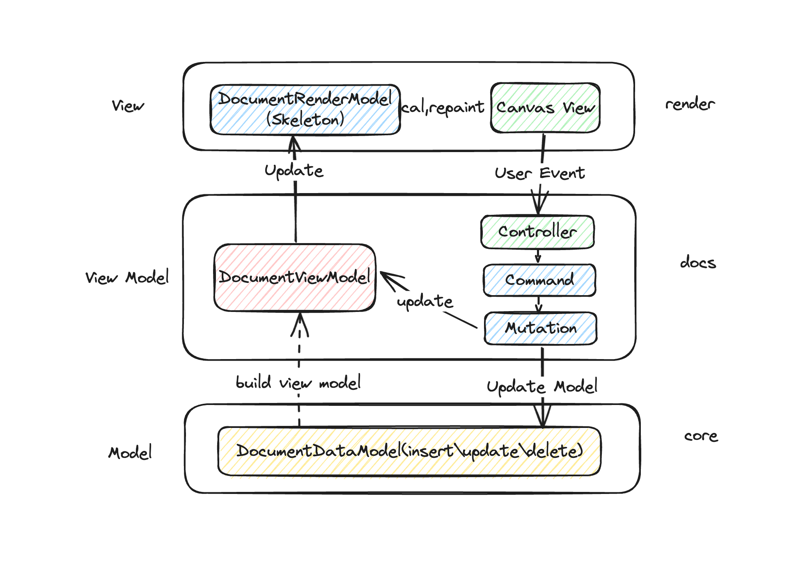
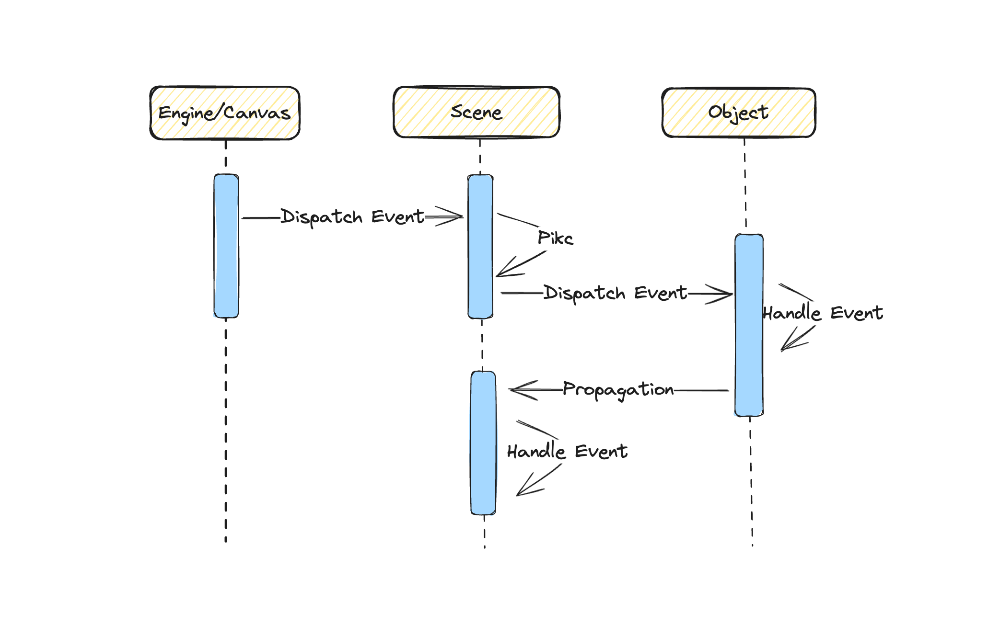
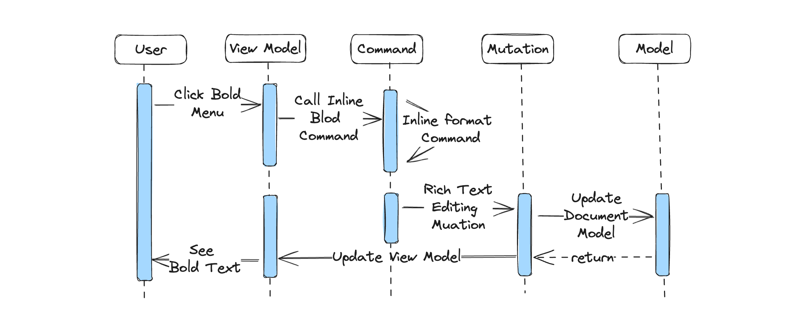

# Univer Document Architecture and Module Design

## 1. Univer Document Architecture

Univer Document is one of the components of the Univer office suite, aimed at providing a top-notch document editing and typesetting experience. We not only integrate in terms of product form, reducing switching costs between different suites through a boundary-less mode, but also enable data interoperability across different suites. In terms of technical architecture, we strive to achieve implementation through a unified architecture, ensuring efficient development experience while also providing more room for imagination in the integration of product forms.

> If you are still relatively unfamiliar with the Univer architecture, it is recommended to first read "[Univer Architecture](https://univer.ai/guides/architecture/architecture/)" and "[This is Univer](https://zhuanlan.zhihu.com/p/666298812)". In these two articles, there are descriptions of the overall architecture of Univer, including the command system, underlying data model, rendering engine, and analysis of the entire process from the data layer to the view layer rendering, from view layer event response to data layer data updates.

This article primarily focuses on the technical architecture and module design of the Univer document. Let's begin with an architectural diagram:

### 1.1 Project Architecture Diagram



From the above architectural diagram, it is apparent that the Univer document adheres to the MVVM architectural model. Progressing from bottom to top, we have the data model layer, the view model layer, and the view layer. The entire document project is divided into three layers with multiple modules:

1. Data Model Layer: This layer is primarily managed by the DocumentDataModel class for data model management and data updates.
2. View Model Layer: It encompasses the view models, which are constructed through the underlying data model and primarily used for view rendering. Additionally, the view model layer includes the command system, such as responding to view layer events, thereby triggering updates to the view model and data model.
3. View Layer: In the view layer, two main tasks are accomplished. Firstly, through the data in the view model layer, layout calculations are performed, known as typesetting, which occurs in the DocumentRenderModel (Document Skeleton) to determine the layout of page content styles. Secondly, the results of the layout calculations are rendered onto the page through the rendering engine.

In the following subsections, I will provide a more detailed description of the data structures, responsibilities, and functions of the different layers.

### 1.2 Data Model Layer

#### 1.2.1 Document Model Layer Data Structure

The data structure of the document is as follows:

```typescript
// i-document-data.ts
export interface IDocumentData extends IReferenceSource, IExtraModelData {
  /** unit ID */
  id: string;
  title?: string;
  body?: IDocumentBody;
  documentStyle: IDocumentStyle;
  // ...
}
export interface IDocumentBody {
  dataStream: string;
  textRuns?: ITextRun[]; // textRun 样式，交互
  paragraphs?: IParagraph[]; // paragraph
  sectionBreaks?: ISectionBreak[]; // SectionBreak
  customBlocks?: ICustomBlock[]; // customBlock 用户通过插件自定义的block
  tables?: ITable[]; // Table
  customRanges?: ICustomRange[]; // plugin注册，实现针对stream的特殊逻辑，超链接，field，structured document tags， bookmark，comment
}
```

The definition of the document's data structure primarily resides in two interfaces: IDocumentData and IDocumentBody. Within IDocumentData, there are details such as the document's title, ID, body, and styles, while the IDocumentBody interface delineates all the information pertaining to the document content.

- The dataStream is a string type, representing the textual content of our document.
- Within textRuns, inline styles of the document are defined, such as bold, italic, color, background color, font, font size, etc. It uses the st and ed position indices to identify the range of content to which inline styles are applied.
- The paragraphs field contains paragraph information, including the starting position of the paragraph and its styles, such as hanging indentation, indentation, and list styles. In Univer documents, paragraphs are denoted by \r in the dataStream.
- The sectionBreaks field encompasses section-related information. Sections are marked by `\n` in the dataStream, so encountering `\n` signifies the end of a section. All Univer documents must conclude with `\r\n`.
- The customBlocks field includes user-defined blocks.
- The tables field contains information related to tables.
- The customRanges field comprises overlapping document information, such as comments, hyperlinks, etc.

```typescript
export const DEFAULT_DOCUMENT_DATA_SIMPLE: IDocumentData = {
  id: 'default-document-id',
  body: {
    dataStream: '荷塘月色\r作者：朱自清\r\n',
    textRuns: [
      {
        st: 0,
        ed: 4,
        ts: {
          fs: 24,
          ff: 'Microsoft YaHei',
          bl: BooleanNumber.TRUE,
        },
      },
    ],
    paragraphs: [
      {
        startIndex: 4,
        paragraphStyle: { /* ... */ },
      },
      {
        startIndex: 11,
      },
    ],
    sectionBreaks: [
      {
        startIndex: 12,
      },
    ],
  },
  documentStyle: { /* ... */ },
}
```

The aforementioned is a simple document example, consisting of two paragraphs and one section. Within the dataStream, there are two `\r` placeholders for paragraphs and one `\n` placeholder for the section. In the textRuns, there is a single inline style specified, which bolds the text within the range `st:0 ~ ed:4`, with a font size of 24 and the font set to Microsoft YaHei.

#### 1.2.2 Managing the Data Model Class

The data model is managed through the `DocumentDataModel` class, located in the core module. Modifying the data model requires mutations for changes. By applying the `apply` method on the `DocumentDataModel`, mutations are applied to the data model, ultimately achieving the goal of modifying the underlying data.

In the document, mutations are abstracted into three types: `retain`, `insert`, and `delete`. The `retain` operation involves moving the cursor or applying style modifications, `insert` is for inserting document content, which can include styles (textRuns), and `delete` is for removing document content, requiring only the `len` attribute to indicate the length to be deleted.

As the document needs to support a history stack, enabling users to revert to previous document states through undo and redo functionalities, these three operations also need to support an `invert` operation, representing their reverse actions. For instance, the inverse of an insert operation is delete, and the inverse of delete is insert. Additionally, to support features like collaborative editing, mutations require `transform` and `compose` operations. There will be forthcoming articles discussing collaborative document editing. Due to space constraints, further elaboration will not be provided here.

### 1.3 View Model Layer

In the view model layer, the management of DocumentViewModel and DocumentSkeleton is crucial, alongside the document's controllers, services, and command system.

#### 1.3.1 View Model Management

The definition of the DocumentViewModel class is within the engine-render module. This placement is logical, as the primary responsibility of the View Model is to serve the rendering (view rendering layer). Therefore, the relevant interfaces and classes are defined within the engine-render module. The management of DocumentViewModel instances occurs in the docs module, specifically in the `doc-view-model-manager.service.ts` file.

The primary responsibility of DocumentViewModel is to generate the latest View Model based on the most recent DocumentDataModel, which is then consumed by the Document Skeleton (to be discussed later). Why then is there a need for a dedicated service for management, rather than a singleton instance? As previously described, Univer encompasses not only documents but also tables, presentations, and more. In tables, both the cell editor and formula bar editor are document editors. This means that even a table cell is managed and rendered through a document. Additionally, Univer supports multiple instances, necessitating the use of a service for View Model management.

Each document corresponds to a DocumentViewModel instance. When a document creation or update is detected, the `docViewModelManagerService` creates or updates the document view model to keep it in sync, ready for consumption by the corresponding Document Skeleton.

```typescript
// doc-canvas-view.ts
private _initialize() {
  this._currentUniverService.currentDoc$.pipe(takeUntil(this.dispose$)).subscribe((documentModel) => {
    const unitId = documentModel.getUnitId();
    // Build the view model and notify the skeleton manager to create the skeleton.
    this._docViewModelManagerService.setCurrent(unitId);

    // ...
  });
}
```

Just as depicted in the above code, upon detecting the addition or modification of a document (Doc), the `setCurrent` method on the `docViewModelManagerService` is invoked to update the view model.

#### 1.3.2 Managing the Document Skeleton

As previously mentioned, the view model layer not only manages the view model but also oversees the Document Skeleton, which pertains to layout-related information of the document. The relevant code can be found in the `doc-skeleton-manager.service.ts` file. (A more detailed exposition on Document Skeleton will be provided in the "Univer Document Layout Design" article.) Similar to the view model, each Univer document corresponds to a single Document Skeleton instance, uniquely identified by `unitId` and `subUnitId`. Upon detecting an update in the view model, the corresponding skeleton instance also necessitates creation or update.

```typescript
// doc-skeleton-manager.service.ts
private _setCurrent(docViewModelParam: IDocumentViewModelManagerParam): Nullable<IDocSkeletonManagerParam> {
  const { unitId } = docViewModelParam;

  if (!this._docSkeletonMap.has(unitId)) {
    const skeleton = this._buildSkeleton(docViewModelParam.docViewModel);

    skeleton.calculate();

    this._docSkeletonMap.set(unitId, {
      unitId,
      skeleton,
      dirty: false,
    });
  } else {
    const skeletonParam = this.getSkeletonByUnitId(unitId)!;
    skeletonParam.skeleton.calculate();
    skeletonParam.dirty = true;
  }

  // ...
  this._currentSkeleton$.next(this.getCurrent());
  return this.getCurrent();
}
```

As depicted in the above code, upon detecting a change in the view model, the `_setCurrent` method is invoked to create or update the skeleton based on the most recent view model.

#### 1.3.3 Controllers and Command System

Within the view layer, there are codes related to controllers, services, and the command system. Controllers are primarily responsible for controlling how the editor responds to events from the view layer and handling matters related to initial page rendering, such as:

- Clipboard Controller: Manages clipboard-related tasks, such as rich text copying, cutting, and pasting.
- Inline Format Controller: Handles inline style-related tasks, like applying bold, italics, or color changes to text.
- Text Selection Controller: Listens to view layer events, manages double-clicks, triple-clicks, and selection drawing tasks. Given that Univer supports multiple instances, and a Univer instance may contain multiple Doc instances, this controller also handles switching the runtime for selection drawing.

Services, as previously mentioned in the view model layer, encompass two heavyweight services: the View Model Manager Service and the Doc Skeleton Manager Service, responsible for managing the view model and doc skeleton, respectively. Other services include:

- Clipboard Service: Manages clipboard-related tasks, facilitating content retrieval, conversion of clipboard content to Univer-compatible formats, setting clipboard content, converting Univer document formats to clipboard-friendly formats, and more.
- Text Selection Manager Service: This service can be viewed as an upper-level service of the underlying Text Selection Render Manager. When developing business logic, _it is advisable to avoid directly calling methods from the lower-level Text Selection Render Manager and instead utilize methods provided by the Text Selection Manager_, such as refreshing selections, obtaining all selections, and replacing (setting) selections. The most commonly used methods include `getSelections` for obtaining all selections and `getActiveRange` for retrieving the active selection.

The command system handles a plethora of business logic, encompassing nearly all business logic within it. In "This is Univer," it is mentioned that commands primarily fall into three categories: command, mutation, and operation. A command can be understood as a user's specific operation, such as creating a paragraph or deleting text or selection using the Backspace key. Commands trigger mutations to modify the data model, update the view model, prompt the Skeleton to recalculate, and ultimately reflect the modifications in the view layer. Operations, on the other hand, handle non-collaborative actions, such as changes in cursor and selection, which are synchronized to other user terminals through live share.

- Break Line Command: Listens for the Enter key event to create a new paragraph.
- IME Input Command: Handles input method editor events for text input.
- Inline Format Command: Covers all inline style commands, such as applying bold, italics, or color changes to text through the menu.

### 1.4 View Layer

The view layer resides at the topmost level of the entire project architecture and serves as the direct interface with which users interact. The code related to the view layer is located within the engine-render module. By rendering document content onto the page via Canvas, users can view the text, image content, and more within the document. Additionally, the view layer is responsible for receiving and triggering user keyboard and mouse events. For instance, when a user inputs text via the keyboard, we should promptly update both the data and the interface rendering content—the input and the output. In this section, we will focus on two core modules within the view layer: the **event system** and **selection cursor**. Understanding these modules will provide a foundational understanding of the document's view layer.

> The view layer also involves the Document Skeleton and document layout design, which will be covered in a separate article titled "Univer Document Layout Design." Therefore, we will not delve into these aspects here.

#### 1.4.1 Event System

Before delving into the event system, it is essential to have an understanding of the architecture of the rendering engine. I invite you to read the "[Renderer Architecture Design](https://univer.ai/guides/architecture/renderer/)" article, which delves into the design of the rendering engine. This article explains how drawing and rendering of tables, documents, and presentation slides are achieved within a rendering engine, along with layered rendering, Viewport design, and texture rendering. Once you have a general understanding of the rendering engine, we can discuss the event system within Univer.

In the DOM event system, we can bind events to individual elements (such as DIV). Unless propagation is prevented, an event will bubble up to ancestor elements, allowing ancestor elements of the event-bound element to receive the event. Ultimately, the event will bubble up to the document element. Through event delegation, we can bind an event to an ancestor element once and then listen for different triggering elements. However, in the context of Canvas, where there is only one Canvas element, how do we bind events and distribute them to various objects drawn on the Canvas?

In the event system of the rendering engine, we draw inspiration from the event dispatching and handling system of the DOM. To summarize the event system of the rendering engine in a single sentence:

> We bind various events, such as mouseenter, mousemove, and mouseleave, to the Canvas Element element. Subsequently, we wrap the event objects and, using the current mouse position information, identify the topmost object drawn on the Canvas. We then trigger the corresponding events bound to that object. If event bubbling is not prevented, the event will continue to propagate, eventually reaching the Scene. If there are corresponding event handling functions on the Scene, they will also be executed.

Above, I may have exceeded one sentence; below, I will provide a detailed explanation of the event system within the Univer rendering engine at the source code level.



Step One: Bind events to the Canvas element and wrap the event objects.

```typescript
// engine.ts
this._pointerDownEvent = (nativeEvent: Event) => {
  const evt = nativeEvent as IPointerEvent
  if (deviceType === DeviceType.Mouse) {
    if (!document.pointerLockElement) {
      this._canvasEle.setPointerCapture(this._mouseId)
    }
  } else {
    // Touch; Since touches are dynamically assigned, only set capture if we have an id
    if (evt.pointerId && !document.pointerLockElement) {
      this._canvasEle.setPointerCapture(evt.pointerId)
    }
  }

  // ...
  this.onInputChangedObservable.notifyObservers(deviceEvent)
}
this._canvasEle.addEventListener(`${eventPrefix}down`, this._pointerDownEvent)
```

As per the above code, bind the `pointerdown` event to the `canvasEle`. In the `_pointerDownEvent` function, wrap the event object accordingly, and then throw the event using `onInputChangedObservable`, passing it to the Scene for processing. In the code snippet above, there is a noteworthy point: we use `setPointerCapture` on `canvasEle`. This method designates `canvasEle` as the capture target for future pointer events. Subsequent pointer events will target the capturing element until the capture is released ([Element.releasePointerCapture()](https://developer.mozilla.org/en-US/docs/Web/API/Element/releasePointerCapture)), ensuring that `pointerup` is also triggered on this element.

Step Two: Pass the event object to the Scene and invoke the corresponding event handling function.

```typescript
// scene.input-manager.ts
this._onInputObserver = engine.onInputChangedObservable.add((eventData: IEvent) => {
  // ...
  this._onPointerDown(evt as IPointerEvent)
})
this._onPointerDown = (evt: IPointerEvent) => {
  const currentObject = this._getCurrentObject(evt.offsetX, evt.offsetY)

  const isStop = currentObject?.triggerPointerDown(evt)

  if (this._checkDirectSceneEventTrigger(!isStop, currentObject)) {
    if (this._scene.onPointerDownObserver.hasObservers()) {
      this._scene.onPointerDownObserver.notifyObservers(evt)
    }
  }
}
```

In the above code, firstly add a pointerdown event handling function to the `onInputChangedObservable`. In the `_onPointerDown` event handling function, identify the topmost Object based on the coordinate information of the current event (`evt`), trigger the PointerDown event handling function on that Object. If the event is not prevented, it will continue to bubble up.

Step Three: Bubble up to the topmost level and trigger the event handling function on the Scene.

The above source code has omitted implementation details and edge cases. Feel free to directly read the relevant source code to understand more details, such as how to find the topmost Object using pointer coordinates, how to prevent event bubbling, and why events can also be bound to the Scene.

#### 1.4.2 Selection and Cursor Introduction

**Selection and cursor can be considered the most core modules directly related to business logic in a rich text editor**. Nearly all business logic typically starts by obtaining the current cursor and selection before implementing the corresponding business logic. In the second part of the article, we provide a comprehensive use case introduction.

Different from rich text editors implemented through DOM `contenteditable`, in a rich text editor implemented through Canvas, the cursor and selection need to be custom-implemented. Browser-provided selection objects cannot be used. However, this customization allows for a high degree of customization. For instance, mainstream browsers do not support multiple Ranges (only Firefox does), meaning they do not support setting multiple selections simultaneously. By implementing selections through Canvas, we can customize selections extensively, such as supporting multiple selections, and customizing selection size, color, blinking animation, etc.

To describe how custom selections are implemented in a nutshell:

> We listen to events like `pointerdown`, `pointermove`, and `pointerup` on the Document object (the Document object in the rendering engine, not the `document` object in the DOM). Based on the position information of relevant events, we draw rectangular selections or cursors using the TextRange object.

Now, how do we describe selections and position selections? What attributes are present on selections?

Selection attributes and methods are defined on the TextRange object:

- `anchorNodePosition`: The position of the starting Univer document node in the document flow. A document node is a concept in the Document Skeleton, similar to an element in the DOM, such as a SPAN element or a text node.
- `focusNodePosition`: The position of the ending Univer document node in the document flow.
- `startOffset`: The offset position where the selection starts, relative to the document's starting position.
- `endOffset`: The offset position where the selection ends, relative to the document's starting position.
- `collapsed`: Indicates if the selection is collapsed. When `startOffset` equals `endOffset`, `collapsed` is `true`; otherwise, it is `false`.
- `direction`: The direction of the selection, pointing from `anchorNode` to `focusNode`, with three possible enum values:

```typescript
export enum RANGE_DIRECTION {
  NONE = 'none',
  BACKWARD = 'backward',
  FORWARD = 'forward',
}
```

With the aforementioned attributes, we can now create selections at corresponding positions in the document. This article primarily focuses on document architecture and module design, so the text selection section provides a general understanding for now. A dedicated article on "Design of Selections and Cursors in Univer Documents" and related pitfalls to avoid will be presented later. Stay tuned for more information.

## 2. Process of Updating Data to Rendering

In the first section, we explored the layered architecture of Univer documents, including the data model layer, view model layer, and view layer, along with the data structures of each layer and the functional responsibilities of various modules. In this section, we will use the setting inline style functionality as an example to delve into the entire process from user interaction, data changes, to page rendering.



### 2.1 Menu and Command Association

Step One: Associate the Bold menu with the corresponding Command. This way, upon clicking the menu, execute the `SetInlineFormatBoldCommand`.

```typescript
export function BoldMenuItemFactory(accessor: IAccessor): IMenuButtonItem {
  return {
    id: SetInlineFormatBoldCommand.id,
    group: MenuGroup.TOOLBAR_FORMAT,
    type: MenuItemType.BUTTON,
    icon: 'BoldSingle',
    title: 'Set bold',
    tooltip: 'toolbar.bold',
    positions: [MenuPosition.TOOLBAR_START],
    hidden$: getMenuHiddenObservable(accessor, UniverInstanceType.DOC),
  }
}
```

In the code snippet above, the `id` field corresponds to the `id` of the `SetInlineFormatBoldCommand`.

### 2.2 Handling Inline Style Business Logic

Step Two: Handle the business logic of inline styles. Almost all business logic is completed within Commands, and setting inline styles is no exception. There is a unified `SetInlineFormatCommand` to handle all inline styles, including bolding text, italicizing, changing font color, font size, background color, and so on. In our example, we will focus on text bolding. The `SetInlineFormatBoldCommand` will forward the bold inline style to `SetInlineFormatCommand` for unified processing.

```typescript
export const SetInlineFormatCommand: ICommand<ISetInlineFormatCommandParams> = {
  id: 'doc.command.set-inline-format',
  type: CommandType.COMMAND,
  handler: async (accessor, params: ISetInlineFormatCommandParams) => {
    // ...
    // 获取所有选区
    const selections = textSelectionManagerService.getSelections()

    // 获取当前行内样式状态相对的状态
    const formatValue = getReverseFormatValueInSelection(
      docsModel.getBody()!.textRuns!,
      preCommandId,
      selections
    )
    // ...
    const doMutation: IMutationInfo<IRichTextEditingMutationParams> = {
      id: RichTextEditingMutation.id,
      params: {
        unitId,
        mutations: [],
      },
    }
    // ...
    const result = commandService.syncExecuteCommand<
            IRichTextEditingMutationParams,
            IRichTextEditingMutationParams
        >(doMutation.id, doMutation.params)
        // refresh selection.
    if (REFRESH_SELECTION_COMMAND_LIST.includes(preCommandId)) {
      textSelectionManagerService.refreshSelection()
    }
    // ...
  },
}
```

As shown in the code snippet above, the first step is to use `getSelections` to retrieve all selections (which is why selections and cursors are considered the core modules of all business logic). Once we have the selections, we use the `getReverseFormatValueInSelection` method to obtain the current inline style status relative to the selection. For instance, if the text within the current selection is already bold, clicking the bold button should unbold it; otherwise, it should apply the bold effect. All data model changes need to be triggered through mutations, ultimately calling `RichTextEditingMutation` to modify the data model and view model.

### 2.3 Updating Data Model and View Model

Step Three: Update the data model and view model to complete the page refresh.

```typescript
export const RichTextEditingMutation: IMutation<IRichTextEditingMutationParams, IRichTextEditingMutationParams> = {
  id: 'doc.mutation.rich-text-editing',
  type: CommandType.MUTATION,
  handler: (accessor, params) => {
    // ...
    // Step 1: Update Doc Data Model.
    const undoMutations = documentDataModel.apply(mutations)

    // Step 2: Update Doc View Model.
    // ...
    segmentViewModel.reset(segmentDocumentDataModel)
    // ...
  },
}
```

The `RichTextEditingMutation` in the code above primarily accomplishes two tasks:

1. It calls the `apply` method on the `documentDataModel` to update the Data Model.
2. It calls the `reset` method on the View Model to rebuild the View Model. Changes in the data model will be synchronized with other clients, while changes in the view model layer will trigger page layout calculations and ultimately refresh the view layer.

This completes all the work related to setting the inline style to bold.

## 3. Comprehensive Review

In this article, we first introduced the project architecture of Univer documents, which adheres to the standard MVVM architectural model, dividing the entire project into data model layer, view model layer, and view layer. Next, we provided a layered introduction to the core modules and data structures in each architectural layer, such as the `DocumentDataModel` class in the data model layer, view model management in the view model layer, controllers and command systems, and how user events are dispatched in the view layer. We also briefly discussed how Univer documents handle cursors and selections, emphasizing their importance as core modules of Univer documents. Lastly, through an example, we interconnected various modules to analyze how they collaborate to achieve document business functionalities.

<p style="color: #666; font-size: 14px;">Author: <a href="https://github.com/Jocs">Jocs</a>, creator of <a href="https://github.com/marktext/marktext">MarkText</a>, core developer of Univer, responsible for Univer Doc architecture and development.</p>
