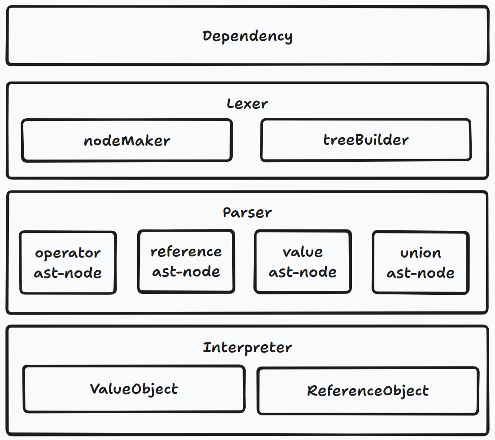
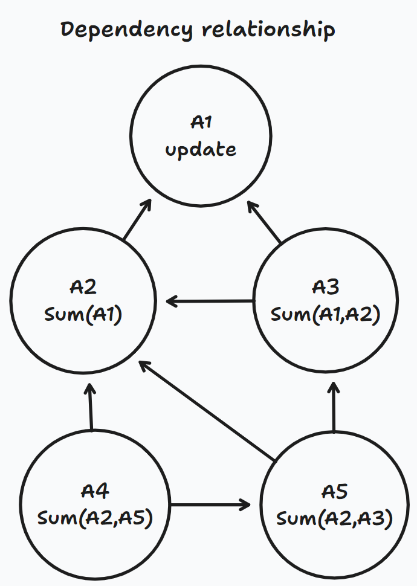

# 公式引擎架构设计

本章节介绍 Univer 公式引擎的整体架构，建议在阅读本章节之前，先阅读[整体架构](/guides/sheet/architecture/univer)。

公式引擎设计的主要目标如下：

1. 支持 Univer 的不同文档类型和相关功能接入公式
2. 提供快速的使用体验，支持和 [web worker](/guides/sheet/architecture/web-worker) 和服务端计算
3. 支持高级公式能力，对齐 Microsoft Office 365 所提供的功能，包括但不限于：
    1. 感知公式执行状态，支持停止公式执行，支持循环引用检测及迭代计算执行次数设置
    2. let / lambda 等自定义函数
    3. 支持超级表、公式和范围命名

## 整体架构

架构图如下：


1. `Model`, 存储公式初始数据，例如所在位置，公式字符串等
2. `Engine`, 负责公式字符串的词法分析和语法分析，分析公式之间的依赖关系等等
3. `Service`, 提供公式计算环境，提供注册函数的能力，并提供自定义名称、超级表、公式调度等服务
4. `Command` 和 `Controller`, 负责控制公式模块协调运作
5. `Function`, 实现函数

{/* 参考 excel 做了公式引用化，维护数组公式的临时范围和值。 */}

## Model

主要管理公式字符串，通过引用化存储来优化内存占用。


此外还对数组公式、数公式范围的数据进行管理。

{/* 数组公式是 sheet 内比较重要的概念，近年来 Excel 对动态数组的支持越来越强，作者有预感 excel 公式未来会越来向 Numpy 矩阵运算看齐，以便于提供强大的数据分析和数据连接能力。*/}

代码见 [formula-data.model.ts](https://github.com/dream-num/univer/blob/dev/packages/engine-formula/src/models/formula-data.model.ts)。

## Engine

Engine 是公式引擎的核心，它提供以下能力：

* 依赖分析，对一组公式的执行顺序做出判断
* 对每一个公式字符串进行语法分析、词法分析，生成语法树
* 通过语法树进行计算
* 提供函数所需的大部分基础运算，包括加减乘除，字符拼接，三角函数等等

{/* 计算过程中会把原始值转换为 ValueObject */}

Engine 架构如下图所示：



### Lexer

负责对公式字符串进行词法分析。匹配引擎定义好的 token，根据规则生成节点，并将这些节点构建为 `LexerNode` tree。比如 `A1`,`B10`, `SUM` 等都会被识别为 `LexerNode`。节点类型的识别则会由 Parser 负责。例如

```txt
=(sum(sum(A1:B10), E10, 100) + 5) * 6 - 1
```

转换后的 `LexerNode` 树如下所示：


在生成 `LexerNode` 树之后，引擎会调用转换方法，采用[后缀表达式](https://www.geeksforgeeks.org/evaluation-of-postfix-expression/)来替换原始的中缀表达式以消除运算中的括号。例如

```typescript
( 3 + 4 ) * 5 - 6
```

会转换为：

```typescript
3 4 + 5 × 6 -
```

### Parser

Parser 的职责主要是对 Lexer 生成的 `LexerNode` 树进行以下转换操作生成 `AstNode` 树：

1. 将节点中的 `SUM` 等函数名转换为 `FunctionNode` 公式节点，`E10` 等引用转换为 `ReferenceNode` 引用节点，`+` 等运算符转换为 `OperatorNode` 操作符节点
2. 其他类型的 node 还包括：
    1. `LambdaNode` lambda 函数专用，将 lambda 函数进行入参，以及包装为 lambda-value-object
    2. `UnionNode`, 把 `A1:B10` 合并为 RangeReference
    3. `PrefixNode`, 将 `-` 识别为负数，以及旧版本的兼容 `@`
    4. `SuffixNode`, 识别 % 为百分比，# 为动态数组公式的范围简写
    5. `ValueNode`, 识别文本、数字、逻辑三个基础类型的值
3. 将 let 转换为 lambda 执行
4. 为 lambda 注入参数

转换 `LexerNode` 树为 `AstNode` 树后的示意图：


### Interpreter

负责执行单个公式，调用 ast-node 的方法递归的得到函数返回值，主要有下列职责：

1. 将运算符转换为 meta function 并执行，主要包括加减乘除运算符和数值比较运算符
2. 将字符、数字，布尔值实例化为 `ValueObject`，将数组实例化为 `ArrayValueObject`
3. 将 reference 实例化为 `ReferenceObject`，并调用内部方法转为 `ArrayValueObject`
4. 调用具体函数开始执行运算，函数接收的值为所有 object 的基类 `BaseValueObject`，返回值为 `ReferenceObject | BaseValueObject | AsyncValueObject`
5. 异步的计算会在上层 await 得到结果再传递到下层，所以函数内不需要写异步方法，只用把 Promise 作为参数传给 `AsyncValueObject` 并返回
6. 对 INDIRECT 和 OFFSET 等引用函数，返回 `ReferenceObject`

#### BaseValueObject

BaseValueObject 是公式引擎计算非常重要的操作类型，它有下列继承类型：

#### NullValueObject

代表空值，再与其他类型值进行计算时会被当做 false 或 0，如果无法计算会直接返回 `ErrorValueObject`

#### ErrorValueObject

代表错误，类似 Excel 的 #VALUE!, #NAME!, #REF! 等，函数内可以直接返回 `ErrorValueObject` 代表公式计算错误。

#### PrimitiveValueObject

由可分为三种基础值类型，`NumberValueObject` `StingValueObject` 和 `BooleanValueObject`，分别实现了自己的数值计算方法，使用了 [big.js](https://github.com/MikeMcl/big.js) 处理底层计算的精度问题。

```typescript
new NumberValueObject(100).plus(new NumberValueObject(100)); // return NumberValueObject

new StringValueObject(100).concatenateFront(new NumberValueObject(100)); // return StringValueObject

new NumberValueObject(100).isEqual(new NumberValueObject(100)); // return BooleanValueObject
```

#### LambdaValueObject

将 lambda 函数作为值传参给下层函数使用，会应用在 [MAKEARRAY](https://support.microsoft.com/en-au/office/makearray-function-b80da5ad-b338-4149-a523-5b221da09097) [REDUCE](https://support.microsoft.com/en-au/office/reduce-function-42e39910-b345-45f3-84b8-0642b568b7cb) 等函数中。

#### ArrayValueObject

是实现矩阵计算的核心，可以与任何 `PrimitiveValueObject` 或 其他 `ArrayValueObject` 进行计算，计算演示如下图：


其自身也支持如：sum, average, min, max, std, var, power 等计算，并且针对 vlookup, xlookup, match 等函数实现了如 Numpy 的 [slice](https://www.w3schools.com/python/numpy/numpy_array_slicing.asp) 和 [filter](https://www.w3schools.com/python/numpy/numpy_array_filter.asp) 能力：

```typescript
export class Vlookup extends BaseFunction {
  override calculate(
    lookupValue: BaseValueObject,
    tableArray: BaseValueObject,
    colIndexNum: BaseValueObject,
    rangeLookup?: BaseValueObject
  ) {

    const colIndexNumValue = this.getIndexNumValue(colIndexNum);

    // 对 tableArray 进行切片操作，获取第一列的矩阵
    const searchArray = (tableArray as ArrayValueObject).slice(, [0, 1]);

    // 对 tableArray 进行切片操作，获取 colIndexNumValue 指定列的矩阵
    const resultArray = (tableArray as ArrayValueObject).slice(, [colIndexNumValue - 1, colIndexNumValue]);

    // searchArray.isEqual(value) ，得到一个 true or false 的矩阵
    // resultArray.pick，调用 array 的 pick 方法从 true or false 的矩阵中范围对应索引的结果。相当于 numpy 的 filter
    // 最后通过 getFirstCell 返回匹配到的第一个结果值
    return resultArray.pick(searchArray.isEqual(lookupValue) as ArrayValueObject).getFirstCell();
  }
}
```

在公式数量较多的情况下，`ArrayValueObject` 实现了对列的倒排索引，以便于提升迭代性能：


### Dependency

负责公式依赖分析，对需要计算的公式进行标脏，输出标脏公式的执行队列。



如上图所示，A1 单元格的内容变更后，会对 A2, A3, A4, A5 单元格的公式进行标脏，标脏后的公式进行依赖关系分析，最终的输出顺序为：A2 -> A3 -> A5 -> A4

如果遇到 [INDIRECT / OFFSET](https://support.microsoft.com/en-us/office/indirect-function-474b3a3a-8a26-4f44-b491-92b6306fa261) 等类似的引用函数，则 Dependency 模块会调用 Lexer 和 Parser 执行预计算，提前算出这类函数的引用范围，再以此进行依赖关系的计算。

## Service

Service 为计算过程提供各种各样的服务，这里介绍几个重要的 service：

### IFormulaCurrentConfigService 和 IFormulaRuntimeService

用于加载 Univer 数据，以及存放公式执行过程中的临时数据，公式执行完毕后 runtime 会返回所有计算结果

### IFunctionService

用于函数和函数描述的注册，用户也可以通过 uniscript 注册快捷自定义函数。

### IFeatureCalculationManagerService

注册数据透视表、条件格式、数据验证等 sheet 领域内的功能函数，以透视表为例：

1. 数据透视表可以注册一个依赖范围和一个 getDirtyData
2. 在公式对依赖范围标脏后执行 getDirtyData 方法，实现透视表内的计算逻辑
3. getDirtyData 方法可返回一个脏区和脏区的临时数据，用于继续计算依赖透视表结果的公式。最后得到正确结果。

### IOtherFormulaManagerService

注册 doc 和 slide 等非表格领域的公式，这些公式不会被 sheet 内的公式依赖，所以不需要返回脏区和脏区临时数据

### CalculateFormulaService

触发公式计算的核心方法，实现了如下功能：

1. 公式循环依赖执行
2. 运行时状态返回，包括执行公式总量，已执行完成数量。
3. 数组公式返回结果后的二次标脏和执行
4. 使用 requestImmediateMacroTask 避免了 setTimeout 4ms 限制，实现了公式在宏任务下的运行，支持公式执行终止。
5. 公式执行时间统计

## Function

采取矩阵计算的方式实现函数逻辑，减少了代码量，并且收敛了核心逻辑，让函数实现更加标准，可以保证准确性和质量。

公式引擎参考了 Numpy 的矩阵运算理念，减少了实现函数的代码量，并收敛了包括数值计算、三角函数计算到 `BaseValueObject` 中，为函数实现的标准化了做好了铺垫。

实现一个 Sum 公式的代码如下：

```typescript
export class Sum extends BaseFunction {
  override calculate(...variants: BaseValueObject[]) {
    // 新建一个用于累加的 0 变量
    let accumulatorAll: BaseValueObject = new NumberValueObject(0);

    // Sum 函数的入参数量由用户决定，这里循环获取并计算。
    for (let i = 0; i < variants.length; i++) {
      let variant = variants[i];

      // 如果入参是 A1:B10 的引用范围，上层会把它自动转换为一个 ArrayValueObject，
      if (variant.isArray()) {
        // 调用 ArrayValueObject 上的 sum 函数，累加所有的 valueObject 值
        variant = (variant as ArrayValueObject).sum();
      }

      // 调用 ValueObject 上的数值计算函数 Plus 进行累加
      accumulatorAll = accumulatorAll.plus(variant);
    }

    return accumulatorAll;
  }
}
```
