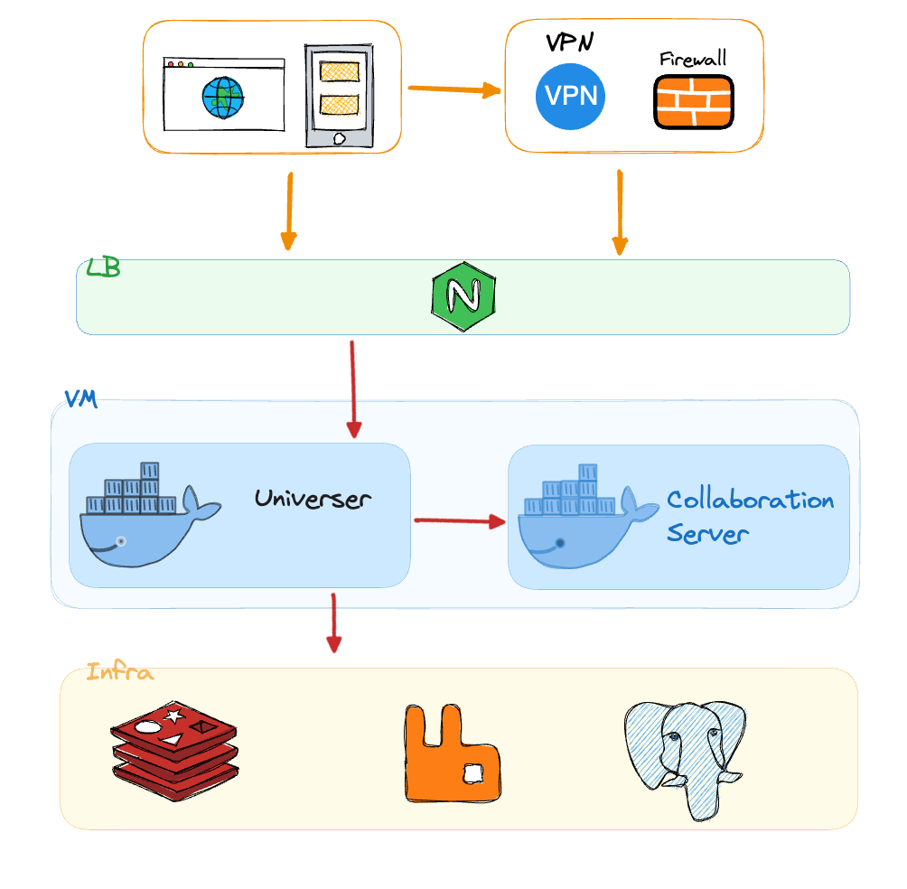
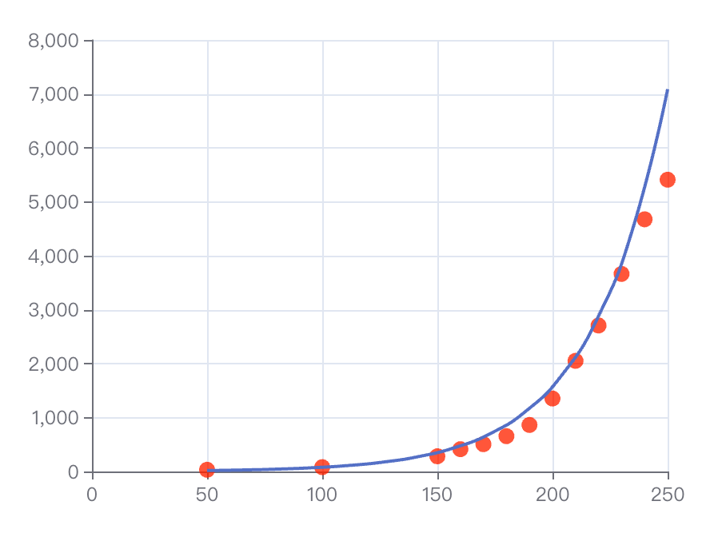

import { Callout } from 'nextra/components'

# Collaborative Benchmarking Report

## Introduction

In the dynamic world of business today, real-time collaborative editing is a cornerstone of modern productivity tools. It enables teams, especially those working remotely, to collaborate effectively on creative and editorial projects. This report provides a detailed assessment of the Univer Pro collaborative engine's performance in multi-user real-time editing scenarios and compares it with other market leaders.

A study titled "Performance of real-time collaborative editors at large scale: User perspective" highlighted latency issues in popular real-time editing services. It suggested that the **number of simultaneous editors** significantly impacts the performance of these systems. Here's how some of the mainstream products stack up:

|                  | Office 365 | Tencent Docs | Shimo Docs | Google Sheet | Feishu Sheet |
|------------------|------------|----------|----------|--------------|----------|
| Maximum number of editors | 365        | 200      | 200      | 200          | 200      |

Note: Data valid as of 2022.

## Introducing the Univer Pro Collaborative Engine

Before diving into the test results, let's get familiar with the Univer Pro collaborative engine.

Univer Pro places a strong emphasis on scalability, supporting distributed setups. However, for simplicity in this report, we'll focus on a single-machine deployment.

The engine primarily uses two programming languages: Golang and JavaScript.

- Golang excels in handling high concurrency and fast network I/O, enabling Univer Pro to manage numerous client connections effortlessly;

- JavaScript (Node.js) facilitates code sharing between the backend and frontend, significantly reducing conflict errors. It also sets a solid foundation for future server-side computations and rendering.

Univer Pro employs Operational Transformation (OT) for managing collaborative conflicts.

Designed as a stateful service, the collaborative engine maintains a current copy of each active document in memory, allowing for quick application and updating of edits.

The stateful Collaboration-server uses Node.js, sharing conflict resolution code with the frontend editor, and includes two key functions:

- Transform: Executes the OT algorithm on the changeset for tables or documents;
- Apply: Applies the transformed changeset to the document or table.

The stateless Universer service, implemented in Golang, handles scheduling and networking:

- Comb: Uses WebSocket to provide room services for broadcasting and distributing collaborative events;
- Snapshot: Offers document snapshot services based on the EventSourcing pattern, efficiently restoring any document version.

Here's a visual on how editing events are processed by the collaborative engine:

> A changeset refers to the modifications made by a user, commonly abbreviated as cs.

## Performance Testing

Our comprehensive tests were designed to evaluate key performance indicators and scenarios for the Univer Pro collaborative engine.

A crucial metric for collaborative experiences is the delay between one user's edit and another's display of that edit, termed "collaborative latency".

<Callout emoji="⏰">
  Definition "Collaborative Latency"

  The time difference from when a changeset is sent to when it is first applied by a client.
  This metric is a direct measure of the performance of the changeset's transformation and application processes.
</Callout>

Factors directly affecting collaborative latency include the number of changesets processed, referred to as "collaborative concurrency".

<Callout emoji="🚀">
  Definition CS QPS, "Collaborative Concurrency"

  The number of Changesets submitted per second for a given document.
</Callout>

Testing conditions:

- ECS configured with 4 cores and 8GB RAM
- Single-machine deployment using Docker Compose

Baseline scenarios:

- Each client sends edits about 0.15 times per second;
- At 200 editors, the collaborative concurrency reaches about 30 (CS QPS=30).

Measurement approach:

- Incrementally increase the number of editors and monitor collaborative latency;
- Total testing duration was 5 minutes.

Results indicated a link between the number of editors and collaborative latency, as shown in the graphs below:

## Conclusion

The data demonstrates that the Univer Pro collaborative engine maintains a latency of approximately 1.3 seconds with 200 concurrent users on a standard server, comparable to leading industry products.

As the number of users increases, there is a noticeable exponential rise in latency, modeled as `y = 3.92e^(0.03x)`.

These benchmarks show that Univer Pro delivers robust performance in real-time collaboration, effectively managing latency with a significant number of users. The trend of increasing latency with more users will guide further optimizations to support higher concurrency with minimal delay.

## Next Steps

While this experiment focused on external metrics like latency and user count, the rising latency with more users suggests internal factors need exploration, such as the relationship between user increase and processing delays for transformation and application.

Additionally, as user numbers grow, network throughput becomes crucial. Future studies will explore the interplay between user count, network capacity, and latency.

Also, the impact of managing multiple documents on latency needs investigation, particularly how many documents a single Node.js instance can handle efficiently given its single-threaded nature.

Continued optimization and innovation are expected to enhance the Univer Pro collaborative engine's standing in real-time collaboration, ensuring a smoother user experience.
